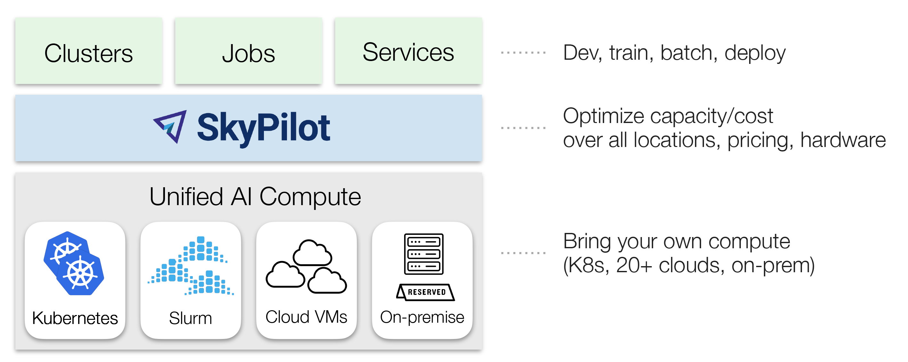

<p align="center">
  <picture>
    <source media="(prefers-color-scheme: dark)" srcset="https://raw.githubusercontent.com/skypilot-org/skypilot/master/docs/source/images/skypilot-wide-dark-1k.png">
    
  </picture>
</p>

<p align="center">
  <a href="https://docs.skypilot.co/">
    
  </a>

  <a href="https://github.com/skypilot-org/skypilot/releases">
    
  </a>

  <a href="http://slack.skypilot.co">
    
  </a>

  <a href="https://github.com/skypilot-org/skypilot/releases">
    
  </a>

</p>

<h3 align="center">
    Simplify & scale any AI infrastructure
</h3>

<div align="center">

#### [🌟 **SkyPilot Demo** 🌟: Click to see a 1-minute tour](https://demo.skypilot.co/dashboard/)

</div>


----

:fire: *News* :fire:
- [Aug 2025] Serve and finetune **OpenAI GPT-OSS models** (gpt-oss-120b, gpt-oss-20b) with one command on any infra: [**serve**](./llm/gpt-oss/) + [**LoRA and full finetuning**](./llm/gpt-oss-finetuning/)
- [Jul 2025] Run distributed **RL training for LLMs** with Verl (PPO, GRPO) on any cloud: [**example**](./llm/verl/)
- [Jul 2025] 🎉 SkyPilot v0.10.0 released! [**blog post**](https://blog.skypilot.co/announcing-skypilot-0.10.0/), [**release notes**](https://github.com/skypilot-org/skypilot/releases/tag/v0.10.0)
- [Jul 2025] Finetune **Llama4** on any distributed cluster/cloud: [**example**](./llm/llama-4-finetuning/)
- [Jul 2025] Two-part blog series, `The Evolution of AI Job Orchestration`: (1) [Running AI jobs on GPU Neoclouds](https://blog.skypilot.co/ai-job-orchestration-pt1-gpu-neoclouds/), (2) [The AI-Native Control Plane & Orchestration that Finally Works for ML](https://blog.skypilot.co/ai-job-orchestration-pt2-ai-control-plane/)
- [Apr 2025] Spin up **Qwen3** on your cluster/cloud: [**example**](./llm/qwen/)
- [Feb 2025] Prepare and serve **Retrieval Augmented Generation (RAG) with DeepSeek-R1**: [**blog post**](https://blog.skypilot.co/deepseek-rag), [**example**](./llm/rag/)


**LLM Finetuning Cookbooks**: Finetuning Llama 2 / Llama 3.1 in your own cloud environment, privately: Llama 2 [**example**](./llm/vicuna-llama-2/) and [**blog**](https://blog.skypilot.co/finetuning-llama2-operational-guide/); Llama 3.1 [**example**](./llm/llama-3_1-finetuning/) and [**blog**](https://blog.skypilot.co/finetune-llama-3_1-on-your-infra/)

----

SkyPilot is a system to run, manage, and scale AI workloads on any AI infrastructure.

SkyPilot gives **AI teams** a simple interface to run jobs on any infra.
**Infra teams** get a unified control plane to manage any AI compute — with advanced scheduling, scaling, and orchestration.

<picture>
  <source media="(prefers-color-scheme: dark)" srcset="./docs/source/images/skypilot-abstractions-long-2-dark.png">
  
</picture>

## Overview

SkyPilot **is easy to use for AI teams**:
- Quickly spin up compute on your own infra
- Environment and job as code — simple and portable
- Easy job management: queue, run, and auto-recover many jobs

SkyPilot **makes Kubernetes easy for AI & Infra teams**:

- Slurm-like ease of use, cloud-native robustness
- Local dev experience on K8s: SSH into pods, sync code, or connect IDE
- Turbocharge your clusters: gang scheduling, multi-cluster, and scaling

SkyPilot **unifies multiple clusters, clouds, and hardware**:
- One interface to use reserved GPUs, Kubernetes clusters, or 16+ clouds
- [Flexible provisioning](https://docs.skypilot.co/en/latest/examples/auto-failover.html) of GPUs, TPUs, CPUs, with auto-retry
- [Team deployment](https://docs.skypilot.co/en/latest/reference/api-server/api-server.html) and resource sharing

SkyPilot **cuts your cloud costs & maximizes GPU availability**:
* Autostop: automatic cleanup of idle resources
* [Spot instance support](https://docs.skypilot.co/en/latest/examples/managed-jobs.html#running-on-spot-instances): 3-6x cost savings, with preemption auto-recovery
* Intelligent scheduling: automatically run on the cheapest & most available infra

SkyPilot supports your existing GPU, TPU, and CPU workloads, with no code changes.

Install with pip:
```bash
# Choose your clouds:
pip install -U "skypilot[kubernetes,aws,gcp,azure,oci,lambda,runpod,fluidstack,paperspace,cudo,ibm,scp,nebius]"
```
To get the latest features and fixes, use the nightly build or [install from source](https://docs.skypilot.co/en/latest/getting-started/installation.html):
```bash
# Choose your clouds:
pip install "skypilot-nightly[kubernetes,aws,gcp,azure,oci,lambda,runpod,fluidstack,paperspace,cudo,ibm,scp,nebius]"
```

<p align="center">
  
</p>

Current supported infra: Kubernetes, AWS, GCP, Azure, OCI, Lambda Cloud, Fluidstack,
RunPod, Cudo, Digital Ocean, Paperspace, Cloudflare, Samsung, IBM, Vast.ai,
VMware vSphere, Nebius.
<p align="center">
  <picture>
    <source media="(prefers-color-scheme: dark)" srcset="https://raw.githubusercontent.com/skypilot-org/skypilot/master/docs/source/images/cloud-logos-dark.png">
    
  </picture>
</p>
<!-- source xcf file: https://drive.google.com/drive/folders/1S_acjRsAD3T14qMeEnf6FFrIwHu_Gs_f?usp=drive_link -->


## Getting started
You can find our documentation [here](https://docs.skypilot.co/).
- [Installation](https://docs.skypilot.co/en/latest/getting-started/installation.html)
- [Quickstart](https://docs.skypilot.co/en/latest/getting-started/quickstart.html)
- [CLI reference](https://docs.skypilot.co/en/latest/reference/cli.html)

## SkyPilot in 1 minute

A SkyPilot task specifies: resource requirements, data to be synced, setup commands, and the task commands.

Once written in this [**unified interface**](https://docs.skypilot.co/en/latest/reference/yaml-spec.html) (YAML or Python API), the task can be launched on any available infra (Kubernetes, cloud, etc.).  This avoids vendor lock-in, and allows easily moving jobs to a different provider.

Paste the following into a file `my_task.yaml`:

```yaml
resources:
  accelerators: A100:8  # 8x NVIDIA A100 GPU

num_nodes: 1  # Number of VMs to launch

# Working directory (optional) containing the project codebase.
# Its contents are synced to ~/sky_workdir/ on the cluster.
workdir: ~/torch_examples

# Commands to be run before executing the job.
# Typical use: pip install -r requirements.txt, git clone, etc.
setup: |
  cd mnist
  pip install -r requirements.txt

# Commands to run as a job.
# Typical use: launch the main program.
run: |
  cd mnist
  python main.py --epochs 1
```

Prepare the workdir by cloning:
```bash
git clone https://github.com/pytorch/examples.git ~/torch_examples
```

Launch with `sky launch` (note: [access to GPU instances](https://docs.skypilot.co/en/latest/cloud-setup/quota.html) is needed for this example):
```bash
sky launch my_task.yaml
```

SkyPilot then performs the heavy-lifting for you, including:
1. Find the cheapest & available infra across your clusters or clouds
2. Provision the GPUs (pods or VMs), with auto-failover if the infra returned capacity errors
3. Sync your local `workdir` to the provisioned cluster
4. Auto-install dependencies by running the task's `setup` commands
5. Run the task's `run` commands, and stream logs

See [Quickstart](https://docs.skypilot.co/en/latest/getting-started/quickstart.html) to get started with SkyPilot.

## Runnable examples

See [**SkyPilot examples**](https://docs.skypilot.co/en/docs-examples/examples/index.html) that cover: development, training, serving, LLM models, AI apps, and common frameworks.

Latest featured examples:

| Task | Examples |
|----------|----------|
| Training | [Verl](https://docs.skypilot.co/en/latest/examples/training/verl.html), [Finetune Llama 4](https://docs.skypilot.co/en/latest/examples/training/llama-4-finetuning.html), [PyTorch](https://docs.skypilot.co/en/latest/getting-started/tutorial.html), [DeepSpeed](https://docs.skypilot.co/en/latest/examples/training/deepspeed.html), [NeMo](https://docs.skypilot.co/en/latest/examples/training/nemo.html), [Ray](https://docs.skypilot.co/en/latest/examples/training/ray.html), [Unsloth](https://docs.skypilot.co/en/latest/examples/training/unsloth.html), [Jax/TPU](https://docs.skypilot.co/en/latest/examples/training/tpu.html) |
| Serving | [vLLM](https://docs.skypilot.co/en/latest/examples/serving/vllm.html), [SGLang](https://docs.skypilot.co/en/latest/examples/serving/sglang.html), [Ollama](https://docs.skypilot.co/en/latest/examples/serving/ollama.html) |
| Models | [DeepSeek-R1](https://docs.skypilot.co/en/latest/examples/models/deepseek-r1.html), [Llama 4](https://docs.skypilot.co/en/latest/examples/models/llama-4.html), [Llama 3](https://docs.skypilot.co/en/latest/examples/models/llama-3.html), [CodeLlama](https://docs.skypilot.co/en/latest/examples/models/codellama.html), [Qwen](https://docs.skypilot.co/en/latest/examples/models/qwen.html), [Kimi-K2](https://docs.skypilot.co/en/latest/examples/models/kimi-k2.html), [Mixtral](https://docs.skypilot.co/en/latest/examples/models/mixtral.html) |
| AI apps | [RAG](https://docs.skypilot.co/en/latest/examples/applications/rag.html), [vector databases](https://docs.skypilot.co/en/latest/examples/applications/vector_database.html) (ChromaDB, CLIP) |
| Common frameworks | [Airflow](https://docs.skypilot.co/en/latest/examples/frameworks/airflow.html), [Jupyter](https://docs.skypilot.co/en/latest/examples/frameworks/jupyter.html) |

Source files can be found in [`llm/`](https://github.com/skypilot-org/skypilot/tree/master/llm) and [`examples/`](https://github.com/skypilot-org/skypilot/tree/master/examples).

## More information
To learn more, see [SkyPilot Overview](https://docs.skypilot.co/en/latest/overview.html), [SkyPilot docs](https://docs.skypilot.co/en/latest/), and [SkyPilot blog](https://blog.skypilot.co/).

SkyPilot adopters: [Testimonials and Case Studies](https://blog.skypilot.co/case-studies/)

Partners and integrations: [Community Spotlights](https://blog.skypilot.co/community/)

Follow updates:
- [Slack](http://slack.skypilot.co)
- [X / Twitter](https://twitter.com/skypilot_org)
- [LinkedIn](https://www.linkedin.com/company/skypilot-oss/)
- [SkyPilot Blog](https://blog.skypilot.co/) ([Introductory blog post](https://blog.skypilot.co/introducing-skypilot/))

Read the research:
- [SkyPilot paper](https://www.usenix.org/system/files/nsdi23-yang-zongheng.pdf) and [talk](https://www.usenix.org/conference/nsdi23/presentation/yang-zongheng) (NSDI 2023)
- [Sky Computing whitepaper](https://arxiv.org/abs/2205.07147)
- [Sky Computing vision paper](https://sigops.org/s/conferences/hotos/2021/papers/hotos21-s02-stoica.pdf) (HotOS 2021)
- [SkyServe: AI serving across regions and clouds](https://arxiv.org/pdf/2411.01438) (EuroSys 2025)
- [Managed jobs spot instance policy](https://www.usenix.org/conference/nsdi24/presentation/wu-zhanghao)  (NSDI 2024)

SkyPilot was initially started at the [Sky Computing Lab](https://sky.cs.berkeley.edu) at UC Berkeley and has since gained many industry contributors. To read about the project's origin and vision, see [Concept: Sky Computing](https://docs.skypilot.co/en/latest/sky-computing.html).

## Questions and feedback
We are excited to hear your feedback:
* For issues and feature requests, please [open a GitHub issue](https://github.com/skypilot-org/skypilot/issues/new).
* For questions, please use [GitHub Discussions](https://github.com/skypilot-org/skypilot/discussions).

For general discussions, join us on the [SkyPilot Slack](http://slack.skypilot.co).

## Contributing
We welcome all contributions to the project! See [CONTRIBUTING](CONTRIBUTING.md) for how to get involved.
