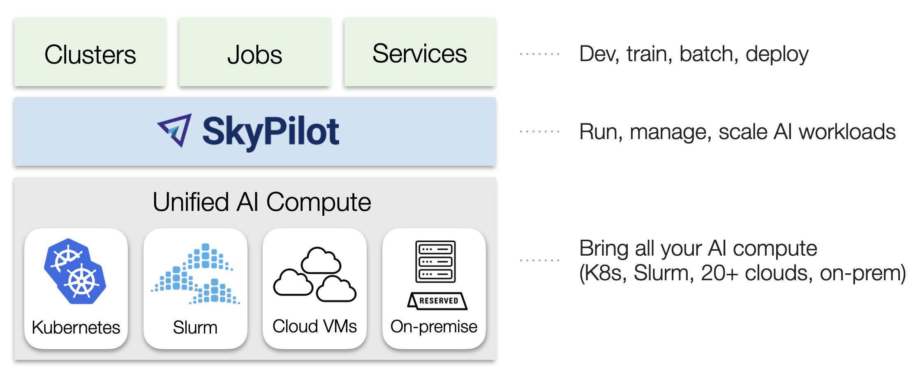

<p align="center">
  <picture>
    <source media="(prefers-color-scheme: dark)" srcset="https://raw.githubusercontent.com/skypilot-org/skypilot/master/docs/source/images/skypilot-wide-dark-1k.png">
    
  </picture>
</p>

<p align="center">
  <a href="https://docs.skypilot.co/">
    
  </a>

  <a href="https://github.com/skypilot-org/skypilot/releases">
    
  </a>

  <a href="http://slack.skypilot.co">
    
  </a>

  <a href="https://github.com/skypilot-org/skypilot/releases">
    
  </a>

</p>

<h3 align="center">
    Manage all your AI compute
</h3>

<div align="center">

#### [🌟 **SkyPilot Demo** 🌟: Click to see a 1-minute tour](https://demo.skypilot.co/dashboard/)

</div>


SkyPilot is a system to run, manage, and scale AI workloads on any AI infrastructure.

SkyPilot gives **AI teams** a simple interface to run jobs on any infra.
**Infra teams** get a unified control plane to manage any AI compute — with advanced scheduling, scaling, and orchestration.

<picture>
  <source media="(prefers-color-scheme: dark)" srcset="./docs/source/images/skypilot-abstractions-long-2-dark.png">
  
</picture>

-----

:fire: *News* :fire:
- [Mar 2026] **Scaling Karpathy's Autoresearch**: Autoresearch runs 1 experiment at a time. We gave it 16 GPUs and let it run in parallel: [**blog**](https://blog.skypilot.co/scaling-autoresearch/), [**HackerNews**](https://news.ycombinator.com/item?id=47442435)
- [Mar 2026] **SkyPilot Agent Skills**: GPU access and job management for AI agents: [**docs**](https://docs.skypilot.co/en/latest/getting-started/skill.html)
- [Jan 2026] **Shopify case study**: Shopify runs all AI training workloads on SkyPilot: [**case study**](https://shopify.engineering/skypilot)
- [Dec 2025] **SkyPilot v0.11** released: Multi-Cloud Pools, Fast Managed Jobs, Enterprise-Readiness at Large Scale, Programmability. [**Release notes**](https://github.com/skypilot-org/skypilot/releases/tag/v0.11.0)
- [Dec 2025] Train **an agent to use Google Search** as a tool with RL on your Kubernetes or clouds: [**blog**](https://blog.skypilot.co/verl-tool-calling/), [**example**](./llm/verl/)
- [Oct 2025] Run **RL training for LLMs** with SkyRL on your Kubernetes or clouds: [**example**](./llm/skyrl/)

## Overview

SkyPilot **is easy to use for AI users**:
- Quickly spin up compute on your own infra
- Environment and job as code — simple and portable
- Easy job management: queue, run, and auto-recover many jobs

SkyPilot **makes Kubernetes easy for AI & Infra teams**:

- Slurm-like ease of use, cloud-native robustness
- Local dev experience on K8s: SSH into pods, sync code, or connect IDE
- Turbocharge your clusters: gang scheduling, multi-cluster, and scaling

SkyPilot **unifies multiple clusters, clouds, and hardware**:
- One interface to use reserved GPUs, Kubernetes clusters, Slurm clusters, or 20+ clouds
- [Flexible provisioning](https://docs.skypilot.co/en/latest/examples/auto-failover.html) of GPUs, TPUs, CPUs, with smart failover
- [Team deployment](https://docs.skypilot.co/en/latest/reference/api-server/api-server.html) and resource sharing

SkyPilot **maximizes GPU fleet utilization**:
* Autostop: automatic cleanup of idle resources
* Binpacking: workload binpacking on shared clusters
* Intelligent scheduler: automatically schedule on the most available infra

SkyPilot supports your existing GPU, TPU, and CPU workloads, with no code changes.

Install with uv ([also supported](https://docs.skypilot.co/en/latest/getting-started/installation.html): pip, nightly, from source)
```bash
# Choose your clouds:
uv pip install "skypilot[kubernetes,aws,gcp,azure,oci,nebius,lambda,runpod,fluidstack,paperspace,cudo,ibm,scp,seeweb,shadeform,verda]"
```

To use SkyPilot directly with your agent (Claude Code, Codex, etc.), install the [SkyPilot Skill](https://docs.skypilot.co/en/latest/getting-started/skill.html). Tell your agent:
```
Fetch and follow https://github.com/skypilot-org/skypilot/blob/HEAD/agent/INSTALL.md to install the skypilot skill
```

<p align="center">
  
</p>

Current supported infra: Kubernetes, Slurm, AWS, GCP, Azure, OCI, CoreWeave, Nebius, Lambda Cloud, RunPod, Fluidstack,
Cudo, Digital Ocean, Paperspace, Cloudflare, Samsung, IBM, Vast.ai, VMware vSphere, Seeweb, Prime Intellect, Shadeform, Verda Cloud, VastData, Crusoe.
<p align="center">
  <picture>
    <source media="(prefers-color-scheme: dark)" srcset="https://raw.githubusercontent.com/skypilot-org/skypilot/master/docs/source/images/cloud-logos-dark.png">
    
  </picture>
</p>
<!-- source xcf file: https://drive.google.com/drive/folders/1S_acjRsAD3T14qMeEnf6FFrIwHu_Gs_f?usp=drive_link -->


## Getting started

[Install SkyPilot](https://docs.skypilot.co/en/latest/getting-started/installation.html) in 1 minute. Then, launch your first cluster in 2 minutes in [Quickstart](https://docs.skypilot.co/en/latest/getting-started/quickstart.html).

SkyPilot is BYOC: Everything is launched within your cloud accounts, VPCs, and clusters.

## Benefits of SkyPilot on Kubernetes

SkyPilot makes Kubernetes AI-native.

It turbocharges your existing Kubernetes clusters by **accelerating AI/ML velocity**:

- AI-friendly interface to launch jobs and deployments
- Much simplified interactive dev for K8s (SSH / sync code / connect IDE to pods)

...and **optimizing GPU scheduling, utilization, and scaling**:

- Advanced scheduling: Gang scheduling, multi-node jobs, and queueing
- Multi-cluster support: Bring all your clusters under one control plane
- Multi-cloud support: One consistent interface to manage many providers

See [SkyPilot vs Vanilla Kubernetes](https://docs.skypilot.co/en/latest/reference/kubernetes/skypilot-and-vanilla-k8s.html) and this [blog post](https://blog.skypilot.co/ai-on-kubernetes/) for more details.

## SkyPilot in 1 minute

A SkyPilot task specifies: resource requirements, data to be synced, setup commands, and the task commands.

Once written in this [**unified interface**](https://docs.skypilot.co/en/latest/reference/yaml-spec.html) (YAML or Python API), the task can be launched on any available infra (Kubernetes, Slurm, cloud, etc.).  This avoids vendor lock-in, and allows easily moving jobs to a different provider.

Paste the following into a file `my_task.yaml`:

```yaml
resources:
  accelerators: A100:8  # 8x NVIDIA A100 GPU

num_nodes: 1  # Number of VMs to launch

# Working directory (optional) containing the project codebase.
# Its contents are synced to ~/sky_workdir/ on the cluster.
workdir: ~/torch_examples

# Commands to be run before executing the job.
# Typical use: pip install -r requirements.txt, git clone, etc.
setup: |
  cd mnist
  pip install -r requirements.txt

# Commands to run as a job.
# Typical use: launch the main program.
run: |
  cd mnist
  python main.py --epochs 1
```

Prepare the workdir by cloning:
```bash
git clone https://github.com/pytorch/examples.git ~/torch_examples
```

Launch with `sky launch` (note: [access to GPU instances](https://docs.skypilot.co/en/latest/cloud-setup/quota.html) is needed for this example):
```bash
sky launch my_task.yaml
```

SkyPilot then performs the heavy-lifting for you, including:
1. Find the cheapest & available infra across your clusters or clouds
2. Provision the GPUs (pods or VMs), with auto-failover if the infra returned capacity errors
3. Sync your local `workdir` to the provisioned cluster
4. Auto-install dependencies by running the task's `setup` commands
5. Run the task's `run` commands, and stream logs

See [Quickstart](https://docs.skypilot.co/en/latest/getting-started/quickstart.html) to get started with SkyPilot.

## Runnable examples

See [**SkyPilot examples**](https://docs.skypilot.co/en/docs-examples/examples/index.html) that cover: development, training, serving, LLM models, AI apps, and common frameworks.

Latest featured examples:

| Task | Examples |
|----------|----------|
| Training | [Verl](https://docs.skypilot.co/en/latest/examples/training/verl.html), [Finetune Llama 4](https://docs.skypilot.co/en/latest/examples/training/llama-4-finetuning.html), [TorchTitan](https://docs.skypilot.co/en/latest/examples/training/torchtitan.html), [PyTorch](https://docs.skypilot.co/en/latest/getting-started/tutorial.html), [DeepSpeed](https://docs.skypilot.co/en/latest/examples/training/deepspeed.html), [NeMo](https://docs.skypilot.co/en/latest/examples/training/nemo.html), [Ray](https://docs.skypilot.co/en/latest/examples/training/ray.html), [Unsloth](https://docs.skypilot.co/en/latest/examples/training/unsloth.html), [Jax/TPU](https://docs.skypilot.co/en/latest/examples/training/tpu.html), [OpenRLHF](https://docs.skypilot.co/en/latest/examples/training/openrlhf.html) |
| Serving | [vLLM](https://docs.skypilot.co/en/latest/examples/serving/vllm.html), [SGLang](https://docs.skypilot.co/en/latest/examples/serving/sglang.html), [Ollama](https://docs.skypilot.co/en/latest/examples/serving/ollama.html) |
| Models | [DeepSeek-R1](https://docs.skypilot.co/en/latest/examples/models/deepseek-r1.html), [Llama 4](https://docs.skypilot.co/en/latest/examples/models/llama-4.html), [Llama 3](https://docs.skypilot.co/en/latest/examples/models/llama-3.html), [CodeLlama](https://docs.skypilot.co/en/latest/examples/models/codellama.html), [Qwen](https://docs.skypilot.co/en/latest/examples/models/qwen.html), [Kimi-K2](https://docs.skypilot.co/en/latest/examples/models/kimi-k2.html), [Kimi-K2-Thinking](https://docs.skypilot.co/en/latest/examples/models/kimi-k2-thinking.html), [Mixtral](https://docs.skypilot.co/en/latest/examples/models/mixtral.html) |
| AI apps | [RAG](https://docs.skypilot.co/en/latest/examples/applications/rag.html), [vector databases](https://docs.skypilot.co/en/latest/examples/applications/vector_database.html) (ChromaDB, CLIP) |
| Common frameworks | [Airflow](https://docs.skypilot.co/en/latest/examples/frameworks/airflow.html), [Jupyter](https://docs.skypilot.co/en/latest/examples/frameworks/jupyter.html), [marimo](https://docs.skypilot.co/en/latest/examples/frameworks/marimo.html)  |

Source files can be found in [`llm/`](https://github.com/skypilot-org/skypilot/tree/master/llm) and [`examples/`](https://github.com/skypilot-org/skypilot/tree/master/examples).

## Learn more
To learn more, see [SkyPilot Overview](https://docs.skypilot.co/en/latest/overview.html), [SkyPilot docs](https://docs.skypilot.co/en/latest/), and [SkyPilot blog](https://blog.skypilot.co/).

SkyPilot adopters: [Testimonials and Case Studies](https://blog.skypilot.co/case-studies/)

Partners and integrations: [Community Spotlights](https://blog.skypilot.co/community/)

Follow updates:
- [Slack](http://slack.skypilot.co)
- [X](https://twitter.com/skypilot_org)
- [LinkedIn](https://www.linkedin.com/company/skypilot-oss/)
- [YouTube](https://www.youtube.com/@skypilot-org)
- [SkyPilot Blog](https://blog.skypilot.co/)

## Questions and feedback
We are excited to hear your feedback:
* For issues and feature requests, please [open a GitHub issue](https://github.com/skypilot-org/skypilot/issues/new).
* For questions, please use [GitHub Discussions](https://github.com/skypilot-org/skypilot/discussions).

For general discussions, join us on the [SkyPilot Slack](http://slack.skypilot.co).

## Contributing
We welcome all contributions to the project! See [CONTRIBUTING](CONTRIBUTING.md) for how to get involved.
