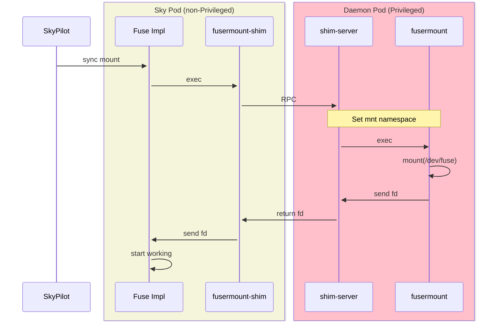

# SkyPilot fuse-proxy

A fuse-proxy that helps SkyPilot run FUSE in containers without root privilege and `SYS_ADMIN` capability.

## Build

The server:

```bash
docker build . -t fusermount-server:latest
```

The (`fusermount-shim`) client is usually built in the application container image to replace the `fusermount` binary:

```Dockerfile
FROM golang:1.23-alpine AS shim-builder
WORKDIR /app
COPY . .
RUN CGO_ENABLED=0 go build -o fusermount-shim cmd/fusermount-shim/main.go

FROM <APPLICATION_BASE_IMAGE>
# ... in the build stage of application image

COPY --from=shim-builder /app/fusermount-shim /bin/fusermount-shim
RUN ln -sf /bin/fusermount-shim /bin/fusermount
```

## Mount/Unmount Process


