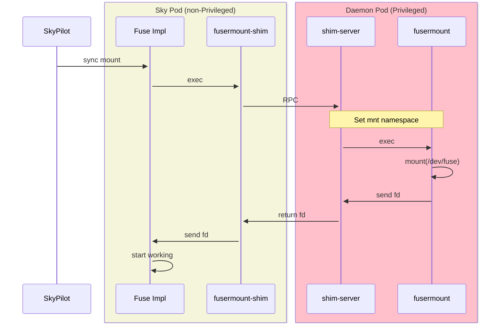

# SkyPilot fuse-proxy

A fuse-proxy that enables SkyPilot to run FUSE in containers without root privilege and `SYS_ADMIN` capability.

## Architecture

The fuse-proxy consists of two components:

1. A client (`fusermount-shim`) that masks the `fusermount` binary to intercept `fusermount` calls;
2. A privileged server running as a DaemonSet on each Kubernetes node;

The client and server communicate via unix domain socket, so SkyPilot Pods and the DaemonSet Pods must mount a shared directoy from host.

## Usage

This component can be used independently with some integration work. Here is how SkyPilot uses this:

1. Build the server image

```bash
docker build . -t fusermount-server:latest
```

2. Deploy the server as a privileged DaemonSet: [example manifest](https://raw.githubusercontent.com/skypilot-org/skypilot/master/sky/provision/kubernetes/manifests/fusermount-server-daemonset.yaml)

3. In the application Pod, mount the shared directory:

```yaml
spec:
  containers:
  - name: main
    volumeMounts:
      - mountPath: /var/run/fusermount
        name: fusermount-shared-dir
  volumes:
    - hostPath:
        path: /var/run/fusermount
        type: DirectoryOrCreate
      name: fusermount-shared-dir
```

4. Mask the `fusermount` binary in an init-container or in init script in your application container:

```bash
# Install fuse2 and fuse3
apt-get install -y fuse fuse3
# Locate the original fusermount binary.
FUSERMOUNT_PATH=$(whereis fusermount | awk '{print $2}')
if [ -z "$FUSERMOUNT_PATH" ]; then
    echo "Error: fusermount binary not found"
    exit 1
fi
FOURSMOUNE3_PATH=$(whereis fusemount3 | awk '{print $2}')
if [ -z "$FOURSMOUNE3_PATH" ]; then
    echo "Error: fusemount3 binary not found"
    exit 1
fi
# The -original suffix is crucial: the server will enter the mnt namespace of application container and find the original fusermount binary
# by searching `fusermount-original` executable in PATH.
cp -p "$FUSERMOUNT_PATH" "${FUSERMOUNT_PATH}-original"
# Mask the fusermount/fusemount3 binary by the shim provided by fusermount-server.
ln -sf /var/run/fusermount/fusermount-shim "$FUSERMOUNT_PATH"
ln -sf /var/run/fusermount/fusermount-shim "$FOURSMOUNE3_PATH"
```

## How it Works

1. When a FUSE mount is requested, SkyPilot starts a FUSE implementation process (e.g., gcsfuse) in the Sky container
2. The FUSE implementation executes `fusermount-shim` (instead of the regular `fusermount`)
3. `fusermount-shim` forwards the request to the privileged daemon pod
4. The daemon pod:
   - Identifies the caller's mnt namespace
   - Performs the mount operation using `nsenter` and real `fusermount` in the caller's mnt namespace
   - Returns the mounted file descriptor back to the FUSE implementation


