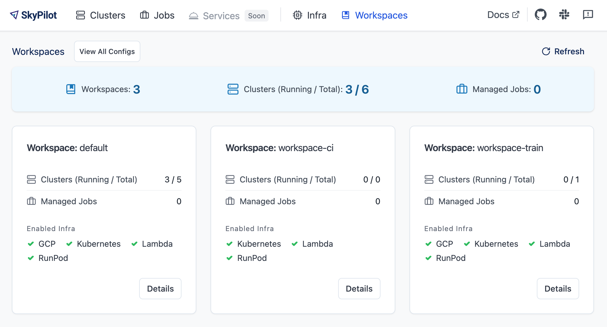
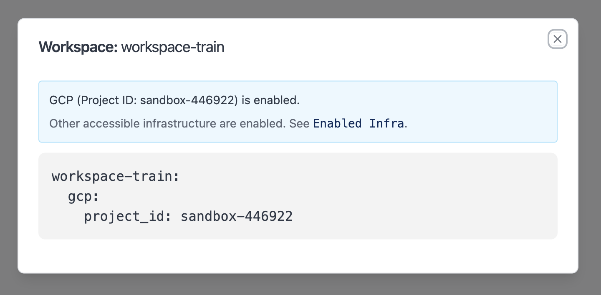
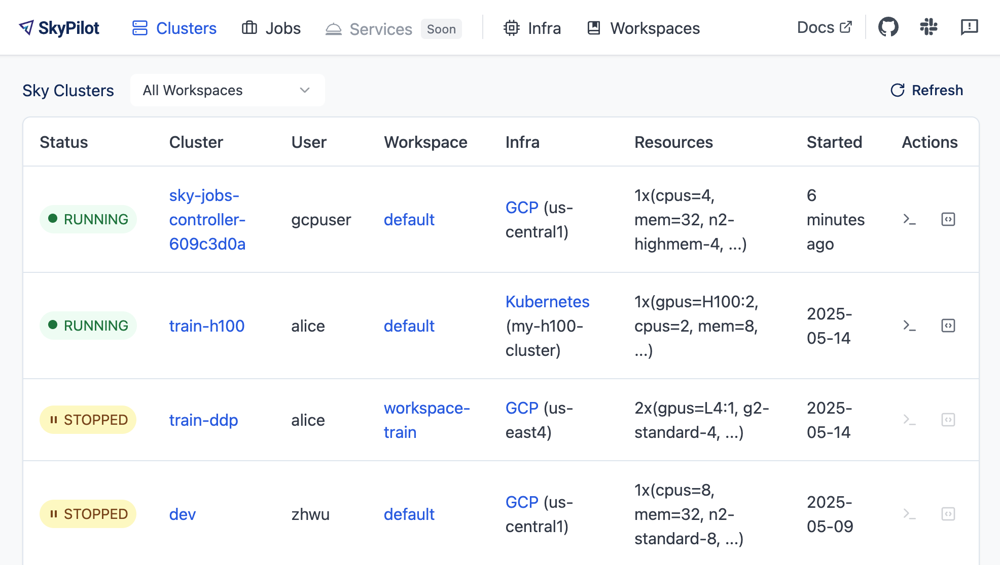

.. _workspaces:

Workspaces: Isolating Teams
=======================================

**Workspaces** in SkyPilot allow you to isolate resources and configurations for
different teams or projects.

Example use cases:

- **Team Isolation**: Have different teams use different infra providers.
- **Project Separation**: Set different SkyPilot configurations for different projects.
- **Resource Tracking**: Track resource usage by team or project.

Configuration
-------------

Define workspaces in your :ref:`SkyPilot config file <config-yaml>` on the API server host, i.e., ``~/.sky/config.yaml``.

For example, assume:

- Your organization has two teams, team-a and team-b.
- SkyPilot API server is configured to use AWS and GCP.
- You want team-a to use both infra, and team-b to use GCP only with a different project ID.

The above is achieved by configuring the following:

.. code-block:: yaml

   workspaces:
     team-a:
       # Use both AWS and GCP.
       gcp:
         project_id: project-id-for-team-a

     team-b:
       # Use GCP only with a different project ID.
       gcp:
         project_id: project-id-for-team-b
       aws:
         disabled: true

Schema of the ``workspaces`` section:

.. code-block:: yaml

   workspaces:
     # Workspace 'default' is created by SkyPilot and is used if no workspaces
     # are defined. Admins can optionally override settings for this workspace.
     default: {}

     <workspace name>:
       <infra name>:  # aws, gcp, ...; ssh; k8s
         disabled: false  # Disable an infra provider for this workspace (default: false)

       # Currently, 'gcp' supports an additional field:
       gcp:
         disabled: false
         project_id: GCP project ID

Setting the active workspace
----------------------------

Whenever a SkyPilot CLI or API is called, the workspace to use is picked up from the client side's ``active_workspace`` configuration.

For example, if your organization has a monorepo with multiple teams/projects:

.. code-block:: console

   /monorepo
   └── team-a
       └── .sky.yaml
       └── training.sky.yaml
   └── team-b
       └── .sky.yaml
       └── batch-infer.sky.yaml
   └── team-c
       └── # No .sky.yaml file; use the 'default' workspace.
       └── serve.sky.yaml
   └── ...

Then, ``/monorepo/team-a/.sky.yaml`` may set:

.. code-block:: yaml

   active_workspace: team-a

All SkyPilot CLI or API calls with ``/monorepo/team-a`` as the PWD will use the workspace ``team-a``.

Similarly, ``/monorepo/team-b/.sky.yaml`` may set.

.. code-block:: yaml

   active_workspace: team-b

All SkyPilot CLI or API calls with ``/monorepo/team-b`` as the PWD will use the workspace ``team-b``.

For team-c, since it has no workspace set, all CLI or API calls there will use the ``default`` workspace.

Viewing the workspaces in dashboard
------------------------------------

The SkyPilot UI (``sky dashboard``) has a **Workspaces** page that shows all configured workspaces.

This page shows all workspaces, and for each workspace its current clusters/jobs usage information and enabled infra choices.

To view a workspace's definition, click on a workspace's **Details** button.

To view all workspaces' definitions (i.e., the one defined at the API server), click on **View All Configs**.

In the **Clusters** and **Jobs** pages, all compute resources are tagged with the
workspace they belong to. Users can filter the view by workspace. Example:

User management
----------------

Currently, all users in an organization are allowed to use any configured
workspace. Users can flexibly switch to a different workspace as shown above.

SkyPilot supports using Okta, Google Workspace, or other SSO providers to
authenticate users. See :ref:`here <api-server-auth-proxy>`.
