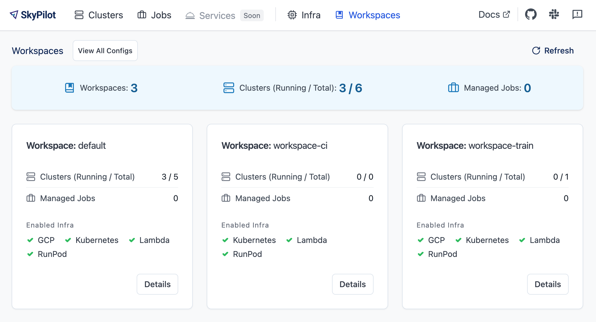
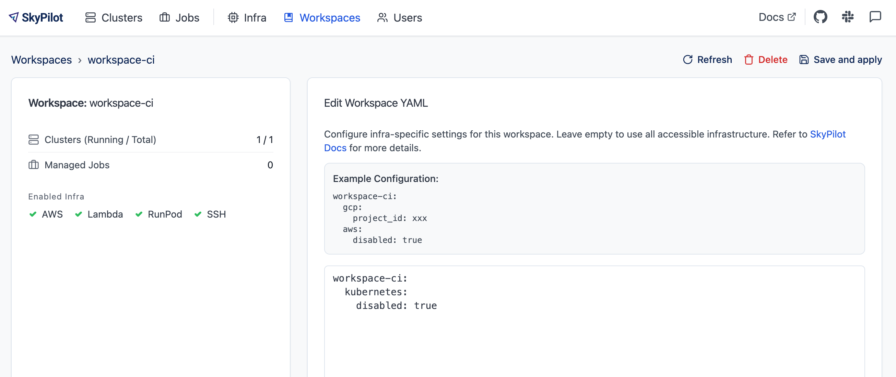
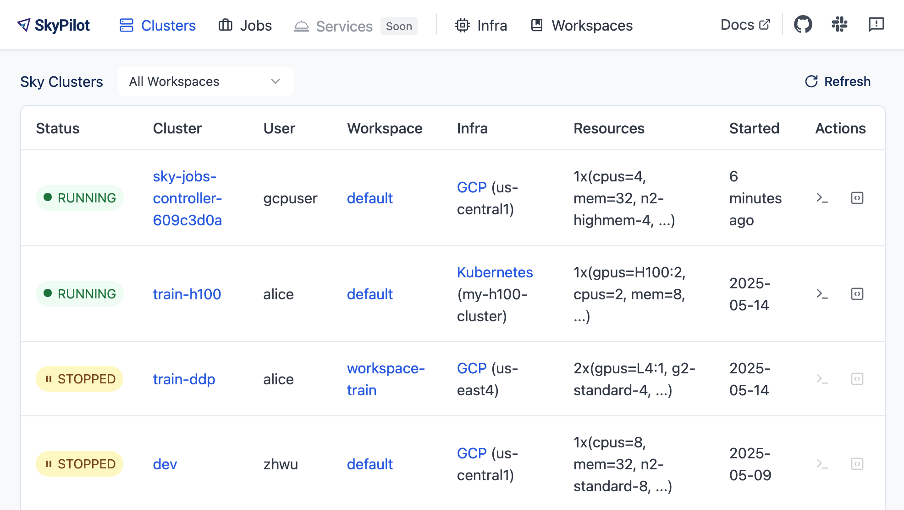

.. _workspaces:

Workspaces: Isolating Teams
=======================================

**Workspaces** in SkyPilot allow you to isolate resources and configurations for
different teams or projects.

Example use cases:

- **Team Isolation**: Have different teams use different infra providers.
- **Project Separation**: Set different SkyPilot configurations for different projects.
- **Resource Tracking**: Track resource usage by team or project.

Defining workspaces
-------------------

Defining workspaces in configuration file
~~~~~~~~~~~~~~~~~~~~~~~~~~~~~~~~~~~~~~~~~

Workspaces are defined in the :ref:`SkyPilot config file <config-yaml>` of API server, i.e., ``~/.sky/config.yaml`` on the API server host.

For example, assume:

- Your organization has two teams, team-a and team-b.
- SkyPilot API server is configured to use AWS and GCP.
- You want team-a to use both infra, and team-b to use GCP only with a different project ID.

The above is achieved by configuring the following section in the config file:

.. code-block:: yaml

   workspaces:
     team-a:
       # Use both AWS and GCP.
       gcp:
         project_id: project-id-for-team-a
       aws:
         profile: team-a-profile

     team-b:
       # Use GCP only with a different project ID.
       gcp:
         project_id: project-id-for-team-b
         capabilities:
           - storage
       aws:
         disabled: true

      team-c:
         private: true
         allowed_users:
         - alice@example.com
         - bob@example.com

.. dropdown:: Schema of the ``workspaces`` field:

   .. code-block:: yaml

      workspaces:
        # Workspace 'default' is created by SkyPilot and is used if no
        # workspaces are defined. Admins can optionally override settings for
        # this workspace.
        default: {}

        <workspace name>:
           <infra name>:  # aws, gcp, ...; ssh; kubernetes
             disabled: false  # Disable an infra for this workspace (default: false).

           # Certain infra providers support additional fields:
           ssh:
             disabled: false
             allowed_node_pools:
               - node-pool-1

           kubernetes:
             disabled: false
             allowed_contexts:
               - node-pool-1
               - node-pool-2
             # Workspace-level default namespace (optional). Applies to every
             # context in `allowed_contexts` that does not set its own
             # `context_configs.<ctx>.namespace` below.
             namespace: team-a-namespace
             # Service account the pods run as (optional). A plain string sets
             # the same service account for every context; a mapping selects
             # one per context. See "Per-workspace cloud identity" below.
             remote_identity: team-a-service-account
             # Per-workspace per-context overrides (optional). Lets a single
             # shared context target a different namespace per workspace and
             # takes precedence over the workspace-level `namespace` above.
             context_configs:
               node-pool-1:
                 namespace: team-a-node-pool-1-namespace

           gcp:
             disabled: false
             project_id: GCP project ID
             capabilities:
               - compute
               - storage
             # Credential mode only (enum): LOCAL_CREDENTIALS, SERVICE_ACCOUNT,
             # or NO_UPLOAD. Unlike AWS/Kubernetes, a specific service account
             # email cannot be pinned per workspace.
             remote_identity: SERVICE_ACCOUNT

           aws:
             disabled: false
             profile: aws-profile-name
             capabilities:
               - compute
               - storage
             # IAM role (service account) attached to launched EC2 instances
             # (optional). A plain string applies to all clusters; a list of
             # {cluster-name-glob: role} mappings selects per cluster name.
             remote_identity: skypilot-team-a-v1

           nebius:
             disabled: false
             tenant_id: Nebius tenant ID (tenant-xxxxxxxx)
             credentials_file_path: ~/.nebius/credentials-file-name.json
             domain: api.nebius.cloud:443

To apply the configuration, follow the following steps:

.. tab-set::

   .. tab-item:: Helm Deployment

      If you used :ref:`Helm Deployment <sky-api-server-helm-deploy-command>` to
      deploy a remote API server, write workspace configuration in a local
      SkyPilot config file, and run:

      .. code-block:: bash

         # RELEASE_NAME and NAMESPACE are the same as the ones used in the Helm
         # deployment.
         helm upgrade --install $RELEASE_NAME skypilot/skypilot-nightly --devel \
            --namespace $NAMESPACE \
            --reuse-values \
            --set-file apiService.config=/your/path/to/config.yaml

      To change workspace configuration, update the config file and run the same command again. The API server will reload the new configuration automatically with no downtime. For more details, refer to :ref:`Setting the SkyPilot config in Helm Deployment <sky-api-server-config>`.

   .. tab-item:: VM Deployment or Local API Server

      If you used a :ref:`VM Deployment <sky-api-server-cloud-deploy>` for your
      API server or testing workspaces locally, edit the workspace configuration
      in the :ref:`SkyPilot config file <config-yaml>`, ``~/.sky/config.yaml``.
      The API server will automatically reload the configuration to apply the
      changes.

Defining workspaces in UI
~~~~~~~~~~~~~~~~~~~~~~~~~

Equivalently, you can also define workspaces in the UI.

The SkyPilot UI (``sky dashboard``) has a **Workspaces** page that shows all configured workspaces.

This page shows all workspaces, and for each workspace its current clusters/jobs usage information and enabled infra choices.

To create a new workspace, click on the **Create New Workspace** button. Users can edit the workspace's definition in the UI.

To view or edit a workspace's definition, click on a workspace's **Edit** button.

.. _workspaces-remote-identity:

Per-workspace cloud identity
----------------------------

Each workspace can run its compute under its own cloud identity by setting
``remote_identity`` in the workspace's cloud block. This is the per-workspace
equivalent of the global :ref:`remote_identity <config-yaml-aws-remote-identity>`
and is typically used to give each team an IAM role / service account scoped to
only that team's resources (e.g., per-team S3 buckets).

.. code-block:: yaml

   workspaces:
     team-a:
       aws:
         # IAM role (service account) attached to launched EC2 instances.
         remote_identity: skypilot-team-a-v1
       kubernetes:
         # Service account the pods run as (IRSA on EKS, Workload Identity on
         # GKE). A plain string applies to all contexts.
         remote_identity: team-a-service-account
     team-b:
       aws:
         remote_identity: skypilot-team-b-v1

What ``remote_identity`` controls per cloud:

* **AWS** — the IAM role (service account) attached to launched EC2 instances.
  Accepts a plain string, or a list of ``{cluster-name-glob: role}`` mappings.
* **Kubernetes** — the ``serviceAccountName`` set on the pod. Accepts a plain
  string (applied to every context) or a ``{context: service-account}`` mapping.
* **GCP** — credential *mode* only: one of ``LOCAL_CREDENTIALS``,
  ``SERVICE_ACCOUNT``, or ``NO_UPLOAD``. Unlike AWS and Kubernetes, GCP cannot
  pin a specific service account email per workspace; the VM uses the default
  SkyPilot service account.

.. _workspaces-remote-identity-precedence:

Resolution order
~~~~~~~~~~~~~~~~~

``remote_identity`` is resolved workspace-first: the workspace block is fully
consulted before any global config. From highest to lowest priority:

#. Workspace, per-context/region — **only for clouds that support it**
   (Kubernetes/SSH via ``context_configs.<ctx>``; Nebius/OCI via
   ``region_configs.<region>``):
   ``workspaces.<ws>.<cloud>.context_configs.<ctx>.remote_identity``
#. Workspace, cloud-level: ``workspaces.<ws>.<cloud>.remote_identity``
#. Global, per-context/region (same clouds as step 1):
   ``<cloud>.context_configs.<ctx>.remote_identity``
#. Global, cloud-level: ``<cloud>.remote_identity``
#. Default: ``LOCAL_CREDENTIALS`` (AWS/GCP) or ``SERVICE_ACCOUNT`` (Kubernetes)

AWS and GCP are neither context- nor region-keyed, so steps 1 and 3 do not
apply to them — only the cloud-level value (steps 2 and 4) and the default are
consulted.

.. note::

   Scope outranks specificity. For a cloud that *does* have a per-context tier
   (e.g. Kubernetes), a cloud-level workspace value (step 2) shadows a *more
   specific* global per-context value (step 3): a plain
   ``workspaces.team-a.kubernetes.remote_identity`` overrides a global
   ``kubernetes.context_configs.<ctx>.remote_identity`` for that workspace. If
   you need a context-specific identity to survive inside a workspace, set it
   under that workspace's own ``context_configs``.

Setting the active workspace
----------------------------

Whenever a SkyPilot CLI or API is called, the workspace to use is picked up from the client side's ``active_workspace`` configuration.

For example, if your organization has a monorepo with multiple teams/projects:

.. code-block:: console

   /monorepo
   └── team-a
       └── .sky.yaml
       └── training.sky.yaml
   └── team-b
       └── .sky.yaml
       └── batch-infer.sky.yaml
   └── team-c
       └── # No .sky.yaml file; use the 'default' workspace.
       └── serve.sky.yaml
   └── ...

Then, ``/monorepo/team-a/.sky.yaml`` may set:

.. code-block:: yaml

   active_workspace: team-a

All SkyPilot CLI or API calls with ``/monorepo/team-a`` as the PWD will use the workspace ``team-a``.

.. code-block:: console

   $ cd /monorepo/team-a
   $ sky launch -c training training.sky.yaml

Similarly, ``/monorepo/team-b/.sky.yaml`` may set:

.. code-block:: yaml

   active_workspace: team-b

All SkyPilot CLI or API calls with ``/monorepo/team-b`` as the PWD will use the workspace ``team-b``.

For team-c, since it has no workspace set, all CLI or API calls there will use the ``default`` workspace.

.. tip::

   You can also set the workspace in the CLI using ``--config active_workspace=<workspace>``:

   .. code-block:: bash

      sky launch --config active_workspace=team-a ...

   See also :ref:`config-sources-and-overrides` for various ways to set configuration.

Workspaces in UI
----------------

Workspaces are shown in the **Workspaces** page in ``sky dashboard``.

In the **Clusters** and **Jobs** pages, all compute resources are tagged with the
workspace they belong to. Users can filter the view by workspace. Example:

Private workspaces
------------------

Private workspaces are workspaces that are only accessible to a specific set of users.

To create a private workspace, set the ``private`` field to ``true`` in the workspace configuration.

.. code-block:: yaml

   workspaces:
     private-ws:
       private: true
       allowed_users:
         - alice@example.com
         - bob@example.com

Private workspaces can only be accessed by admins or the users in the ``allowed_users`` list. For
users who cannot access the workspace, they cannot see/access/operate on the workspace or the resources in the workspace.

.. note::

   The ``allowed_users`` field can be a list of user names or IDs. Note, if you
   have multiple users with the same name, you need to specify the user IDs instead.

Service accounts in private workspaces
~~~~~~~~~~~~~~~~~~~~~~~~~~~~~~~~~~~~~~~~

:ref:`Service accounts <service-accounts>` can be added to ``allowed_users`` to
let automation (CI, scripts, etc.) launch into a private workspace. List the
service account by its token name, just like a human user:

.. code-block:: yaml

   workspaces:
     private-ws:
       private: true
       allowed_users:
         - alice@example.com
         - my-service-account        # service account token name

.. important::

   A newly created service account is assigned the **default role**, which is
   ``admin`` unless you set ``rbac.default_role: user``. **Admins can access
   every workspace**, so adding an admin service account to ``allowed_users``
   has no scoping effect.

   To restrict a service account to specific workspaces, first assign it the
   ``user`` role (in the dashboard's **Users** page under the service accounts
   tab, or via the ``/service-account-tokens/update-role`` API), then add it to
   the ``allowed_users`` of the workspaces it should reach.

User management
----------------

Currently, all users in an organization are allowed to use any configured
workspace. Users can flexibly switch to a different workspace as shown above.

SkyPilot supports using Okta, Google Workspace, or other SSO providers to
authenticate users. See :ref:`here <api-server-oauth>`.
