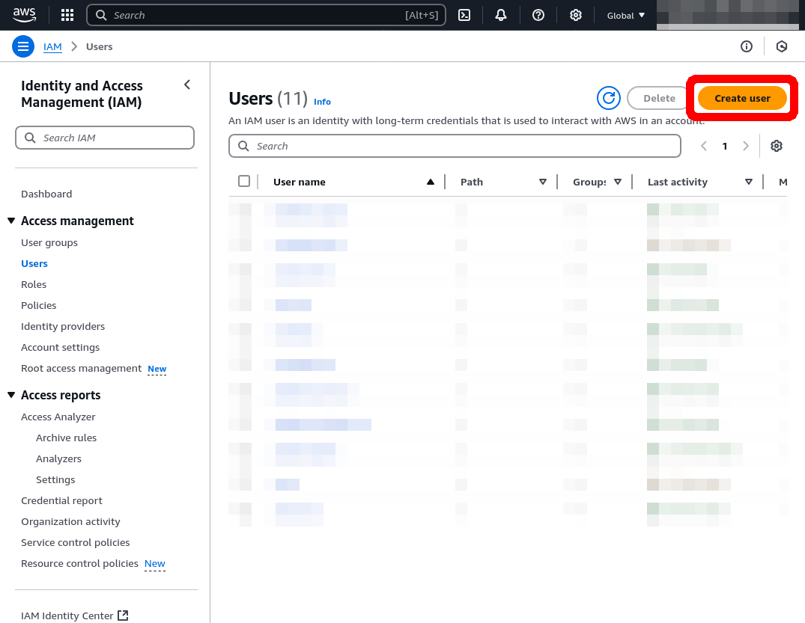
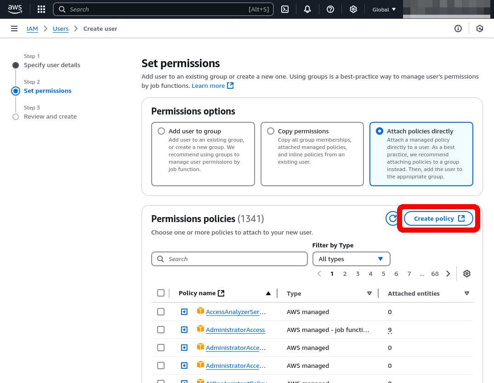
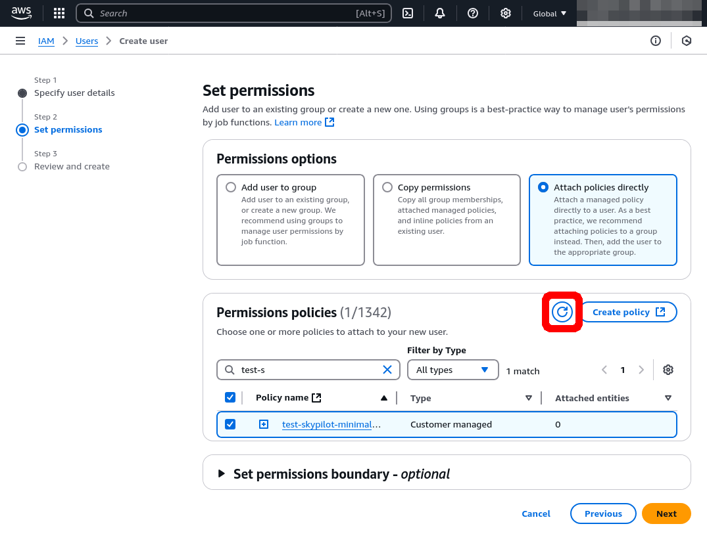
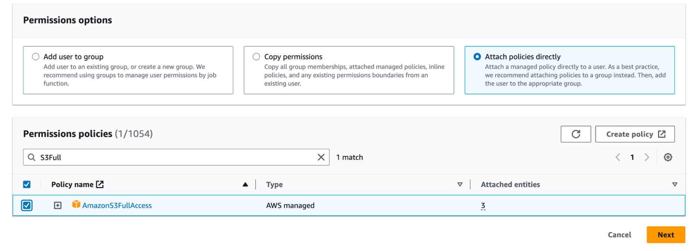
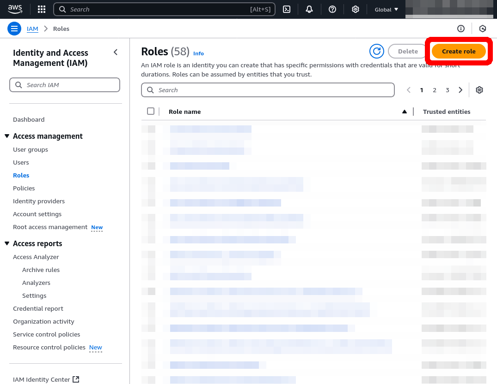
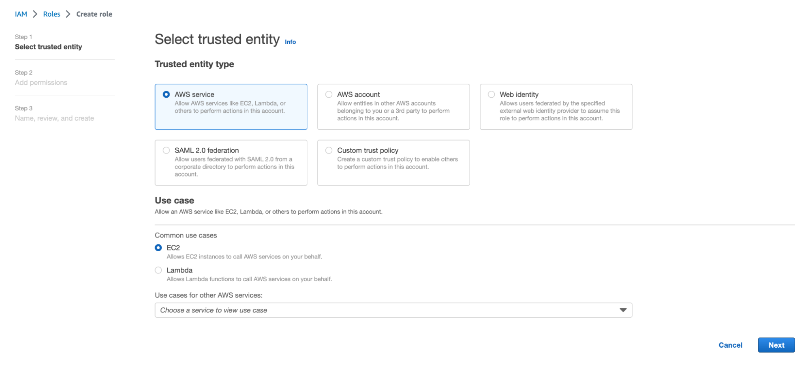

.. _cloud-permissions-aws:

AWS
=====

.. _cloud-permissions-aws-user-creation:

Minimal Permissions
-----------------------

Minimizing AWS permissions should be set up in two places:

1. **User Account**: the user account is the individual account of an user created by the administrator.
2. **IAM role**: the IAM role is assigned to all EC2 instances created by SkyPilot, which is used by the instances to access AWS resources, e.g., read/write S3 buckets or create other EC2 nodes. The IAM role is shared by all users under the same organization/root account. (If a user account has the permission to create IAM roles, SkyPilot can automatically create the role.)

User Account
~~~~~~~~~~~~~~~~~~

AWS accounts can be attached with a policy that limits the permissions of the account. Follow these steps to create an AWS user with the minimum permissions required by SkyPilot:

1. Open the `IAM dashboard <https://us-east-1.console.aws.amazon.com/iamv2/home#/home>`_ in the AWS console and click on the **Users** tab. Then, click **Add users** and enter the user's name. Click **Next**.

2. In the **Permissions options** section, select "Attach existing policies directly"; Click on the **Create Policy**. This opens another window to create an IAM policy.

3. Choose "JSON" tab and place the following policy into the box. Replace the ``<account-ID-without-hyphens>`` with your AWS account ID. You can find your AWS account ID by clicking on the upper right corner of the console.

.. code-block:: json
    :name: aws-policy-json

    {
        "Version": "2012-10-17",
        "Statement": [
            {
                "Effect": "Allow",
                "Action": "ec2:RunInstances",
                "Resource": "arn:aws:ec2:*::image/ami-*"
            },
            {
                "Effect": "Allow",
                "Action": "ec2:RunInstances",
                "Resource": [
                    "arn:aws:ec2:*:<account-ID-without-hyphens>:instance/*",
                    "arn:aws:ec2:*:<account-ID-without-hyphens>:network-interface/*",
                    "arn:aws:ec2:*:<account-ID-without-hyphens>:subnet/*",
                    "arn:aws:ec2:*:<account-ID-without-hyphens>:volume/*",
                    "arn:aws:ec2:*:<account-ID-without-hyphens>:security-group/*"
                ]
            },
            {
                "Effect": "Allow",
                "Action": [
                    "ec2:TerminateInstances",
                    "ec2:DeleteTags",
                    "ec2:StartInstances",
                    "ec2:CreateTags",
                    "ec2:StopInstances"
                ],
                "Resource": "arn:aws:ec2:*:<account-ID-without-hyphens>:instance/*"
            },
            {
                "Effect": "Allow",
                "Action": [
                    "ec2:Describe*"
                ],
                "Resource": "*"
            },
            {
                "Effect": "Allow",
                "Action": [
                    "ec2:CreateSecurityGroup",
                    "ec2:AuthorizeSecurityGroupIngress"
                ],
                "Resource": "arn:aws:ec2:*:<account-ID-without-hyphens>:*"
            },
            {
                "Effect": "Allow",
                "Action": [
                    "iam:GetRole",
                    "iam:PassRole"
                ],
                "Resource": [
                    "arn:aws:iam::<account-ID-without-hyphens>:role/skypilot-v1"
                ]
            },
            {
                "Effect": "Allow",
                "Action": [
                    "iam:GetInstanceProfile"
                ],
                "Resource": "arn:aws:iam::<account-ID-without-hyphens>:instance-profile/skypilot-v1"
            }
        ]
    }

4. **Optional**: To enable ``sky launch --clone-disk-from``, you need to add the following permissions to the policy above as well.

.. code-block:: json

           {
                "Effect": "Allow",
                "Action": [
                    "ec2:CreateImage",
                    "ec2:CopyImage",
                    "ec2:DeregisterImage"
                ],
                "Resource": "*"
            }

5. Click **Next: Tags** and follow the instructions to finish creating the policy. You can give the policy a descriptive name, such as ``minimal-skypilot-policy``.
6. Go back to the previous window and click on the refresh button, and you can now search for the policy you just created.

7. **Optional**: If you would like to have your users access S3 buckets: You can additionally attach S3 access, such as the "AmazonS3FullAccess" policy.

8. Click on **Next** and follow the instructions to create the user.

With the steps above you are almost ready to have the users in your organization to use SkyPilot with the minimal permissions.

**One more thing** to do is to create a single IAM role ``skypilot-v1`` for all users in your organization. There are two ways to accomplish this:

1. Add additional permission for the user you created to allow SkyPilot to automatically create the IAM role using the user account. You can modify the last two rules in the policy you created in step 4 with the highlighted four lines:

.. note::

    If you have created the policy, you can find the policy in the **Policies** tab in the IAM dashboard. Click on the policy ``minimal-skypilot-policy`` (or the name you set in step 4) and click on the **Edit** to edit the policy.

.. code-block:: json
    :emphasize-lines: 6-7,17-18

            {
                "Effect": "Allow",
                "Action": [
                    "iam:GetRole",
                    "iam:PassRole",
                    "iam:CreateRole",
                    "iam:AttachRolePolicy"
                ],
                "Resource": [
                    "arn:aws:iam::<account-ID-without-hyphens>:role/skypilot-v1"
                ]
            },
            {
                "Effect": "Allow",
                "Action": [
                    "iam:GetInstanceProfile",
                    "iam:CreateInstanceProfile",
                    "iam:AddRoleToInstanceProfile"
                ],
                "Resource": "arn:aws:iam::<account-ID-without-hyphens>:instance-profile/skypilot-v1"
            }

2. Alternatively, you can create the ``skypilot-v1`` IAM role manually. The following section describes how to create the IAM role manually.

IAM Role Creation
~~~~~~~~~~~~~~~~~~

.. note::

    If you already have an IAM role called ``skypilot-v1`` in your AWS account, it is likely created by SkyPilot automatically, and you can skip this section.

1. Click the "Roles" tab in the IAM console, and click on **Create role**.

2. Select the following entity and common use cases and click **Next**.

3. Select the policy you created in step 4 in :ref:`User Creation <cloud-permissions-aws-user-creation>` (i.e. the previous step 6) and click on **Next: Tags**.
4. **Optional**: If you would like to let the user access S3 buckets on the VM they created, you can additionally attach the s3 access permission to the IAM role, such as the "AmazonS3FullAccess" policy.
5. Click **Next**, and name your role "skypilot-v1". Click **Create role**.

Using a specific VPC
-----------------------
By default, SkyPilot uses the "default" VPC in each region.

To instruct SkyPilot to use a specific VPC, you can use SkyPilot's global config
file ``~/.sky/config.yaml`` to specify the VPC name. See the ``aws.vpc_name``
field in :ref:`config-yaml`.  Example use cases include using a private VPC or a
VPC with fine-grained constraints, typically created via Terraform or manually.

To manually create a private VPC (i.e., all nodes will have internal IPs only),
you can use the AWS console; see instructions `here
<https://github.com/skypilot-org/skypilot/pull/1512>`_.
