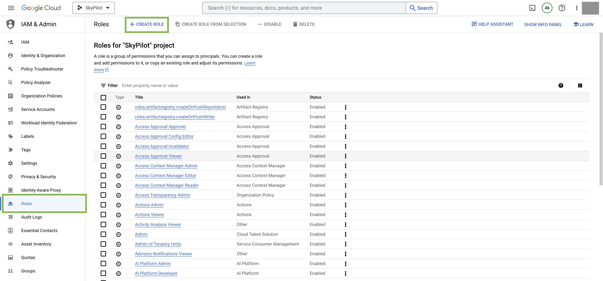
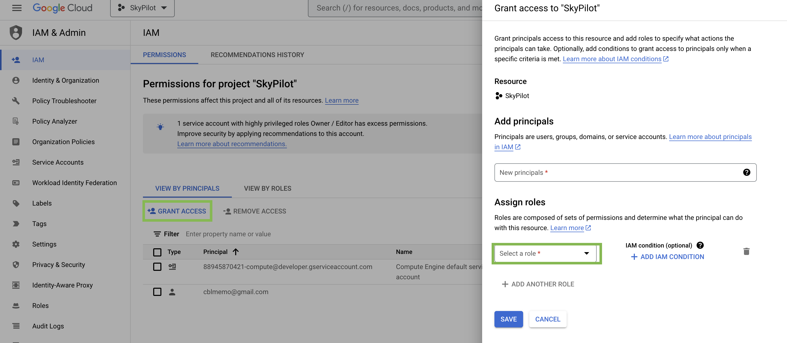
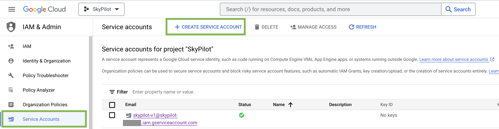
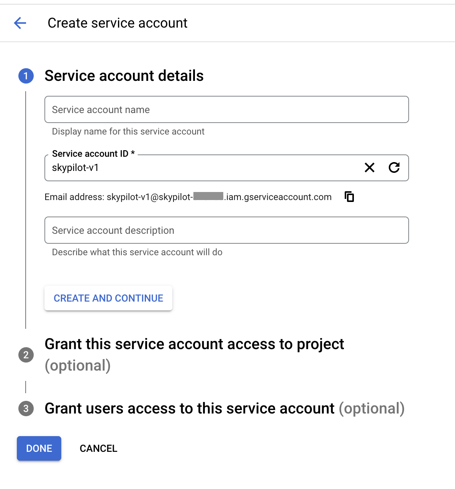
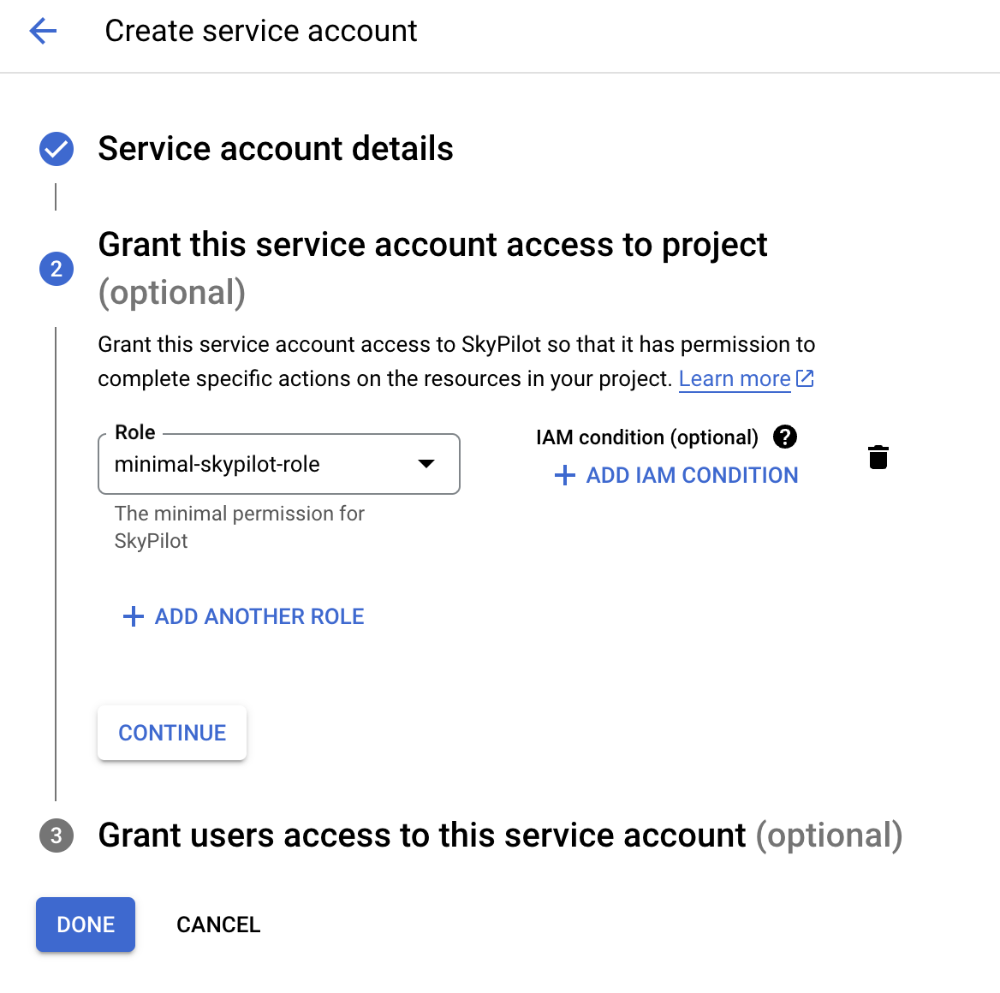
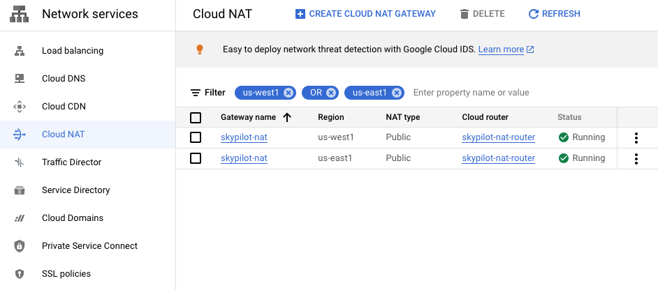

.. _cloud-permissions-gcp:

GCP
=============

Generally, the administrator can choose among three "levels" of permissions, from the most permissive and least setup effort, to the least permissive and more setup effort:

* Default: no setup, give users Owner-level permissions (i.e., you do not need to follow the instructions in this section)
* :ref:`Medium <gcp-medium-permissions>`: easy setup, with a medium set of permissions
* :ref:`Minimal <gcp-minimal-permissions>`: more setup, with the minimal set of permissions

.. _gcp-medium-permissions:

Medium Permissions
-----------------------

The easiest way to grant permissions to a user access your GCP project without the ``Owner`` role is to add the following roles to the user principals:

.. code-block:: yaml

  roles/browser
  roles/compute.admin
  roles/iam.serviceAccountAdmin
  roles/iam.serviceAccountUser
  roles/serviceusage.serviceUsageConsumer
  roles/storage.admin
  roles/iam.securityAdmin

.. note::
    If the ``roles/iam.securityAdmin`` role is undesirable, you can do the following. First, include the role and have any user (e.g., the admin) run ``sky launch --cloud gcp`` successfully once. This is to create the necessary service account. Then, replace the role ``roles/iam.securityAdmin`` with ``roles/iam.roleViewer`` in the list above.

Optionally, to use TPUs, add the following role:

.. code-block:: yaml

  roles/tpu.admin

You can grant those accesses via GCP's `IAM & Admin console <https://console.cloud.google.com/iam-admin/iam>`__.

.. _gcp-minimal-permissions:

Minimal Permissions
-----------------------

The :ref:`Medium Permissions <gcp-medium-permissions>` assigns admin permissions for some GCP services to the user.  If you would like to grant finer-grained and more minimal permissions to your users in your organization / project, you can create a custom role by following the steps below:

User
~~~~~~~~~~~~

1. Go to GCP's `IAM & Admin console <https://console.cloud.google.com/iam-admin/roles>`__ and click on **Create Role**.

2. Give the role a descriptive name, such as ``minimal-skypilot-role``.
3. Click **Add Permissions** and search for the following permissions and add them to the role:

.. code-block:: text

    compute.disks.create
    compute.disks.list
    compute.firewalls.create
    compute.firewalls.delete
    compute.firewalls.get
    compute.instances.create
    compute.instances.delete
    compute.instances.get
    compute.instances.list
    compute.instances.setLabels
    compute.instances.setMetadata
    compute.instances.setServiceAccount
    compute.instances.start
    compute.instances.stop
    compute.networks.get
    compute.networks.list
    compute.networks.getEffectiveFirewalls
    compute.globalOperations.get
    compute.reservations.list
    compute.subnetworks.use
    compute.subnetworks.list
    compute.subnetworks.useExternalIp
    compute.projects.get
    compute.zoneOperations.get
    iam.roles.get
    iam.serviceAccounts.actAs
    iam.serviceAccounts.get
    serviceusage.services.enable
    serviceusage.services.list
    serviceusage.services.use
    resourcemanager.projects.get
    resourcemanager.projects.getIamPolicy

.. note::
    
    For custom VPC users (with :code:`gcp.vpc_name` specified in :code:`~/.sky/config.yaml`, check `here <#_gcp-bring-your-vpc>`_),  :code:`compute.firewalls.create` and :code:`compute.firewalls.delete` are not necessary unless opening ports is needed via `resources.ports` in task yaml.

4. **Optional**: If the user needs to access GCS buckets, you can additionally add the following permissions:

.. code-block:: text

    storage.buckets.create
    storage.buckets.get
    storage.buckets.delete
    storage.objects.create
    storage.objects.update
    storage.objects.delete
    storage.objects.get
    storage.objects.list

5. **Optional**: If the user needs to access TPU VMs, you can additionally add the following permissions (the following may not be exhaustive, please file an issue if you find any missing permissions):

.. code-block:: text

    tpu.nodes.create
    tpu.nodes.delete
    tpu.nodes.list
    tpu.nodes.get
    tpu.nodes.update
    tpu.operations.get

6. **Optional**: To enable ``sky launch --clone-disk-from``, you need to have the following permissions for the role as well:

.. code-block:: text

    compute.disks.useReadOnly
    compute.images.create
    compute.images.get
    compute.images.delete

7. **Optional**: To enable opening ports on GCP cluster, you need to have the following permissions for the role as well:

.. code-block:: text

    compute.instances.setTags
    compute.firewalls.list
    compute.firewalls.update

8. **Optional**: If the user needs to use custom machine images with ``sky launch --image-id``, you can additionally add the following permissions:

.. code-block:: text
    
    compute.disks.get
    compute.disks.resize
    compute.images.get
    compute.images.useReadOnly

9. Click **Create** to create the role.
10. Go back to the "IAM" tab and click on **GRANT ACCESS**.
11. Fill in the email address of the user in the “Add principals” section, and select ``minimal-skypilot-role`` in the “Assign roles” section. Click **Save**.

12. The user should receive an invitation to the project and should be able to setup SkyPilot by following the instructions in :ref:`Installation <installation-gcp>`.

.. note::

    The user created with the above minimal permissions will not be able to create service accounts to be assigned to SkyPilot instances.

    The admin needs to follow the :ref:`instruction below <gcp-service-account-creation>` to create a service account to be shared by all users in the project.

.. _gcp-service-account-creation:

Service Account
~~~~~~~~~~~~~~~~~~~
.. note::

    If you already have an service account under "Service Accounts" tab with the email starting with ``skypilot-v1@``, it is likely created by SkyPilot automatically, and you can skip this section.

1. Click the "Service Accounts" tab in the `IAM & Admin console <https://console.cloud.google.com/iam-admin/iam>`__, and click on **CREATE SERVICE ACCOUNT**.

2. Set the service account id to ``skypilot-v1`` and click **CREATE AND CONTINUE**.

3. Select the ``minimal-skypilot-role`` (or the name you set) created in the
last section and click on **DONE**. You can also choose to use the Default or
Medium Permissions roles as described in the previous sections.

.. _gcp-minimum-firewall-rules:

Firewall Rules
~~~~~~~~~~~~~~~~~~~

By default, users do not need to set up any special firewall rules to start
using SkyPilot. If the default VPC does not satisfy the minimal required rules,
a new VPC ``skypilot-vpc`` with sufficient rules will be automatically created
and used.

However, if you manually set up and instruct SkyPilot to use a custom VPC (see
:ref:`below <gcp-bring-your-vpc>`), ensure it has the following required firewall rules:

.. code-block:: python

    # Allow internal connections between SkyPilot VMs:
    #
    #   controller -> head node of a cluster
    #   head node of a cluster <-> worker node(s) of a cluster
    #
    # NOTE: these ports are more relaxed than absolute minimum, but the
    # sourceRanges restrict the traffic to internal IPs.
    {
        "direction": "INGRESS",
        "allowed": [
            {"IPProtocol": "tcp", "ports": ["0-65535"]},
            {"IPProtocol": "udp", "ports": ["0-65535"]},
        ],
        "sourceRanges": ["10.128.0.0/9"],
    },

    # Allow SSH connections from user machine(s)
    #
    # NOTE: This can be satisfied using the following relaxed sourceRanges
    # (0.0.0.0/0), but you can customize it if you want to restrict to certain
    # known public IPs (useful when using internal VPN or proxy solutions).
    {
        "direction": "INGRESS",
        "allowed": [
            {"IPProtocol": "tcp", "ports": ["22"]},
        ],
        "sourceRanges": ["0.0.0.0/0"],
    },

You can inspect and manage firewall rules at
``https://console.cloud.google.com/net-security/firewall-manager/firewall-policies/list?project=<your-project-id>``
or using any of GCP's SDKs.

.. _gcp-bring-your-vpc:

Using a specific VPC
-----------------------
By default, SkyPilot uses the following behavior to get a VPC to use for all GCP instances:

- First, all existing VPCs in the project are checked against the minimal
  recommended firewall rules for SkyPilot to function. If any VPC satisfies these
  rules, it is used.
- Otherwise, a new VPC named ``skypilot-vpc`` is automatically created with the
  minimal recommended firewall rules and will be used. It is an auto mode VPC that
  automatically starts with one subnet per region.

To instruct SkyPilot to use a specific VPC, you can use SkyPilot's global config
file ``~/.sky/config.yaml`` to specify the VPC name in the ``gcp.vpc_name`` field:

.. code-block:: yaml

    gcp:
      vpc_name: my-vpc-name

See details in :ref:`config-yaml`.  Example use cases include using a private VPC or a
VPC with fine-grained constraints, typically created via Terraform or manually.

The custom VPC should contain the :ref:`required firewall rules <gcp-minimum-firewall-rules>`.

.. _gcp-use-internal-ips:

Using Internal IPs
-----------------------
For security reason, users may only want to use internal IPs for SkyPilot instances.
To do so, you can use SkyPilot's global config file ``~/.sky/config.yaml`` to specify the ``gcp.use_internal_ips`` and ``gcp.ssh_proxy_command`` fields (to see the detailed syntax, see :ref:`config-yaml`):

.. code-block:: yaml

    gcp:
      use_internal_ips: true
      # VPC with NAT setup, see below
      vpc_name: my-vpc-name
      ssh_proxy_command: ssh -W %h:%p -o StrictHostKeyChecking=no myself@my.proxy      

The ``gcp.ssh_proxy_command`` field is optional. If SkyPilot is run on a machine that can directly access the internal IPs of the instances, it can be omitted. Otherwise, it should be set to a command that can be used to proxy SSH connections to the internal IPs of the instances.

Cloud NAT Setup
~~~~~~~~~~~~~~~~

Instances created with internal IPs only on GCP cannot access public internet by default. To make sure SkyPilot can install the dependencies correctly on the instances,
cloud NAT needs to be setup for the VPC (see `GCP's documentation <https://cloud.google.com/nat/docs/overview>`__ for details).

Cloud NAT is a regional resource, so it will need to be created in each region that SkyPilot will be used in.

To limit SkyPilot to use some specific regions only, you can specify the ``gcp.ssh_proxy_command`` to be a dict mapping from region to the SSH proxy command for that region (see :ref:`config-yaml` for details):

.. code-block:: yaml

    gcp:
      use_internal_ips: true
      vpc_name: my-vpc-name
      ssh_proxy_command:
        us-west1: ssh -W %h:%p -o StrictHostKeyChecking=no myself@my.us-west1.proxy
        us-east1: ssh -W %h:%p -o StrictHostKeyChecking=no myself@my.us-west2.proxy

If proxy is not needed, but the regions need to be limited, you can set the ``gcp.ssh_proxy_command`` to be a dict mapping from region to ``null``:

.. code-block:: yaml

    gcp:
      use_internal_ips: true
      vpc_name: my-vpc-name
      ssh_proxy_command:
        us-west1: null
        us-east1: null
