.. _cloud-prepare-vsphere:

vSphere
=======

This document is provided for users who use VMware vSphere provider and helps them set up basic configuration on VMware vSphere to meet the needs of running SkyPilot tasks.

.. _cloud-prepare-vsphere-tags:

Prepare category & tag
~~~~~~~~~~~~~~~~~~~~~~~

The Categories and Tags is needed when using the vSphere provider, please follow bellow steps to create them.

**Create the Category:**

1. Open web browser and Login your vSphere Client.

2. Navigate to **Menu** -> **Tags & Custom Attributes**.

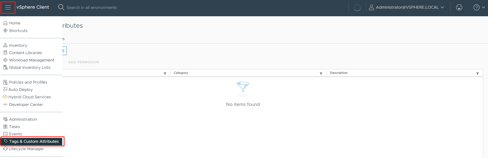

3. Click **Tags** -> **CATEGORIES** -> **NEW**.

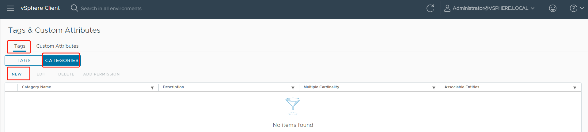

4. Fill in the **Create Category** form with follow content:

.. code-block:: text

    Category Name: skypilot
    Tags Per Object: Many tags
    Associable Object Types: Datastore, Content Library, Library Item, VirtualMachine

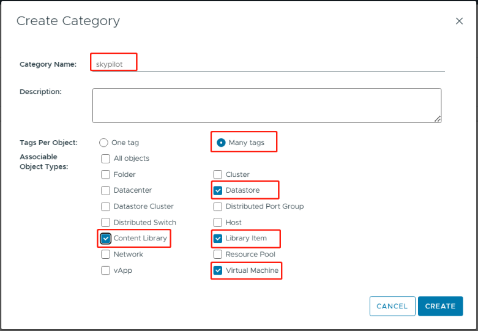

5. Click the **CREATE** to finish the creation.

**Create the Tag:**

1. Open web browser and Login your vSphere Client.

2. Navigate to **Menu** -> **Tags & Custom Attributes**.

3. Click **Tags** -> **TAGS** -> **NEW**.

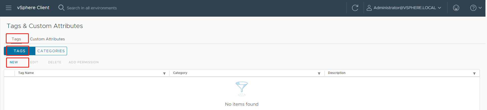

4. Fill in the **Create Tag** form with follow content:

.. code-block:: text

    Name: skypilot
    Category: skypilot

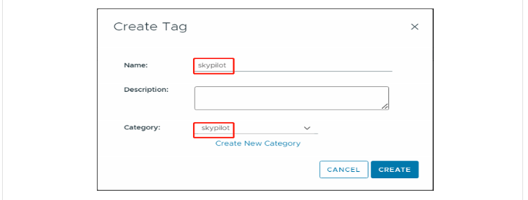

5. Click the **CREATE** to finish the creation.

.. _cloud-prepare-vsphere-storage-policy:

Create VM storage policies
~~~~~~~~~~~~~~~~~~~~~~~~~~

The vSphere provider depends on the VM Storage Policies to place the VM. A Shared Datastore is recommended.

1. Open web browser and Login your vSphere Client.

2. Navigate to **Menu** -> **Inventory**.

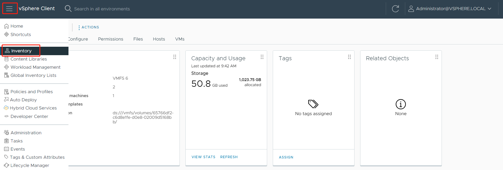

3. Click the **Datastore Icon**.

   Select the datastore eligible for VM creation, assign the previously created ``skypilot`` tag to them.

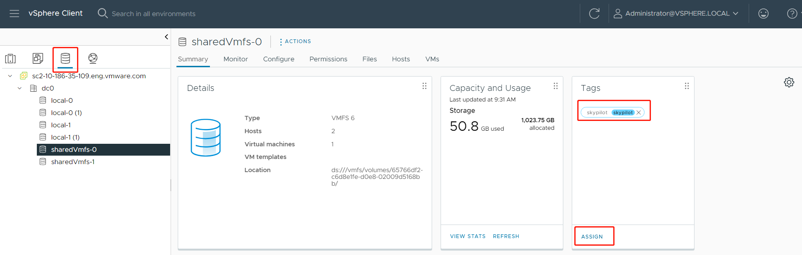

4. Navigate to **Menu** -> **Policies and Profiles**.

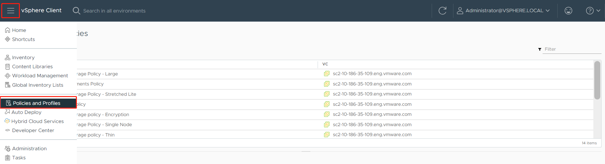

5. Select **VM Storage Policies** , and click **CREATE** button.

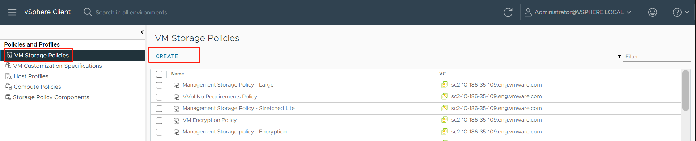

6. In the **Name and description** step, specify the name as ``skypilot_policy``.

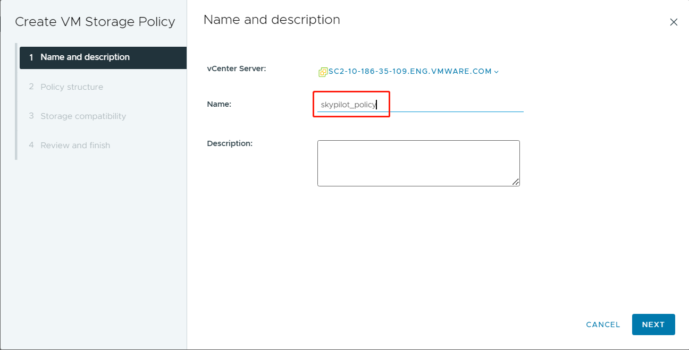

7. In the **Policy structure** step, select **Enable tag based placement rules**.

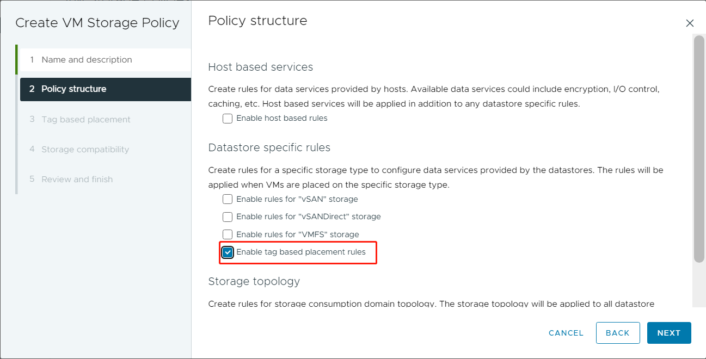

8. In the **Tag based placement** step, select the tag **skypilot**.

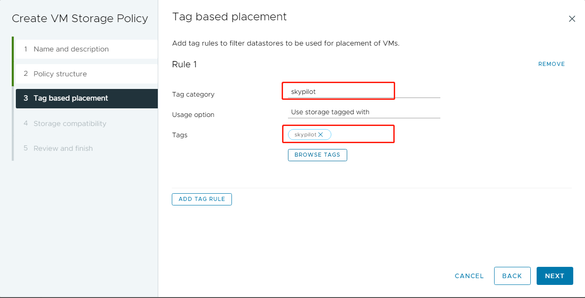

9. In the **Storage compatibility** step, review the datastores.

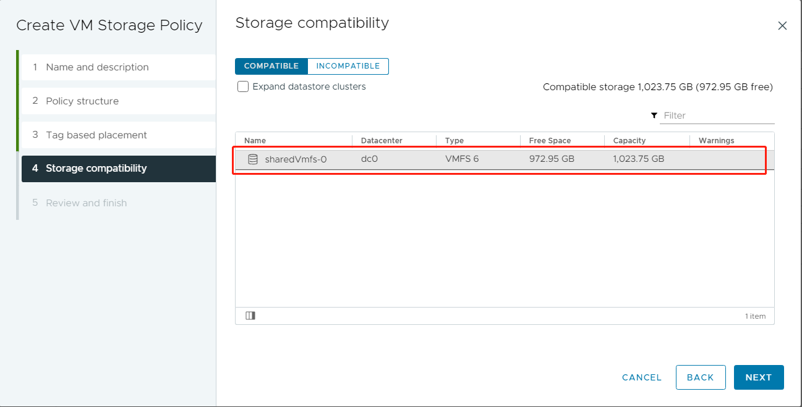

10. Review and Click the **FINISH** to create the policy.

.. _cloud-prepare-vsphere-content-library-create:

Prepare VM image
~~~~~~~~~~~~~~~~

The VM must be Linux-based; we take Ubuntu 20.04 as the base OS in this document. Other Linux distributions may also works but not promised.

**Step 1. Prepare a linux-based VM**.

Open web browser and Login your vSphere Client, create a linux-based Virtual Machine.

If you're unfamiliar with the process of creating a virtual machine, please refer to this guide for assistance: `Deploying Virtual Machines <https://docs.vmware.com/en/VMware-vSphere/7.0/com.vmware.vsphere.vm_admin.doc/GUID-39D19B2B-A11C-42AE-AC80-DDA8682AB42C.html>`_

**Step 2. Create a user and Enable password-less sudo**.

Login your prepared VM, Create a user named ``ubuntu``, and add to the sudo group.

.. code-block:: shell

    sudo adduser ubuntu
    sudo usermod -aG sudo ubuntu

Edit the sudoer file to enable passwordless sudo.

.. code-block:: shell

    sudo visudo

Add the following line:

.. code-block:: text

    ubuntu   ALL=(ALL:ALL) NOPASSWD: ALL

**Step 3. Check VMtools version**.

Execute the following command to check VMtools version 10.1.0 or later is required.

.. code-block:: shell

    vmware-toolbox-cmd -v

**Step 4. Enabling Custom Scripts in VMtools**.

Execute the following command to check if the enable-custom-scripts option is enabled:

.. code-block:: shell

    sudo vmware-toolbox-cmd config get deployPkg enable-custom-scripts

If the enable-custom-scripts option is disabled, enable it by executing:

.. code-block:: shell

    sudo vmware-toolbox-cmd config set deployPkg enable-custom-scripts true

**Step 5. Install the GPU driver**.

Different GPUs require different drivers; please choose the correct driver based on your GPU mode and OS version.
Take Ubuntu and Nvidia GPU for example, the following driver works for most of the case:

.. code-block:: shell

    sudo apt install nvidia-headless-535-server --no-install-recommends

**Step 6. Convert the VM to template**.

1. Power off the VM.

2. Select the VM and right click -> **Clone**-> **Clone as Template to Library**.

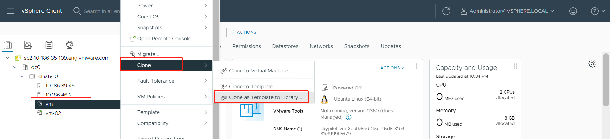

3. Select Template type: **OVF**, provide the template name and click **Next**.

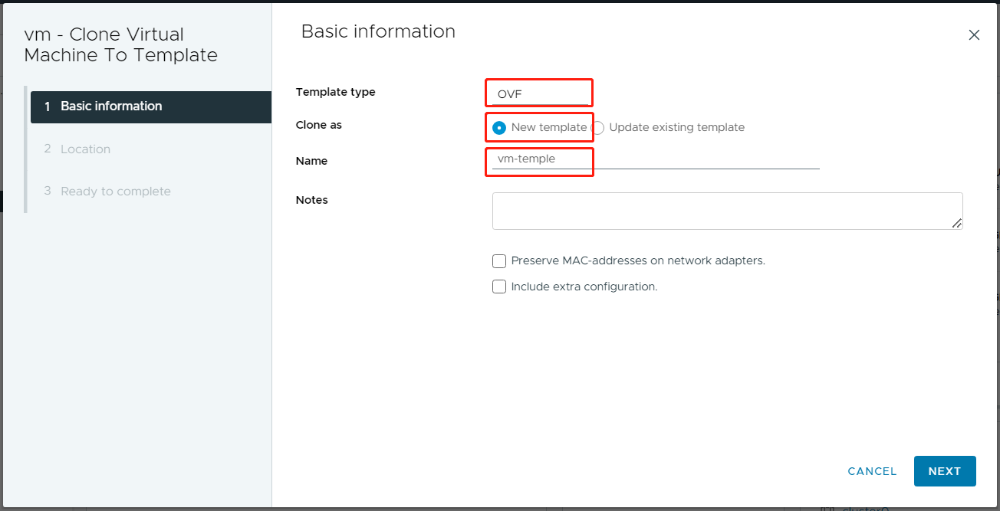

4. Select a Content Library location and click **Next**.

   Create one if you haven't set up a **Local** content library. Please refer to `Create a Library <https://docs.vmware.com/en/VMware-vSphere/7.0/com.vmware.vsphere.vm_admin.doc/GUID-2A0F1C13-7336-45CE-B211-610D39A6E1F4.html>`_

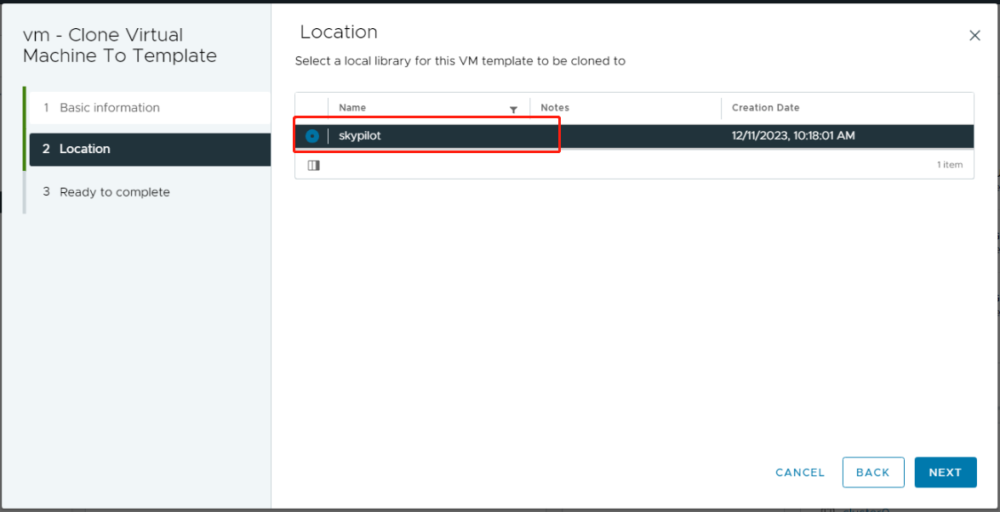

5. Review and click **Finish**.

**Step 7. Tag the VM template**.

Follow the steps bellow to tag the VM template:

1. Navigate to **Menu** -> **Content Libraries**.

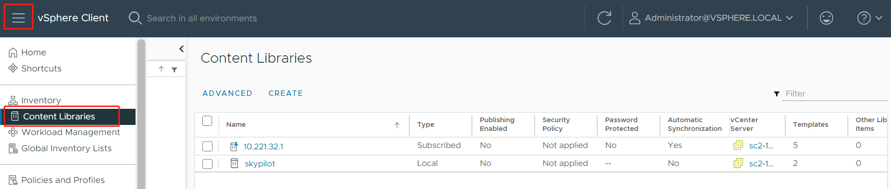

2. Review the content libraries and click on the one that contains your target VM templates.

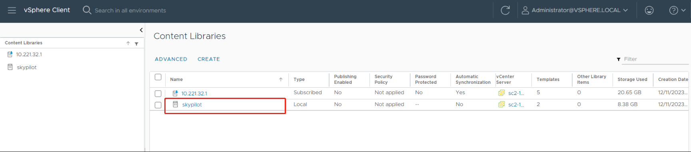

3. Review the content library items and click on your target VM template.

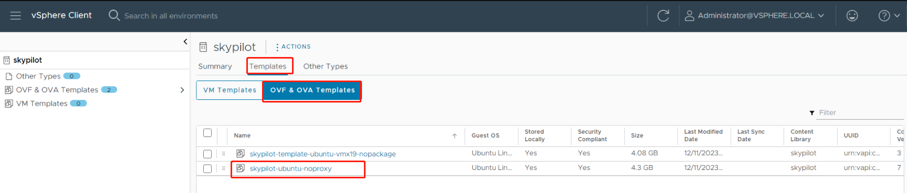

4. Assign the relevant tags to the VM template.

   If you no sure how to assign the tags, please refer to :ref:`Rules for tagging VM template <cloud-prepare-vsphere-references>`

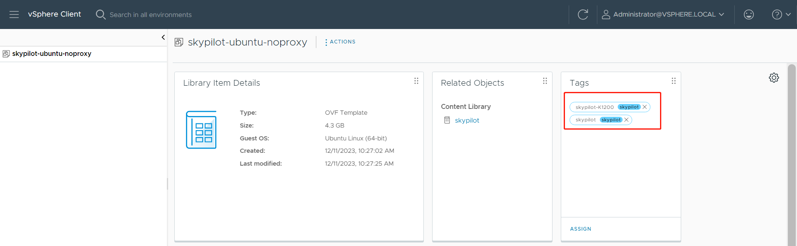

.. _cloud-prepare-vsphere-references:

References
~~~~~~~~~~

**Rules for tagging VM template**

The vSphere driver for SkyPilot uses the Tag to identify the VM images for GPU. VI admin needs to tag the VM template accordingly in the Content Library.
Here are a few rules for tagging templates:

- All workloads that do not need an accelerator will use the VM image tagged with ``skypilot-cpu``. If you have multiple VM templates (Content Item) tagged with ``skypilot-cpu`` only the first one will be used, so the best practice is only tagging one image with ``skypilot-cpu``.

- Vi Admin should create a default VM Image for each accelerator vendor and tag it with the format ``skypilot-vendorname``  e.g., ``skypilot-nvidia``. The fallback logic is if the user requires a specific Nvidia GPU(e.g., k1200) and the vSphere driver cannot find an image with tag ``skypilot-K1200`` it will use the VM image tagged with ``skypilot-nvidia``.

- All the tags should select the Tag category as: ``skypilot``.

**Support new GPU**

The vSphere cloud provider has a default support GPU list. You can first check the default one by executing the ``sky check`` command.
Then the GPU list can be found in the ``~/.sky/catalogs/v5/vsphere/accelerators.csv`` file. If you want to support a new GPU, say ``Nvidia K1200``
you can add one more line at the end of the file:

.. code-block:: text

    Model,Type,MemoryMB,vCPUs,fullNames
    ...
    K1200,GPU,4096,4,['GM107GL [Quadro K1200]']

If the GPU needs a particular driver, ask the VI admin to create a new VM template and upload it to the Content Library, then add a tag to the VM template, e.g., ``GPU-k1200``. If the new default VM template's driver supports the new GPU, you will not need to create a new one. For example, if the VM template with the Tag ``skypilot-nvidia`` supports the new GPU, then you will not need to create a new VM template.
