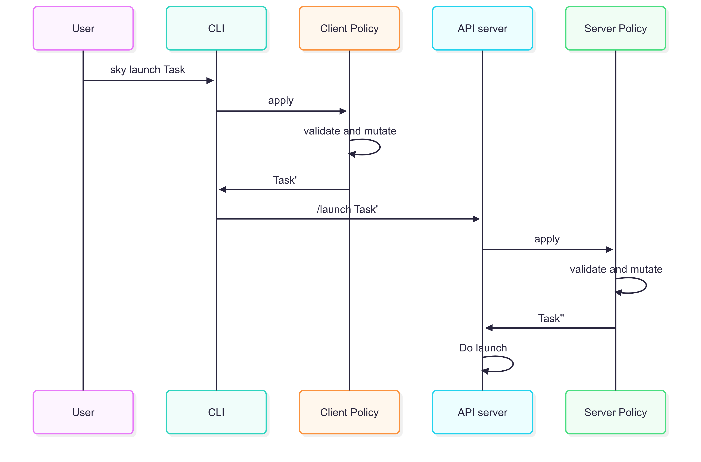

.. _advanced-policy-config:

Admin Policy Enforcement
========================

SkyPilot provides an **admin policy** mechanism that admins can use to enforce certain policies on users' SkyPilot usage. An admin policy applies
custom validation and mutation logic to a user's tasks and SkyPilot config.

Example usage:

- :ref:`kubernetes-labels-policy`
- :ref:`disable-public-ip-policy`
- :ref:`use-spot-for-gpu-policy`
- :ref:`enforce-autostop-policy`
- :ref:`dynamic-kubernetes-contexts-update-policy`
- :ref:`use-local-gcp-credentials-policy`
- :ref:`add-volumes-policy`

Overview
--------

SkyPilot has a :ref:`client-server architecture <sky-api-server>`, where a centralized API server can be deployed and users can interact with the server through a client.

To deploy a admin policy, here are the steps:

1. :ref:`Implement the policy in a Python package <implement-admin-policy>` or :ref:`host the policy as a RESTful server <host-admin-policy-as-server>`.
2. Install the policy at the :ref:`server-side <server-side-admin-policy>` to enforce it for all users.
3. Optionally, an admin policy can also be installed at the :ref:`client-side<client-side-admin-policy>` if it needs to access user's local environment.

The order of policy application is demonstrated below:

.. note::

    Client-side policy lacks enforcement capability, i.e., end-user may modify them. However, client policy is useful for automation that can only be applied at client-side. Refer to :ref:`use-local-gcp-credentials-policy` as an example.

.. _server-side-admin-policy:

Server-side
~~~~~~~~~~~

If you have a :ref:`centralized API server <sky-api-server>` deployed, you can enforce a policy for all users by setting it at the server-side.

.. tab-set::

  .. tab-item:: Use a RESTful policy
  
    Open :ref:`SkyPilot dashboard <sky-api-server-config>` https://api.server.com/dashboard/config,  and set the :ref:`admin_policy <config-yaml-admin-policy>` field to the URL of the RESTful policy. To host a RESTful policy, see :ref:`here <host-admin-policy-as-server>`.

    .. code-block:: yaml

        admin_policy: https://example.com/policy
    
  .. tab-item:: Use a Python package

    First, install the Python package that implements the policy on the API server host:

    .. code-block:: bash

        pip install mypackage.subpackage

    For helm deployment, refer to :ref:`sky-api-server-admin-policy` to install the policy package.

    Then, open the server's dashboard, go to :ref:`the server's SkyPilot config <sky-api-server-config>` and set the :ref:`admin_policy <config-yaml-admin-policy>` field to the path of the Python package that implements the policy.

    .. code-block:: yaml

        admin_policy: mypackage.subpackage.MyPolicy

.. _client-side-admin-policy:

Client-side
~~~~~~~~~~~

If the policy needs to access user's local environment, you can get the policy applied at the client-side by following the steps below.

First, install the Python package that implements the policy:

.. code-block:: bash

    pip install mypackage.subpackage

Then, set the :ref:`admin_policy <config-yaml-admin-policy>` field in :ref:`the SkyPilot config <config-yaml>` to the path of the Python package that implements the policy.

.. code-block:: yaml

    admin_policy: mypackage.subpackage.MyPolicy

Optionally, you can also apply different policies in different projects by leveraging the :ref:`layered config <config-sources-and-overrides>`, e.g. set a different policy in ``$pwd/.sky.yaml`` for the current project:

.. code-block:: yaml

    admin_policy: mypackage.subpackage.AnotherPolicy

.. hint::

    SkyPilot loads the policy from the given package in the same Python environment.
    You can test the existence of the policy by running:

    .. code-block:: bash

        python -c "from mypackage.subpackage import MyPolicy"

.. note::

    It is possible to call a RESTful policy at client-side. However, a RESTful policy is executed on the policy server host, i.e., cannot access user's local environment, e.g., local files.

.. _host-admin-policy-as-server:

Host admin policy as a RESTful server
~~~~~~~~~~~~~~~~~~~~~~~~~~~~~~~~~~~~~

You can host an admin policy as a RESTful API server and configure the SkyPilot to call the RESTful url to apply the policy.

It is recommended to :ref:`inherit your implementation from the AdminPolicy interface <implement-admin-policy>` to ensure the request and response body are correctly typed. You can also import existing policies at the server and composite these policies to fit your needs. Here is an example of implementing a policy server using Python and FastAPI:

.. dropdown:: Example Policy Server

    .. literalinclude:: ../../../examples/admin_policy/example_server/policy_server.py
        :language: python
        :caption: `Policy Server <https://github.com/skypilot-org/skypilot/blob/master/examples/admin_policy/example_server/policy_server.py>`_

Optionally, the server can also be implemented in other languages as long as it follows the API convention:

.. dropdown:: The Admin Policy API

    **POST /<api-path>**

    Request body is a marshalled :ref:`sky.UserRequest <user-request-class>` in JSON format:

    .. code-block:: json

        {
          "task": {
            "name": "sky-cmd",
            "resources": {
              "cpus": "1+",
            },
            "num_nodes": 1,
          },
          "skypilot_config": {},
          "request_options": {
            "cluster_name": "test",
            "idle_minutes_to_autostop": null,
            "down": false,
            "dryrun": false
          },
          "at_client_side": false
        }
    
    Response body is a marshalled :ref:`sky.MutatedUserRequest <mutated-user-request-class>` in JSON format:

    .. code-block:: json

        {
          "task": {
            "name": "sky-cmd",
            "resources": {
              "cpus": "1+",
            },
            "num_nodes": 1,
          },
          "skypilot_config": {}
        }

.. _implement-admin-policy:

Implement an admin policy package
~~~~~~~~~~~~~~~~~~~~~~~~~~~~~~~~~

Admin policies are implemented by extending the ``sky.AdminPolicy`` `interface <https://github.com/skypilot-org/skypilot/blob/master/sky/admin_policy.py>`_:

.. literalinclude:: ../../../sky/admin_policy.py
    :language: python
    :pyobject: AdminPolicy
    :name: admin-policy-interface
    :caption: `AdminPolicy Interface <https://github.com/skypilot-org/skypilot/blob/master/sky/admin_policy.py>`_

Your custom admin policy should look like this:

.. code-block:: python

    import sky

    class MyPolicy(sky.AdminPolicy):
        @classmethod
        def validate_and_mutate(cls, user_request: sky.UserRequest) -> sky.MutatedUserRequest:
            # Logic for validate and modify user requests.
            ...
            return sky.MutatedUserRequest(user_request.task,
                                          user_request.skypilot_config)

``UserRequest`` and ``MutatedUserRequest`` are defined as follows (see `source code <https://github.com/skypilot-org/skypilot/blob/master/sky/admin_policy.py>`_ for more details):

.. literalinclude:: ../../../sky/admin_policy.py
    :language: python
    :pyobject: UserRequest
    :name: user-request-class
    :caption: `UserRequest Class <https://github.com/skypilot-org/skypilot/blob/master/sky/admin_policy.py>`_

.. literalinclude:: ../../../sky/admin_policy.py
    :language: python
    :pyobject: MutatedUserRequest
    :name: mutated-user-request-class
    :caption: `MutatedUserRequest Class <https://github.com/skypilot-org/skypilot/blob/master/sky/admin_policy.py>`_

In other words, an ``AdminPolicy`` can mutate any fields of a user request, including
the :ref:`task <yaml-spec>` and the :ref:`skypilot config <config-yaml>` for that specific user request,
giving admins a lot of flexibility to control user's SkyPilot usage.

An ``AdminPolicy`` can be used to both validate and mutate user requests. If
a request should be rejected, the policy should raise an exception.

The ``sky.Config`` and ``sky.RequestOptions`` classes are defined as follows:

.. literalinclude:: ../../../sky/utils/config_utils.py
    :language: python
    :pyobject: Config
    :caption: `Config Class <https://github.com/skypilot-org/skypilot/blob/master/sky/utils/config_utils.py>`_

.. literalinclude:: ../../../sky/admin_policy.py
    :language: python
    :pyobject: RequestOptions
    :caption: `RequestOptions Class <https://github.com/skypilot-org/skypilot/blob/master/sky/admin_policy.py>`_

Example policies
----------------

We have provided a few example policies in `examples/admin_policy/example_policy <https://github.com/skypilot-org/skypilot/tree/master/examples/admin_policy/example_policy>`_. You can test these policies by installing the example policy package in your Python environment.

.. code-block:: bash

    git clone https://github.com/skypilot-org/skypilot.git
    cd skypilot
    pip install examples/admin_policy/example_policy

Reject all tasks
~~~~~~~~~~~~~~~~

.. literalinclude:: ../../../examples/admin_policy/example_policy/example_policy/skypilot_policy.py
    :language: python
    :pyobject: RejectAllPolicy
    :caption: `RejectAllPolicy <https://github.com/skypilot-org/skypilot/blob/master/examples/admin_policy/example_policy/example_policy/skypilot_policy.py>`_

.. literalinclude:: ../../../examples/admin_policy/reject_all.yaml
    :language: yaml
    :caption: `Config YAML for using RejectAllPolicy <https://github.com/skypilot-org/skypilot/blob/master/examples/admin_policy/reject_all.yaml>`_

.. _kubernetes-labels-policy:

Add labels for all tasks on Kubernetes
~~~~~~~~~~~~~~~~~~~~~~~~~~~~~~~~~~~~~~

.. literalinclude:: ../../../examples/admin_policy/example_policy/example_policy/skypilot_policy.py
    :language: python
    :pyobject: AddLabelsPolicy
    :caption: `AddLabelsPolicy <https://github.com/skypilot-org/skypilot/blob/master/examples/admin_policy/example_policy/example_policy/skypilot_policy.py>`_

.. literalinclude:: ../../../examples/admin_policy/add_labels.yaml
    :language: yaml
    :caption: `Config YAML for using AddLabelsPolicy <https://github.com/skypilot-org/skypilot/blob/master/examples/admin_policy/add_labels.yaml>`_

.. _disable-public-ip-policy:

Always disable public IP for AWS tasks
~~~~~~~~~~~~~~~~~~~~~~~~~~~~~~~~~~~~~~

.. literalinclude:: ../../../examples/admin_policy/example_policy/example_policy/skypilot_policy.py
    :language: python
    :pyobject: DisablePublicIpPolicy
    :caption: `DisablePublicIpPolicy <https://github.com/skypilot-org/skypilot/blob/master/examples/admin_policy/example_policy/example_policy/skypilot_policy.py>`_

.. literalinclude:: ../../../examples/admin_policy/disable_public_ip.yaml
    :language: yaml
    :caption: `Config YAML for using DisablePublicIpPolicy <https://github.com/skypilot-org/skypilot/blob/master/examples/admin_policy/disable_public_ip.yaml>`_

.. _use-spot-for-gpu-policy:

Use spot for all GPU tasks
~~~~~~~~~~~~~~~~~~~~~~~~~~

..
.. literalinclude:: ../../../examples/admin_policy/example_policy/example_policy/skypilot_policy.py
    :language: python
    :pyobject: UseSpotForGpuPolicy
    :caption: `UseSpotForGpuPolicy <https://github.com/skypilot-org/skypilot/blob/master/examples/admin_policy/example_policy/example_policy/skypilot_policy.py>`_

.. literalinclude:: ../../../examples/admin_policy/use_spot_for_gpu.yaml
    :language: yaml
    :caption: `Config YAML for using UseSpotForGpuPolicy <https://github.com/skypilot-org/skypilot/blob/master/examples/admin_policy/use_spot_for_gpu.yaml>`_

.. _enforce-autostop-policy:

Enforce autostop for all tasks
~~~~~~~~~~~~~~~~~~~~~~~~~~~~~~~

.. literalinclude:: ../../../examples/admin_policy/example_policy/example_policy/skypilot_policy.py
    :language: python
    :pyobject: EnforceAutostopPolicy
    :caption: `EnforceAutostopPolicy <https://github.com/skypilot-org/skypilot/blob/master/examples/admin_policy/example_policy/example_policy/skypilot_policy.py>`_

.. literalinclude:: ../../../examples/admin_policy/enforce_autostop.yaml
    :language: yaml
    :caption: `Config YAML for using EnforceAutostopPolicy <https://github.com/skypilot-org/skypilot/blob/master/examples/admin_policy/enforce_autostop.yaml>`_

.. _dynamic-kubernetes-contexts-update-policy:

Dynamically update Kubernetes contexts to use
~~~~~~~~~~~~~~~~~~~~~~~~~~~~~~~~~~~~~~~~~~~~~

.. literalinclude:: ../../../examples/admin_policy/example_policy/example_policy/skypilot_policy.py
    :language: python
    :pyobject: DynamicKubernetesContextsUpdatePolicy
    :caption: `DynamicKubernetesContextsUpdatePolicy <https://github.com/skypilot-org/skypilot/blob/master/examples/admin_policy/example_policy/example_policy/skypilot_policy.py>`_

.. literalinclude:: ../../../examples/admin_policy/dynamic_kubernetes_contexts_update.yaml
    :language: yaml
    :caption: `Config YAML for using DynamicKubernetesContextsUpdatePolicy <https://github.com/skypilot-org/skypilot/blob/master/examples/admin_policy/dynamic_kubernetes_contexts_update.yaml>`_

.. _use-local-gcp-credentials-policy:

Use local GCP credentials for all tasks
~~~~~~~~~~~~~~~~~~~~~~~~~~~~~~~~~~~~~~~

.. literalinclude:: ../../../examples/admin_policy/example_policy/example_policy/client_policy.py
    :language: python
    :pyobject: UseLocalGcpCredentialsPolicy
    :caption: `UseLocalGcpCredentialsPolicy <https://github.com/skypilot-org/skypilot/blob/master/examples/admin_policy/example_policy/example_policy/client_policy.py>`_

Specify the following config in :ref:`the SkyPilot config <config-yaml>` at the client:

.. literalinclude:: ../../../examples/admin_policy/use_local_gcp_credentials.yaml
    :language: yaml
    :caption: `Config YAML for using UseLocalGcpCredentialsPolicy <https://github.com/skypilot-org/skypilot/blob/master/examples/admin_policy/use_local_gcp_credentials.yaml>`_

Then specify the policy at the server with the same config, or call this policy in the :ref:`RESTful policy server <host-admin-policy-as-server>`.

    This policy only take effects when applied at :ref:`client-side <client-side-admin-policy>`. Use this policy at the :ref:`server-side <server-side-admin-policy>` will be a no-op.

.. _add-volumes-policy:

Add volumes to all tasks
~~~~~~~~~~~~~~~~~~~~~~~~

.. literalinclude:: ../../../examples/admin_policy/example_policy/example_policy/skypilot_policy.py
    :language: python
    :pyobject: AddVolumesPolicy
    :caption: `AddVolumesPolicy <https://github.com/skypilot-org/skypilot/blob/master/examples/admin_policy/example_policy/example_policy/skypilot_policy.py>`_

.. literalinclude:: ../../../examples/admin_policy/add_volumes.yaml
    :language: yaml
    :caption: `Config YAML for using AddVolumesPolicy <https://github.com/skypilot-org/skypilot/blob/master/examples/admin_policy/add_volumes.yaml>`_

