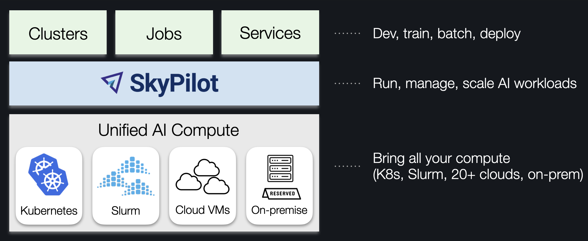

.. rst-class:: hero-title

SkyPilot: Manage all your AI compute
=========================================

.. image:: /_static/SkyPilot_wide_dark.svg
  :width: 50%
  :align: center
  :alt: SkyPilot
  :class: no-scaled-link, only-dark
.. image:: /_static/SkyPilot_wide_light.svg
  :width: 50%
  :align: center
  :alt: SkyPilot
  :class: no-scaled-link, only-light

.. raw:: html

   

   

   <a class="github-button" href="https://github.com/skypilot-org/skypilot" data-show-count="true" data-size="large" aria-label="Star skypilot-org/skypilot on GitHub">Star</a>
   
   
   

SkyPilot is a system to run, manage, and scale AI workloads on any AI infrastructure.

SkyPilot gives **AI teams** a simple interface to run jobs on any infra.
**Infra teams** get a unified control plane to manage any AI compute — with advanced scheduling, scaling, and orchestration.

..  Abstractions image source: https://drive.google.com/file/d/1egDS0xHXFUbUKS_63RyqYQLaZxmrSLZQ/view?usp=sharing
..  To update: edit the .key, export to PDF, open in Photoshop, crop, save as PNG.

.. image:: ../images/skypilot-abstractions-long-2.png
    :width: 90%
    :align: center
    :class: only-light

.. grid:: 1 1 1 1
    :gutter: 3

    .. grid-item-card::
        :link: https://demo.skypilot.co/dashboard/
        :text-align: center

        🌟 **SkyPilot Demo** 🌟: Click to see a 1-minute tour

Why SkyPilot
----------------------

SkyPilot **is easy to use for AI users**:

- Quickly spin up compute on your own infra
- Environment and job as code --- simple and portable
- Easy job management: queue, run, and auto-recover many jobs

SkyPilot **makes Kubernetes easy for AI & Infra teams**:

- Slurm-like ease of use, cloud-native robustness
- Local dev experience on K8s: SSH into pods, sync code, or connect IDE
- Turbocharge your clusters: gang scheduling, multi-cluster, and scaling

SkyPilot **unifies multiple clusters, clouds, and hardware**:

- One interface to use reserved GPUs, Kubernetes clusters, Slurm clusters, or 20+ clouds
- :ref:`Flexible provisioning <auto-failover>` of GPUs, TPUs, CPUs, with smart failover
- :ref:`Team deployment <sky-api-server>` and resource sharing

SkyPilot **maximizes GPU fleet utilization**:

* Autostop: automatic cleanup of idle resources
* Binpacking: workload binpacking on shared clusters
* Intelligent scheduler: automatically schedule on the most available infra

.. raw:: html

   
   
   

     <video id="video-with-badge" style="width: 100%; height: auto;" autoplay muted playsinline onended="pauseAndReplay(this)">
        <source src="../_static/intro.mp4" type="video/mp4" />
     </video>
     <button id="pause-btn" class="video-control-btn" onclick="togglePlayPause(document.getElementById('video-with-badge'))" title="Pause" data-tooltip="Pause">⏸︎</button>
   

SkyPilot supports your existing GPU, TPU, and CPU workloads, with no code changes.

Current supported infra: Kubernetes, Slurm, AWS, GCP, Azure, OCI, Nebius, Lambda Cloud, RunPod, Fluidstack,
Cudo, Digital Ocean, Paperspace, Cloudflare, Samsung, IBM, Vast.ai, VMware vSphere, Seeweb, Prime Intellect.

.. raw:: html

   

   <picture>
      
      
   </picture>
   

Getting started
----------------------

:ref:`Install SkyPilot <installation>` in 1 minute. Then, launch your first cluster in 2 minutes in :ref:`Quickstart <quickstart>`.

SkyPilot is BYOC: Everything is launched within your cloud accounts, VPCs, and clusters.

Benefits of SkyPilot on Kubernetes
-----------------------------------

SkyPilot makes Kubernetes more AI-native.

It turbocharges your existing Kubernetes clusters by **accelerating AI/ML velocity**:

- AI-friendly interface to launch jobs and deployments
- Much simplified interactive dev for K8s (SSH / sync code / connect IDE to pods)

...and **optimizing GPU scheduling, utilization, and scaling**:

- Advanced scheduling: Gang scheduling, multi-node jobs, and queueing
- Multi-cluster support: Bring all your clusters under one control plane
- Multi-cloud support: One consistent interface to manage many providers

See :ref:`SkyPilot vs Vanilla Kubernetes <sky-compare>` and this `blog post <https://blog.skypilot.co/ai-on-kubernetes/>`_ for more details.

Contact the SkyPilot team
---------------------------------

You can chat with the SkyPilot team and community on the `SkyPilot Slack <http://slack.skypilot.co>`_.

Learn more
--------------------------

To learn more, see :ref:`SkyPilot Overview <overview>` and `SkyPilot blog <https://blog.skypilot.co/>`_.

SkyPilot adopters: `Testimonials and Case Studies <https://blog.skypilot.co/case-studies/>`_

Partners and integrations: `Community Spotlights <https://blog.skypilot.co/community/>`_

Follow updates:

* `Slack <http://slack.skypilot.co>`_
* `X / Twitter <https://twitter.com/skypilot_org>`_
* `LinkedIn <https://www.linkedin.com/company/skypilot-oss/>`_
* `SkyPilot Blog <https://blog.skypilot.co/>`_ (`Introductory blog post <https://blog.skypilot.co/introducing-skypilot/>`_)

.. toctree::
   :hidden:
   :maxdepth: 1
   :caption: Getting Started

   ../overview
   ../getting-started/installation
   ../getting-started/quickstart
   Agent Skills <../getting-started/skill>
   ../examples/index
   ../sky-computing

.. toctree::
   :hidden:
   :maxdepth: 1
   :caption: Clusters

   ../examples/interactive-development
   Cluster Jobs <../reference/job-queue>
   ../examples/auto-failover
   ../reference/auto-stop

.. toctree::
   :hidden:
   :maxdepth: 1
   :caption: Jobs

   ../examples/managed-jobs
   Checkpointing and Recovery <../examples/checkpointing>
   Multi-Node Jobs <../running-jobs/distributed-jobs>
   Many Parallel Jobs <../running-jobs/many-jobs>
   Model Training Guide <../reference/training-guide>
   Using a Pool of Workers <../examples/pools>
   Job Groups <../examples/job-groups>

.. toctree::
   :hidden:
   :maxdepth: 1
   :caption: Model Serving

   Getting Started <../serving/sky-serve>
   ../serving/user-guides

.. toctree::
   :hidden:
   :maxdepth: 1
   :caption: Infra Choices

   ../reference/kubernetes/index
   ../reference/slurm/index
   Using Existing Machines <../reservations/existing-machines>
   ../reservations/reservations
   Using Cloud VMs <../compute/cloud-vm>
   ../compute/gpus

.. toctree::
   :hidden:
   :maxdepth: 1
   :caption: Data

   ../reference/storage
   ../reference/volumes
   ../examples/syncing-code-artifacts

.. toctree::
   :hidden:
   :maxdepth: 1
   :caption: User Guides

   SkyPilot Recipes <../reference/recipes>
   Migrating from Slurm <../reference/slurm-migration>
   External Links <../running-jobs/external-links>
   ../reference/async
   ../running-jobs/environment-variables
   Docker Containers <../examples/docker-containers>
   ../examples/ports
   ../reference/logging
   ../reference/faq

.. toctree::
   :hidden:
   :maxdepth: 1
   :caption: Administrator Guides

   ../reference/api-server/api-server
   ../reference/auth
   ../admin/workspaces
   ../cloud-setup/cloud-permissions/index
   Admin Policies <../cloud-setup/policy>
   External Logging Storage <../cloud-setup/external-logging>
   Airgapped Environments <../cloud-setup/airgap>

.. toctree::
   :hidden:
   :maxdepth: 1
   :caption: References

   Task YAML <../reference/yaml-spec>
   CLI <../reference/cli>
   ../reference/api
   ../reference/config
   SkyPilot Internals <../reference/architecture/internals>
   ../developers/index
