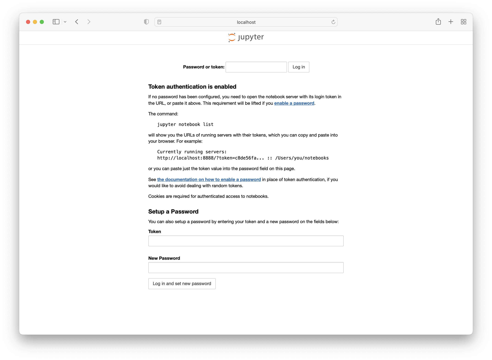
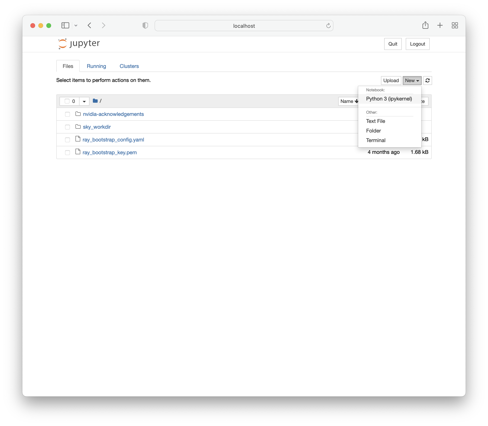
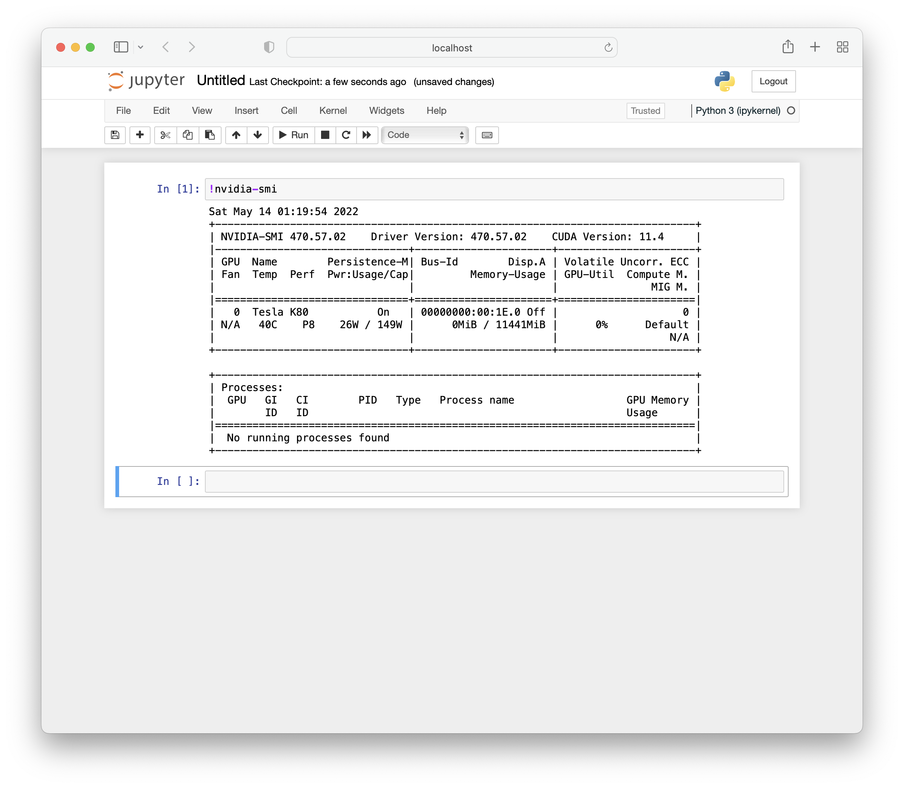
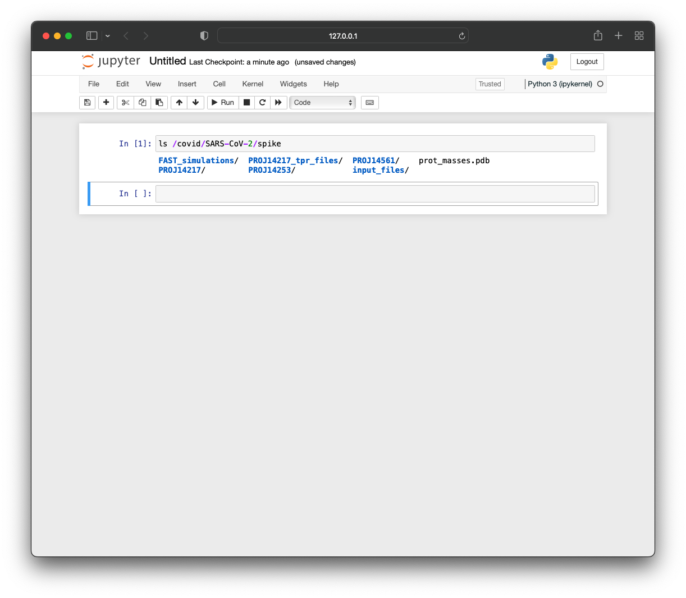

.. _dev-cluster:

Start a Development Cluster
===========================

SkyPilot makes interactive development easy on Kubernetes or cloud VMs. It helps you:

#. :ref:`Launch <dev-launch>`: Quickly get a cluster with GPU or other resource requirement with a single command.
#. :ref:`Autostop <dev-autostop>`: Automatically stop the cluster after some idle time for cost savings.
#. :ref:`Connect <dev-connect>`: Easily connect to the cluster using the cluster name:

   - :ref:`SSH <dev-ssh>`
   - :ref:`VSCode <dev-vscode>`
   - :ref:`Jupyter Notebooks <dev-notebooks>`

.. _dev-launch:

Launch
------

To launch a cluster with a cheap GPU for development:

.. code-block:: bash

  # Launch a cluster with 1 NVIDIA GPU and sync the local working directory to the
  # cluster.
  sky launch -c dev --gpus T4 --workdir .

This can be launched as a pod in your Kubernetes cluster or a VM on any cloud.

.. tab-set::

  .. tab-item:: Kubernetes

    .. figure:: ../images/k8s-pod.png
      :align: center
      :width: 80%
      :alt: Launch a cluster as a pod in Kubernetes

      Launch a cluster as a pod in Kubernetes

  .. tab-item:: Cloud

    .. figure:: ../images/gcp-vm.png
      :align: center
      :width: 80%
      :alt: Launch a cluster as a VM on GCP

      Launch a cluster as a VM on GCP

.. note::

  View the supported GPUs with the :code:`sky show-gpus` command.

.. _dev-autostop:

Autostop
--------

SkyPilot allows you to automatically stop the cluster after a period of idle time to save costs. You can set the autostop time with a single command:

.. code-block:: bash

  # Auto stop the cluster after 5 hours
  sky autostop -i 300 dev

Or add an additional flag :code:`-i` during the launch:

.. code-block:: bash

  # Launch a cluster with auto stop after 5 hours
  sky launch -c dev --gpus T4 --workdir . -i 300

For more details of auto stopping, check out: :ref:`auto-stop`. This feature is designed
to prevent idle clusters from incurring unnecessary costs, ensuring your cluster
stops automatically, whether it's overnight or throughout the weekend.

.. _dev-connect:

Connect
-------

A user can easily connect to the cluster using your method of choice:

.. _dev-ssh:

SSH
~~~

SkyPilot will automatically configure the SSH setting for a cluster, so that users can connect to the cluster with the cluster name:

.. code-block:: bash

  ssh dev

.. _dev-vscode:

VSCode
~~~~~~

A common use case for interactive development is to connect a local IDE to a remote cluster and directly edit code that lives on the cluster.
This is supported by simply connecting VSCode to the cluster with the cluster name:

#. Click on the top bar, type: :code:`> remote-ssh`, and select :code:`Remote-SSH: Connect Current Window to Host...`
#. Select the cluster name (e.g., ``dev``) from the list of hosts.
#. Open folder: :code:`sky_workdir` and find your code.

For more details, please refer to the `VSCode documentation <https://code.visualstudio.com/docs/remote/ssh-tutorial>`__.

.. image:: https://imgur.com/8mKfsET.gif
  :align: center
  :alt: Connect to the cluster with VSCode

.. _dev-notebooks:

Jupyter Notebooks
~~~~~~~~~~~~~~~~~

Jupyter notebooks are a useful tool for interactive development, debugging, and
visualization.

Connect to the machine and forward the port used by jupyter notebook:

.. code-block:: bash

   ssh -L 8888:localhost:8888 dev

Inside the cluster, you can run the following commands to start a Jupyter session:

.. code-block:: bash

   pip install jupyter
   jupyter notebook

In your local browser, you should now be able to access :code:`localhost:8888` and see the following screen:

Enter the password or token and you will be directed to a page where you can create a new notebook.

You can verify that this notebook is running on the GPU-backed instance using :code:`nvidia-smi`.

The GPU node is a normal SkyPilot cluster, so you can use the usual CLI commands on it.  For example, run ``sky down/stop`` to terminate or stop it, and ``sky exec`` to execute a task.

Notebooks in SkyPilot tasks
^^^^^^^^^^^^^^^^^^^^^^^^^^^
Jupyter notebooks can also be used in SkyPilot tasks, allowing access to the full
range of SkyPilot's features including :ref:`mounted storage <sky-storage>` and
:ref:`autostop <auto-stop>`.

The following :code:`jupyter.yaml` is an example of a task specification that can launch notebooks with SkyPilot.

.. code:: yaml

  # jupyter.yaml

  name: jupyter

  resources:
    accelerators: T4:1

  file_mounts:
    /covid:
      source: s3://fah-public-data-covid19-cryptic-pockets
      mode: MOUNT

  setup: |
    pip install --upgrade pip
    conda init bash
    conda create -n jupyter python=3.9 -y
    conda activate jupyter
    pip install jupyter

  run: |
    cd ~/sky_workdir
    conda activate jupyter
    jupyter notebook --port 8888 &

Launch the GPU-backed Jupyter notebook:

.. code:: bash

  sky launch -c jupyter jupyter.yaml

To access the notebook locally, use SSH port forwarding.

.. code:: bash

  ssh -L 8888:localhost:8888 jupyter

You can verify that this notebook has access to the mounted storage bucket.

