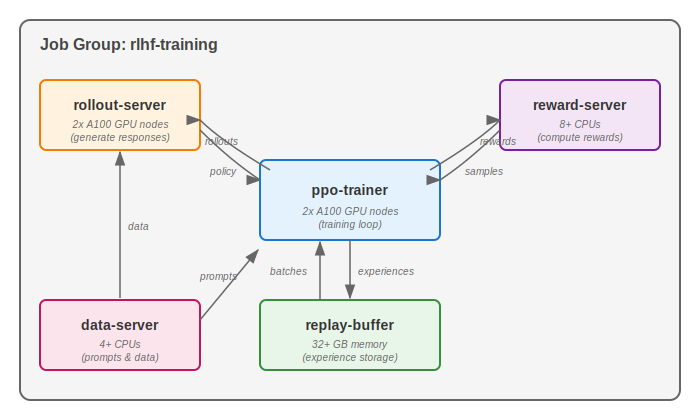

.. _job-groups:

Job Groups
==========

.. warning::

  **This is an experimental feature.** The interface may change in future versions.

.. tip::

  Job Groups are ideal for heterogeneous parallel workloads where multiple tasks
  with different resource requirements need to run together and communicate
  with each other.

Job Groups allow you to run multiple related tasks in parallel as a single managed unit.
Unlike :ref:`managed jobs <managed-jobs>` which run tasks sequentially (pipelines),
Job Groups launch all tasks simultaneously, enabling complex distributed architectures.

Common use cases include:

- **RL post-training**: Separate tasks for trainer, reward modeling, rollout server, and data serving
- **Parallel train-eval**: Training and evaluation running in parallel with shared storage

   Example: RL post-training architecture where each component (ppo-trainer, rollout-server,
   reward-server, replay-buffer, data-server) runs as a separate task within a single Job Group.
   Tasks can have different resource requirements and communicate via service discovery.

.. contents:: Contents
   :local:
   :backlinks: none

Creating a job group
--------------------

A Job Group is defined using a multi-document YAML file. The first document is the
**header** that defines the group's properties, followed by individual task definitions:

.. code-block:: yaml

    # job-group.yaml
    ---
    # Header: Job Group configuration
    name: my-job-group
    execution: parallel      # Required: indicates this is a Job Group
    placement: SAME_INFRA    # All tasks run on the same infrastructure
    ---
    # Task 1: Trainer
    name: trainer
    resources:
      accelerators: A100:1
    run: |
      python train.py
    ---
    # Task 2: Evaluator
    name: evaluator
    resources:
      accelerators: A100:1
    run: |
      python evaluate.py

Launch the Job Group with:

.. code-block:: console

    $ sky jobs launch job-group.yaml

Header fields
~~~~~~~~~~~~~

The header document supports the following fields:

.. list-table::
   :widths: 20 20 60
   :header-rows: 1

   * - Field
     - Default
     - Description
   * - ``name``
     - Required
     - Name of the Job Group
   * - ``execution``
     - Required
     - Must be ``parallel`` to indicate this is a Job Group
   * - ``placement``
     - ``SAME_INFRA``
     - Where tasks are placed. Currently only ``SAME_INFRA`` is supported

Each task document after the header follows the standard :ref:`SkyPilot task YAML format <yaml-spec>`.

.. note::

    Every task in a Job Group **must have a unique name**. The name is used for
    service discovery and log viewing.

Service discovery
-----------------

Tasks in a Job Group can discover each other using hostnames. SkyPilot automatically
configures networking so that tasks can communicate.

Hostname format
~~~~~~~~~~~~~~~

Each task's head node is accessible via the hostname:

.. code-block:: text

    {task_name}-0.{job_group_name}

For multi-node tasks, worker nodes use:

.. code-block:: text

    {task_name}-{node_index}.{job_group_name}

For example, in a Job Group named ``rlhf-experiment`` with a 2-node ``trainer`` task:

- ``trainer-0.rlhf-experiment`` - Head node (rank 0)
- ``trainer-1.rlhf-experiment`` - Worker node (rank 1)

Environment variables
~~~~~~~~~~~~~~~~~~~~~

SkyPilot injects the following environment variables into all tasks:

.. list-table::
   :widths: 40 60
   :header-rows: 1

   * - Variable
     - Description
   * - ``SKYPILOT_JOBGROUP_NAME``
     - Name of the Job Group
   * - ``SKYPILOT_JOBGROUP_HOST_{TASK_NAME}``
     - Address of each task's head node (uppercase, hyphens become underscores)

Example usage in a task:

.. code-block:: bash

    # Access the trainer task from the evaluator
    curl http://${SKYPILOT_JOBGROUP_HOST_TRAINER}:8000/status

    # Or use the hostname directly
    curl http://trainer-0.${SKYPILOT_JOBGROUP_NAME}:8000/status

Viewing logs
------------

View logs for a specific task within a Job Group:

.. code-block:: console

    # View logs for a specific task by name
    $ sky jobs logs <job_id> trainer

    # View logs for a specific task by task ID
    $ sky jobs logs <job_id> 0

    # View all task logs (default)
    $ sky jobs logs <job_id>

When viewing logs for a multi-task job, SkyPilot displays a hint:

.. code-block:: console

    Hint: This job has 3 tasks. Use 'sky jobs logs 42 TASK' to view logs
    for a specific task (TASK can be task ID or name).

Examples
--------

Parallel train-eval with shared storage
~~~~~~~~~~~~~~~~~~~~~~~~~~~~~~~~~~~~~~~

This example runs training and evaluation in parallel, sharing checkpoints via
a Kubernetes PVC volume:

.. code-block:: yaml

    ---
    name: train-eval
    execution: parallel
    placement: SAME_INFRA
    ---
    name: trainer
    resources:
      accelerators: A100:1
    volumes:
      /checkpoints: my-checkpoint-volume
    run: |
      python train.py --checkpoint-dir /checkpoints
    ---
    name: evaluator
    resources:
      accelerators: A100:1
    volumes:
      /checkpoints: my-checkpoint-volume
    run: |
      python evaluate.py --checkpoint-dir /checkpoints

See the full example at ``llm/train-eval-jobgroup/`` in the SkyPilot repository.

RL post-training architecture
~~~~~~~~~~~~~~~~~~~~~~~~~~~~~

This example demonstrates a distributed RL post-training architecture with 5 tasks:

.. code-block:: yaml

    ---
    name: rlhf-training
    execution: parallel
    placement: SAME_INFRA
    ---
    name: data-server
    resources:
      cpus: 4+
    run: |
      python data_server.py
    ---
    name: rollout-server
    num_nodes: 2
    resources:
      accelerators: A100:1
    run: |
      python rollout_server.py
    ---
    name: reward-server
    resources:
      cpus: 8+
    run: |
      python reward_server.py
    ---
    name: replay-buffer
    resources:
      cpus: 4+
      memory: 32+
    run: |
      python replay_buffer.py
    ---
    name: ppo-trainer
    num_nodes: 2
    resources:
      accelerators: A100:1
    run: |
      python ppo_trainer.py \
        --data-server data-server-0.${SKYPILOT_JOBGROUP_NAME}:8000 \
        --rollout-server rollout-server-0.${SKYPILOT_JOBGROUP_NAME}:8001 \
        --reward-server reward-server-0.${SKYPILOT_JOBGROUP_NAME}:8002

See the full RL post-training example at ``llm/rl-post-training-jobgroup/`` in the SkyPilot repository.

Current limitations
-------------------

- **Placement**: Only ``SAME_INFRA`` is currently supported. All tasks must run on
  the same Kubernetes cluster or cloud region.

- **Recovery**: Job Groups do not currently support automatic preemption recovery.
  If a task is preempted, the entire group fails.

.. note::

   Job Groups require ``execution: parallel`` in the header. For sequential task
   execution, use :ref:`managed job pipelines <pipeline>` instead (omit the
   ``execution`` field or set it to ``serial``).

.. seealso::

   :ref:`managed-jobs` for single tasks or sequential pipelines.

   :ref:`dist-jobs` for multi-node distributed training within a single task.
