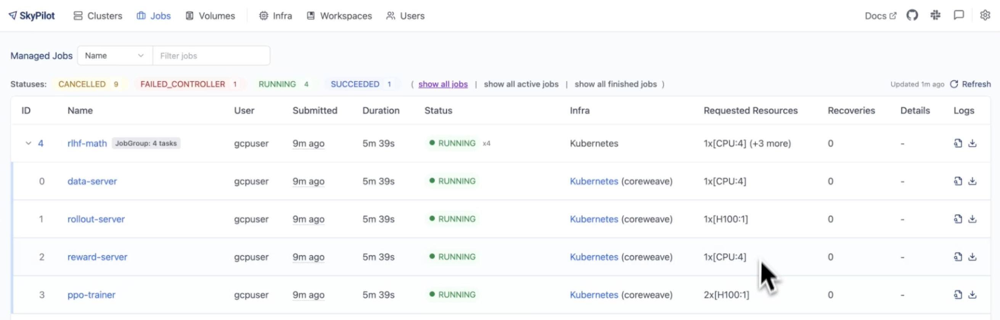

.. _job-groups:

Job Groups
==========

.. warning::

  **This is an experimental feature.** The interface may change in future versions.

Job Groups allow you to run multiple related tasks in parallel as a single managed unit.
Unlike :ref:`managed jobs <managed-jobs>` which run tasks sequentially (pipelines),
Job Groups launch all tasks simultaneously, enabling complex distributed architectures.

   A Job Group with 4 tasks (data-server, rollout-server, reward-server, ppo-trainer)
   running in parallel on Kubernetes. Each task has different resource requirements
   and can be monitored independently through the dashboard.

Overview
--------

**Key Features:**

- **Parallel execution**: Launch multiple tasks simultaneously, each running independently
- **Heterogeneous resources**: Different resource requirements per task (e.g., GPUs for training, CPUs for data serving)
- **Automatic service discovery**: Tasks discover each other and communicate via hostnames
- **Independent recovery**: Each task recovers from preemptions without affecting other tasks

**When to Use Job Groups:**

Job Groups are ideal for workloads where multiple components with different requirements need to run together and communicate. Common use cases include:

- **RL post-training**: Separate tasks for trainer, reward modeling, rollout server, and data serving
- **Parallel train-eval**: Training and evaluation running in parallel with shared storage

.. tip::

   Use Job Groups when your workload has **heterogeneous tasks** that need to run
   **in parallel** and **communicate with each other**. For homogeneous multi-node
   training within a single task, use :ref:`distributed jobs <dist-jobs>` instead.
   For sequential task execution, use :ref:`managed job pipelines <pipeline>`.

.. contents:: Contents
   :local:
   :backlinks: none

Creating a job group
--------------------

A Job Group is defined using a multi-document YAML file. The first document is the
**header** that defines the group's properties, followed by individual task definitions:

.. code-block:: yaml

    # job-group.yaml
    ---
    # Header: Job Group configuration
    name: my-job-group
    execution: parallel      # Required: indicates this is a Job Group
    ---
    # Task 1: Trainer
    name: trainer
    resources:
      accelerators: A100:1
    run: |
      python train.py
    ---
    # Task 2: Evaluator
    name: evaluator
    resources:
      accelerators: A100:1
    run: |
      python evaluate.py

Launch the Job Group with:

.. code-block:: console

    $ sky jobs launch job-group.yaml

Header fields
~~~~~~~~~~~~~

The header document supports the following fields:

.. list-table::
   :widths: 20 20 60
   :header-rows: 1

   * - Field
     - Default
     - Description
   * - ``name``
     - Required
     - Name of the Job Group
   * - ``execution``
     - Required
     - Must be ``parallel`` to indicate this is a Job Group
   * - ``primary_tasks``
     - None
     - List of task names that are "primary". Tasks not in this list are
       "auxiliary" - long-running services (e.g., data servers, replay buffers)
       that wait for a signal to terminate. When all primary tasks complete,
       auxiliary tasks are terminated. If not set, all tasks are primary.
   * - ``termination_delay``
     - None
     - Delay before terminating auxiliary tasks when primary tasks complete,
       allowing them to finish pending work (e.g., flushing data). Can be a
       string (e.g., ``"30s"``, ``"5m"``) or a dict with per-task delays
       (e.g., ``{"default": "30s", "replay-buffer": "1m"}``).

Each task document after the header follows the standard :ref:`SkyPilot task YAML format <yaml-spec>`.

.. note::

    Every task in a Job Group **must have a unique name**. The name is used for
    service discovery and log viewing.

Service discovery
-----------------

Tasks in a Job Group can discover each other using hostnames. SkyPilot automatically
configures networking so that tasks can communicate.

Hostname format
~~~~~~~~~~~~~~~

Each task's head node is accessible via the hostname:

.. code-block:: text

    {task_name}-0.{job_group_name}

For multi-node tasks, worker nodes use:

.. code-block:: text

    {task_name}-{node_index}.{job_group_name}

For example, in a Job Group named ``rlhf-experiment`` with a 2-node ``trainer`` task:

- ``trainer-0.rlhf-experiment`` - Head node (rank 0)
- ``trainer-1.rlhf-experiment`` - Worker node (rank 1)

Environment variables
~~~~~~~~~~~~~~~~~~~~~

SkyPilot injects the following environment variables into all tasks:

.. list-table::
   :widths: 40 60
   :header-rows: 1

   * - Variable
     - Description
   * - ``SKYPILOT_JOBGROUP_NAME``
     - Name of the Job Group

Example usage in a task:

.. code-block:: bash

    # Access the trainer task from the evaluator using the hostname
    curl http://trainer-0.${SKYPILOT_JOBGROUP_NAME}:8000/status

Viewing logs
------------

View logs for a specific task within a Job Group:

.. code-block:: console

    # View logs for a specific task by name
    $ sky jobs logs <job_id> trainer

    # View logs for a specific task by task ID
    $ sky jobs logs <job_id> 0

    # View all task logs (default)
    $ sky jobs logs <job_id>

When viewing logs for a multi-task job, SkyPilot displays a hint:

.. code-block:: console

    Hint: This job has 3 tasks. Use 'sky jobs logs 42 TASK' to view logs
    for a specific task (TASK can be task ID or name).

Examples
--------

Parallel train-eval with shared storage
~~~~~~~~~~~~~~~~~~~~~~~~~~~~~~~~~~~~~~~

This example runs training and evaluation in parallel, sharing checkpoints via
a Kubernetes PVC volume:

.. figure:: ../images/job-groups-train-eval-architecture.png
   :width: 80%
   :align: center
   :alt: Parallel Train-Eval Architecture with Job Groups

   Parallel training and evaluation with shared storage. The trainer saves checkpoints
   to a shared volume while the evaluator monitors and evaluates new checkpoints on-the-fly.

.. code-block:: yaml

    ---
    name: train-eval
    execution: parallel
    ---
    name: trainer
    resources:
      accelerators: A100:1
    volumes:
      /checkpoints: my-checkpoint-volume
    run: |
      python train.py --checkpoint-dir /checkpoints
    ---
    name: evaluator
    resources:
      accelerators: A100:1
    volumes:
      /checkpoints: my-checkpoint-volume
    run: |
      python evaluate.py --checkpoint-dir /checkpoints

See the full example at ``llm/train-eval-jobgroup/`` in the SkyPilot repository.

RL post-training architecture
~~~~~~~~~~~~~~~~~~~~~~~~~~~~~

This example demonstrates a distributed RL post-training architecture with 5 tasks:

.. code-block:: yaml

    ---
    name: rlhf-training
    execution: parallel
    ---
    name: data-server
    resources:
      cpus: 4+
    run: |
      python data_server.py
    ---
    name: rollout-server
    num_nodes: 2
    resources:
      accelerators: A100:1
    run: |
      python rollout_server.py
    ---
    name: reward-server
    resources:
      cpus: 8+
    run: |
      python reward_server.py
    ---
    name: replay-buffer
    resources:
      cpus: 4+
      memory: 32+
    run: |
      python replay_buffer.py
    ---
    name: ppo-trainer
    num_nodes: 2
    resources:
      accelerators: A100:1
    run: |
      python ppo_trainer.py \
        --data-server data-server-0.${SKYPILOT_JOBGROUP_NAME}:8000 \
        --rollout-server rollout-server-0.${SKYPILOT_JOBGROUP_NAME}:8001 \
        --reward-server reward-server-0.${SKYPILOT_JOBGROUP_NAME}:8002

See the full RL post-training example at ``llm/rl-post-training-jobgroup/`` in the SkyPilot repository.

Primary and auxiliary tasks
~~~~~~~~~~~~~~~~~~~~~~~~~~~

In many distributed workloads, you have a main task (e.g., trainer) and supporting
services (e.g., data servers, replay buffers) that run indefinitely until the main
task signals completion. These supporting services are "auxiliary tasks" - they
don't have a natural termination point and need to be told when to shut down.

Use ``primary_tasks`` to designate which tasks drive the job's lifecycle. Auxiliary
tasks (those not listed) will be automatically terminated when all primary tasks
complete:

.. code-block:: yaml

    ---
    name: train-with-services
    execution: parallel
    primary_tasks: [trainer]      # Only trainer is primary
    termination_delay: 30s        # Give services 30s to finish after trainer completes
    ---
    name: trainer
    resources:
      accelerators: A100:1
    run: |
      python train.py             # Primary task: job completes when this finishes
    ---
    name: data-server
    resources:
      cpus: 4+
    run: |
      python data_server.py       # Auxiliary: terminated 30s after trainer completes

When the trainer task finishes, the data-server (auxiliary) task will receive a
termination signal after the 30-second delay, allowing it to flush pending data
or perform cleanup.

Current limitations
-------------------

- **Co-location**: All tasks in a Job Group run on the same infrastructure
  (same Kubernetes cluster or cloud zone).

- **Networking**: Service discovery (hostname-based communication between tasks)
  currently only works on Kubernetes. On other clouds, tasks can run in parallel
  but cannot communicate with each other using the hostname format.

.. note::

   Job Groups require ``execution: parallel`` in the header. For sequential task
   execution, use :ref:`managed job pipelines <pipeline>` instead (omit the
   ``execution`` field or set it to ``serial``).

.. seealso::

   :ref:`managed-jobs` for single tasks or sequential pipelines.

   :ref:`dist-jobs` for multi-node distributed training within a single task.
