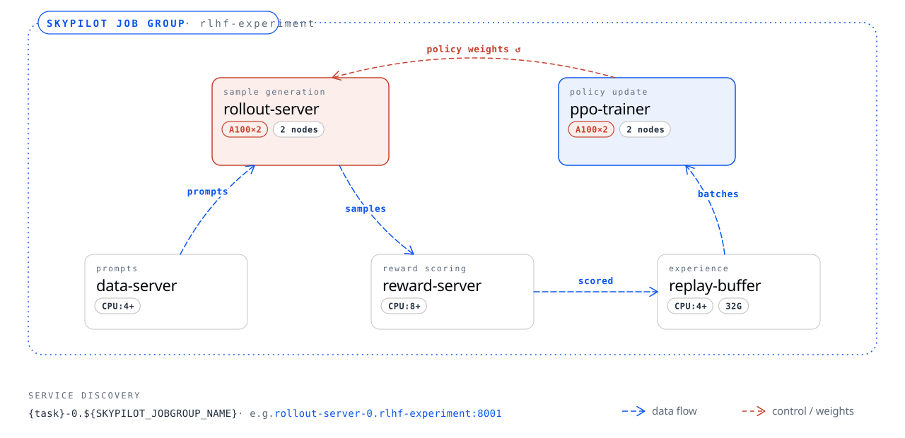
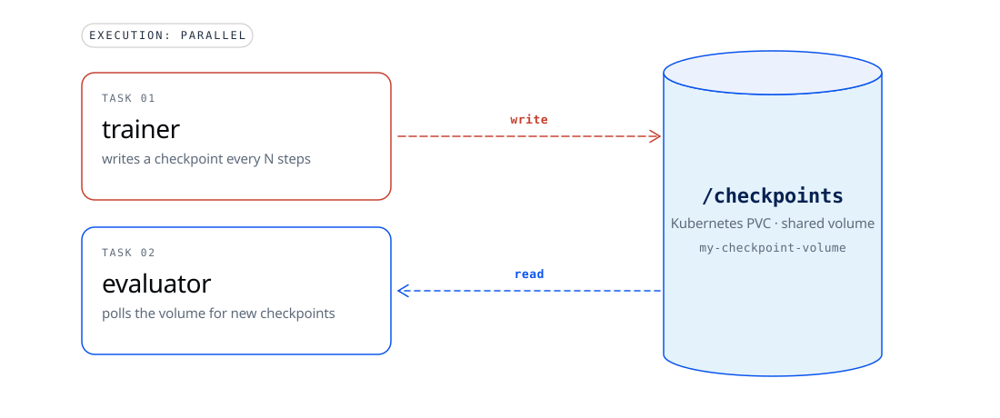
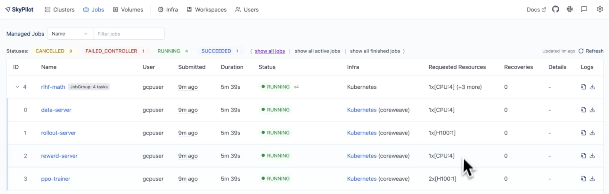
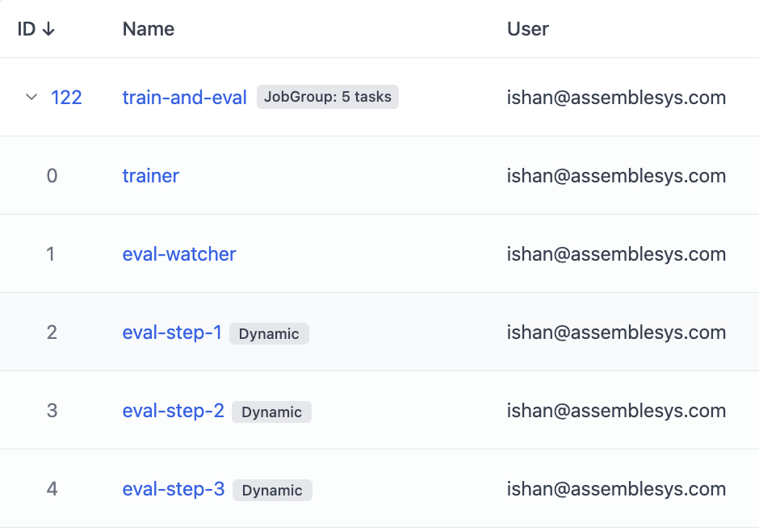

.. _job-groups:

Job Groups for RL
=================

Job Groups allow you to run multiple related tasks in parallel as a single managed unit.
Unlike :ref:`managed jobs <managed-jobs>` which run tasks sequentially (pipelines),
Job Groups launch all tasks simultaneously, enabling complex distributed architectures.

   A **SkyPilot Job Group** for RL post-training. Five heterogeneous tasks run side by side: samples flow rollout → reward → buffer → trainer, and new policy weights loop back to the rollout server every step.

Overview
--------

**Key Features:**

- **Parallel execution**: Launch multiple tasks simultaneously, each running independently
- **Heterogeneous resources**: Different resource requirements per task (e.g., GPUs for training, CPUs for data serving)
- **Automatic service discovery**: Tasks discover each other and communicate via hostnames
- **Independent recovery**: Each task recovers from preemptions without affecting other tasks
- **Launching jobs from inside the group**: A task can launch further managed jobs, which are listed under the group and cancelled with it

**When to Use Job Groups:**

Job Groups are ideal for workloads where multiple components with different requirements need to run together and communicate. Common use cases include:

- **RL post-training**: Separate tasks for trainer, reward modeling, rollout server, and data serving
- **Parallel train-eval**: Training and evaluation running in parallel with shared storage

.. tip::

   Use Job Groups when your workload has **heterogeneous tasks** that need to run
   **in parallel** and **communicate with each other**. For homogeneous multi-node
   training within a single task, use :ref:`distributed jobs <dist-jobs>` instead.
   For sequential task execution, use :ref:`managed job pipelines <pipeline>`.

.. contents:: Contents
   :local:
   :backlinks: none

Creating a job group
--------------------

A Job Group is defined using a multi-document YAML file. The first document is the
**header** that defines the group's properties, followed by individual task definitions:

.. code-block:: yaml

    # job-group.yaml
    ---
    # Header: Job Group configuration
    name: my-job-group
    execution: parallel      # Required: indicates this is a Job Group
    ---
    # Task 1: Trainer
    name: trainer
    resources:
      accelerators: A100:1
    run: |
      python train.py
    ---
    # Task 2: Evaluator
    name: evaluator
    resources:
      accelerators: A100:1
    run: |
      python evaluate.py

Launch the Job Group with:

.. code-block:: console

    $ sky jobs launch job-group.yaml

Header fields
~~~~~~~~~~~~~

The header document supports the following fields:

.. list-table::
   :widths: 20 20 60
   :header-rows: 1

   * - Field
     - Default
     - Description
   * - ``name``
     - Required
     - Name of the Job Group
   * - ``execution``
     - Required
     - Must be ``parallel`` to indicate this is a Job Group
   * - ``primary_tasks``
     - None
     - List of task names that are "primary". Tasks not in this list are
       "auxiliary" - long-running services (e.g., data servers, replay buffers)
       that wait for a signal to terminate. When all primary tasks complete,
       auxiliary tasks are terminated. If not set, all tasks are primary.
   * - ``termination_delay``
     - None
     - Delay before terminating auxiliary tasks when primary tasks complete,
       allowing them to finish pending work (e.g., flushing data). Can be a
       string (e.g., ``"30s"``, ``"5m"``) or a dict with per-task delays
       (e.g., ``{"default": "30s", "replay-buffer": "1m"}``).
   * - ``inter_connection``
     - ``None``
     - Whether tasks need to reach each other by hostname.
       ``true``: place all tasks on a single Kubernetes cluster and set
       up hostname connectivity between them; hard-fail if either is not
       possible. ``false``: deliberately skip all networking setup; tasks
       still prefer co-location but may land on separate clusters.
       Unset (default): assumes ``true`` — co-locate all tasks on a
       single Kubernetes cluster and set up networking, unless the tasks
       request non-Kubernetes infrastructure or pin infrastructures that
       cannot be co-located, in which case it degrades to ``false`` with
       a warning and skips networking setup.
       See :ref:`job-groups-inter-connection`.

Each task document after the header follows the standard :ref:`SkyPilot task YAML format <yaml-spec>`.

.. note::

    Every task in a Job Group **must have a unique name**. The name is used for
    service discovery and log viewing.

.. _job-groups-service-discovery:

Service discovery
-----------------

Tasks in a Job Group can discover each other using hostnames. SkyPilot automatically
configures networking so that tasks can communicate.

Hostname format
~~~~~~~~~~~~~~~

Each task's head node is accessible via the hostname:

.. code-block:: text

    {task_name}-0.{job_group_name}

For multi-node tasks, worker nodes use:

.. code-block:: text

    {task_name}-{node_index}.{job_group_name}

For example, in a Job Group named ``rlhf-experiment`` with a 2-node ``trainer`` task:

- ``trainer-0.rlhf-experiment`` - Head node (rank 0)
- ``trainer-1.rlhf-experiment`` - Worker node (rank 1)

Environment variables
~~~~~~~~~~~~~~~~~~~~~

SkyPilot injects the following environment variables into all tasks:

.. list-table::
   :widths: 40 60
   :header-rows: 1

   * - Variable
     - Description
   * - ``SKYPILOT_JOBGROUP_NAME``
     - Name of the Job Group

Example usage in a task:

.. code-block:: bash

    # Access the trainer task from the evaluator using the hostname
    curl http://trainer-0.${SKYPILOT_JOBGROUP_NAME}:8000/status

.. _job-groups-inter-connection:

Requiring or skipping in-group networking
~~~~~~~~~~~~~~~~~~~~~~~~~~~~~~~~~~~~~~~~~

In-group service discovery is supported on Kubernetes. By default,
in-group networking is enabled: SkyPilot places all tasks in a job group
on a single Kubernetes cluster, and tasks wait for peer hostnames to
become resolvable before running. If networking cannot be initialized,
the job fails with a clear error rather than running without
connectivity.

Explicitly setting ``inter_connection: true`` is stricter than leaving it
unset: placements where in-group networking cannot exist (non-Kubernetes
infra, or infra pins with no common option) are rejected with an error,
whereas with the field unset such placements proceed without networking
and emit a warning.

Set ``inter_connection: false`` in the header for tasks that do not need to
reach each other by hostname (e.g., components that coordinate through an
external endpoint or a shared object store):

.. code-block:: yaml

    name: my-job-group
    execution: parallel
    inter_connection: false
    ---
    # ... task documents ...

With ``inter_connection: false``:

- No in-group networking is set up, and tasks start immediately without
  waiting for peers.
- Tasks may be placed on **different Kubernetes clusters** when no single
  cluster can host the whole group (e.g., the required GPU types live in
  different clusters), or on non-Kubernetes infrastructure.
- Tasks can also pin different clusters explicitly, via per-task
  ``infra: k8s/<context>``.

.. note::

   Hostname-based service discovery across clusters is not yet
   supported: tasks placed on different clusters cannot reach each other
   via in-group hostnames.

Viewing logs
------------

View logs for a specific task within a Job Group:

.. code-block:: console

    # View logs for a specific task by name
    $ sky jobs logs <job_id> trainer

    # View logs for a specific task by task ID
    $ sky jobs logs <job_id> 0

    # View all task logs (default)
    $ sky jobs logs <job_id>

When viewing logs for a multi-task job, SkyPilot displays a hint:

.. code-block:: console

    Hint: This job has 3 tasks. Use 'sky jobs logs 42 TASK' to view logs
    for a specific task (TASK can be task ID or name).

Examples
--------

Parallel train-eval with shared storage
~~~~~~~~~~~~~~~~~~~~~~~~~~~~~~~~~~~~~~~

This example runs training and evaluation in parallel, sharing checkpoints via
a Kubernetes PVC volume:

   Parallel training and evaluation with shared storage. The trainer saves checkpoints
   to a shared volume while the evaluator monitors and evaluates new checkpoints on-the-fly.

.. code-block:: yaml

    ---
    name: train-eval
    execution: parallel
    ---
    name: trainer
    resources:
      accelerators: A100:1
    volumes:
      /checkpoints: my-checkpoint-volume
    run: |
      python train.py --checkpoint-dir /checkpoints
    ---
    name: evaluator
    resources:
      accelerators: A100:1
    volumes:
      /checkpoints: my-checkpoint-volume
    run: |
      python evaluate.py --checkpoint-dir /checkpoints

See the `full example <https://github.com/skypilot-org/skypilot/tree/master/llm/train-eval-jobgroup>`_ in the SkyPilot repository.

RL post-training architecture
~~~~~~~~~~~~~~~~~~~~~~~~~~~~~

This example demonstrates a distributed RL post-training architecture with 5 tasks (see the hero diagram at the top of the page). The trainer and rollout-server share a ``ReadWriteMany`` Kubernetes volume so the trainer can push freshly-updated policy weights back to the rollout-server every N steps, closing the RL feedback loop:

.. code-block:: yaml

    ---
    name: rlhf-training
    execution: parallel
    ---
    name: data-server
    resources:
      cpus: 4+
    run: |
      python data_server.py
    ---
    name: rollout-server
    num_nodes: 2
    resources:
      accelerators: A100:1
    volumes:
      /shared/policy: rlhf-policy
    run: |
      python rollout_server.py
    ---
    name: reward-server
    resources:
      cpus: 8+
    run: |
      python reward_server.py
    ---
    name: replay-buffer
    resources:
      cpus: 4+
      memory: 32+
    run: |
      python replay_buffer.py
    ---
    name: ppo-trainer
    num_nodes: 2
    resources:
      accelerators: A100:1
    volumes:
      /shared/policy: rlhf-policy
    run: |
      python ppo_trainer.py \
        --data-server data-server-0.${SKYPILOT_JOBGROUP_NAME}:8000 \
        --rollout-server rollout-server-0.${SKYPILOT_JOBGROUP_NAME}:8001 \
        --reward-server reward-server-0.${SKYPILOT_JOBGROUP_NAME}:8002 \
        --policy-sync-path /shared/policy/latest

   The same Job Group running in production, viewed from the SkyPilot dashboard.
   Each task has independent resources and can be monitored separately.

See the `full RL post-training example <https://github.com/skypilot-org/skypilot/tree/master/llm/rl-post-training-jobgroup>`_ in the SkyPilot repository.

.. _job-groups-primary-auxiliary:

Primary and auxiliary tasks
~~~~~~~~~~~~~~~~~~~~~~~~~~~

In many distributed workloads, you have a main task (e.g., trainer) and supporting
services (e.g., data servers, replay buffers) that run indefinitely until the main
task signals completion. These supporting services are "auxiliary tasks" - they
don't have a natural termination point and need to be told when to shut down.

Use ``primary_tasks`` to designate which tasks drive the job's lifecycle. Auxiliary
tasks (those not listed) will be automatically terminated when all primary tasks
complete:

.. code-block:: yaml

    ---
    name: train-with-services
    execution: parallel
    primary_tasks: [trainer]      # Only trainer is primary
    termination_delay: 30s        # Give services 30s to finish after trainer completes
    ---
    name: trainer
    resources:
      accelerators: A100:1
    run: |
      python train.py             # Primary task: job completes when this finishes
    ---
    name: data-server
    resources:
      cpus: 4+
    run: |
      python data_server.py       # Auxiliary: terminated 30s after trainer completes

When the trainer task finishes, the data-server (auxiliary) task will receive a
termination signal after the 30-second delay, allowing it to flush pending data
or perform cleanup.

.. _job-groups-dynamic-members:

Dynamically attaching jobs to a job group
~~~~~~~~~~~~~~~~~~~~~~~~~~~~~~~~~~~~~~~~~

A job can be attached to a running job group after the group has launched, in
two ways:

- **From inside**: a task in the group launches it with ``sky jobs launch`` or
  :func:`sky.jobs.launch` (see :ref:`nested-skypilot-managed-jobs`). It
  attaches to that group by default.
- **From outside**: ``sky jobs launch --job-group <job id or name>`` attaches a
  job to a running group from anywhere.

Either way the job becomes a *dynamic task* of the group:

- It is listed under the group in ``sky jobs queue`` and the dashboard, and is
  addressed like any other task: ``sky jobs logs 39 2`` tails it and
  ``sky jobs cancel 39 --task 2`` cancels it on its own.
- Dynamic tasks are :ref:`auxiliary <job-groups-primary-auxiliary>`: they do
  not keep the group alive and are cancelled when it finishes. A failed dynamic
  task does not fail the group.

One common use case for dynamic tasks is an **eval watcher** during model
training: one task watches for new checkpoints and launches one evaluation job
per checkpoint, each on its own resources, while the trainer keeps going
without being blocked by evaluation.

.. code-block:: yaml

    ---
    name: train-and-eval
    execution: parallel
    # The watcher is primary so the group stays alive until its evals finish.
    primary_tasks: [trainer, eval-watcher]
    ---
    name: trainer
    resources:
      accelerators: H100:8
    volumes:
      /checkpoints: checkpoints  # shared volume, also mounted by the watcher
    run: |
      python train.py --checkpoint-dir /checkpoints
    ---
    name: eval-watcher
    resources:
      cpus: 2
    volumes:
      /checkpoints: checkpoints
    setup: |
      pip install skypilot-nightly
    run: |
      # API server credentials are injected into the task automatically.
      # Launch one eval job per new checkpoint; each becomes a dynamic task
      # of this group.
      for ckpt in $(python watch_checkpoints.py /checkpoints); do
        sky jobs launch -y -d -n "eval-$ckpt" eval.yaml --env CKPT=$ckpt
      done

      # Wait for the evals: any still running when the group finishes is
      # cancelled.
      python wait_for_evals.py

A runnable demo example is available at
`job_group_eval_watcher.yaml <https://github.com/skypilot-org/skypilot/blob/master/examples/job-group-sdk/job_group_eval_watcher.yaml>`_.

The dashboard lists the dynamic tasks with the group's declared tasks, marked
``Dynamic``:

The tasks also appear underneath the parent job in ``sky jobs queue``:

.. dropdown:: Example output

    .. code-block:: console

        $ sky jobs queue
        ID    TASK  NAME              ...  STATUS
        122   -     train-and-eval    ...  RUNNING
         ↳    0     trainer [P]       ...  RUNNING
         ↳    1     eval-watcher [P]  ...  RUNNING
         ↳    2     eval-step-1       ...  SUCCEEDED
         ↳    3     eval-step-2       ...  RUNNING
         ↳    4     eval-step-3       ...  RUNNING

**Controlling where a job attaches.**

- A launch from inside a job group attaches to that group by default.
- ``--job-group <job id or name>`` attaches to a specific running group, from
  inside another group or from outside.
- ``--no-job-group`` launches a top-level job even from inside a group.
- In the SDK, :func:`sky.jobs.launch` takes ``job_group``:
  ``sky.jobs.AUTO_JOB_GROUP`` (the default), a job id or unique running job
  name, or ``None`` for a top-level job.

.. note::

   Attaching to a job group requires a :ref:`remote SkyPilot API server
   <sky-api-server>` running managed jobs in :ref:`consolidation mode
   <jobs-consolidation-mode>`, and :ref:`API server access from within the
   job <nested-skypilot-managed-jobs>` for the launching task. Elsewhere,
   ``--job-group`` is rejected and a launch from inside a group runs as a
   top-level job.

.. note::

   Dynamic tasks are not part of the group's :ref:`service discovery
   <job-groups-service-discovery>`: they get no group hostname and cannot
   reach the group's tasks by hostname.

Using the Python SDK
~~~~~~~~~~~~~~~~~~~~

Job Groups can also be created and launched entirely in Python using the SkyPilot SDK,
instead of YAML files. See the `Job Group SDK examples <https://github.com/skypilot-org/skypilot/tree/master/examples/job-group-sdk>`_ for more.

Here is a minimal example:

.. code-block:: python

   import sky

   server = sky.Task(name='server', run='python3 -m http.server 8080')
   server.set_resources(sky.Resources(cpus=2, infra='kubernetes'))

   client = sky.Task(name='client', run='curl http://server-0.${SKYPILOT_JOBGROUP_NAME}:8080/')
   client.set_resources(sky.Resources(cpus=2, infra='kubernetes'))

   with sky.Dag() as dag:
       dag.add(server)
       dag.add(client)
   dag.name = 'my-group'
   dag.set_execution(sky.DagExecution.PARALLEL)

   sky.stream_and_get(sky.jobs.launch(dag))

Current limitations
-------------------

- **Networking**: Service discovery (hostname-based communication between
  tasks) requires all tasks to run on a single Kubernetes cluster
  (``inter_connection`` ``true`` or unset). A Job Group can span Kubernetes
  clusters or run on other infrastructure with ``inter_connection: false``;
  its tasks then run in parallel without in-group networking. See
  :ref:`job-groups-inter-connection`.

.. note::

   Job Groups require ``execution: parallel`` in the header. For sequential task
   execution, use :ref:`managed job pipelines <pipeline>` instead (omit the
   ``execution`` field or set it to ``serial``).

.. seealso::

   :ref:`managed-jobs` for single tasks or sequential pipelines.

   :ref:`dist-jobs` for multi-node distributed training within a single task.
