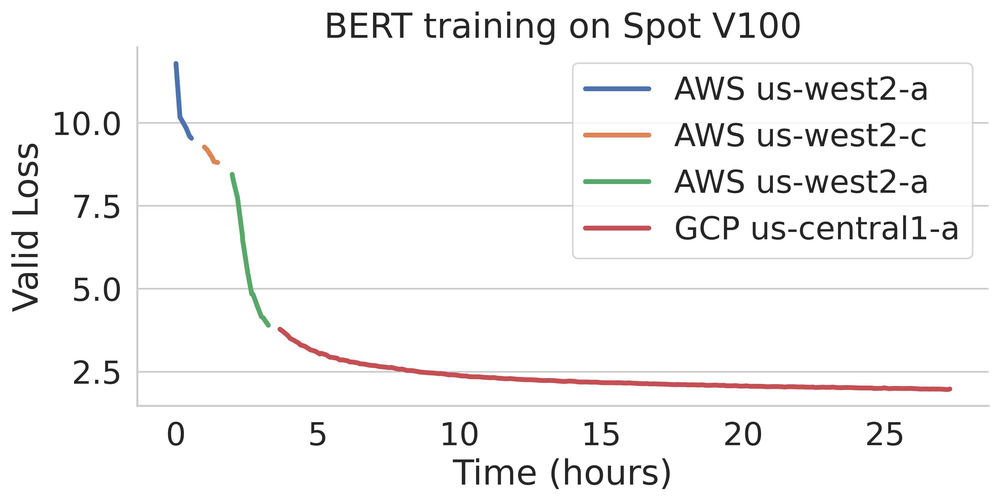

.. _managed-jobs:

Managed Jobs
============

.. tip::

  This feature is great for scaling out: running a single job for long durations, or running many jobs (pipelines).

SkyPilot supports **managed jobs** (:code:`sky jobs`), which can automatically recover from any spot preemptions or hardware failures.
It can be used in three modes:

#. :ref:`Managed Spot Jobs <spot-jobs>`: Jobs run on auto-recovering spot instances. This can **save significant costs** (e.g., up to 70\% for GPU VMs) by making preemptible spot instances useful for long-running jobs.
#. :ref:`On-demand <on-demand>`: Jobs run on auto-recovering on-demand instances. This is useful for jobs that require guaranteed resources.
#. :ref:`Pipelines <pipeline>`: Run pipelines that contain multiple tasks (which can have different resource requirements and ``setup``/``run`` commands). This is useful for running a sequence of tasks that depend on each other, e.g., data processing, training a model, and then running inference on it.

.. _spot-jobs:

Managed Spot Jobs
-----------------

In this mode, :code:`sky jobs launch --use-spot` is used to launch a managed spot job. SkyPilot automatically finds available spot resources across regions and clouds to maximize availability.
Any spot preemptions are automatically handled by SkyPilot without user intervention.

Quick comparison between *unmanaged spot clusters* vs. *managed spot jobs*:

.. list-table::
   :widths: 30 18 12 35
   :header-rows: 1

   * - Command
     - Managed?
     - SSH-able?
     - Best for
   * - :code:`sky launch --use-spot`
     - Unmanaged spot cluster
     - Yes
     - Interactive dev on spot instances (especially for hardware with low preemption rates)
   * - :code:`sky jobs launch --use-spot`
     - Managed spot job (auto-recovery)
     - No
     - Scaling out long-running jobs (e.g., data processing, training, batch inference)

Here is an example of a BERT training job failing over different regions across AWS and GCP.

.. image:: https://i.imgur.com/Vteg3fK.gif
  :width: 600
  :alt: GIF for BERT training on Spot V100

To use managed spot jobs, there are two requirements:

#. :ref:`Job YAML <job-yaml>`: Managed Spot requires a YAML to describe the job, tested with :code:`sky launch`.
#. :ref:`Checkpointing <checkpointing>` (optional): For job recovery due to preemptions, the user application code can checkpoint its progress periodically to a :ref:`mounted cloud bucket <sky-storage>`. The program can reload the latest checkpoint when restarted.

.. _job-yaml:

Job YAML
~~~~~~~~

To launch a managed job, you can simply reuse your job YAML (recommended to test it with :code:`sky launch` first).
For example, we found the BERT fine-tuning YAML works with :code:`sky launch`, and want to
launch it with SkyPilot managed spot jobs.

We can launch it with the following:

.. code-block:: console

  $ sky jobs launch -n bert-qa bert_qa.yaml

.. code-block:: yaml

  # bert_qa.yaml
  name: bert-qa

  resources:
    accelerators: V100:1
    # Use spot instances to save cost.
    use_spot: true

  # Assume your working directory is under `~/transformers`.
  # To make this example work, please run the following command:
  # git clone https://github.com/huggingface/transformers.git ~/transformers -b v4.30.1
  workdir: ~/transformers

  setup: |
    # Fill in your wandb key: copy from https://wandb.ai/authorize
    # Alternatively, you can use `--env WANDB_API_KEY=$WANDB_API_KEY`
    # to pass the key in the command line, during `sky spot launch`.
    echo export WANDB_API_KEY=[YOUR-WANDB-API-KEY] >> ~/.bashrc

    pip install -e .
    cd examples/pytorch/question-answering/
    pip install -r requirements.txt torch==1.12.1+cu113 --extra-index-url https://download.pytorch.org/whl/cu113
    pip install wandb

  run: |
    cd ./examples/pytorch/question-answering/
    python run_qa.py \
    --model_name_or_path bert-base-uncased \
    --dataset_name squad \
    --do_train \
    --do_eval \
    --per_device_train_batch_size 12 \
    --learning_rate 3e-5 \
    --num_train_epochs 50 \
    --max_seq_length 384 \
    --doc_stride 128 \
    --report_to wandb

.. note::

  :ref:`workdir <sync-code-artifacts>` and :ref:`file mounts with local files <sync-code-artifacts>` will be automatically uploaded to a
  :ref:`cloud bucket <sky-storage>`. The bucket will be created during the job running time, and cleaned up after the job
  finishes.

SkyPilot will launch and start monitoring the job. When a spot preemption or any machine failure happens, SkyPilot will automatically
search for resources across regions and clouds to re-launch the job.

In this example, the job will be restarted from scratch after each preemption recovery.
To resume the job from previous states, user's application needs to implement checkpointing and recovery.

.. _checkpointing:

Checkpointing and Recovery
~~~~~~~~~~~~~~~~~~~~~~~~~~

To allow job recovery, a cloud bucket is typically needed to store the job's states (e.g., model checkpoints).
Below is an example of mounting a bucket to :code:`/checkpoint`.

.. code-block:: yaml

  file_mounts:
    /checkpoint:
      name: # NOTE: Fill in your bucket name
      mode: MOUNT

The :code:`MOUNT` mode in :ref:`SkyPilot bucket mounting <sky-storage>` ensures the checkpoints outputted to :code:`/checkpoint` are automatically synced to a persistent bucket.
Note that the application code should save program checkpoints periodically and reload those states when the job is restarted.
This is typically achieved by reloading the latest checkpoint at the beginning of your program.

.. _spot-jobs-end-to-end:

An End-to-End Example
~~~~~~~~~~~~~~~~~~~~~

Below we show an `example <https://github.com/skypilot-org/skypilot/blob/master/examples/spot/bert_qa.yaml>`_ for fine-tuning a BERT model on a question-answering task with HuggingFace.

.. code-block:: yaml
  :emphasize-lines: 13-16,42-45

  # bert_qa.yaml
  name: bert-qa

  resources:
    accelerators: V100:1
    use_spot: true

  # Assume your working directory is under `~/transformers`.
  # To make this example work, please run the following command:
  # git clone https://github.com/huggingface/transformers.git ~/transformers -b v4.30.1
  workdir: ~/transformers

  file_mounts:
    /checkpoint:
      name: # NOTE: Fill in your bucket name
      mode: MOUNT

  setup: |
    # Fill in your wandb key: copy from https://wandb.ai/authorize
    # Alternatively, you can use `--env WANDB_API_KEY=$WANDB_API_KEY`
    # to pass the key in the command line, during `sky jobs launch`.
    echo export WANDB_API_KEY=[YOUR-WANDB-API-KEY] >> ~/.bashrc

    pip install -e .
    cd examples/pytorch/question-answering/
    pip install -r requirements.txt
    pip install wandb

  run: |
    cd ./examples/pytorch/question-answering/
    python run_qa.py \
    --model_name_or_path bert-base-uncased \
    --dataset_name squad \
    --do_train \
    --do_eval \
    --per_device_train_batch_size 12 \
    --learning_rate 3e-5 \
    --num_train_epochs 50 \
    --max_seq_length 384 \
    --doc_stride 128 \
    --report_to wandb \
    --run_name $SKYPILOT_TASK_ID \
    --output_dir /checkpoint/bert_qa/ \
    --save_total_limit 10 \
    --save_steps 1000

As HuggingFace has built-in support for periodically checkpointing, we only need to pass the highlighted arguments for setting up
the output directory and frequency of checkpointing (see more
on `Huggingface API <https://huggingface.co/docs/transformers/main_classes/trainer#transformers.TrainingArguments.save_steps>`_).
You may also refer to another example `here <https://github.com/skypilot-org/skypilot/tree/master/examples/spot/resnet_ddp>`__ for periodically checkpointing with PyTorch.

We also set :code:`--run_name` to :code:`$SKYPILOT_TASK_ID` so that the logs for all recoveries of the same job will be saved
to the same run in Weights & Biases.

.. note::
  The environment variable :code:`$SKYPILOT_TASK_ID` (example: "sky-managed-2022-10-06-05-17-09-750781_bert-qa_8-0") can be used to identify the same job, i.e., it is kept identical across all
  recoveries of the job.
  It can be accessed in the task's :code:`run` commands or directly in the program itself (e.g., access
  via :code:`os.environ` and pass to Weights & Biases for tracking purposes in your training script). It is made available to
  the task whenever it is invoked.

With the highlighted changes, the managed spot job can now resume training after preemption! We can enjoy the benefits of
cost savings from spot instances without worrying about preemption or losing progress.

.. code-block:: console

  $ sky jobs launch -n bert-qa bert_qa.yaml

.. tip::

  Try copy-paste this example and adapt it to your own job.

Real-World Examples
~~~~~~~~~~~~~~~~~~~

* `Vicuna <https://vicuna.lmsys.org/>`_ LLM chatbot: `instructions <https://github.com/skypilot-org/skypilot/tree/master/llm/vicuna>`_, `YAML <https://github.com/skypilot-org/skypilot/blob/master/llm/vicuna/train.yaml>`__
* BERT (shown above): `YAML <https://github.com/skypilot-org/skypilot/blob/master/examples/spot/bert_qa.yaml>`__
* PyTorch DDP, ResNet: `YAML <https://github.com/skypilot-org/skypilot/blob/master/examples/spot/resnet.yaml>`__
* PyTorch Lightning DDP, CIFAR-10: `YAML <https://github.com/skypilot-org/skypilot/blob/master/examples/spot/lightning_cifar10.yaml>`__

.. _on-demand:

Using On-Demand Instances
--------------------------------

The same ``sky jobs launch`` and YAML interfaces can run jobs on auto-recovering
on-demand instances. This is useful to have SkyPilot monitor any underlying
machine failures and transparently recover the job.

To do so, simply set :code:`use_spot: false` in the :code:`resources` section, or override it with :code:`--use-spot false` in the CLI.

.. code-block:: console

  $ sky jobs launch -n bert-qa bert_qa.yaml --use-spot false

.. tip::

  It is useful to think of ``sky jobs launch`` as a "serverless" managed job
  interface, while ``sky launch`` is a cluster interface (that you can launch
  tasks on, albeit not managed).

Either Spot Or On-Demand
~~~~~~~~~~~~~~~~~~~~~~~~~~~~~~~~~~~~~~~~

You can use ``any_of`` to specify either spot or on-demand instances as
candidate resources for a job. See documentation :ref:`here
<multiple-resources>` for more details.

.. code-block:: yaml

  resources:
    accelerators: A100:8
    any_of:
      - use_spot: true
      - use_spot: false

In this example, SkyPilot will perform cost optimizations to select the resource to use, which almost certainly
will be spot instances. If spot instances are not available, SkyPilot will fall back to launch on-demand instances.

More advanced policies for resource selection, such as the `Can't Be Late
<https://www.usenix.org/conference/nsdi24/presentation/wu-zhanghao>`__ (NSDI'24)
paper, may be supported in the future.

Useful CLIs
-----------

Here are some commands for managed jobs. Check :code:`sky jobs --help` and :ref:`CLI reference <cli>` for more details.

See all managed jobs:

.. code-block:: console

  $ sky jobs queue

.. code-block:: console

  Fetching managed job statuses...
  Managed jobs:
  ID NAME     RESOURCES           SUBMITTED   TOT. DURATION   JOB DURATION   #RECOVERIES  STATUS
  2  roberta  1x [A100:8][Spot]   2 hrs ago   2h 47m 18s      2h 36m 18s     0            RUNNING
  1  bert-qa  1x [V100:1][Spot]   4 hrs ago   4h 24m 26s      4h 17m 54s     0            RUNNING

Stream the logs of a running managed job:

.. code-block:: console

  $ sky jobs logs -n bert-qa  # by name
  $ sky jobs logs 2           # by job ID

Cancel a managed job:

.. code-block:: console

  $ sky jobs cancel -n bert-qa  # by name
  $ sky jobs cancel 2           # by job ID

.. note::
  If any failure happens for a managed job, you can check :code:`sky jobs queue -a` for the brief reason
  of the failure. For more details, it would be helpful to check :code:`sky jobs logs --controller <job_id>`.

.. _pipeline:

Job Pipelines
-------------

A pipeline is a managed job that contains a sequence of tasks running one after another.

This is useful for running a sequence of tasks that depend on each other, e.g., training a model and then running inference on it.
Different tasks can have different resource requirements to use appropriate per-task resources, which saves costs, while  keeping the burden of managing the tasks off the user.

.. note::
  In other words, a managed job is either a single task or a pipeline of tasks. All managed jobs are submitted by :code:`sky jobs launch`.

To run a pipeline, specify the sequence of tasks in a YAML file. Here is an example:

.. code-block:: yaml

  name: pipeline

  ---

  name: train

  resources:
    accelerators: V100:8
    any_of:
      - use_spot: true
      - use_spot: false

  file_mounts:
    /checkpoint:
      name: train-eval # NOTE: Fill in your bucket name
      mode: MOUNT

  setup: |
    echo setup for training

  run: |
    echo run for training
    echo save checkpoints to /checkpoint

  ---

  name: eval

  resources:
    accelerators: T4:1
    use_spot: false

  file_mounts:
    /checkpoint:
      name: train-eval # NOTE: Fill in your bucket name
      mode: MOUNT

  setup: |
    echo setup for eval

  run: |
    echo load trained model from /checkpoint
    echo eval model on test set

The YAML above defines a pipeline with two tasks. The first :code:`name:
pipeline` names the pipeline. The first task has name :code:`train` and the
second task has name :code:`eval`. The tasks are separated by a line with three
dashes :code:`---`. Each task has its own :code:`resources`, :code:`setup`, and
:code:`run` sections. Tasks are executed sequentially.

To submit the pipeline, the same command :code:`sky jobs launch` is used. The pipeline will be automatically launched and monitored by SkyPilot. You can check the status of the pipeline with :code:`sky jobs queue` or :code:`sky jobs dashboard`.

.. code-block:: console

  $ sky jobs launch -n pipeline pipeline.yaml
  $ sky jobs queue
  Fetching managed job statuses...
  Managed jobs
  In progress jobs: 1 RECOVERING
  ID  TASK  NAME      RESOURCES                    SUBMITTED    TOT. DURATION  JOB DURATION  #RECOVERIES  STATUS
  8         pipeline  -                            50 mins ago  47m 45s        -             1            RECOVERING
   ↳  0     train     1x [V100:8][Spot|On-demand]  50 mins ago  47m 45s        -             1            RECOVERING
   ↳  1     eval      1x [T4:1]                    -            -              -             0            PENDING

.. note::

  The :code:`$SKYPILOT_TASK_ID` environment variable is also available in the :code:`run` section of each task. It is unique for each task in the pipeline.
  For example, the :code:`$SKYPILOT_TASK_ID` for the :code:`eval` task above is:
  "sky-managed-2022-10-06-05-17-09-750781_pipeline_eval_8-1".

Dashboard
---------

Use ``sky jobs dashboard`` to open a dashboard to see all jobs:

.. code-block:: console

  $ sky jobs dashboard

This automatically opens a browser tab to show the dashboard:

.. image:: ../images/job-dashboard.png

The UI shows the same information as the CLI ``sky jobs queue -a``. The UI is
especially useful when there are many in-progress jobs to monitor, which the
terminal-based CLI may need more than one page to display.

Concept: Jobs Controller
------------------------

The jobs controller is a small on-demand CPU VM running in the cloud that manages all jobs of a user.
It is automatically launched when the first managed job is submitted, and it is autostopped after it has been idle for 10 minutes (i.e., after all managed jobs finish and no new managed job is submitted in that duration).
Thus, **no user action is needed** to manage its lifecycle.

You can see the controller with :code:`sky status` and refresh its status by using the :code:`-r/--refresh` flag.

While the cost of the jobs controller is negligible (~$0.4/hour when running and less than $0.004/hour when stopped),
you can still tear it down manually with
:code:`sky down <job-controller-name>`, where the ``<job-controller-name>`` can be found in the output of :code:`sky status`.

.. note::
  Tearing down the jobs controller loses all logs and status information for the finished managed jobs. It is only allowed when there are no in-progress managed jobs to ensure no resource leakage.

Customizing Job Controller Resources
~~~~~~~~~~~~~~~~~~~~~~~~~~~~~~~~~~~~

You may want to customize the resources of the jobs controller for several reasons:

#. Changing the maximum number of jobs that can be run concurrently, which is 2x the vCPUs of the controller. (Default: 16)
#. Use a lower-cost controller (if you have a low number of concurrent managed jobs).
#. Enforcing the jobs controller to run on a specific location. (Default: cheapest location)
#. Changing the disk_size of the jobs controller to store more logs. (Default: 50GB)

To achieve the above, you can specify custom configs in :code:`~/.sky/config.yaml` with the following fields:

.. code-block:: yaml

  jobs:
    # NOTE: these settings only take effect for a new jobs controller, not if
    # you have an existing one.
    controller:
      resources:
        # All configs below are optional.
        # Specify the location of the jobs controller.
        cloud: gcp
        region: us-central1
        # Specify the maximum number of managed jobs that can be run concurrently.
        cpus: 4+  # number of vCPUs, max concurrent jobs = 2 * cpus
        # Specify the disk_size in GB of the jobs controller.
        disk_size: 100

The :code:`resources` field has the same spec as a normal SkyPilot job; see `here <https://skypilot.readthedocs.io/en/latest/reference/yaml-spec.html>`__.

.. note::
  These settings will not take effect if you have an existing controller (either
  stopped or live).  For them to take effect, tear down the existing controller
  first, which requires all in-progress jobs to finish or be canceled.

