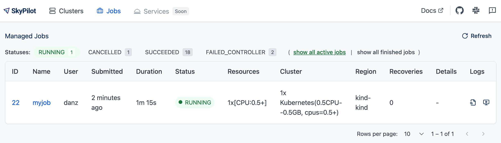

.. _managed-jobs:

Managed Jobs
============

.. tip::

  This feature is great for scaling out: running a single job for long durations, or running many jobs in parallel.

SkyPilot supports **managed jobs** (:code:`sky jobs`), which can automatically retry failures, recover from spot instance preemptions, and clean up when done.

To start a managed job, use :code:`sky jobs launch`:

.. code-block:: console

  $ sky jobs launch -n myjob hello_sky.yaml

  Task from YAML spec: hello_sky.yaml
  Managed job 'myjob' will be launched on (estimated):
  Considered resources (1 node):
  ------------------------------------------------------------------------------------------
   INFRA              INSTANCE      vCPUs   Mem(GB)   GPUS   COST ($)   CHOSEN
  ------------------------------------------------------------------------------------------
   AWS (us-east-1)    m6i.2xlarge   8       32        -      0.38          ✔
  ------------------------------------------------------------------------------------------
  Launching a managed job 'myjob'. Proceed? [Y/n]: Y
  ... <job is submitted and launched>
  (setup pid=2383) Running setup.
  (myjob, pid=2383) Hello, SkyPilot!
  ✓ Managed job finished: 1 (status: SUCCEEDED).

  Managed Job ID: 1
  📋 Useful Commands
  ├── To cancel the job:                sky jobs cancel 1
  ├── To stream job logs:               sky jobs logs 1
  ├── To stream controller logs:        sky jobs logs --controller 1
  └── To view all managed jobs:         sky jobs queue

The job is launched on a temporary SkyPilot cluster, managed end-to-end, and automatically cleaned up.

Managed jobs have several benefits:

#. :ref:`Use spot instances <spot-jobs>`: Jobs can run on auto-recovering spot instances. This **saves significant costs** (e.g., ~70\% for GPU VMs) by making preemptible spot instances useful for long-running jobs.
#. :ref:`Scale across regions and clouds <scaling-to-many-jobs>`: Easily run and manage **thousands of jobs at once**, using instances and GPUs across multiple regions/clouds.
#. :ref:`Recover from failure <failure-recovery>`: When a job fails, you can automatically retry it on a new cluster, eliminating flaky failures.
#. :ref:`Managed pipelines <pipeline>`: Run pipelines that contain multiple tasks.
   Useful for running a sequence of tasks that depend on each other, e.g., data
   processing, training a model, and then running inference on it.

.. contents:: Contents
   :local:
   :backlinks: none

.. _managed-job-quickstart:

Create a managed job
--------------------

A managed job is created from a standard :ref:`SkyPilot YAML <yaml-spec>`. For example:

.. code-block:: yaml

  # bert_qa.yaml
  name: bert-qa

  resources:
    accelerators: V100:1
    use_spot: true  # Use spot instances to save cost.

  envs:
    # Fill in your wandb key: copy from https://wandb.ai/authorize
    # Alternatively, you can use `--env WANDB_API_KEY=$WANDB_API_KEY`
    # to pass the key in the command line, during `sky jobs launch`.
    WANDB_API_KEY:

  # Assume your working directory is under `~/transformers`.
  # To get the code for this example, run:
  # git clone https://github.com/huggingface/transformers.git ~/transformers -b v4.30.1
  workdir: ~/transformers

  setup: |
    pip install -e .
    cd examples/pytorch/question-answering/
    pip install -r requirements.txt torch==1.12.1+cu113 --extra-index-url https://download.pytorch.org/whl/cu113
    pip install wandb

  run: |
    cd examples/pytorch/question-answering/
    python run_qa.py \
      --model_name_or_path bert-base-uncased \
      --dataset_name squad \
      --do_train \
      --do_eval \
      --per_device_train_batch_size 12 \
      --learning_rate 3e-5 \
      --num_train_epochs 50 \
      --max_seq_length 384 \
      --doc_stride 128 \
      --report_to wandb \
      --output_dir /tmp/bert_qa/

.. note::

  :ref:`Workdir <sync-code-artifacts>` and :ref:`file mounts with local files <sync-code-artifacts>` will be :ref:`automatically uploaded to a cloud bucket <intermediate-bucket>`.
  The bucket will be cleaned up after the job finishes.

To launch this YAML as a managed job, use :code:`sky jobs launch`:

.. code-block:: console

  $ sky jobs launch -n bert-qa-job bert_qa.yaml

To see all flags, you can run :code:`sky jobs launch --help` or see the :ref:`CLI reference <sky-job-launch>` for more information.

SkyPilot will launch and start monitoring the job.

- Under the hood, SkyPilot spins up a temporary cluster for the job.
- If a spot preemption or any machine failure happens, SkyPilot will automatically search for resources across regions and clouds to re-launch the job.
- Resources are cleaned up as soon as the job is finished.

.. tip::
   You can test your YAML on |unmanaged sky launch|_ , then do a production run as a managed job using :code:`sky jobs launch`.

.. https://stackoverflow.com/a/4836544
.. |unmanaged sky launch| replace:: unmanaged :code:`sky launch`
.. _unmanaged sky launch: ../getting-started/quickstart.html

:code:`sky launch` and :code:`sky jobs launch` have a similar interface, but are useful in different scenarios.

.. list-table::
   :header-rows: 1

   * - :code:`sky launch` (cluster jobs)
     - :code:`sky jobs launch` (managed jobs)
   * - Long-lived, manually managed cluster
     - Dedicated auto-managed cluster for each job
   * - Spot preemptions must be manually recovered
     - Spot preemptions are auto-recovered
   * - Number of parallel jobs limited by cluster resources
     - Easily manage hundreds or thousands of jobs at once
   * - Good for interactive dev
     - Good for scaling out production jobs

Work with managed jobs
~~~~~~~~~~~~~~~~~~~~~~

For a list of all commands and options, run :code:`sky jobs --help` or read the :ref:`CLI reference <cli>`.

See a list of managed jobs:

.. code-block:: console

  $ sky jobs queue

.. code-block:: console

  Fetching managed jobs...
  Managed jobs:
  ID NAME     RESOURCES           SUBMITTED   TOT. DURATION   JOB DURATION   #RECOVERIES  STATUS
  2  roberta  1x [A100:8][Spot]   2 hrs ago   2h 47m 18s      2h 36m 18s     0            RUNNING
  1  bert-qa  1x [V100:1][Spot]   4 hrs ago   4h 24m 26s      4h 17m 54s     0            RUNNING

This command shows 50 managed jobs by default, use ``--limit <num>`` to show more jobs or use ``--all`` to show all jobs.

Stream the logs of a running managed job:

.. code-block:: console

  $ sky jobs logs -n bert-qa  # by name
  $ sky jobs logs 2           # by job ID

Cancel a managed job:

.. code-block:: console

  $ sky jobs cancel -n bert-qa  # by name
  $ sky jobs cancel 2           # by job ID

.. note::
  If any failure happens for a managed job, you can check :code:`sky jobs queue -a` for the brief reason
  of the failure. For more details related to provisioning, check :code:`sky jobs logs --controller <job_id>`.

Viewing jobs in dashboard
~~~~~~~~~~~~~~~~~~~~~~~~~

The SkyPilot dashboard, ``sky dashboard`` has a **Jobs** page that shows all managed jobs.

The UI shows the same information as the CLI ``sky jobs queue -au``.

.. _spot-jobs:

Running on spot instances
-------------------------

Managed jobs can run on spot instances, and preemptions are auto-recovered by SkyPilot.

To run on spot instances, use :code:`sky jobs launch --use-spot`, or specify :code:`use_spot: true` in your SkyPilot YAML.

.. code-block:: yaml

  name: spot-job

  resources:
    accelerators: A100:8
    use_spot: true

  run: ...

.. tip::
   Spot instances are cloud VMs that may be "preempted".
   The cloud provider can forcibly shut down the underlying VM and remove your access to it, interrupting the job running on that instance.

   In exchange, spot instances are significantly cheaper than normal instances that are not subject to preemption (so-called "on-demand" instances).
   Depending on the cloud and VM type, spot instances can be 70-90% cheaper.

SkyPilot automatically finds available spot instances across regions and clouds to maximize availability.
Any spot preemptions are automatically handled by SkyPilot without user intervention.

.. note::
   By default, a job will be restarted from scratch after each preemption recovery.
   To avoid redoing work after recovery, implement :ref:`checkpointing and recovery <checkpointing>`.
   Your application code can checkpoint its progress periodically to a :ref:`mounted cloud bucket <sky-storage>`. The program can then reload the latest checkpoint when restarted.

Here is :ref:`an example of a training job <bert>` failing over different regions across AWS and GCP.

.. image:: https://i.imgur.com/Vteg3fK.gif
  :width: 600
  :alt: GIF for BERT training on Spot V100
  :align: center

Quick comparison between *managed spot jobs* vs. *launching unmanaged spot clusters*:

.. list-table::
   :widths: 30 18 12 35
   :header-rows: 1

   * - Command
     - Managed?
     - SSH-able?
     - Best for
   * - :code:`sky jobs launch --use-spot`
     - Yes, preemptions are auto-recovered
     - No
     - Scaling out long-running jobs (e.g., data processing, training, batch inference)
   * - :code:`sky launch --use-spot`
     - No, preemptions are not handled
     - Yes
     - Interactive dev on spot instances (especially for hardware with low preemption rates)

Either spot or on-demand/reserved
~~~~~~~~~~~~~~~~~~~~~~~~~~~~~~~~~

By default, on-demand instances will be used (not spot instances). To use spot instances, you must specify :code:`--use-spot` on the command line or :code:`use_spot: true` in your SkyPilot YAML.

However, you can also tell SkyPilot to use **both spot instance and on-demand instances**, depending on availability. In your SkyPilot YAML, use ``any_of`` to specify either spot or on-demand/reserved instances as
candidate resources for a job. See documentation :ref:`here
<multiple-resources>` for more details.

.. code-block:: yaml

  resources:
    accelerators: A100:8
    any_of:
      - use_spot: true
      - use_spot: false

In this example, SkyPilot will choose the cheapest resource to use, which almost certainly
will be spot instances. If spot instances are not available, SkyPilot will fall back to launching on-demand/reserved instances.

.. _checkpointing:

Checkpointing and recovery
--------------------------

To recover quickly from spot instance preemptions, a cloud bucket is typically needed to store the job's states (e.g., model checkpoints). Any data on disk that is not stored inside a cloud bucket will be lost during the recovery process.

Below is an example of mounting a bucket to :code:`/checkpoint`:

.. code-block:: yaml

  file_mounts:
    /checkpoint:
      name: # NOTE: Fill in your bucket name
      mode: MOUNT_CACHED # or MOUNT

To learn more about the different modes, see :ref:`SkyPilot bucket mounting <sky-storage>` and :ref:`high-performance training <training-guide>`.

Real-world examples
~~~~~~~~~~~~~~~~~~~

See the :ref:`Model training guide <training-guide>` for more training examples and best practices.

.. _failure-recovery:

Jobs restarts on user code failure
~~~~~~~~~~~~~~~~~~~~~~~~~~~~~~~~~~

Preemptions or hardware failures will be auto-recovered, but **by default, user code failures (non-zero exit codes) are not auto-recovered**.

In some cases, you may want a job to automatically restart even if it fails in application code. For instance, if a training job crashes due to an NVIDIA driver issue or NCCL timeout, it should be recovered. To specify this, you
can set :code:`max_restarts_on_errors` in :code:`resources.job_recovery` in the :ref:`SkyPilot YAML <yaml-spec>`.

.. code-block:: yaml

  resources:
    accelerators: A100:8
    job_recovery:
      # Restart the job up to 3 times on user code errors.
      max_restarts_on_errors: 3

This will restart the job, up to 3 times (for a total of 4 attempts), if your code has any non-zero exit code. Each restart runs on a newly provisioned temporary cluster.

When will my job be recovered?
~~~~~~~~~~~~~~~~~~~~~~~~~~~~~~

Here's how various kinds of failures will be handled by SkyPilot:

.. list-table::
   :widths: 1 2
   :header-rows: 0

   * - User code fails (:code:`setup` or :code:`run` commands have non-zero exit code):
     - If :code:`max_restarts_on_errors` is set, restart up to that many times. If :code:`max_restarts_on_errors` is not set, or we run out of restarts, set the job to :code:`FAILED` or :code:`FAILED_SETUP`.
   * - Instances are preempted or underlying hardware fails:
     - Tear down the old temporary cluster and provision a new one in another region, then restart the job.
   * - Can't find available resources due to cloud quota or capacity restrictions:
     - Try other regions and other clouds indefinitely until resources are found.
   * - Cloud config/auth issue or invalid job configuration:
     - Mark the job as :code:`FAILED_PRECHECKS` and exit. Won't be retried.

To see the logs of user code (:code:`setup` or :code:`run` commands), use :code:`sky jobs logs <job_id>`. If there is a provisioning or recovery issue, you can see the provisioning logs by running :code:`sky jobs logs --controller <job_id>`.

.. tip::
  Under the hood, SkyPilot uses a "controller" to provision, monitor, and recover the underlying temporary clusters. See :ref:`jobs-controller`.

.. _scaling-to-many-jobs:

Scaling to many jobs
--------------------

You can easily manage dozens, hundreds, or thousands of managed jobs at once. This is a great fit for batch jobs such as **data processing**, **batch inference**, or **hyperparameter sweeps**. To see an example launching many jobs in parallel, see :ref:`many-jobs`.

.. tip::

  For workloads that can reuse the same environment across many jobs, consider using :ref:`Pools <pool>`. Pools provide faster cold-starts by maintaining a set of pre-provisioned workers that can be reused across job submissions.

.. TODO(cooperc): code block or dashboard showcasing UX of many jobs (thousand-scale)

To increase the maximum number of jobs that can run at once, see :ref:`jobs-controller-sizing`.

.. _pipeline:

Managed pipelines
-----------------

A pipeline is a managed job that contains a sequence of tasks running one after another.

This is useful for running a sequence of tasks that depend on each other, e.g., training a model and then running inference on it.
Different tasks can have different resource requirements to use appropriate per-task resources, which saves costs, while  keeping the burden of managing the tasks off the user.

.. note::
  In other words, a managed job is either a single task or a pipeline of tasks. All managed jobs are submitted by :code:`sky jobs launch`.

To run a pipeline, specify the sequence of tasks in a YAML file. Here is an example:

.. code-block:: yaml

  name: pipeline

  ---

  name: train

  resources:
    accelerators: V100:8
    any_of:
      - use_spot: true
      - use_spot: false

  file_mounts:
    /checkpoint:
      name: train-eval # NOTE: Fill in your bucket name
      mode: MOUNT

  setup: |
    echo setup for training

  run: |
    echo run for training
    echo save checkpoints to /checkpoint

  ---

  name: eval

  resources:
    accelerators: T4:1
    use_spot: false

  file_mounts:
    /checkpoint:
      name: train-eval # NOTE: Fill in your bucket name
      mode: MOUNT

  setup: |
    echo setup for eval

  run: |
    echo load trained model from /checkpoint
    echo eval model on test set

The YAML above defines a pipeline with two tasks. The first :code:`name:
pipeline` names the pipeline. The first task has name :code:`train` and the
second task has name :code:`eval`. The tasks are separated by a line with three
dashes :code:`---`. Each task has its own :code:`resources`, :code:`setup`, and
:code:`run` sections. Tasks are executed sequentially. If a task fails, later tasks are skipped.

To pass data between the tasks, use a shared file mount. In this example, the :code:`train` task writes its output to the :code:`/checkpoint` file mount, which the :code:`eval` task is then able to read from.

To submit the pipeline, the same command :code:`sky jobs launch` is used. The pipeline will be automatically launched and monitored by SkyPilot. You can check the status of the pipeline with :code:`sky jobs queue` or :code:`sky dashboard`.

.. code-block:: console

  $ sky jobs launch -n pipeline pipeline.yaml

  $ sky jobs queue

  Fetching managed job statuses...
  Managed jobs
  In progress jobs: 1 RECOVERING
  ID  TASK  NAME      REQUESTED                    SUBMITTED    TOT. DURATION  JOB DURATION  #RECOVERIES  STATUS
  8         pipeline  -                            50 mins ago  47m 45s        -             1            RECOVERING
   ↳  0     train     1x [V100:8][Spot|On-demand]  50 mins ago  47m 45s        -             1            RECOVERING
   ↳  1     eval      1x [T4:1]                    -            -              -             0            PENDING

.. note::

  The :code:`$SKYPILOT_TASK_ID` environment variable is also available in the :code:`run` section of each task. It is unique for each task in the pipeline.
  For example, the :code:`$SKYPILOT_TASK_ID` for the :code:`eval` task above is:
  "sky-managed-2022-10-06-05-17-09-750781_pipeline_eval_8-1".

File uploads for managed jobs
-----------------------------

For managed jobs, SkyPilot uses an intermediate bucket to store files used in the task, such as local :code:`file_mounts` and the :code:`workdir`.

If you do not configure a bucket, SkyPilot will automatically create a temporary bucket named :code:`skypilot-filemounts-{username}-{run_id}` for each job launch. SkyPilot automatically deletes the bucket after the job completes.

**Object store access is not necessary to use managed jobs.** If cloud object storage is not available (e.g., Kubernetes deployments), SkyPilot automatically falls back to a two-hop upload that copies files to the jobs controller and then downloads them to the jobs.

.. tip::

  To force disable using cloud buckets even when available, set :ref:`jobs.force_disable_cloud_bucket <config-yaml-jobs-force-disable-cloud-bucket>` in your config:

  .. code-block:: yaml

    # ~/.sky/config.yaml
    jobs:
      force_disable_cloud_bucket: true

.. _intermediate-bucket:

Setting the job files bucket
~~~~~~~~~~~~~~~~~~~~~~~~~~~~

If you want to use a pre-provisioned bucket for storing intermediate files, set :code:`jobs.bucket` in :code:`~/.sky/config.yaml`:

.. code-block:: yaml

  # ~/.sky/config.yaml
  jobs:
    bucket: s3://my-bucket  # Supports s3://, gs://, https://<azure_storage_account>.blob.core.windows.net/<container>, r2://, cos://<region>/<bucket>

If you choose to specify a bucket, ensure that the bucket already exists and that you have the necessary permissions.

When using a pre-provisioned intermediate bucket with :code:`jobs.bucket`, SkyPilot creates job-specific directories under the bucket root to store files. They are organized in the following structure:

.. code-block:: text

  # cloud bucket, s3://my-bucket/ for example
  my-bucket/
  ├── job-15891b25/            # Job-specific directory
  │   ├── local-file-mounts/   # Files from local file mounts
  │   ├── tmp-files/           # Temporary files
  │   └── workdir/             # Files from workdir
  └── job-cae228be/            # Another job's directory
      ├── local-file-mounts/
      ├── tmp-files/
      └── workdir/

When using a custom bucket (:code:`jobs.bucket`), the job-specific directories (e.g., :code:`job-15891b25/`) created by SkyPilot are removed when the job completes.

.. tip::
  Multiple users can share the same intermediate bucket. Each user's jobs will have their own unique job-specific directories, ensuring that files are kept separate and organized.

.. _jobs-controller:

How it works: The jobs controller
---------------------------------

The jobs controller is a small on-demand CPU VM or pod created by SkyPilot to manage all jobs.
It is automatically launched when the first managed job is submitted, and it is autostopped after it has been idle for 10 minutes (i.e., after all managed jobs finish and no new managed job is submitted in that duration).
Thus, **no user action is needed** to manage its lifecycle.

You can see the controller with :code:`sky status` and refresh its status by using the :code:`-r/--refresh` flag.

While the cost of the jobs controller is negligible (~$0.25/hour when running and less than $0.004/hour when stopped),
you can still tear it down manually with
:code:`sky down <job-controller-name>`, where the ``<job-controller-name>`` can be found in the output of :code:`sky status`.

.. note::
  Tearing down the jobs controller loses all logs and status information for the finished managed jobs. It is only allowed when there are no in-progress managed jobs to ensure no resource leakage.

To adjust the size of the jobs controller instance, see :ref:`jobs-controller-custom-resources`.

.. _managed-jobs-high-availability-controller:

High availability controller
~~~~~~~~~~~~~~~~~~~~~~~~~~~~

High availability mode ensures the controller for Managed Jobs remains resilient to failures by running it as a Kubernetes Deployment with automatic restarts and persistent storage. This helps maintain management capabilities even if the controller pod crashes or the node fails.

To enable high availability for Managed Jobs, simply set the ``high_availability`` flag to ``true`` under ``jobs.controller`` in your ``~/.sky/config.yaml``, and ensure the controller runs on Kubernetes:

.. code-block:: yaml
    :emphasize-lines: 4-5

    jobs:
      controller:
        resources:
          cloud: kubernetes
        high_availability: true

This will deploy the controller as a Kubernetes Deployment with persistent storage, allowing automatic recovery on failures. For prerequisites, setup steps, and recovery behavior, see the detailed page: :ref:`high-availability-controller`.

Setup and best practices
------------------------

.. _managed-jobs-creds:

Using long-lived credentials
~~~~~~~~~~~~~~~~~~~~~~~~~~~~

Since the :ref:`jobs controller <jobs-controller>` is a long-lived instance that will manage other cloud instances, it's best to **use static credentials that do not expire**. If a credential expires, it could leave the controller with no way to clean up a job, leading to expensive cloud instance leaks. For this reason, it's preferred to set up long-lived credential access, such as a ``~/.aws/credentials`` file on AWS, or a service account json key file on GCP.

To use long-lived static credentials for the jobs controller, just make sure the right credentials are in use by SkyPilot. They will be automatically uploaded to the jobs controller. **If you're already using local credentials that don't expire, no action is needed.**

To set up credentials:

- **AWS**: :ref:`Create a dedicated SkyPilot IAM user <dedicated-aws-user>` and use a static ``~/.aws/credentials`` file.
- **GCP**: :ref:`Create a GCP service account <gcp-service-account>` with a static JSON key file.
- **Other clouds**: Make sure you are using credentials that do not expire.

.. _jobs-controller-custom-resources:

Customizing jobs controller resources
~~~~~~~~~~~~~~~~~~~~~~~~~~~~~~~~~~~~~

You may want to customize the jobs controller resources for several reasons:

#. Increasing the maximum number of jobs that can be run concurrently, which is based on the controller's memory allocation. (Default: ~600, see :ref:`best practices <jobs-controller-sizing>`)
#. Use a lower-cost controller (if you have a low number of concurrent managed jobs).
#. Enforcing the jobs controller to run on a specific location. (Default: cheapest location)
#. Changing the disk_size of the jobs controller to store more logs. (Default: 50GB)

To achieve the above, you can specify custom configs in :code:`~/.sky/config.yaml` with the following fields:

.. code-block:: yaml

  jobs:
    # NOTE: these settings only take effect for a new jobs controller, not if
    # you have an existing one.
    controller:
      resources:
        # All configs below are optional.
        # Specify the location of the jobs controller.
        infra: gcp/us-central1
        # Bump cpus to allow more managed jobs to be launched concurrently. (Default: 4+)
        cpus: 8+
        # Bump memory to allow more managed jobs to be running at once.
        # By default, it scales with CPU (4x).
        memory: 64+
        # Specify the disk_size in GB of the jobs controller.
        disk_size: 100

The :code:`resources` field has the same spec as a normal SkyPilot job; see `here <https://docs.skypilot.co/en/latest/reference/yaml-spec.html>`__.

.. note::
  These settings will not take effect if you have an existing controller (either
  stopped or live).  For them to take effect, tear down the existing controller
  first, which requires all in-progress jobs to finish or be canceled.

To see your current jobs controller, use :code:`sky status`.

.. code-block:: console

  $ sky status --refresh

  Clusters
  NAME                          INFRA             RESOURCES                                  STATUS   AUTOSTOP  LAUNCHED
  my-cluster-1                  AWS (us-east-1)   1x(cpus=16, m6i.4xlarge, ...)              STOPPED  -         1 week ago
  my-other-cluster              GCP (us-central1) 1x(cpus=16, n2-standard-16, ...)           STOPPED  -         1 week ago
  sky-jobs-controller-919df126  AWS (us-east-1)   1x(cpus=4, m6i.xlarge, disk_size=50)       STOPPED  10m       1 day ago

  Managed jobs
  No in-progress managed jobs.

  Services
  No live services.

In this example, you can see the jobs controller (:code:`sky-jobs-controller-919df126`) is an m6i.xlarge on AWS, which is the default size.

To tear down the current controller, so that new resource config is picked up, use :code:`sky down`.

.. code-block:: console

  $ sky down sky-jobs-controller-919df126

  WARNING: Tearing down the managed jobs controller. Please be aware of the following:
   * All logs and status information of the managed jobs (output of `sky jobs queue`) will be lost.
   * No in-progress managed jobs found. It should be safe to terminate (see caveats above).
  To proceed, please type 'delete': delete
  Terminating cluster sky-jobs-controller-919df126...done.
  Terminating 1 cluster ━━━━━━━━━━━━━━━━━━━━━━━━━━━━━━━━━━━━━━━━ 100% 0:00:00

The next time you use :code:`sky jobs launch`, a new controller will be created with the updated resources.

.. _jobs-controller-sizing:

Best practices for scaling up the jobs controller
~~~~~~~~~~~~~~~~~~~~~~~~~~~~~~~~~~~~~~~~~~~~~~~~~

.. tip::
  For managed jobs, it's highly recommended to use :ref:`long-lived credentials for cloud authentication <managed-jobs-creds>`. This is so that the jobs controller credentials do not expire. This is particularly important in large production runs to avoid leaking resources.

The number of active jobs that the controller supports is based on the controller size. There are two limits that apply:

- **Actively launching job count**: limit is ``8 * floor((memory - 2GiB) / 3.59GiB)``, with a maximum of 512 jobs.
  A job counts towards this limit when it is first starting, launching instances, or recovering.

  - The default controller size has 16 GiB memory, meaning **24 jobs** can be actively launching at once.

- **Running job count**: limit is ``200 * floor((memory - 2GiB) / 3.59GiB)``, with a maximum of 2000 jobs.

  - The default controller size supports up to **600 jobs** running in parallel.

The default size is appropriate for most moderate use cases, but if you need to run hundreds or thousands of jobs at once, you should increase the controller size. Each additional ~3.6 GiB of controller memory adds capacity for 8 concurrent launches and 200 concurrently running jobs.

Increase CPU modestly as memory grows to keep controller responsiveness high, but note that the hard parallelism limits are driven by available memory.
A ratio of 4 GiB memory per CPU works well in our testing.

For absolute maximum parallelism, the following per-cloud configurations are recommended:

.. tab-set::

    .. tab-item:: AWS

        .. code-block:: yaml

            jobs:
              controller:
                resources:
                  infra: aws
                  cpus: 192
                  memory: 4x
                  disk_size: 500

    .. tab-item:: GCP

        .. code-block:: yaml

            jobs:
              controller:
                resources:
                  infra: gcp
                  cpus: 128
                  memory: 4x
                  disk_size: 500

    .. tab-item:: Azure

        .. code-block:: yaml

            jobs:
              controller:
                resources:
                  infra: azure
                  cpus: 96
                  memory: 4x
                  disk_size: 500

.. note::
  Remember to tear down your controller to apply these changes, as described above.

With this configuration, you can launch up to 512 jobs at once. Once the jobs are launched, up to 2000 jobs can be running in parallel.
