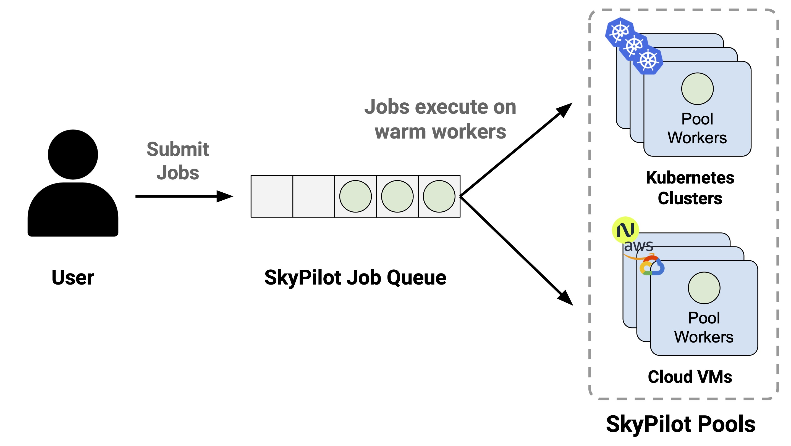
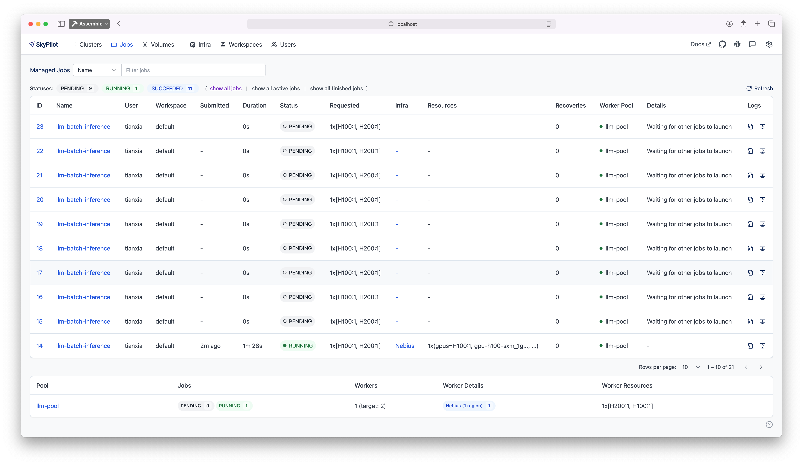
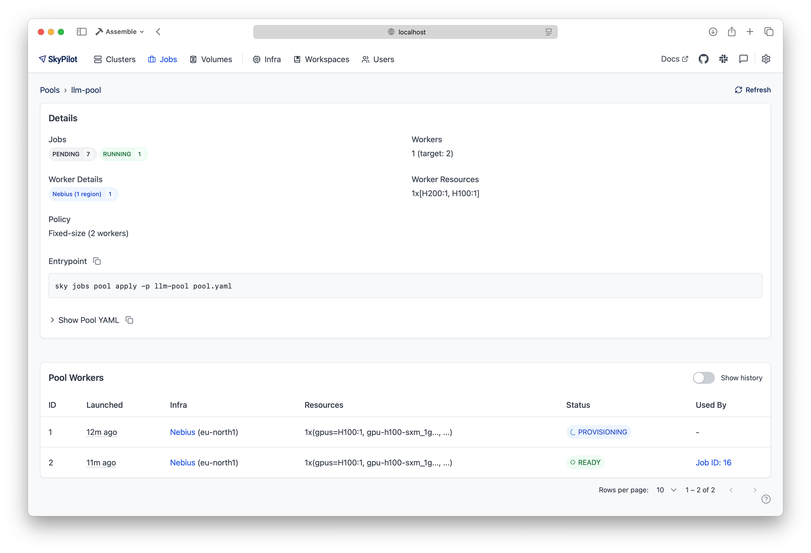

.. _pool:

Using a Pool of Workers
=======================

SkyPilot supports spawning a **pool** that launches a set of **workers** with identical environments. Jobs can be scheduled on this pool and will be assigned to workers as they become available.

Pools benefits
---------------

#. **Faster cold-starts**: Workers in the pool are **reused** across job submissions, avoiding repeated setup and saving time that would otherwise be spent provisioning and configuring instances.
#. **Consistent environments**: All workers in the pool are provisioned with the same configuration and setup, ensuring consistency across jobs.
#. **Stable resource usage**: Many jobs can be assigned to the pool at once, without worrying about the total provisioning requirements for the workload.

Use cases
----------

Pools is great for large-scale data processing tasks, that require launching many jobs whose cumulative resource requirements are too large to spawn at once. This is generally useful for any application that is easily parallelized, but some common use cases are:

#. **Batch inference**: Run batch inference jobs on a pool of workers, such as generating embeddings or backfilling data.
#. **Hyperparameter tuning**: Evaluate multiple hyperparameters in parallel on a pool of workers.

Example: :doc:`Batch Text Classification with Pools </examples/applications/pools_batch_inference>` demonstrates using pools to run parallel text classification on movie reviews with vLLM.

.. warning::

  Pools is a beta feature. Some features are not yet supported, but are on the roadmap:

  - Heterogeneous clusters (e.g., mixed H100 and H200 workers)
  - Fractional GPUs (e.g. a job requesting 0.5 GPUs)
  - Multiple jobs running concurrently on the same worker

Creating a pool
---------------

To create a pool, specify the number pool workers in a SkyPilot YAML:

.. code-block:: yaml
  :emphasize-lines: 2-4

  # pool.yaml
  pool:
    # Specify the number of workers in the pool.
    workers: 3

  resources:
    # Specify the resources for each worker.
    accelerators: H100

  file_mounts:
    /my-data:
      source: s3://my-dataset/
      mode: MOUNT

  setup: |
    # Setup commands for all workers
    echo "Setup complete!"

Notice that the :code:`pool` section is the only difference from a normal SkyPilot YAML.

.. warning::

   - You **may not** specify a :code:`run` section when creating a pool. Pool creation should be solely concerned with provisioning the workers.
   - Setup commands should be non-blocking, more details below.

The setup commands **must not be blocking**. If a long-running server is required, it should be launched in the background. The :code:`setsid` command ensures that setup processes are not terminated when the shell exits. An example using vLLM server is shown below:

.. code-block:: yaml

  setup: |
    # Start a long-running vLLM server in the background
    setsid bash -c "vllm serve $MODEL_NAME > ./vllm.log 2>&1" > /dev/null 2>&1 &

To create a pool, use :code:`sky jobs pool apply`:

.. code-block:: console

  $ sky jobs pool apply -p gpu-pool pool.yaml
  YAML to run: pool.yaml
  Pool spec:
  Worker policy:  Fixed-size (3 workers)

  Each pool worker will use the following resources (estimated):
  Considered resources (1 node):
  -------------------------------------------------------------------------------------------------------
  INFRA                 INSTANCE                         vCPUs   Mem(GB)   GPUS     COST ($)   CHOSEN
  -------------------------------------------------------------------------------------------------------
  Nebius (eu-north1)    gpu-h100-sxm_1gpu-16vcpu-200gb   16      200       H100:1   2.95          ✔
  Nebius (eu-north1)    gpu-h200-sxm_1gpu-16vcpu-200gb   16      200       H200:1   3.50
  GCP (us-central1-a)   a3-highgpu-1g                    26      234       H100:1   5.38
  -------------------------------------------------------------------------------------------------------
  Applying config to pool 'gpu-pool'. Proceed? [Y/n]:
  Launching controller for 'gpu-pool'...
  ...
  ⚙︎ Job submitted, ID: 1

  Pool name: gpu-pool
  📋 Useful Commands
  ├── To submit jobs to the pool: sky jobs launch --pool gpu-pool <yaml_file>
  ├── To submit multiple jobs:    sky jobs launch --pool gpu-pool --num-jobs 10 <yaml_file>
  ├── To check the pool status:   sky jobs pool status gpu-pool
  └── To terminate the pool:      sky jobs pool down gpu-pool

  ✓ Successfully created pool 'gpu-pool'.

The pool will be created in the background. You can submit jobs to this pool immediately. If there aren't any workers ready to run the jobs yet, the jobs will wait in the PENDING state.
Jobs will start automatically once some worker is provisioned and ready to run.

Submit jobs to a pool
----------------------

To submit jobs to the pool, create a job YAML file:

.. code-block:: yaml

  # job.yaml
  name: simple-workload

  # Always specify the resources requirements for the job. Without this 
  # specification this job will not be able to use a GPU.
  resources:
    accelerators: {H100:1, H200:1}

  run: |
    nvidia-smi

.. warning::

   - You **may not** specify a :code:`setup` section, workdir, file mounts, or storage mounts in the job YAML. This is to ensure that worker environment remains consistent across jobs.
   - Also make sure to specify the resources requirements for the job. Without this specification this job will not be able to use a GPU.

This yaml file indicates that the job (1) requires the specified :code:`resources` to run, and (2) executes the given :code:`run` command when dispatched to a worker. Then, use :code:`sky jobs launch -p <pool-name>` to submit jobs to the pool:

.. code-block:: console

  $ sky jobs launch -p gpu-pool job.yaml
  YAML to run: job.yaml
  Submitting to pool 'gpu-pool' with 1 job.
  Managed job 'simple-workload' will be launched on (estimated):
  Use resources from pool 'gpu-pool': 1x[H200:1, H100:1].
  Launching a managed job 'simple-workload'. Proceed? [Y/n]: Y
  Launching managed job 'simple-workload' (rank: 0) from jobs controller...
  ...
  ⚙︎ Job submitted, ID: 2
  ├── Waiting for task resources on 1 node.
  └── Job started. Streaming logs... (Ctrl-C to exit log streaming; job will not be killed)
  (simple-workload, pid=4150) Thu Aug 14 18:49:05 2025
  (simple-workload, pid=4150) +-----------------------------------------------------------------------------------------+
  (simple-workload, pid=4150) | NVIDIA-SMI 570.172.08             Driver Version: 570.172.08     CUDA Version: 12.8     |
  (simple-workload, pid=4150) |-----------------------------------------+------------------------+----------------------+
  (simple-workload, pid=4150) | GPU  Name                 Persistence-M | Bus-Id          Disp.A | Volatile Uncorr. ECC |
  (simple-workload, pid=4150) | Fan  Temp   Perf          Pwr:Usage/Cap |           Memory-Usage | GPU-Util  Compute M. |
  (simple-workload, pid=4150) |                                         |                        |               MIG M. |
  (simple-workload, pid=4150) |=========================================+========================+======================|
  (simple-workload, pid=4150) |   0  NVIDIA H100 80GB HBM3          On  |   00000000:0F:00.0 Off |                    0 |
  (simple-workload, pid=4150) | N/A   29C    P0             69W /  700W |       0MiB /  81559MiB |      0%      Default |
  (simple-workload, pid=4150) |                                         |                        |             Disabled |
  (simple-workload, pid=4150) +-----------------------------------------+------------------------+----------------------+
  (simple-workload, pid=4150)
  (simple-workload, pid=4150) +-----------------------------------------------------------------------------------------+
  (simple-workload, pid=4150) | Processes:                                                                              |
  (simple-workload, pid=4150) |  GPU   GI   CI              PID   Type   Process name                        GPU Memory |
  (simple-workload, pid=4150) |        ID   ID                                                               Usage      |
  (simple-workload, pid=4150) |=========================================================================================|
  (simple-workload, pid=4150) |  No running processes found                                                             |
  (simple-workload, pid=4150) +-----------------------------------------------------------------------------------------+
  ✓ Job finished (status: SUCCEEDED).
  ✓ Managed job finished: 2 (status: SUCCEEDED).

The job will be launched on one of the available workers in the pool.

.. note::

  Currently, each worker is **exclusively occupied** by a single job at a time, so the :code:`resources` specified in the job YAML should match those used in the pool YAML. Support for running multiple jobs concurrently on the same worker will be added in the future.

Scale out with multiple jobs
----------------------------

Pools support a :code:`--num-jobs` flag to conveniently submit multiple jobs at once. This is useful for scaling out a workload that can be parallelized.

Each job will be assigned a unique environment variable :code:`$SKYPILOT_JOB_RANK`, which can be used to partition the total work across each job.
Additionally, the :code:`$SKYPILOT_NUM_JOBS` environment variable will be set to the total number of jobs submitted.

For example, if you have 1000 prompts to evaluate, each job can process prompts with sequence numbers
:code:`$SKYPILOT_JOB_RANK * 100` to :code:`($SKYPILOT_JOB_RANK + 1) * 100`.

Here is a simple example:

.. code-block:: yaml

  # batch-job.yaml
  name: batch-workload

  resources:
    accelerators: {H100:1, H200:1}

  run: |
    echo "Job rank: $SKYPILOT_JOB_RANK out of $SKYPILOT_NUM_JOBS"
    echo "Processing prompts from $(($SKYPILOT_JOB_RANK * 100)) to $((($SKYPILOT_JOB_RANK + 1) * 100))"
    # Actual business logic here...
    echo "Job $SKYPILOT_JOB_RANK finished"

Use the following command to submit them to the pool:

.. code-block:: console

  $ sky jobs launch -p gpu-pool --num-jobs 10 batch-job.yaml
  YAML to run: batch-job.yaml
  Submitting to pool 'gpu-pool' with 10 jobs.
  Managed job 'batch-workload' will be launched on (estimated):
  Use resources from pool 'gpu-pool': 1x[H200:1, H100:1].
  Launching 10 managed jobs 'batch-workload'. Proceed? [Y/n]: Y
  Launching managed job 'batch-workload' (rank: 0) from jobs controller...
  ...
  Launching managed job 'batch-workload' (rank: 9) from jobs controller...
  Jobs submitted with IDs: 3,4,5,6,7,8,9,10,11,12.
  📋 Useful Commands
  ├── To stream job logs:                 sky jobs logs <job-id>
  ├── To stream controller logs:          sky jobs logs --controller <job-id>
  └── To cancel all jobs on the pool:     sky jobs cancel --pool gpu-pool

Note that the maximum concurrency is limited by the number of workers in the pool.
To enable more jobs to run simultaneously, increase the number of workers when creating the pool.

There are several things to note when submitting jobs to a pool:

- Any :code:`setup` commands or file mounts in the YAML are ignored because the workers handle setup before running the jobs.
- The :code:`resources` requirements are still respected. This should be the same as the ones used in the pool YAML.

Monitor job statuses
--------------------

You can use the job page in the dashboard to monitor the job status.

In this example, we submit 10 jobs with IDs from 3 to 12.
Only one worker is currently ready due to a resource availability issue, but the pool continues to request additional workers in the background.

Since each job requires **the entire worker cluster**, the number of concurrent jobs is limited to the number of workers. Additional jobs will remain in the **PENDING** state until a worker becomes available.

As a result, except for the 5 completed jobs, 1 job is running on the available worker, while the remaining 4 are in the PENDING state, waiting for the previous job to finish.

Clicking on the pool name will show detailed information about the pool, including its resource specification, status of each worker node, and any job currently running on it:

In this example, one worker is ready in Nebius, and another is currently provisioning.
The ready worker is running the managed job with ID 10.
The **Worker Details** section displays the current resource summary of the pool, while the **Jobs** section shows a live snapshot of all jobs associated with this pool, including their statuses and job IDs.

.. tip::

  You can use :code:`sky jobs cancel -p gpu-pool` to cancel all jobs currently running or pending on the pool.

Scaling and updating a pool
---------------------------

You can update the pool configuration with the following command:

.. code-block:: yaml
  :emphasize-lines: 3-4

  # new-pool.yaml
  pool:
    # Update the number of workers in the pool to 10
    workers: 10

  resources:
    accelerators: {H100:1, H200:1}

  file_mounts:
    /my-data-2:
      source: s3://my-dataset-2/
      mode: MOUNT

  setup: |
    # Setup commands for all workers
    echo "Setup complete!"

.. code-block:: console

  # Apply the new pool configuration
  $ sky jobs pool apply -p gpu-pool new-pool.yaml

The :code:`sky jobs pool apply` command can be used to update the configuration of an existing pool with the same name. In this example, it scales out the pool to 10 workers.

If no such pool exists, it will create a new one; this is equivalent to the behavior demonstrated in the previous example.

Pools will automatically detect changes in the worker configuration. If only the pool configuration (e.g. number of workers) is changed, the pool will be updated in place to reuse the previous workers; otherwise, if the setup, file mounts, workdir, or resources configuration is changed, new worker clusters will be created and the old ones will be terminated gradually.

You can also update the number of workers in a pool without a YAML file by using the :code:`--workers` flag:

.. code-block:: console

  $ sky jobs pool apply -p gpu-pool --workers 10

.. note::

  If there is a :code:`workdir` or :code:`file_mounts` field in the worker configuration, workers will always be recreated when the pool is updated. This is to respect any data changes in them.

Terminate a pool
----------------

After usage, the pool can be terminated with :code:`sky jobs pool down`:

.. code-block:: console

  $ sky jobs pool down gpu-pool
  Terminating pool(s) 'gpu-pool'. Proceed? [Y/n]:
  Pool 'gpu-pool' is scheduled to be terminated.

The pool will be torn down in the background, and any remaining resources will be automatically cleaned up.

.. admonition:: Coming Soon

  Some improved features are under development and will be available soon:

  - **Autoscaling**: Automatically scale down to 0 workers when idle, and scale up when new jobs are submitted.
  - **Multi-job per worker**: Support for running multiple jobs concurrently on the same worker.
  - **Fractional GPU support**: Allow jobs to request and share fractional GPU resources.

