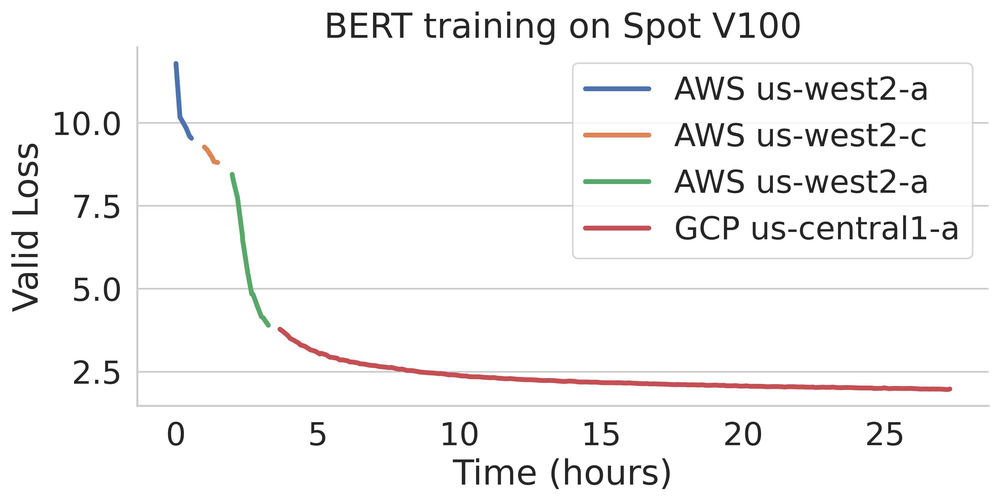

.. _spot-jobs:
Managed Spot Jobs
================================================

Sky supports managed spot jobs that can **automatically recover from preemptions**.
This feature **saves significant cost** (e.g., up to 70\% for GPU VMs) by making preemptible spot instances practical for long-running jobs.

To maximize availability, Sky automatically finds available spot resources across regions and clouds.
Here is an example of BERT training job failing over different regions across AWS and GCP.

Below are requirements for using managed spot jobs:

(1) **Mounting code and datasets**: Local file mounts/workdir are not supported. Cloud buckets should be used to hold code and datasets, which can be satisfied by using :ref:`Sky Storage <sky-storage>`.

(2) **Saving and loading checkpoints**: (For ML jobs) Application code should save checkpoints periodically to a :ref:`Sky Storage <sky-storage>`-mounted cloud bucket. For job recovery,  the program should try to reload a latest checkpoint from that path when it starts.

We explain them in detail below.

Mounting code and datasets
--------------------------------

To launch a spot job, users should upload their codebase and data to cloud buckets through :ref:`Sky Storage <sky-storage>`.
Note that the cloud buckets can be mounted to VMs in different regions/clouds and thus enable enables transparent job relaunching without user's intervention.
The YAML below shows an example.

.. code-block:: yaml

  file_mounts:
    /code:
      name: # NOTE: Fill in your bucket name
      source: /path/to/your/codebase
      persistent: true
      mode: COPY

    # If data is stored locally
    /data:
      name: # NOTE: Fill in your bucket name
      source: /path/to/your/dataset
      persistent: true
      mode: COPY

    # If data is already on S3
    /data2: s3://your-s3-bucket-name

.. note::

  Currently :ref:`workdir <sync-code-artifacts>` and :ref:`file mounts with local files <sync-code-artifacts>` are not
  supported for spot jobs. You can convert them to :ref:`Sky Storage <sky-storage>`.

Saving and loading checkpoints
--------------------------------

To allow spot recovery, another cloud bucket is typically needed for storing states of the job (e.g., model checkpoints).
Below is an example of mounting a bucket to :code:`/checkpoint`.

.. code-block:: yaml

  file_mounts:
    /checkpoint:
      name: # NOTE: Fill in your bucket name
      mode: MOUNT

The :code:`MOUNT` mode in :ref:`Sky Storage <sky-storage>` ensures the checkpoints outputted to :code:`/checkpoint` are automatically synced to a persistent bucket.
Note that the application code should save program checkpoints periodically and reload those states when the job is restarted.
This is typically achieved by reloading the latest checkpoint at the beginning of your program.

An end-to-end example
--------------------------------

Below we show an `example <https://github.com/sky-proj/sky/blob/master/examples/spot/bert_qa.yaml>`_ for fine-tuning a bert model on a question answering task with HuggingFace.

.. code-block:: yaml

  # bert_qa.yaml
  name: bert_qa

  resources:
    accelerators: V100:1
    # NOTE: `use_spot` and `spot_recovery` are optional when using `sky spot launch`.
    use_spot: true
    # When a spot cluster is preempted, this strategy recovers by first waiting for
    # the resources in the current region for a while (default: 3 minutes), and
    # then failing over to other regions and clouds, until the resources are launched.
    spot_recovery: FAILOVER

  file_mounts:
    /checkpoint:
      name: # NOTE: Fill in your bucket name
      mode: MOUNT
    /code:
      name: # NOTE: Fill in your bucket name
      # Assume your working directory is under `~/transformers`.
      # To make this example work, please run the following command:
      # git clone https://github.com/huggingface/transformers.git ~/transformers
      source: ~/transformers
      persistent: false
      mode: COPY

  setup: |
    # Fill in your wandb key: copy from https://wandb.ai/authorize
    # Alternatively, you can use `--env WANDB_API_KEY=$WANDB_API_KEY`
    # to pass the key in the command line, during `sky spot launch`.
    echo export WANDB_API_KEY=[YOUR-WANDB-API-KEY] >> ~/.bashrc

    cd /code && git checkout v4.18.0
    pip install -e .
    cd examples/pytorch/question-answering/
    pip install -r requirements.txt
    pip install wandb

  run: |
    cd /code/examples/pytorch/question-answering/
    python run_qa.py \
    --model_name_or_path bert-base-uncased \
    --dataset_name squad \
    --do_train \
    --do_eval \
    --per_device_train_batch_size 12 \
    --learning_rate 3e-5 \
    --num_train_epochs 50 \
    --max_seq_length 384 \
    --doc_stride 128 \
    --output_dir /checkpoint/bert_qa/ \
    --report_to wandb \
    --save_total_limit 10 \
    --save_steps 1000

As HuggingFace has built-in support for periodically checkpointing, we only need to pass the below arguments for setting up the output directory and frequency of checkpointing (see more on `Huggingface API <https://huggingface.co/docs/transformers/main_classes/trainer#transformers.TrainingArguments.save_steps>`_).

.. code-block:: console

    $ python run_qa.py ... --output_dir /checkpoint/bert_qa/ --save_total_limit 10 --save_steps 1000

.. note::
  You may also refer to another example `here <https://github.com/sky-proj/sky/tree/master/examples/spot/resnet_ddp>`_ for periodically checkpointing with PyTorch.

With the above changes, you are ready to launch a spot job with ``sky spot launch``!

.. code-block:: console

    $ sky spot launch -n bert-qa bert_qa.yaml

Sky will launch and start monitoring the spot job. When a preemption happens, Sky will automatically
search for resources across regions and clouds to re-launch the job.

Here are some commands for managed spot jobs. Check :code:`sky spot --help` for more details.

.. code-block:: console

    # Check the status of the spot jobs
    $ sky spot status
    Fetching managed spot job status...
    Managed spot jobs:
    ID NAME     RESOURCES     SUBMITTED   TOT. DURATION   JOB DURATION   #RECOVERIES  STATUS
    2  roberta  1x [A100:8]   2 hrs ago   2h 47m 18s      2h 36m 18s     0            RUNNING
    1  bert-qa  1x [V100:1]   4 hrs ago   4h 24m 26s      4h 17m 54s     0            RUNNING

    # Stream the logs of a running spot job
    $ sky spot logs -n bert-qa

    # Cancel a spot job by name
    $ sky spot cancel -n bert-qa

