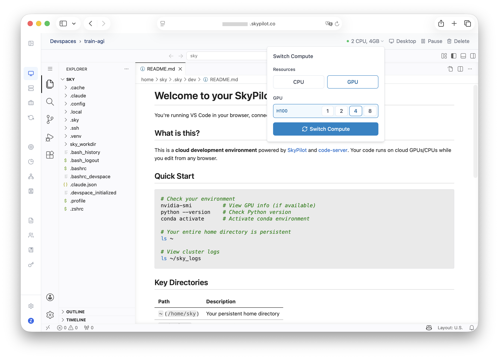
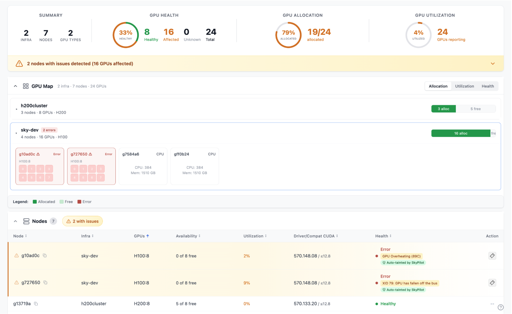
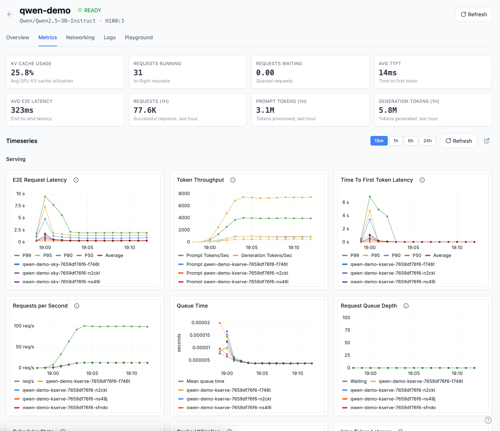
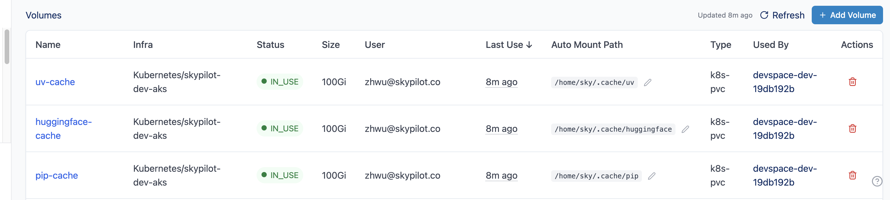

.. _skypilot-frontier-ai:

.. rst-class:: hero-title

SkyPilot for Frontier AI
========================

SkyPilot is used by AI teams of all sizes, from individual researchers to organizations running thousands of GPUs across Kubernetes, Slurm, and 20+ clouds.

For AI infra and platform teams supporting frontier AI work, **SkyPilot Platform** extends SkyPilot OSS with capabilities tuned for production at scale:

- **Researcher productivity** — persistent dev environments for engineers and AI agents; fast launches across the AI lifecycle: large-scale pre-training, SFT and RL post-training, batch inference, RL rollouts, and parallel evals.
- **Higher GPU utilization** — multi-team quotas with borrowing and preemption, fleet-wide observability, idle reclamation.
- **Less firefighting** — instant GPU failure detection and recovery across XID, NVML, NCCL, and dmesg signals, with Slack alerts.
- **Production deployments** — multi-cluster model serving (SkyServe v2), HA managed API server, encrypted secrets, SSO.

With **10× faster cluster launches**, already running at deployments of **200+ users** and **20K+ GPUs**.

.. tip::

   Interested? The SkyPilot team would love to talk to you. `Sign up here <https://forms.gle/HGGMjzvRz8Mqn9pn7>`_; takes 20 seconds.

Capabilities
------------

For researchers and AI agents
~~~~~~~~~~~~~~~~~~~~~~~~~~~~~

💻 **SkyPilot Devspaces** — Researchers spin up GPU-backed VSCode workspaces in seconds, in the browser. Run fleets of AI coding agents in parallel; dynamic CPU ↔ GPU switching with environment and code persisted; no SSH config.

🚀 **Large-scale training launches** — Coordinated provisioning across thousands of GPUs for **pre-training**, **SFT post-training**, and **RL post-training**. 5K-node training jobs in under a minute, with gang scheduling, topology/rack-aware scheduling, and high-bandwidth networking pre-wired.

.. code-block:: yaml

   resources:
     accelerators: B200:8
   num_nodes: 5000

⚡ **Fast parallel jobs and sandboxes** — Launch thousands of parallel jobs and sandboxes in seconds, for RL rollouts, parallel evals, and agent sandboxes. Tight integration with SkyPilot job groups.

For infra teams
~~~~~~~~~~~~~~~

📊 **SkyPilot GPU Manager** — Proactive and reactive health checks across the fleet, with instant GPU failure detection and auto-remediation. Catches XID errors, NVML failures, NCCL timeouts, dmesg errors, and more; taints bad nodes, recovers jobs, notifies the team.

📡 **SkyServe v2: production-ready model serving** — High-performance, multi-cluster model serving with cache-aware routing, PD disaggregation, autoscaling, rolling updates, and TLS / API-key auth. Share GPU capacity dynamically between training and serving on the same fleet.

🎯 **SkyPilot Quotas** — Per-team and per-user GPU quotas with priority, preemption, dynamic borrowing, fairness, and reclamation across the fleet.

📦 **Volumes and Auto Mounts** — Persistent storage on Kubernetes (NFS, VAST, Weka, EFS, Alluxio, host volumes). Auto Mounts attach a volume to every workload on a cluster, with no task YAML changes required.

🔔 **Notifications** — Slack alerts for GPU failures, job lifecycle events, preemptions, and cluster events. Configurable per channel, with event-type and workspace filters.

🛟 **Managed SkyPilot Service** — Fully managed, high-availability SkyPilot API server operated by the maintainers, with up to 10× faster cluster launches, SSH, CLI, and dashboard.

For security and identity
~~~~~~~~~~~~~~~~~~~~~~~~~

🔐 **Secrets Manager** — Store API keys, tokens, and credentials encrypted at rest and in transit (AES-256). Scoped per user, team, or workspace, and injected directly into Devspaces, clusters, and jobs.

🔑 **SSO with Okta, Google Workspace, OIDC** — Tie SkyPilot access to your existing identity system, with per-team and per-workspace permissions.

.. note::

   SOC 2 is available.

----

.. tip::

   Interested? The SkyPilot team would love to talk to you. `Sign up here <https://forms.gle/HGGMjzvRz8Mqn9pn7>`_; takes 20 seconds.
