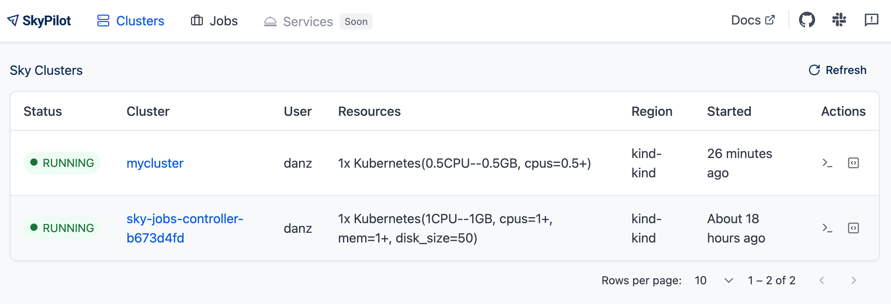
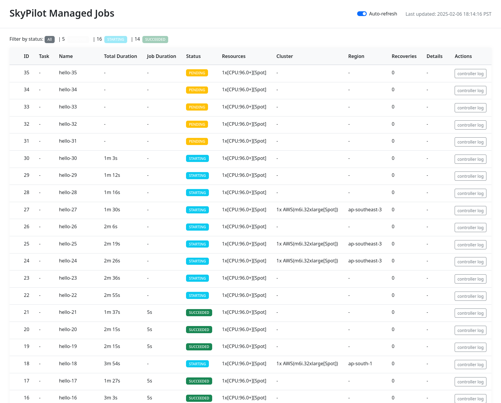

.. _quickstart:

==========
Quickstart
==========

This guide will walk you through:

- Defining a task in a simple YAML format
- Provisioning a cluster and running a task
- Using the core SkyPilot CLI commands

Be sure to complete the :ref:`installation instructions <installation>` first before continuing with this guide.

.. _hello-skypilot:

Hello, SkyPilot!
------------------

Let's define our very first task, a simple Hello, SkyPilot! program.

Create a directory from anywhere on your machine:

.. code-block:: console

  $ mkdir hello-sky
  $ cd hello-sky

.. tab-set::

  .. tab-item:: CLI
    :sync: cli

    Copy the following YAML into a ``hello_sky.yaml`` file:

    .. code-block:: yaml

      resources:
        # Optional; if left out, automatically pick the cheapest cloud.
        infra: aws
        # 8x NVIDIA A100 GPU
        accelerators: A100:8

      # Working directory (optional) containing the project codebase.
      # Its contents are synced to ~/sky_workdir/ on the cluster.
      workdir: .

      # Typical use: pip install -r requirements.txt
      # Invoked under the workdir (i.e., can use its files).
      setup: |
        echo "Running setup."

      # Typical use: make use of resources, such as running training.
      # Invoked under the workdir (i.e., can use its files).
      run: |
        echo "Hello, SkyPilot!"
        conda env list

  .. tab-item:: Python
    :sync: python

    Copy the following Python script to a ``hello_sky.py`` file:

    .. code-block:: python

      import sky
      import sys

      # List of commands to run
      commands = [
          'echo "Hello, SkyPilot!"',
          'conda env list'
      ]

      # Define a resource object.
      #   infra: (Optional) if left out, automatically pick cheapest available.
      #   accelerators: 8x NVIDIA A100 GPU
      resource = sky.Resources(infra='aws', accelerators='A100:8')

      # Define a task object.
      #   setup: Typical use: pip install -r requirements.txt
      #   run: Typical use: make use of resources, such as running training.
      #   workdir: Working directory (optional) containing the project codebase.
      #     Its contents are synced to ~/sky_workdir/ on the cluster.
      #     Both `setup` and `run` is invoked under the workdir (i.e., can use its files).
      task = sky.Task(setup='echo "Running setup."',
                      run=commands,
                      workdir='.',
                      resources=resource)

      # Launch the task.
      request_id = sky.launch(task=task, cluster_name='mycluster')

      # (Optional) stream the logs from the task to the console.
      job_id, handle = sky.stream_and_get(request_id)
      cluster_name = handle.get_cluster_name()
      returncode = sky.tail_logs(cluster_name, job_id, follow=True)

      sys.exit(returncode)

    .. tip::

      You can use the ``cluster_name`` parameter to give the cluster an easy-to-remember name. If not specified, a name is autogenerated.

      If the cluster name is an existing cluster shown in ``sky status``, the cluster will be reused.
    
    .. tip::

      Setup/run commands can get complicated when using ``if`` statements, ``for`` loops, etc. For this, we support using ``textwrap.dedent`` for multi-line commands.

      .. code-block:: python

        import sky
        import textwrap

        commands = textwrap.dedent("""\
        for i in {1..5}; do
          echo "Hello, SkyPilot!"
        done
      
        conda env list
        """)

        task = sky.Task(run=commands)

This defines a task with the following components:

- :code:`resources`: cloud resources the task must be run on (e.g., accelerators, instance type, etc.)
- :code:`workdir`: the working directory containing project code that will be synced to the provisioned instance(s)
- :code:`setup`: commands that must be run before the task is executed (invoked under workdir)
- :code:`run`: commands that run the actual task (invoked under workdir)

All these fields are optional.

Now we can launch a cluster to run a task:

.. tab-set::

  .. tab-item:: CLI
    :sync: cli

    Use :code:`sky launch`:

    .. code-block:: console

      $ sky launch -c mycluster hello_sky.yaml
    
    .. tip::

      You can use the ``-c`` flag to give the cluster an easy-to-remember name. If not specified, a name is autogenerated.

      If the cluster name is an existing cluster shown in ``sky status``, the cluster will be reused.

  .. tab-item:: Python
    :sync: python

    Run the python script:

    .. code-block:: console

      $ python hello_sky.py

.. tip::

  This may take a few minutes for the first run.  Feel free to read ahead on this guide.

By launching, SkyPilot performs much of the heavy-lifting:

- selects an appropriate cloud and VM based on the specified resource constraints;
- provisions (or reuses) a cluster on that cloud;
- syncs up the :code:`workdir`;
- executes the :code:`setup` commands; and
- executes the :code:`run` commands.

In a few minutes, the cluster will finish provisioning and the task will be executed.
The outputs will show ``Hello, SkyPilot!`` and the list of installed Conda environments.

Execute a task on an existing cluster
=====================================

Instead of launching a new cluster every time, we can execute tasks on an existing cluster:

.. tab-set::

  .. tab-item:: CLI
    :sync: cli

    Using :code:`sky exec`:

    .. code-block:: console

      $ sky exec mycluster hello_sky.yaml

    .. tip::

      Bash commands are also supported, such as:

      .. code-block:: console

        $ sky exec mycluster python train_cpu.py
        $ sky exec mycluster --gpus=A100:8 python train_gpu.py

      For interactive/monitoring commands, such as ``htop`` or ``gpustat -i``, use ``ssh`` instead (see below) to avoid job submission overheads.

  .. tab-item:: Python
    :sync: python

    Using Python:

    .. code-block:: python

      import sky
      import sys

      # Super simple task to run on a SkyPilot cluster.
      task = sky.Task(run='echo "Hello, SkyPilot!"')

      # Execute the task. Remember we launched `mycluster` before?
      request_id = sky.exec(task, cluster_name='mycluster')

      # (Optional) stream the logs from the task to the console.
      job_id, handle = sky.stream_and_get(request_id)
      cluster_name = handle.get_cluster_name()
      returncode = sky.tail_logs(cluster_name, job_id, follow=True)

      sys.exit(returncode)

The executing tasks on an existing cluster is more lightweight; it

- syncs up the :code:`workdir` (so that the task may use updated code); and
- executes the :code:`run` commands.

Provisioning and ``setup`` commands are skipped.

View all clusters
=================

Use :code:`sky status` to see all clusters (across regions and clouds) in a single table:

.. code-block:: console

  $ sky status

This may show multiple clusters, if you have created several:

.. code-block::

  NAME       INFRA                RESOURCES                                   STATUS   AUTOSTOP  LAUNCHED     
  mygcp      GCP (us-central1-a)  1x(cpus=4, mem=16, n2-standard-4, ...)      STOPPED  -         1 day ago   
  mycluster  AWS (us-east-1)      1x(gpus=A100:8, p4d.24xlarge, ...)          UP       -         4 mins ago  

See here for a list of all possible :ref:`cluster states <sky-status>`.

.. _dashboard:

Access the dashboard
====================

SkyPilot offers a dashboard for all clusters and jobs launched with SkyPilot. To open the dashboard, run :code:`sky dashboard`, which will automatically opens a browser tab for the dashboard.

.. dropdown:: Start dashboard when installing SkyPilot from source

    If you install SkyPilot from source, before starting the API server:

    * Run the following commands to generate the dashboard build:

    .. code-block:: console

      # Install all dependencies
      $ npm --prefix sky/dashboard install
      # Build
      $ npm --prefix sky/dashboard run build

    * Start the dashboard with :code:`sky dashboard`.

The clusters page example:

The managed jobs page example:

.. image:: ../images/dashboard-managed-jobs.png
  :width: 800
  :alt: Managed jobs dashboard

.. _ssh:

SSH into clusters
=================
Simply run :code:`ssh <cluster_name>` to log into a cluster:

.. code-block:: console

  $ ssh mycluster

:ref:`Multi-node clusters <dist-jobs>` work too:

.. code-block:: console

  # Assuming 3 nodes.

  # Head node.
  $ ssh mycluster

  # Worker nodes.
  $ ssh mycluster-worker1
  $ ssh mycluster-worker2

The above are achieved by adding appropriate entries to ``~/.ssh/config``.

Because SkyPilot exposes SSH access to clusters, this means clusters can be easily used inside
tools such as `Visual Studio Code Remote <https://code.visualstudio.com/docs/remote/remote-overview>`_.

Transfer files
===============

After a task's execution,  use :code:`rsync` or :code:`scp` to download files (e.g., checkpoints):

.. code-block:: console

    $ rsync -Pavz mycluster:/remote/source /local/dest  # copy from remote VM

For uploading files to the cluster, see :ref:`Syncing Code and Artifacts <sync-code-artifacts>`.

Stop/terminate a cluster
=========================

When you are done, stop the cluster:

.. tab-set::

  .. tab-item:: CLI
    :sync: cli

    Using :code:`sky stop`:

    .. code-block:: console

      $ sky stop mycluster

  .. tab-item:: Python
    :sync: python

    Using python:

    .. code-block:: python

      import sky

      request_id = sky.stop('mycluster')

      # (Optional) Wait for `sky stop` to finish.
      sky.stream_and_get(request_id)

Otherwise, terminate the cluster:

.. tab-set::

  .. tab-item:: CLI
    :sync: cli

    Using :code:`sky down`:

    .. code-block:: console

      $ sky down mycluster
  
  .. tab-item:: Python
    :sync: python

    Using python:

    .. code-block:: python

      import sky

      request_id = sky.down('mycluster')

      # (Optional) Wait for `sky down` to finish.
      sky.stream_and_get(request_id)

.. note::

    Stopping a cluster does not lose data on the attached disks (billing for the
    instances will stop while the disks will still be charged).  Those disks
    will be reattached when restarting the cluster.

    Terminating a cluster will delete all associated resources (all billing
    stops), and any data on the attached disks will be lost.  Terminated
    clusters cannot be restarted.

Find more commands that manage the lifecycle of clusters in the :ref:`CLI reference <cli>` and :ref:`SDK reference <pythonapi>`.

Scaling out
=========================

So far, we have used SkyPilot's CLI to submit work to and interact with a single cluster.
When you are ready to scale out (e.g., run 10s, 100s, or 1000s of jobs), **use** :ref:`managed jobs <managed-jobs>` **to run on auto-managed clusters**, or even spot instances.

.. tab-set::

  .. tab-item:: CLI
    :sync: cli

    Using :code:`sky jobs launch`:

    .. code-block:: console

      $ for i in $(seq 100) # launch 100 jobs
          do sky jobs launch --use-spot --detach-run --async --yes -n hello-$i hello_sky.yaml
        done

  .. tab-item:: Python
    :sync: python

    Using python:

    .. code-block:: python

      import sky
      from sky import jobs as managed_jobs

      for i in range(100):
          resource = sky.Resources(use_spot=True)
          task = sky.Task(resources=resource, run='echo "Hello, SkyPilot!"')
          managed_jobs.launch(task, name=f'hello-{i}')

After you launch the jobs, open the SkyPilot dashboard and check job status(es) in the Jobs tab.

.. code-block:: console

  $ sky dashboard # check the job status in Jobs tab.

SkyPilot can support :ref:`thousands of managed jobs <many-jobs>` running at once.

Asynchronous execution
======================

All SkyPilot CLIs and APIs are asynchronous requests, i.e. you can interrupt them at
any time and let them run in the background. For example, if you KeyInterrupt the ``sky launch`` command,
the cluster will keep provisioning in the background:

.. code-block:: console

  $ sky launch -c mycluster hello_sky.yaml
  ^C
  ⚙︎ Request will continue running asynchronously.
  ├── View logs: sky api logs 73d316ac
  ├── Or, visit: http://127.0.0.1:46580/api/stream?request_id=73d316ac
  └── To cancel the request, run: sky api cancel 73d316ac

See more details in :ref:`async`.

Next steps
-----------

Congratulations!  In this quickstart, you have launched a cluster, run a task, and interacted with SkyPilot's CLI.

Next steps:

- Adapt :ref:`Tutorial: AI Training <ai-training>` to start running your own project on SkyPilot!
- See the :ref:`Task YAML reference <yaml-spec>`, :ref:`CLI reference <cli>`, and `more examples <https://github.com/skypilot-org/skypilot/tree/master/examples>`_.
- Set up SkyPilot for a multi-user team: :ref:`Team Deployment <sky-api-server>`.

We invite you to explore SkyPilot's unique features in the rest of the documentation.
