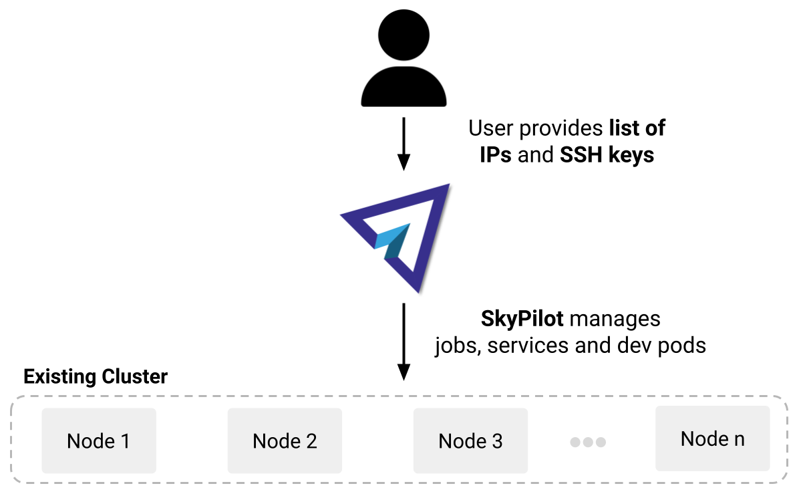
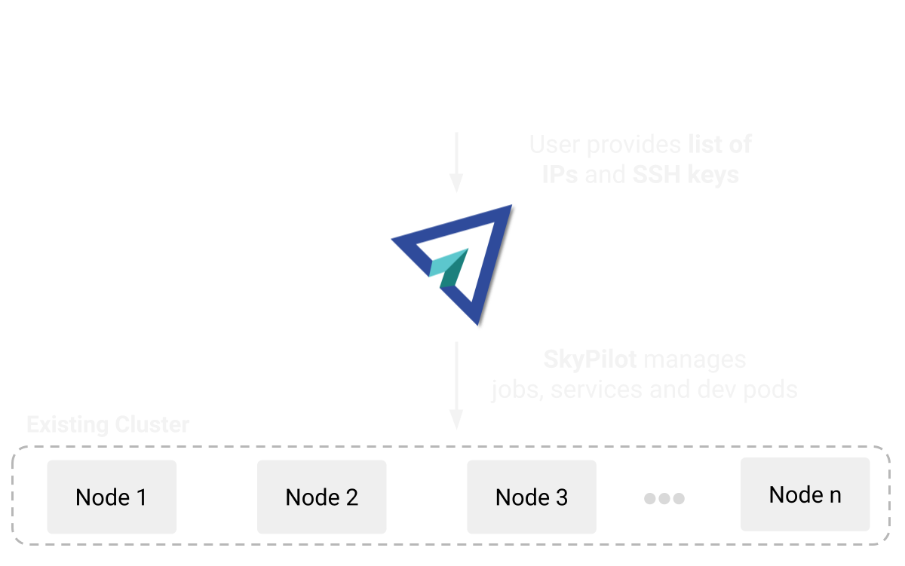

.. _overview:

========================
Overview
========================

SkyPilot combines your cloud infra --- Kubernetes
clusters, clouds and regions for VMs, and existing machines --- into a unified compute pool, which is optimized for running AI workloads.

.. image:: images/skypilot-abstractions-long-2.png
    :width: 90%
    :align: center

You can run AI workloads on this pool in a unified interface, using these core abstractions:

- Clusters
- Jobs
- Services

These abstractions support all use cases in the AI lifecycle:
Batch processing, development, (pre)training, finetuning, hyperparameter sweeps, batch inference, and online serving.

Using SkyPilot to run workloads offers these benefits:

.. dropdown:: Unified execution on any cloud, region, and cluster

    Regardless of how many clouds, regions, and clusters you have, you can use a unified interface
    to submit, run, and manage workloads on them.

    You focus on the workload, and SkyPilot alleviates the burden of
    dealing with cloud infra details and differences.

.. dropdown:: Cost and capacity optimization

    When launching a workload, SkyPilot will automatically choose the cheapest and most available infra choice in your search space.

.. dropdown:: Auto-failover across infra choices

    When launching a workload, you can give SkyPilot a search space of infra
    choices --- as unrestricted or as specific as you like.

    If an infra choice has no capacity,
    SkyPilot automatically falls back to the next best choice in your infra search space.

.. dropdown:: No cloud lock-in

    Should you add infra choices (e.g., a new cloud, region, or cluster) in the future, your existing workloads can easily run on them.
    No complex migration or workflow changes.
    See the underlying :ref:`Sky Computing <sky-computing>` vision.

.. _concept-dev-clusters:

Clusters
------------

A *cluster* is SkyPilot's core resource unit: one or more VMs or Kubernetes pods in the same location.

You can use ``sky launch`` to launch a cluster:

.. tab-set::

    .. tab-item:: CLI
        :sync: cli

        .. code-block:: console

            $ sky launch
            $ sky launch --gpus L4:8
            $ sky launch --num-nodes 10 --cpus 32+
            $ sky launch --down cluster.yaml
            $ sky launch --help  # See all flags.

    .. tab-item:: Python
        :sync: python

        .. code-block:: python

            import sky
            task = sky.Task().set_resources(sky.Resources(accelerators='L4:8'))
            sky.launch(task, cluster_name='my-cluster')

You can do the following with a cluster:

- SSH into any node
- Connect VSCode/IDE to it
- Submit and queue many jobs on it
- Have it automatically shut down or stop to save costs
- Easily launch and use many virtual, ephemeral clusters

Optionally, you can bring your custom Docker or VM image when launching, or use SkyPilot's sane defaults, which configure the correct CUDA versions for different GPUs.

Note that a SkyPilot cluster is a *virtual* collection of either cloud instances, or pods
launched on the *physical* clusters you bring to SkyPilot (:ref:`Kubernetes
clusters <concept-kubernetes-clusters>` or :ref:`existing machines
<concept-existing-machines>`).

See :ref:`quickstart` and :ref:`dev-cluster` to get started.

.. _concept-jobs:

Jobs
------------

A *job* is a program you want to run. Two types of jobs are supported:

.. list-table::
   :widths: 50 50
   :header-rows: 1
   :align: center

   * - **Jobs on Clusters**
     - **Managed Jobs**
   * - Usage: ``sky exec``
     - Usage: ``sky jobs launch``
   * - Jobs are submitted to an existing cluster and reuse that cluster's setup.
     - Each job runs in its own temporary cluster, with auto-recovery.
   * - Ideal for interactive development and debugging on an existing cluster.
     - Ideal for jobs requiring recovery (e.g., spot instances) or scaling to many parallel jobs.

A job can contain one or :ref:`more <pipeline>` *tasks*. In most cases, a job has just one task; we'll refer to them interchangeably.

.. _concept-jobs-on-dev-cluster:

Jobs on clusters
~~~~~~~~~~~~~~~~~~~~~~~~~~~~~~~

You can use ``sky exec`` to queue and run jobs on an existing cluster.
This is ideal for interactive development, reusing a cluster's setup.

See :ref:`job-queue` to get started.

.. tab-set::

    .. tab-item:: CLI
        :sync: cli

        .. code-block:: bash

            sky exec my-cluster --gpus L4:1 --workdir=. -- python train.py
            sky exec my-cluster train.yaml  # Specify everything in a YAML.

            # Fractional GPUs are also supported.
            sky exec my-cluster --gpus L4:0.5 -- python eval.py

            # Multi-node jobs are also supported.
            sky exec my-cluster --num-nodes 2 -- hostname

    .. tab-item:: Python
        :sync: python

        .. code-block:: python

            # Assume you have 'my-cluster' already launched.

            # Queue a job requesting 1 GPU.
            train = sky.Task(run='python train.py').set_resources(
                sky.Resources(accelerators='L4:1'))
            train = sky.Task.from_yaml('train.yaml')  # Or load from a YAML.
            sky.exec(train, cluster_name='my-cluster')

            # Queue a job requesting 0.5 GPU.
            eval = sky.Task(run='python eval.py').set_resources(
                sky.Resources(accelerators='L4:0.5'))
            sky.exec(eval, cluster_name='my-cluster')

.. _concept-managed-jobs:

Managed jobs
~~~~~~~~~~~~~~~~~~~~~~~~~~~~~~~~~~~~~~~~~~~~~

*Managed jobs* automatically provision a temporary cluster for each job and handle
auto-recovery. A lightweight jobs controller is used to offer hands-off monitoring and recovery.
You can use ``sky jobs launch`` to launch managed jobs.

Managed jobs are especially ideal for running jobs on preemptible spot instances (e.g.,
finetuning, batch inference). Spot GPUs can typically save 3--6x costs. They are also
ideal for scaling to many parallel jobs.

Suggested pattern: Use clusters to interactively develop and debug your code first, and then
use managed jobs to run them at scale.

See :ref:`managed-jobs` and :ref:`many-jobs` to get started.

.. _concept-services:

Services
--------

A *service* is for AI model serving.
A service can have one or more replicas, potentially spanning across locations (regions, clouds, clusters), pricing models (on-demand, spot, etc.), or even GPU types.

See :ref:`sky-serve` to get started.

Bring your own compute
-------------------------------------------------------------------

SkyPilot easily connects to your existing infra---Kubernetes clusters, clouds, or on-prem machines---using each infra's native authentication
(kubeconfig, cloud credentials, SSH).

.. _concept-kubernetes-clusters:

Kubernetes clusters
~~~~~~~~~~~~~~~~~~~~~

You can bring existing Kubernetes clusters, including managed clusters (e.g.,
EKS, GKE, AKS) or on-prem ones, into SkyPilot.  Auto-failover
between multiple clusters is also supported.

.. image:: images/k8s-skypilot-architecture-light.png
    :width: 45%
    :align: center
    :class: no-scaled-link, only-light

.. image:: images/k8s-skypilot-architecture-dark.png
    :width: 45%
    :align: center
    :class: no-scaled-link, only-dark

Example usage:

.. tab-set::

    .. tab-item:: CLI
        :sync: cli

        .. code-block:: console

            $ sky launch --infra k8s  # Use any available Kubernetes context.
            $ # Or use a particular context:
            $ sky launch --infra k8s/my-cluster1
            $ sky launch --infra k8s/my-cluster2

    .. tab-item:: Python
        :sync: python

        .. code-block:: python

            import sky
            task = sky.Task().set_resources(sky.Resources(
                infra='k8s',  # Use any available Kubernetes context.
                # Or use a particular context:
                # infra='k8s/my-cluster1',
                # infra='k8s/my-cluster2',
            ))
            sky.launch(task)

See :ref:`kubernetes-overview`.

.. _concept-cloud-vms:

Cloud VMs
~~~~~~~~~~~~~~~~~~~~~~~~~~~~~~~

SkyPilot can launch VMs on the clouds and regions you have access to.
Run ``sky check`` to check access.

SkyPilot supports most major cloud providers. See :ref:`cloud-account-setup` for details.

.. raw:: html

   

   <picture>
      
      
   </picture>
   

By default, SkyPilot reuses your existing cloud authentication methods.  Optionally, you can also :ref:`set up <cloud-permissions>` specific roles, permissions, or service accounts for SkyPilot to use.

Example usage:

.. tab-set::

    .. tab-item:: CLI
        :sync: cli

        .. code-block:: console

            $ sky launch --infra aws  # Use any available region/zone within this cloud.
            $ sky launch --infra gcp
            $ sky launch --infra azure
            $ sky launch --infra nebius
            $ sky launch --infra runpod
            $ sky launch --infra lambda
            # ... Or any other supported cloud.

            # Use a particular region.
            $ sky launch --infra aws/us-east-1
            $ sky launch --infra gcp/us-central1

            # Use a particular zone.
            $ sky launch --infra aws/us-east-1/us-east-1a

    .. tab-item:: Python
        :sync: python

        .. code-block:: python

            import sky
            task = sky.Task().set_resources(sky.Resources(
                infra='aws',  # Use any available region/zone within this cloud.
                # infra='gcp',
                # infra='azure',
                # infra='nebius',
                # infra='runpod',
                # infra='lambda',
                # ... Or any other supported cloud.

                # Use a particular region:
                # infra='aws/us-east-1',
                # infra='gcp/us-central1',

                # Use a particular zone:
                # infra='aws/us-east-1/us-east-1a',
            ))
            sky.launch(task)

.. _concept-existing-machines:

Existing machines
~~~~~~~~~~~~~~~~~~~~~

If you have existing machines, i.e., a list of IP addresses you can SSH into, you can bring them into SkyPilot.

Example usage:

.. tab-set::

    .. tab-item:: CLI
        :sync: cli

        .. code-block:: console

            $ sky launch --infra ssh  # Use any available SSH node pool.
            $ sky launch --infra ssh/my-node-pool  # Use a particular SSH node pool.

    .. tab-item:: Python
        :sync: python

        .. code-block:: python

            import sky
            task = sky.Task().set_resources(sky.Resources(
                infra='ssh',  # Use any available SSH node pool.
                # infra='ssh/my-node-pool',  # Use a particular SSH node pool.
            ))
            sky.launch(task)

See :ref:`Using Existing Machines <existing-machines>`.

SkyPilot's cost and capacity optimization
-------------------------------------------------------------------

Whenever new compute is needed for a cluster, job, or service,
SkyPilot's provisioner natively optimizes for cost and capacity, choosing the infra option that is the cheapest and available.

For example, if you want to launch a cluster with 8 A100 GPUs, SkyPilot will try all infra
options in the given search space in the "cheapest and available" order,
with auto-failover:

.. figure:: https://blog.skypilot.co/ai-on-kubernetes/images/failover.png
   :width: 95%
   :align: center
   :alt: SkyPilot auto-failover
   :class: no-scaled-link

As such, SkyPilot users no longer need to worry about specific infra details, manual retry, or manual setup.
Workloads also obtain higher GPU capacity and cost savings.

Users can specify each workload's search space. It can be as flexible or as specific as desired. Example search spaces that can be specified:

- Use the cheapest and available GPUs out of a set, ``{A10g:8, A10:8, L4:8, A100:8}``
- Use my Kubernetes cluster or any accessible clouds (pictured above)
- Use either a spot or on-demand H100 GPU
- Use AWS's five European regions only
- Use a specific zone, region, or cloud

Optimization is performed within the search space.
See :ref:`auto-failover` for details.

Use SkyPilot locally or deploy for a team
----------------------------------------------------------

SkyPilot can be used locally or deployed as a centralized API server for your team.

Team deployment enables you to share and manage compute resources across many users:

- **Deploy once and use anywhere**: Deploy a SkyPilot API server in Kubernetes or on a cloud VM and access it anywhere.
- **Resource sharing in a team**: Team members can share resources with each other.
- **Easy onboarding for new members**: Users can run SkyPilot commands without setting up local cloud credentials.
- **Global view and control**: Admins obtain a single pane of glass for the entire team's compute resources---across clusters and regions.

See :ref:`sky-api-server` for details.
