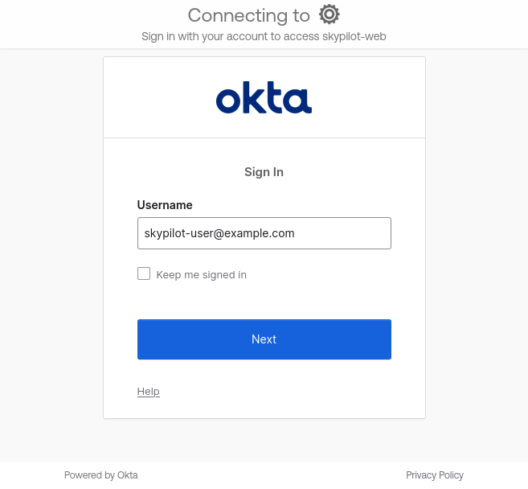
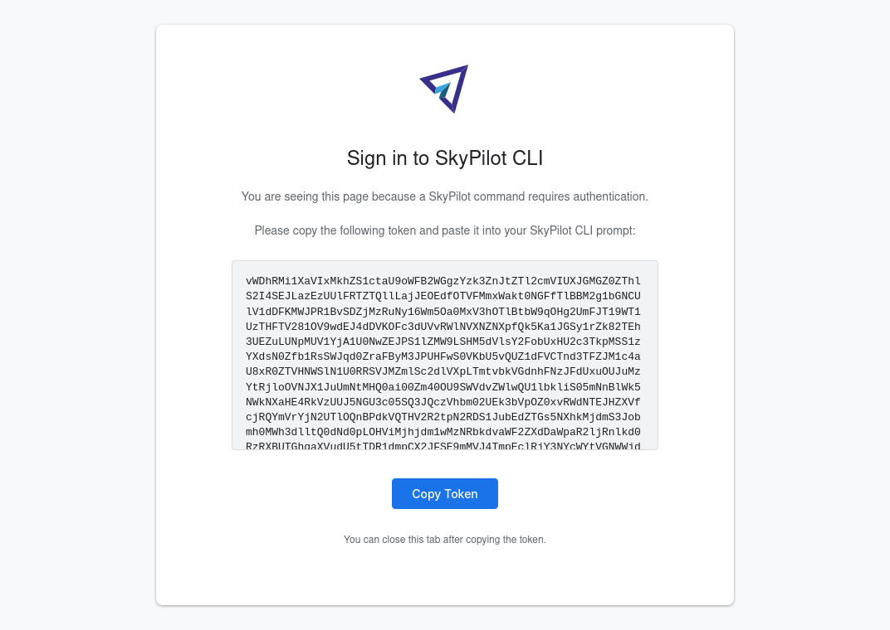

.. _api-server-auth-proxy:

Using an Auth Proxy with the SkyPilot API Server
================================================

You can deploy the SkyPilot API server behind an web authentication proxy, such as `OAuth2 Proxy <https://oauth2-proxy.github.io/oauth2-proxy/>`__, to use SSO providers such as :ref:`Okta <oauth2-proxy-okta>` or Google Workspace.

The SkyPilot implementation is flexible and will work with most cookie-based browser auth proxies. See :ref:`auth-proxy-user-flow` and :ref:`auth-proxy-byo` for details. To set up Okta, see :ref:`oauth2-proxy-okta`.

.. image:: ../../../images/client-server/auth-proxy-user-flow.svg
    :alt: SkyPilot with auth proxy
    :align: center
    :width: 80%

.. _auth-proxy-user-flow:

User flow
---------

While logging into an API server, SkyPilot will attempt to detect an auth proxy. If detected, the user must log in via a browser:

.. code-block:: console

    $ sky api login
    Enter your SkyPilot API server endpoint: http://a.b.c.d
    Authentication is needed. Please visit this URL to get a token:

    http://a.b.c.d/token

    Paste the token:

Opening ``http://a.b.c.d/token`` in the browser will force the user to authenticate as required by the auth proxy.

After authentication, the user will be redirected to the SkyPilot token page:

Copy and paste the token into the terminal to save the auth for the SkyPilot CLI.

.. code-block:: console

    ...

    http://a.b.c.d/token

    Paste the token: eyJfb2F1dGgyX3Byb3h5IjogInVYcFRTTGZGSEVYeHVGWXB2NEc4dHNKTzVET253YkRVVEJ5SkVFM1cxYkg1V29TQVhSRk4tLXg1NFotT1hab0ZsV1BMUEJicTE2NXZmZmdWQ0FrVnQtMktlM0hpenczOWhLLTRMZ3...
    Logged into SkyPilot API server at: http://a.b.c.d
    └── Dashboard: http://a.b.c.d/dashboard

This will copy the relevant auth cookies from the browser into the CLI.

SkyPilot will use the user info passed by the auth proxy in your SkyPilot API server.

.. image:: ../../../images/client-server/cluster-users.png
    :alt: User emails in the SkyPilot dashboard
    :align: center
    :width: 70%

.. _oauth2-proxy-okta:

Setting up OAuth2 Proxy with Okta
---------------------------------

The SkyPilot API server helm chart can also deploy and configure `OAuth2 Proxy <https://oauth2-proxy.github.io/oauth2-proxy/>`__ to provide an out-of-the-box auth proxy setup.

To integrate with Okta, OAuth2 Proxy uses OpenID Connect (OIDC) and follows the `Authorization Code flow <https://developer.okta.com/docs/guides/implement-grant-type/authcode/main/>`__ recommended by Okta.

Here's how to set it up:

Create application in Okta
~~~~~~~~~~~~~~~~~~~~~~~~~~

1. From your Okta admin panel, navigate to **Applications > Applications**, then click the **Create App Integration** button.

   * **Sign-in method:** ``OIDC - OpenID Connect``
   * **Application type:** ``Web Application``

.. image:: ../../../images/client-server/okta-setup.png
    :alt: SkyPilot token page
    :align: center
    :width: 80%

2. Configure the application:

   * **App integration name:** ``SkyPilot API Server`` or any other name.
   * **Sign-in redirect URIs:** ``<ENDPOINT>/oauth2/callback``, where ``<ENDPOINT>`` is your API server endpoint. e.g. ``http://skypilot.example.com/oauth2/callback``
   * **Assignments > Controlled access:** ``Allow everyone in your organization to access``, unless you want to limit access to select groups.

3. Click **Save**. You will need the Client ID and a Client Secret in the next step.

Deploy in Helm
~~~~~~~~~~~~~~

Set up the environment variables for your API server deployment. ``NAMESPACE`` and ``RELEASE_NAME`` should be set to the currently installed namespace and release:

.. code-block:: bash

    NAMESPACE=skypilot # TODO: change to your installed namespace
    RELEASE_NAME=skypilot # TODO: change to your installed release name

Use ``helm upgrade`` to redeploy the API server helm chart with the ``skypilot-oauth2-proxy`` deployment. Replace ``<CLIENT ID>`` and ``<CLIENT SECRET>`` with the values from the Okta admin console above, and ``<OKTA URL>`` with your Okta login URL.

.. code-block:: console

    $ # --reuse-values is critical to keep the old values that aren't being updated here.
    $ helm upgrade -n $NAMESPACE $RELEASE_NAME skypilot/skypilot-nightly --devel --reuse-values \
      --set ingress.oauth2-proxy.enabled=true \
      --set ingress.oauth2-proxy.oidc-issuer-url=https://<OKTA URL>.okta.com \
      --set ingress.oauth2-proxy.client-id=<CLIENT ID> \
      --set ingress.oauth2-proxy.client-secret=<CLIENT SECRET>

To make sure it's working, visit your endpoint URL in a browser. You should be redirected to Okta to sign in.

Now, you can use ``sky api login -e <ENDPOINT>`` to go though the login flow for the CLI.

Okta integration FAQ
~~~~~~~~~~~~~~~~~~~~

* I'm getting a `400 Bad Request error <https://support.okta.com/help/s/article/The-redirect-uri-parameter-must-be-an-absolute-URI?language=en_US>`__  from Okta when I open the endpoint URL in a browser.

  Your proxy may be configured to redirect to a different URL (e.g., changing the URL from ``http`` to ``https``). Make sure to set the ``Sign-in redirect URIs`` in Okta application settings to all possible URLs that your proxy may redirect to, including HTTP and HTTPS endpoints.

.. _auth-proxy-byo:

Optional: Bring your own auth proxy
-----------------------------------

Under the hood, SkyPilot uses cookies just like a browser to authenticate to an auth proxy. This means that most web authentication proxies should work with the SkyPilot API server. This can be convenient if you already have a standardized auth proxy setup for services you deploy.

To bring your own auth proxy, just configure it in front of the underlying SkyPilot API server, just like any other web application. Then, use the proxy's address as the API server endpoint.

To log into the CLI, use ``sky api login`` as normal - it should automatically detect the auth proxy and redirect you into the special login flow.

During the login flow, the token provided by the web login will encode the cookies used for authentication. By pasting this into the CLI, the CLI will also be able to authenticate using the cookies.

.. image:: ../../../images/client-server/auth-proxy-internals.svg
    :alt: SkyPilot auth proxy architecture
    :align: center
    :width: 100%

.. note::

    If your auth proxy is not automatically detected, try using ``sky api login --cookies`` to force auth proxy mode.

If the ``X-Auth-Request-Email`` header is set by your auth proxy, SkyPilot will use it as the username in all requests.
