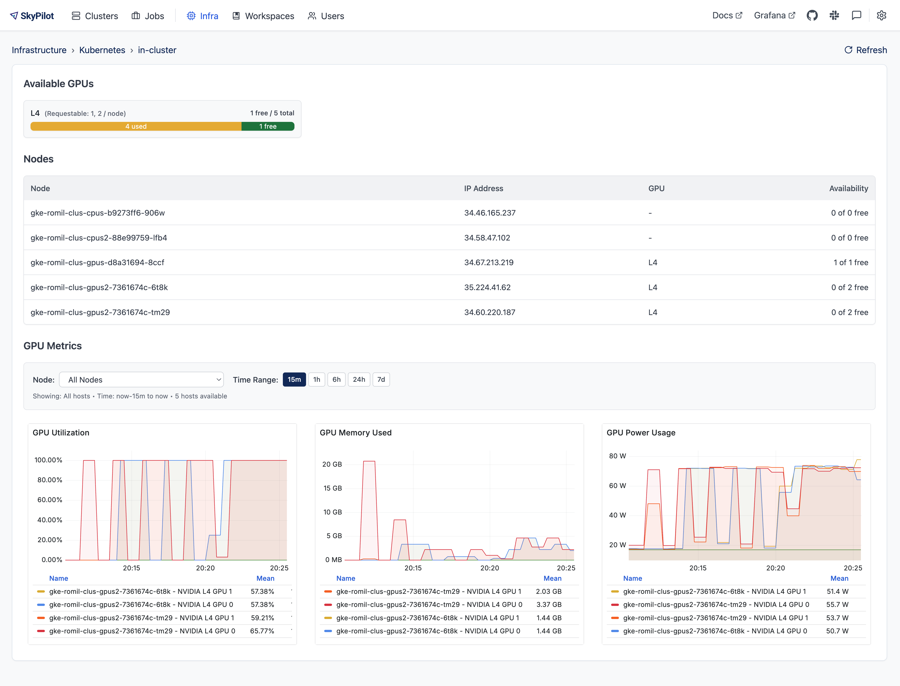

.. _api-server-gpu-metrics-setup:

Monitoring Cluster-wide GPU Metrics
===================================

SkyPilot provides native integration with NVIDIA DCGM to surface
real-time GPU metrics directly in the SkyPilot dashboard.

Prerequisites
-------------

Before you begin, make sure your Kubernetes cluster meets the following
requirements:

* **NVIDIA GPUs** are available on your worker nodes.
* The `NVIDIA device plugin <https://github.com/NVIDIA/k8s-device-plugin>`__
  and the NVIDIA **GPU Operator** are installed.
* **DCGM-Exporter** is running on the cluster and exposes metrics on
  port ``9400``.  Most GPU Operator installations already deploy DCGM-Exporter for you.

If this is the Kubernetes cluster you will be deploying the SkyPilot API server on, these
are the only prerequisites. Otherwise, make sure to also helm install the SkyPilot Prometheus
server using the following command:

.. code-block:: bash

    helm upgrade --install skypilot skypilot/skypilot-prometheus-server --devel \
     --namespace skypilot \
     --create-namespace

Set up DCGM metrics scraping
----------------------------

Deploy the SkyPilot API server with GPU metrics enabled:

.. code-block:: bash

   helm upgrade --install skypilot skypilot/skypilot-nightly --devel \
     --namespace skypilot \
     --create-namespace \
     --reuse-values \
     --set apiService.metrics.enabled=true \
     --set prometheus.enabled=true \
     --set grafana.enabled=true

The flags do the following:

* ``apiService.metrics.enabled`` – turn on the ``/metrics`` endpoint in the
  SkyPilot API server.
* ``prometheus.enabled`` – deploy a Prometheus instance pre-configured to
  scrape both the SkyPilot API server and DCGM-Exporter.
* ``grafana.enabled`` – deploy Grafana with an out-of-the-box dashboard that will be embedded in the SkyPilot dashboard.

What metrics are exposed?
---------------------------

By default, the SkyPilot dashboard exposes the following metrics:

* GPU utilization
* GPU memory usage
* GPU power usage

However, all `metrics <https://github.com/NVIDIA/dcgm-exporter/blob/main/etc/dcp-metrics-included.csv>`__ exported by DCGM exporter
can be accessed via Prometheus/Grafana including GPU errors, NVLink stats and more.
