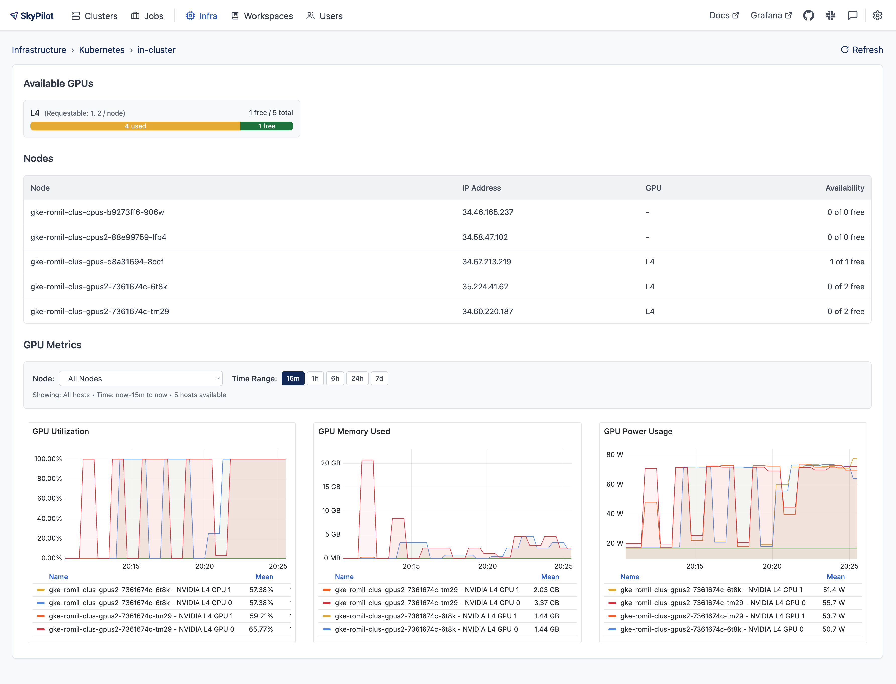

.. _api-server-gpu-metrics-setup:

Monitoring Cluster-wide GPU Metrics
===================================

SkyPilot provides native integration with NVIDIA DCGM to surface
real-time GPU metrics directly in the SkyPilot dashboard.

Prerequisites
-------------

Before you begin, make sure your Kubernetes cluster meets the following
requirements:

* **NVIDIA GPUs** are available on your worker nodes.
* The `NVIDIA device plugin <https://github.com/NVIDIA/k8s-device-plugin>`_ or the NVIDIA **GPU Operator** is installed.
* **DCGM-Exporter** is running on the cluster and exposes metrics on
  port ``9400``.  Most GPU Operator installations already deploy DCGM-Exporter for you.
* `Node Exporter <https://prometheus.io/docs/guides/node-exporter/>`_ is running on the cluster and exposes metrics on port ``9100``. This is required only if you want to monitor the CPU and Memory metrics.

Check the dcgm exporter setup
~~~~~~~~~~~~~~~~~~~~~~~~~~~~~

Verify that Prometheus scrape annotations are correctly configured for DCGM-Exporter.

1. Check whether the DCGM-Exporter Pod has the required Prometheus scrape annotations:

.. code-block:: console

    kubectl get pod $POD_NAME --namespace $NAMESPACE -o jsonpath='{.metadata.annotations}'

where ``$POD_NAME`` is the DCGM-Exporter Pod name and ``$NAMESPACE`` is its namespace. For `CoreWeave managed Kubernetes clusters <https://docs.coreweave.com/docs/products/cks>`_, the namespace is ``cw-exporters``.

Confirm the following annotations exist:

.. code-block:: console

    prometheus.io/scrape: "true"
    prometheus.io/port: "9400"
    prometheus.io/path: "/metrics"

If the Pod already has these annotations, skip the rest of this section.

2. If not, check whether a Service for DCGM-Exporter exists:

.. code-block:: console

    kubectl get svc -n $NAMESPACE | grep "dcgm-exporter"

where ``$NAMESPACE`` is the DCGM-Exporter namespace.

2.1 If the Service exists, verify its Prometheus scrape annotations:

.. code-block:: console

    kubectl get svc $SERVICE_NAME -n $NAMESPACE -o jsonpath='{.metadata.annotations}'

Confirm the following annotations exist:

.. code-block:: console

    prometheus.io/scrape: "true"
    prometheus.io/port: "9400"
    prometheus.io/path: "/metrics"

If any are missing, edit the Service to add them.

.. code-block:: console

    kubectl edit svc $SERVICE_NAME -n $NAMESPACE

2.2 If the Service does not exist, create it:

.. code-block:: console

    kubectl create -f https://raw.githubusercontent.com/skypilot-org/skypilot/refs/heads/master/examples/metrics/dcgm_service.yaml -n $NAMESPACE

where ``$NAMESPACE`` is the DCGM-Exporter namespace.

Check the node exporter setup
~~~~~~~~~~~~~~~~~~~~~~~~~~~~~

Verify that Prometheus scrape annotations are correctly configured for Node Exporter.

1. Check whether the Node Exporter Pod has the required Prometheus scrape annotations:

.. code-block:: console

    kubectl get pod $POD_NAME --namespace $NAMESPACE -o jsonpath='{.metadata.annotations}'

where ``$POD_NAME`` is the Node Exporter Pod name and ``$NAMESPACE`` is its namespace. For `CoreWeave managed Kubernetes clusters <https://docs.coreweave.com/docs/products/cks>`_, the namespace is ``cw-exporters``.

Confirm the following annotations exist:

.. code-block:: console

    prometheus.io/scrape: "true"
    prometheus.io/port: "9100"
    prometheus.io/path: "/metrics"

If the Pod already has these annotations, skip the rest of this section.

2. If not, check whether a Service for Node Exporter exists:

.. code-block:: console

    kubectl get svc -n $NAMESPACE | grep "node-exporter"

where ``$NAMESPACE`` is the Node Exporter namespace.

2.1 If the Service exists, verify its Prometheus scrape annotations:

.. code-block:: console

    kubectl get svc $SERVICE_NAME -n $NAMESPACE -o jsonpath='{.metadata.annotations}'

Confirm the following annotations exist:

.. code-block:: console

    prometheus.io/scrape: "true"
    prometheus.io/port: "9100"
    prometheus.io/path: "/metrics"

If any are missing, edit the Service to add them.

.. code-block:: console

    kubectl edit svc $SERVICE_NAME -n $NAMESPACE

2.2 If the Service does not exist, create it:

.. code-block:: console

    kubectl create -f https://raw.githubusercontent.com/skypilot-org/skypilot/refs/heads/master/examples/metrics/node_exporter_service.yaml -n $NAMESPACE

where ``$NAMESPACE`` is the Node Exporter namespace.

Prometheus setup
~~~~~~~~~~~~~~~~

In the cluster where you deploy the API server, Prometheus is installed automatically as part of :ref:`api-server-setup-dcgm-metrics-scraping`.

For other Kubernetes clusters (external clusters), deploy Prometheus manually. By default, SkyPilot scrapes metrics from external clusters through a Service named ``skypilot-prometheus-server`` in the ``skypilot`` namespace. If your Prometheus is deployed under a different namespace, service name, or port, set the :ref:`metrics.prometheus <config-yaml-metrics-prometheus>` fields in the SkyPilot config accordingly.

First, create a ``prometheus-values.yaml`` file with the following configuration:

.. literalinclude:: ../../../../../examples/metrics/prometheus-values.yaml
   :language: yaml

Then install Prometheus using ``skypilot-prometheus`` as the release name (this creates the required ``skypilot-prometheus-server`` service):

.. code-block:: bash

    helm repo add prometheus-community https://prometheus-community.github.io/helm-charts
    helm repo update
    helm upgrade --install skypilot-prometheus prometheus-community/prometheus \
      --namespace skypilot \
      --create-namespace \
      -f prometheus-values.yaml

Verify the service was created:

.. code-block:: bash

    kubectl get svc skypilot-prometheus-server -n skypilot

Refer to the `Prometheus helm chart values <https://github.com/prometheus-community/helm-charts/blob/main/charts/prometheus/values.yaml>`_ for additional configuration options.

.. note::

    Do not use the Prometheus Operator (kube-prometheus-stack) for GPU metrics.
    The Prometheus Operator adds an ``exported_`` prefix to pod and namespace labels,
    which breaks the PromQL queries used by SkyPilot.

If you are using the Nebius Kubernetes cluster, refer to :ref:`api-server-gpu-metrics-setup-nebius` for how to setup the GPU metrics.

.. _api-server-setup-dcgm-metrics-scraping:

Set up DCGM metrics scraping
----------------------------

Deploy the SkyPilot API server with GPU metrics enabled:

.. code-block:: bash

   helm upgrade --install skypilot skypilot/skypilot-nightly --devel \
     --namespace skypilot \
     --create-namespace \
     --reuse-values \
     --set apiService.metrics.enabled=true \
     --set prometheus.enabled=true \
     --set grafana.enabled=true

The flags do the following:

* ``apiService.metrics.enabled`` – turn on the ``/metrics`` endpoint in the
  SkyPilot API server.
* ``prometheus.enabled`` – deploy a Prometheus instance pre-configured to
  scrape both the SkyPilot API server and DCGM-Exporter.
* ``grafana.enabled`` – deploy Grafana with an out-of-the-box dashboard that will be embedded in the SkyPilot dashboard.

.. _api-server-gpu-metrics-slurm:

GPU metrics for Slurm clusters
------------------------------

Slurm clusters can surface GPU metrics in the same dashboard. Instead of
scraping the cluster directly, the API server runs ``GET /federate`` against
a Prometheus of yours *from the cluster's login node* over SSH, so the API
server never needs network access to the Prometheus.

Requirements:

* **DCGM-Exporter** runs on each GPU node (port ``9400``) and **Node
  Exporter** (port ``9100``, optional, for CPU/memory metrics) — for
  example as containers or system services, since there is no Kubernetes on
  the nodes.
* A **Prometheus** (or compatible store, e.g. VictoriaMetrics) scrapes those
  exporters and is reachable from a login node.
* The ``Hostname`` label on DCGM series must match the Slurm node name
  (``sinfo -N``) — the dashboard joins metrics to nodes by hostname. When
  running DCGM-Exporter in Docker, pass ``--hostname "$(hostname)"``, since
  the container otherwise reports its container ID as the hostname.

Opt a cluster in via :ref:`config <config-yaml-slurm-cluster-configs>`:

.. code-block:: yaml

  slurm:
    cluster_configs:
      mycluster1:
        prometheus:
          url: http://prometheus.internal:9090

If the Prometheus aggregates metrics from several clusters, scope each
cluster's slice with ``filter`` (label matchers applied server-side), and use
``via`` when the Prometheus is reachable from only some login nodes:

.. code-block:: yaml

  slurm:
    cluster_configs:
      mycluster1:
        prometheus:
          url: http://prometheus.internal:9090
          filter:
            cluster: mycluster1-fleet
      mycluster2:
        prometheus:
          url: http://prometheus.internal:9090
          # mycluster2's login node cannot reach the Prometheus; run the
          # /federate request on mycluster1's login node instead. The
          # series are still attributed to mycluster2.
          via: mycluster1
          filter:
            cluster: mycluster2-fleet

Clusters sharing a ``url`` automatically exclude each other's filtered
slices, so a fleet is never attributed to two clusters.

What metrics are exposed?
---------------------------

By default, the SkyPilot dashboard exposes the following metrics:

* GPU utilization
* GPU memory usage
* GPU power usage
* GPU temperature
* CPU utilization
* Memory usage

However, all `metrics <https://github.com/NVIDIA/dcgm-exporter/blob/main/etc/dcp-metrics-included.csv>`__ exported by DCGM exporter
can be accessed via Prometheus/Grafana including GPU errors, NVLink stats and more.
