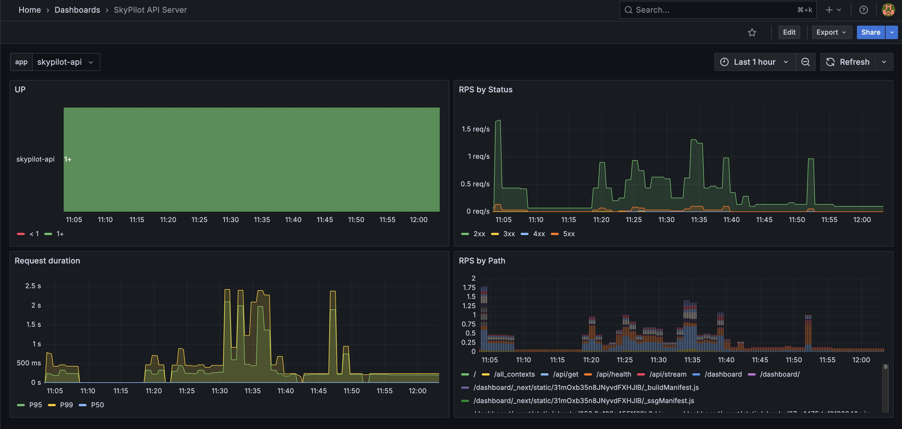

.. _api-server-metrics-setup:

Monitoring SkyPilot API Server Metrics
======================================

SkyPilot API Server can export Prometheus-compatible metrics and
optionally deploy a *one-click* Prometheus + Grafana stack so that you get
a fully functional monitoring solution out of the box.

.. tip::

   Metrics are **disabled by default**.  All the
   knobs described below can be set via ``helm upgrade`` during the initial
   installation or a later upgrade.

Quickstart: enable the full metrics stack
-----------------------------------------

If you do not already have Prometheus or Grafana running, the quickest way to get started is to let the SkyPilot Helm
chart deploy everything for you with a single command:

.. code-block:: bash

    helm upgrade --install skypilot skypilot/skypilot-nightly --devel \
      --namespace skypilot \
      --create-namespace \
      --reuse-values \
      --set apiService.metrics.enabled=true \
      --set prometheus.enabled=true \
      --set grafana.enabled=true

You can access Grafana at the ``/grafana`` endpoint:

.. code-block:: bash

   # Fetch the endpoint URL
   HOST=$(kubectl get svc ${RELEASE_NAME}-ingress-nginx-controller --namespace $NAMESPACE -o jsonpath='{.status.loadBalancer.ingress[0].ip}')
   echo http://$HOST/grafana

Metrics exposed
---------------

The endpoint ``/grafana`` on the SkyPilot API server exposes the following metrics in standard Prometheus format:

* API Server uptime
* Requests per second grouped by HTTP status code
* Request duration grouped by percentile
* Requests per second grouped by endpoint path

You can also :ref:`setup GPU metric collection <api-server-gpu-metrics-setup>` to directly export GPU memory, utilization and power consumption.

.. note::

   You can override the request duration histogram buckets by setting the
   ``SKY_APISERVER_HISTOGRAM_BUCKETS`` environment variable, e.g.:

   .. code-block:: bash

      helm upgrade skypilot skypilot/skypilot-nightly --devel \
        --namespace skypilot \
        --reuse-values \
        --set extraEnvs[0].name=SKY_APISERVER_HISTOGRAM_BUCKETS \
        --set extraEnvs[0].value='0.1,1.0,2.5,5.0,10.0,15.0,30.0,60.0,120.0,inf'

Using existing Prometheus / Grafana
-----------------------------------

The Helm chart introduces **three new top-level blocks** to provide flexibility in how you set up Prometheus and Grafana:

* ``apiService.metrics.enabled`` – enables the ``/metrics`` HTTP endpoint on the SkyPilot API server.
* ``prometheus.enabled`` – deploys a prometheus instance configured to scrape the ``/metrics`` endpoint on the SkyPilot API server.
* ``grafana.enabled`` – deploys Grafana with a pre-baked dashboard to display the SkyPilot API server metrics from prometheus.

All three default to ``false`` so you can mix & match:

* **Fully managed Prometheus + Grafana** – set ``apiService.metrics.enabled: true``, ``prometheus.enabled: true``, and ``grafana.enabled: true``. The chart will deploy a fully managed Prometheus + Grafana stack.
* **External Prometheus / Grafana** – set *only* ``apiService.metrics.enabled: true``. The API server will expose the metrics on the ``/metrics`` endpoint and the pod will be annotated with ``prometheus.io/scrape: true`` to enable automatic scraping by prometheus.
* **External Grafana, internal Prometheus** – enable ``prometheus`` but disable ``grafana``. Point your existing Grafana at the Prometheus service created by the chart.
