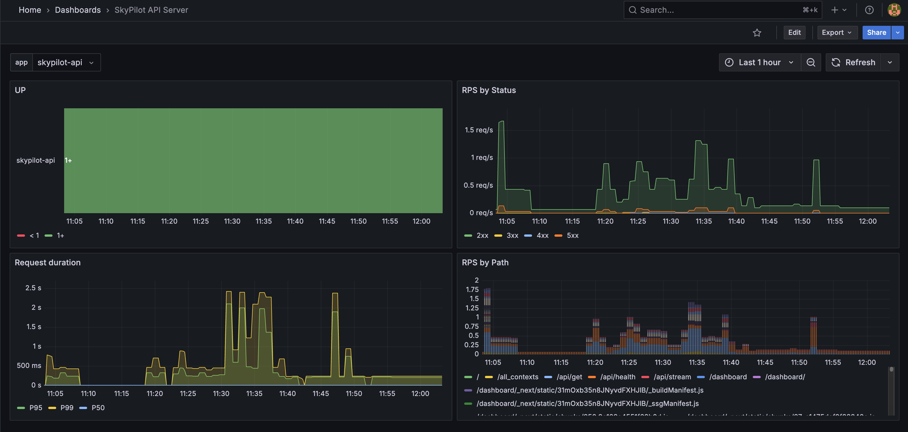

.. _api-server-metrics-setup:

Monitoring SkyPilot API Server Metrics
======================================

SkyPilot API Server can export Prometheus-compatible metrics and
optionally deploy a *one-click* Prometheus + Grafana stack so that you get
a fully functional monitoring solution out of the box.

.. tip::

   Metrics are **disabled by default**.  All the
   knobs described below can be set via ``helm upgrade`` during the initial
   installation or a later upgrade.

Quickstart: enable the full metrics stack
-----------------------------------------

If you do not already have Prometheus or Grafana running, the quickest way to get started is to let the SkyPilot Helm
chart deploy everything for you with a single command:

.. code-block:: bash

    helm upgrade --install skypilot skypilot/skypilot-nightly --devel \
      --namespace skypilot \
      --create-namespace \
      --reuse-values \
      --set apiService.metrics.enabled=true \
      --set prometheus.enabled=true \
      --set grafana.enabled=true

.. dropdown:: Turn off GPU metrics scraping

   The above command also configures Prometheus to scrape the SkyPilot API server's ``/gpu-metrics`` endpoint. To disable scraping of ``/gpu-metrics``, append ``--set prometheus.extraScrapeConfigs=""`` to the Helm command:

   .. code-block:: bash

       helm upgrade --install skypilot skypilot/skypilot-nightly --devel \
         --namespace skypilot \
         --create-namespace \
         --reuse-values \
         --set apiService.metrics.enabled=true \
         --set prometheus.enabled=true \
         --set prometheus.extraScrapeConfigs="" \
         --set grafana.enabled=true

You can access Grafana at the ``/grafana`` endpoint:

.. code-block:: bash

   # Fetch the endpoint URL
   HOST=$(kubectl get svc ${RELEASE_NAME}-ingress-nginx-controller --namespace $NAMESPACE -o jsonpath='{.status.loadBalancer.ingress[0].ip}')
   echo http://$HOST/grafana

Metrics exposed
---------------

The endpoint ``/metrics`` on the SkyPilot API server exposes Prometheus-format
metrics covering:

* API server health — request rate, latency, queue wait time, per-worker memory.
* Cluster inventory by workspace, user, status, cloud, and kind
  (``cluster`` / ``managed_job`` / ``controller``) — counts and GPU
  occupancy by accelerator model. Filter ``kind="cluster"`` to avoid
  overlap with managed-job clusters; sum across kinds for total
  resource usage.
* Managed jobs by workspace, user, status, and cloud (all statuses
  including terminal; use ``delta(...)`` over a window for per-period
  success/failure rate).

You can also :ref:`setup GPU metric collection <api-server-gpu-metrics-setup>`
to directly export GPU memory, utilization and power consumption from
each compute cluster.

Forward metrics to an OpenTelemetry-based backend
-------------------------------------------------

If your observability stack is built on OpenTelemetry (Datadog,
Honeycomb, GCP Cloud Monitoring, Tempo + Mimir, etc.) rather than
vanilla Prometheus, deploy an `OpenTelemetry Collector
<https://opentelemetry.io/docs/collector/>`__ as a bridge: its
`Prometheus receiver
<https://github.com/open-telemetry/opentelemetry-collector-contrib/tree/main/receiver/prometheusreceiver>`__
scrapes SkyPilot's endpoints and an OTLP exporter forwards downstream.

The only SkyPilot-specific part is the scrape config — point it at the
API server Service (``<release>-api-service.<namespace>.svc`` on the
metrics port, 9090 by default), and give ``/gpu-metrics`` a
``scrape_timeout`` larger than the API server's per-context federation
budget (20 s):

.. code-block:: yaml

   receivers:
     prometheus:
       config:
         scrape_configs:
           - job_name: skypilot-api
             metrics_path: /metrics
             static_configs:
               - targets: ['<release>-api-service.<namespace>.svc:9090']
           - job_name: skypilot-gpu
             metrics_path: /gpu-metrics
             scrape_timeout: 25s   # must exceed the 20s per-context budget
             static_configs:
               - targets: ['<release>-api-service.<namespace>.svc:9090']

Configure the processors, OTLP exporter, pipelines, and Collector
deployment mode per the `Collector configuration docs
<https://opentelemetry.io/docs/collector/configuration/>`__ — those are
generic OpenTelemetry concerns.

Using existing Prometheus / Grafana
-----------------------------------

The Helm chart introduces **three new top-level blocks** to provide flexibility in how you set up Prometheus and Grafana:

* ``apiService.metrics.enabled`` – enables the ``/metrics`` HTTP endpoint on the SkyPilot API server.
* ``prometheus.enabled`` – deploys a prometheus instance configured to scrape the ``/metrics`` endpoint on the SkyPilot API server.
* ``grafana.enabled`` – deploys Grafana with a pre-baked dashboard to display the SkyPilot API server metrics from prometheus.

All three default to ``false`` so you can mix & match:

* **Fully managed Prometheus + Grafana** – set ``apiService.metrics.enabled: true``, ``prometheus.enabled: true``, and ``grafana.enabled: true``. The chart will deploy a fully managed Prometheus + Grafana stack.
* **External Prometheus / Grafana** – set *only* ``apiService.metrics.enabled: true``. The API server will expose the metrics on the ``/metrics`` endpoint and the pod will be annotated with ``prometheus.io/scrape: true`` to enable automatic scraping by prometheus.
* **External Grafana, internal Prometheus** – enable ``prometheus`` but disable ``grafana``. Point your existing Grafana at the Prometheus service created by the chart.
