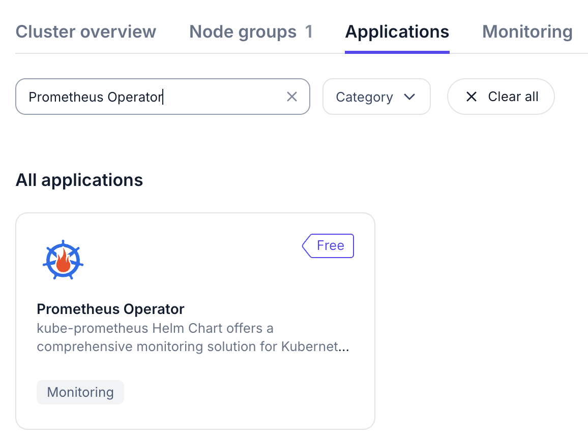
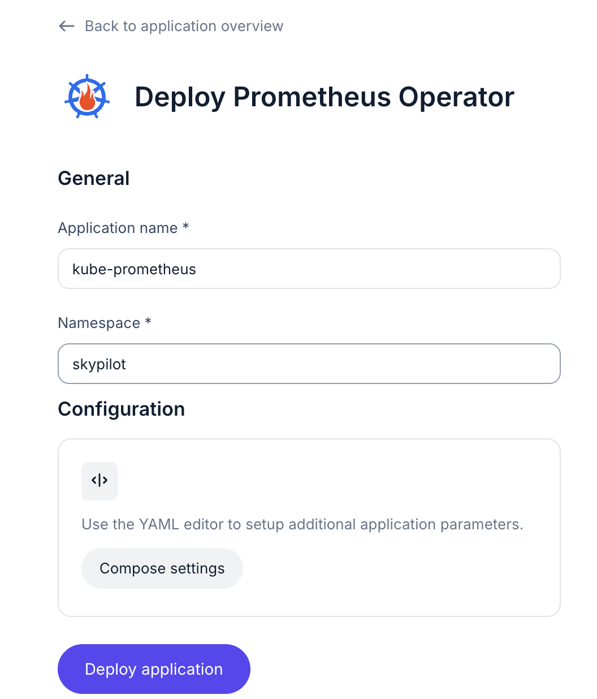
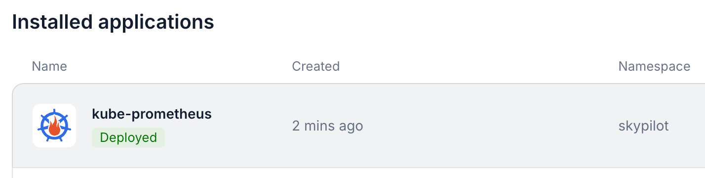
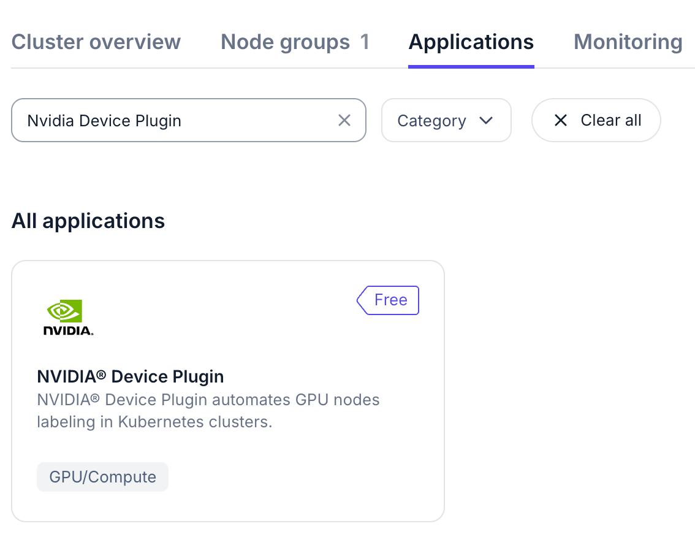
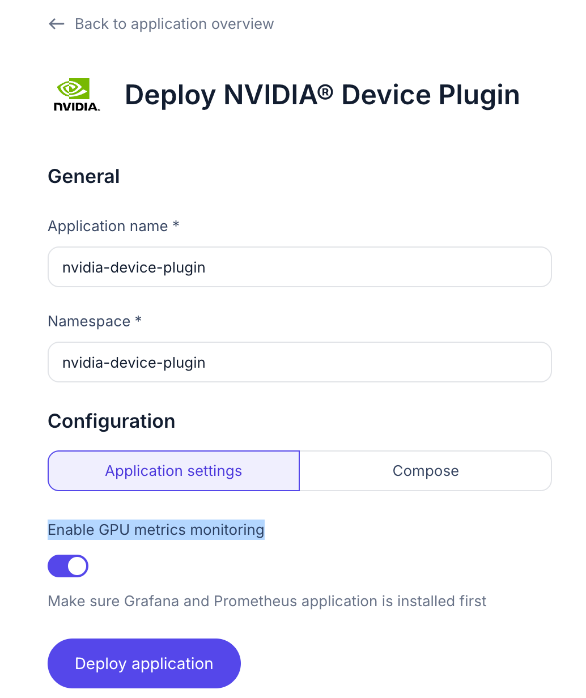
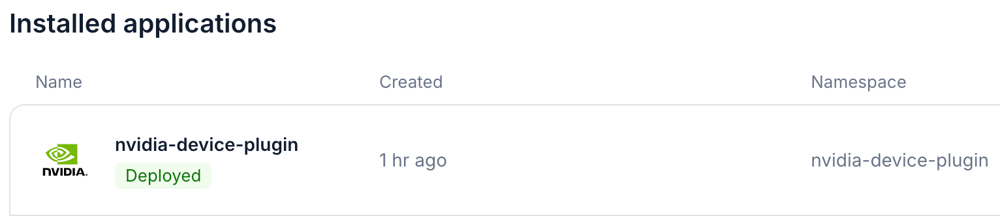

Deploying a SkyPilot API Server on GKE with Okta and Nebius
===========================================================

In this example, we will deploy a SkyPilot API server on a GKE cluster with Okta for authentication.

Infra choices configured in this guide (pick any combination or all):

* GCP VMs
* Nebius VMs
* GKE Kubernetes cluster
* Nebius Managed Kubernetes cluster

More infra choices (AWS, Lambda Cloud, RunPod, SSH Node Pools, and more) are covered in the `admin deployment docs <https://docs.skypilot.co/en/latest/reference/api-server/api-server-admin-deploy.html#optional-configure-cloud-accounts>`_.

.. figure:: https://i.imgur.com/k17TpJU.png
   :width: 600px
   :alt: Login page
   :align: center

   SkyPilot login with Okta

.. figure:: https://i.imgur.com/FBSv0PR.png
   :width: 600px
   :alt: SkyPilot dashboard
   :align: center

   SkyPilot dashboard with running clusters

Prerequisites
--------------

* Okta with SkyPilot API server configured as OIDC App (see `auth proxy docs <https://docs.skypilot.co/en/latest/reference/auth.html#okta-oidc-setup>`_)
* GCP credentials with access to a GKE cluster and permissions to create VMs (`GCP service account with json key <https://docs.skypilot.co/en/latest/cloud-setup/cloud-permissions/gcp.html#service-account>`_)
* Nebius credentials (`Nebius service account with json key <https://docs.nebius.com/iam/service-accounts/authorized-keys#create>`_)
* An existing `Nebius Managed Kubernetes cluster <https://docs.nebius.com/kubernetes>`_
* Nvidia GPU Operator and Nvidia Device Plugin must be installed on the cluster (Nebius Console -> Applications -> Nvidia {GPU Operator, Device Plugin} -> Deploy)

Step 1: Collect cloud credentials and variables
-----------------------------------------------

Set up the following variables by replacing the values with your own. These variables will be used throughout the guide:

.. code-block:: bash

   # Namespace to deploy the API server in and the name of the helm release (can be any string)
   NAMESPACE=skypilot
   RELEASE_NAME=skypilot

   # Okta variables - from Okta console -> Applications -> <SkyPilot App> -> Client ID and Client Secret
   OKTA_CLIENT_ID=<okta_client_id>
   OKTA_CLIENT_SECRET=<okta_client_secret>
   OKTA_ISSUER_URL=<okta_issuer_url> # E.g., https://myorg.okta.com

   # GCP variables
   GCP_PROJECT_ID=<your_gcp_project_id> # E.g., my-project
   GCP_SERVICE_ACCOUNT_JSON=<your_gcp_service_account_json_path> # E.g., $PWD/gcp-service-account.json

   # GKE variables. This is the cluster that will host the API server.
   GKE_CLUSTER_NAME=<gke_cluster_name> # E.g., mycluster
   GKE_ZONE=<gke_zone> # E.g., us-central1

   # Nebius variables. This is the external k8s cluster with GPUs.
   NEBIUS_CLUSTER_ID=<nebius_cluster_id> # Starts with mk8scluster-; different from cluster name. Can be found in Nebius console.
   NEBIUS_TENANT_ID=$(nebius iam tenant list --format json | jq -r '.items[0].metadata.id') # Also available in Nebius console, e.g., abc-123-...
   NEBIUS_SERVICE_ACCOUNT_JSON=<your_nebius_service_account_json_path> # E.g., $PWD/nebius-credentials.json

   # Temp variables used in the guide, no need to change
   TMP_KUBECONFIG=/tmp/sky_kubeconfig

Prepare GCP credentials
~~~~~~~~~~~~~~~~~~~~~~~

Create a secret with the GCP service account json key:

.. code-block:: bash

   rm -f $TMP_KUBECONFIG # Remove the file if it exists

   # Get GKE credentials
   KUBECONFIG=$TMP_KUBECONFIG gcloud container clusters get-credentials $GKE_CLUSTER_NAME --zone $GKE_ZONE
   GKE_CONTEXT=$(kubectl config current-context --kubeconfig $TMP_KUBECONFIG)

   kubectl create namespace $NAMESPACE --kubeconfig $TMP_KUBECONFIG
   kubectl create secret generic gcp-credentials --kubeconfig $TMP_KUBECONFIG --context $GKE_CONTEXT \
     --namespace $NAMESPACE \
     --from-file=gcp-cred.json=$GCP_SERVICE_ACCOUNT_JSON

Prepare Nebius credentials
~~~~~~~~~~~~~~~~~~~~~~~~~~

Create a secret with the Nebius service account json key:

.. code-block:: bash

   # Set up Nebius credentials for Nebius CLI auth
   kubectl create secret generic nebius-credentials \
     --namespace $NAMESPACE \
     --from-file=credentials.json=$NEBIUS_SERVICE_ACCOUNT_JSON

Prepare Kubernetes credentials: Nebius managed Kubernetes and GKE
~~~~~~~~~~~~~~~~~~~~~~~~~~~~~~~~~~~~~~~~~~~~~~~~~~~~~~~~~~~~~~~~~

Combine Nebius and GKE credentials into a single kubeconfig and create a secret with the combined kubeconfig:

.. code-block:: bash

   # Get Nebius credentials
   nebius mk8s cluster get-credentials --id $NEBIUS_CLUSTER_ID --external --kubeconfig $TMP_KUBECONFIG
   NEBIUS_CONTEXT=$(kubectl config current-context --kubeconfig $TMP_KUBECONFIG)

   # To help SkyPilot identify GPUs on the Nebius cluster, label the nodes with the GPU type. If you already installed the Nvidia Device Plugin, this step will be automatically skipped.
   KUBECONFIG=$TMP_KUBECONFIG python -m sky.utils.kubernetes.gpu_labeler --context $NEBIUS_CONTEXT

   # Get GKE credentials
   KUBECONFIG=$TMP_KUBECONFIG gcloud container clusters get-credentials $GKE_CLUSTER_NAME --zone $GKE_ZONE

   # Verify both contexts are available in the kubeconfig
   kubectl config get-contexts --kubeconfig $TMP_KUBECONFIG

   # Strip exec paths from the kubeconfig to avoid hardcoded paths in the kubeconfig
   python -m sky.utils.kubernetes.exec_kubeconfig_converter --input $TMP_KUBECONFIG --output kubeconfig.converted

   # Create a secret with the converted kubeconfig
   kubectl create secret generic kube-credentials --kubeconfig $TMP_KUBECONFIG --context $GKE_CONTEXT \
     --namespace $NAMESPACE \
     --from-file=config=kubeconfig.converted

   # Create a SkyPilot config that allows both contexts (GKE and Nebius) to be used simultaneously:
   cat <<EOF > config.yaml
   kubernetes:
     allowed_contexts:
       - $NEBIUS_CONTEXT
       - $GKE_CONTEXT
   EOF
   CONFIG_PATH=$PWD/config.yaml

Step 2: Deploy the API server
-----------------------------

Deploy the API server with helm:

.. code-block:: bash

   helm repo add skypilot https://helm.skypilot.co
   helm repo update

   helm upgrade --install skypilot skypilot/skypilot-nightly --devel \
     --namespace $NAMESPACE \
     --create-namespace \
     --set-file apiService.config=$CONFIG_PATH \
     --set ingress.oauth2-proxy.enabled=true \
     --set ingress.oauth2-proxy.oidc-issuer-url=$OKTA_ISSUER_URL \
     --set ingress.oauth2-proxy.client-id=$OKTA_CLIENT_ID \
     --set ingress.oauth2-proxy.client-secret=$OKTA_CLIENT_SECRET \
     --set kubernetesCredentials.useApiServerCluster=false \
     --set kubernetesCredentials.useKubeconfig=true \
     --set kubernetesCredentials.kubeconfigSecretName=kube-credentials \
     --set gcpCredentials.enabled=true \
     --set gcpCredentials.projectId=$GCP_PROJECT_ID \
     --set nebiusCredentials.enabled=true \
     --set nebiusCredentials.tenantId=$NEBIUS_TENANT_ID

.. note::
   If you need to reconfigure any of the values, you can simply run ``helm upgrade --install ... --reuse-values`` with only the changed values. ``--reuse-values`` will keep the existing values and only update the changed ones.

Here's an explanation of all the arguments used in the helm chart installation:

.. list-table::
   :widths: 40 60
   :header-rows: 1

   * - Argument
     - Description
   * - ``--namespace $NAMESPACE``
     - The Kubernetes namespace where SkyPilot will be installed
   * - ``--create-namespace``
     - Creates the namespace if it doesn't exist
   * - ``--set-file apiService.config=$CONFIG_PATH``
     - Path to the SkyPilot config file that defines allowed Kubernetes contexts
   * - ``--set ingress.oauth2-proxy.enabled=true``
     - Enables OAuth2 proxy for authentication
   * - ``--set ingress.oauth2-proxy.oidc-issuer-url=$OKTA_ISSUER_URL``
     - URL of the Okta OIDC issuer
   * - ``--set ingress.oauth2-proxy.client-id=$OKTA_CLIENT_ID``
     - Okta client ID for OAuth2 authentication
   * - ``--set ingress.oauth2-proxy.client-secret=$OKTA_CLIENT_SECRET``
     - Okta client secret for OAuth2 authentication
   * - ``--set kubernetesCredentials.useApiServerCluster=false``
     - Disables using the in-cluster authentication for k8s (instead we use kubeconfig)
   * - ``--set kubernetesCredentials.useKubeconfig=true``
     - Uses kubeconfig for cluster access
   * - ``--set kubernetesCredentials.kubeconfigSecretName=kube-credentials``
     - Name of the secret containing the kubeconfig
   * - ``--set gcpCredentials.enabled=true``
     - Enables GCP credentials
   * - ``--set gcpCredentials.projectId=$GCP_PROJECT_ID``
     - GCP project ID
   * - ``--set gcpCredentials.serviceAccountJson=$GCP_SERVICE_ACCOUNT_JSON``
     - GCP service account JSON credentials
   * - ``--set nebiusCredentials.enabled=true``
     - Enables Nebius credentials
   * - ``--set nebiusCredentials.tenantId=$NEBIUS_TENANT_ID``
     - Nebius tenant ID

Step 3: Get the endpoint and configure your DNS
-----------------------------------------------

.. code-block:: bash

   HOST=$(kubectl get svc ${RELEASE_NAME}-ingress-nginx-controller --namespace $NAMESPACE --kubeconfig $TMP_KUBECONFIG --context $GKE_CONTEXT -o jsonpath='{.status.loadBalancer.ingress[0].ip}')
   ENDPOINT=http://$HOST
   echo $ENDPOINT

If you see a blank address, wait a bit and try again. The GCP load balancer takes 1-2min to get an external IP.

Configure your DNS to point to the IP address of the API server. This is required for Okta to verify the ``redirect_uri`` configured by you in the Okta app. Alternatively, update the ``redirect_uri`` in the Okta app to use the IP address of the API server.

Try opening the endpoint in a browser. You should see the SkyPilot dashboard login page.

.. figure:: https://i.imgur.com/k17TpJU.png
   :width: 500px
   :alt: Okta login page
   :align: center

After logging in, you should be able to see the configured cloud and kubernetes infra on the dashboard.

.. figure:: https://i.imgur.com/0cY1B5A.png
   :width: 600px
   :alt: infras page
   :align: center

   SkyPilot dashboard showing available infra

If the login page shows 503 error, make sure the API server pod is healthy:

.. code-block:: bash

   kubectl get pods --namespace $NAMESPACE --kubeconfig $TMP_KUBECONFIG --context $GKE_CONTEXT

Step 4: Configure the CLI and launch your first job
---------------------------------------------------

On your client(s), install the SkyPilot CLI:

.. code-block:: bash

   pip install -U skypilot-nightly

Login to the API server:

.. code-block:: bash

   sky api login -e $ENDPOINT # E.g., http://34.42.25.204 or http://sky.yourorg.com

A browser will open and you will be redirected to the Okta login page. Login with your Okta credentials. You will receive a token:

.. figure:: https://i.imgur.com/OflAVTp.png
   :width: 500px
   :alt: Okta token page
   :align: center

Copy the token and paste it in the CLI. You should see the following message:

.. code-block:: console

   $ sky api login -e http://sky.yourorg.com
   Authentication is needed. Please visit this URL setup up the token:

   http://sky.yourorg.com/token

   Opening browser...
   Paste the token:

Run ``sky check`` to verify cloud setup:

.. code-block:: console

   $ sky check
   ...
   🎉 Enabled infra 🎉
     GCP [compute, storage]
     Kubernetes [compute]
       Allowed contexts:
       ├── nebius-cluster
       └── gke-cluster
     Nebius [compute]

🎉 SkyPilot API server is ready to use!
---------------------------------------

Some commands to try:

* ``sky dashboard`` to open the dashboard in your browser
* ``sky launch -c test --gpus H100:1 -- nvidia-smi`` to launch a job with 1 H100 GPU
* ``sky show-gpus`` to show available GPUs
* ``sky status`` to see SkyPilot status and infra available

✨ Bonus: Infiniband, Nebius shared filesystem, and volumes
-----------------------------------------------------------

Configuring Infiniband on Nebius Kubernetes cluster
~~~~~~~~~~~~~~~~~~~~~~~~~~~~~~~~~~~~~~~~~~~~~~~~~~~~~

To configure SkyPilot to use infiniband on Nebius:

1. Set the following config in your SkyPilot task YAML to enable InfiniBand:

   .. code-block:: yaml

      config:
        kubernetes:
          pod_config:
            spec:
              containers:
              - securityContext:
                  capabilities:
                    add:
                    - IPC_LOCK

2. Configure the environment variables in your SkyPilot task:

   .. code-block:: yaml

      run: |
        export NCCL_IB_HCA=mlx5
        export UCX_NET_DEVICES=mlx5_0:1,mlx5_1:1,mlx5_2:1,mlx5_3:1,mlx5_4:1,mlx5_5:1,mlx5_6:1,mlx5_7:1
        ... your own run script ...

.. note::
   Add the above config to the SkyPilot config (``~/.sky/config.yaml`` `global config <https://docs.skypilot.co/en/latest/reference/config.html#config-yaml>`_ or ``.sky.yaml`` `project config <https://docs.skypilot.co/en/latest/reference/config-sources.html#config-client-project-config>`_) to have Infiniband configured automatically for all your jobs.

Refer to `Using InfiniBand in Nebius with SkyPilot <https://docs.skypilot.co/en/latest/examples/performance/nebius_infiniband.html>`_ and `NCCL test example <https://github.com/skypilot-org/skypilot/blob/master/examples/nebius_infiniband/nccl.yaml>`_ for more details.

Shared storage with Nebius shared filesystem
~~~~~~~~~~~~~~~~~~~~~~~~~~~~~~~~~~~~~~~~~~~~~

You can also use `Nebius shared filesystem <https://docs.nebius.com/compute/storage/types#filesystems>`_ with SkyPilot to get high performance data storage for datasets, checkpoints and more across multiple nodes.

When creating a node group on the Nebius console, simply attach your desired shared file system to the node group (``Create Node Group`` -> ``Attach shared filesystem``):

* Ensure ``Auto mount`` is enabled.
* Note the ``Mount tag`` (e.g. ``filesystem-d0``).

.. figure:: https://i.imgur.com/02PhLB5.png
   :width: 50%
   :alt: Nebius shared filesystem
   :align: center

Nebius will automatically mount the shared filesystem to hosts in the node group. You can then use a ``hostPath`` volume to mount the shared filesystem to your SkyPilot pods.

Here's an example of how to use the shared filesystem in a SkyPilot job:

.. code-block:: yaml

   resources:
     infra: k8s/nebius-mk8s-nebius-gpu-dev

   run: |
     echo "Hello, world!" > /mnt/nfs/hello.txt
     ls -la /mnt/nfs

   config:
     kubernetes:
       pod_config:
         spec:
           containers:
             - volumeMounts:
                 - mountPath: /mnt/nfs
                   name: nebius-sharedfs
           volumes:
             - name: nebius-sharedfs
               hostPath:
                 path: /mnt/<mount_tag> # e.g. /mnt/filesystem-d0
                 type: Directory

.. note::
   Add the above ``config`` field to the SkyPilot config (``~/.sky/config.yaml`` `global config <https://docs.skypilot.co/en/latest/reference/config.html#config-yaml>`_ or ``.sky.yaml`` `project config <https://docs.skypilot.co/en/latest/reference/config-sources.html#config-client-project-config>`_) to have the shared filesystem mounted automatically for all your jobs.

Volumes on top of Nebius shared filesystem
~~~~~~~~~~~~~~~~~~~~~~~~~~~~~~~~~~~~~~~~~~~

The above guide allows you to mount the entire Nebius shared filesystem to all SkyPilot clusters. Additionally, SkyPilot supports creating and managing :ref:`volumes <volumes-on-kubernetes>` on top of the shared filesystem using Kubernetes Persistent Volume Claims.

Volumes provide several key benefits:

* **Caching**: Serve as persistent cache for PyPI packages, Hugging Face models, and other dependencies
* **Isolation**: Provide better data isolation between clusters and jobs compared to mounting the shared filesystem directly to node groups

1. Prepare a volume YAML file:

   .. code-block:: yaml

     # volume.yaml
     name: new-pvc
     type: k8s-pvc
     infra: k8s/nebius-mk8s-nebius-gpu-dev
     size: 10Gi
     config:
       namespace: default  # optional
       storage_class_name: csi-mounted-fs-path-sc
       access_mode: ReadWriteMany

2. Create the volume with ``sky volumes apply volume.yaml``:

   .. code-block:: console

     $ sky volumes apply volume.yaml
     Proceed to create volume 'new-pvc'? [Y/n]: Y
     Creating PVC: new-pvc-73ec42f2-5c6c4e

3. Mount the volume in your task YAML:

   .. code-block:: yaml

     # task.yaml
     volumes:
       /mnt/data: new-pvc  # The volume new-pvc will be mounted to /mnt/data

     run: |
       echo "Hello, World!" > /mnt/data/hello.txt

Refer to :ref:`volumes-on-kubernetes` for more details.

.. _api-server-gpu-metrics-setup-nebius:

Setup GPU metrics in Nebius Kubernetes cluster
----------------------------------------------

If you are using Nebius Kubernetes cluster, you can setup GPU metrics in the cluster to get real-time GPU metrics in the SkyPilot dashboard.

1. Install the Prometheus operator.

On Nebius console, in the detail page of the Nebius Kubernetes cluster, go to ``Applications`` -> Search for ``Prometheus Operator`` -> ``Deploy`` -> Enter ``skypilot`` for the ``Namespace`` -> ``Deploy application``.

Wait for the Prometheus operator to be installed, the status badge will become ``Deployed``.

You can also check the Pod status to verify the installation.

.. code-block:: bash

  kubectl get pods -n skypilot

By default, the CPU and memory metrics exported by node exporter do not include the ``node`` label, which is required for the SkyPilot dashboard to display the metrics. You can add the ``node`` label to the metrics by applying the following config to the node exporter service monitor resource:

.. code-block:: bash

  kubectl apply -f https://raw.githubusercontent.com/skypilot-org/skypilot/refs/heads/master/examples/metrics/kube_prometheus_node_exporter_service_monitor.yaml -n skypilot

2. Install the Nvidia Device Plugin.

On Nebius console, in the detail page of the Nebius Kubernetes cluster, go to ``Applications`` -> Search for ``Nvidia Device Plugin`` -> ``Deploy`` -> Make sure to check the ``Enable GPU metrics monitoring`` -> ``Deploy application``.

Wait for the Nvidia Device Plugin to be installed, the status badge will become ``Deployed``.

You can also check the Pod status to verify the installation.

.. code-block:: bash

  kubectl get pods -n nvidia-device-plugin

The dcgm exporter will be installed automatically.

3. Create the Prometheus service for SkyPilot API server to retrieve the GPU metrics:

   .. code-block:: bash

     kubectl create -f https://raw.githubusercontent.com/skypilot-org/skypilot/refs/heads/master/examples/metrics/skypilot_prometheus_server_service.yaml -n skypilot

Confirm that the service endpoint is created by running the following command:

.. code-block:: bash

  kubectl get endpoints skypilot-prometheus-server -n skypilot
  NAME                         ENDPOINTS           AGE
  skypilot-prometheus-server   10.24.20.128:9090   62s

4. If you are using multiple Kubernetes clusters, you will need to add the context names to ``allowed_contexts`` in the SkyPilot config.

An example config file that allows using the hosting Kubernetes cluster and two additional Kubernetes clusters is shown below:

.. code-block:: yaml

  kubernetes:
    allowed_contexts:
    # The hosting Kubernetes cluster, you cannot set this if the hosting cluster is disabled by kubernetesCredentials.useApiServerCluster=false
    - in-cluster
    # The additional Kubernetes context names in the kubeconfig you configured
    - context1
    - context2

Refer to :ref:`config-yaml-kubernetes-allowed-contexts` for how to set the SkyPilot config in Helm chart values.

5. Refer to :ref:`api-server-setup-dcgm-metrics-scraping` to upgrade the API server to scrape the GPU metrics.

Now you should be able to see the GPU metrics in the SkyPilot dashboard.
