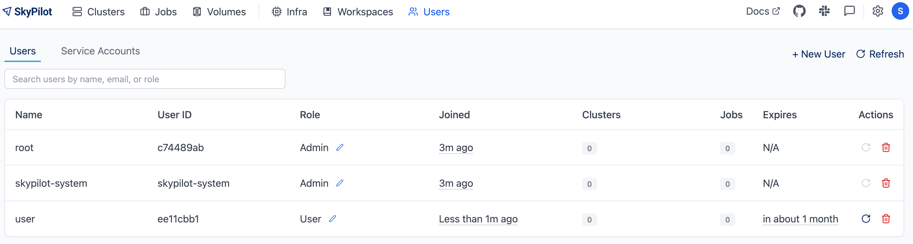

.. _api-server-auth:

Authentication and RBAC
=========================

SkyPilot API server supports three authentication methods:

.. We will eventually support N+1 kinds of authentications:
.. 1. Service account token based authentication, which will enabled by default in helm deployment to ensure the deployed server is protected;
.. 2. SSO;
.. N: (another authentication method, authentication schemes 1~N are handled by the API server and can be used at the same time, a.k.a. unified authentication)
.. N+1: Proxy authentication, where the reverse proxy in front of the API server handles the authentication and pass the identity header to the API server. This is mutually exclusive with authentication schemes 1~N. For clarity maybe this part will be hosted in another doc.
.. TODO(aylei): replace basic auth with proxy auth for clarity after we support service account token based authentication to be used along.

- **Basic auth in ingress**: Use an admin-configured username and password to authenticate.
- **Users and service accounts with tokens**: Use a JWT (JSON Web Token) to authenticate.
- **SSO (recommended)**: Use an auth proxy (e.g.,
  `OAuth2 Proxy <https://oauth2-proxy.github.io/oauth2-proxy/>`__) to
  authenticate. For example, Okta, Google Workspace, or other SSO providers are supported.

Comparison of the three methods:

.. csv-table::
    :header: "", "Basic Auth in ingress", "Users and service accounts with tokens", "SSO (recommended)"
    :widths: 20, 20, 30, 30
    :align: left

    "User identity", "Client's ``whoami`` + hash of MAC address", "Users or service accounts created by the ``Admin`` role", "User email (e.g., ``who@skypilot.co``), read from ``X-Auth-Request-Email``"
    "SkyPilot RBAC", "Not supported", "Supported", "Supported"
    "Setup", "Can be enabled during deployment with Helm", "Automatically enabled", "Bring your Okta, Google Workspace, or other SSO provider"

.. _api-server-basic-auth:

Basic auth in ingress
---------------------

Basic auth in ingress can be enabled if you use the :ref:`helm chart
<sky-api-server-deploy>` to deploy the API server.

Example deployment command:

.. code-block:: console

    # NAMESPACE is the namespace to deploy the API server in
    NAMESPACE=skypilot
    # RELEASE_NAME is the name of the helm release, must be unique within the namespace
    RELEASE_NAME=skypilot
    # Set up basic username/password HTTP auth
    WEB_USERNAME=skypilot
    WEB_PASSWORD=skypilot
    AUTH_STRING=$(htpasswd -nb $WEB_USERNAME $WEB_PASSWORD)
    # Deploy the API server
    helm upgrade --install $RELEASE_NAME skypilot/skypilot-nightly --devel \
      --namespace $NAMESPACE \
      --create-namespace \
      --set ingress.authCredentials=$AUTH_STRING

Example login command:

.. code-block:: console

    $ sky api login -e http://username:password@<SKYPILOT_API_SERVER_ENDPOINT>

.. _api-server-users-service-accounts-with-tokens:

Users and service accounts with tokens
--------------------------------------

Users and service accounts with tokens will be enabled by default if you use the :ref:`helm chart<sky-api-server-deploy>` to deploy the API server.

After the installation, a default token with `Admin` role will be created and saved to a secret named ``$RELEASE_NAME-initial-sa-token`` in the namespace where the API server is deployed. You can use this token to connect to the API server and then create new users.

When an user is created, a token will be created automatically with specified role and expiration time, and the user can login the API server with the token.

.. _api-server-users-service-accounts-with-tokens-create-users:

Create users
~~~~~~~~~~~~

1. Login to the SkyPilot dashboard with the default token.
2. Navigate to the **Users** tab.
3. Click **+ New User** and provide:

   * **User Name**: Descriptive name (e.g., "alice")
   * **Token Expiration**: Optional (defaults to 30 days)
   * **Role**: Assign appropriate role (admin/user)

4. Click **Create** to create the user.

5. **Save the token immediately** - it won't be shown again

6. The user can login the API server with the token.

You can also create service accounts with tokens. See :ref:`service-accounts-create` for more details.

Access the API server
~~~~~~~~~~~~~~~~~~~~~~

Authenticate with the token:

.. code-block:: console

    $ sky api login -e <ENDPOINT> --token <SERVICE_ACCOUNT_TOKEN>

Or, use the ``SKYPILOT_SERVICE_ACCOUNT_TOKEN`` environment variable:

.. code-block:: console

    $ export SKYPILOT_SERVICE_ACCOUNT_TOKEN=<SERVICE_ACCOUNT_TOKEN>
    $ sky api info

.. _api-server-oauth:

SSO (recommended)
------------------

You can configure the SkyPilot API server to use an SSO providers such as :ref:`Okta or Google Workspace <oauth-oidc>` for authentication.

The SkyPilot implementation is flexible and will also work with most cookie-based browser auth proxies. See :ref:`oauth-user-flow` and :ref:`auth-proxy-byo` for details. To set up Okta or Google Workspace, see :ref:`oauth-oidc`.

.. image:: ../images/client-server/oauth-user-flow.svg
    :alt: SkyPilot with OAuth
    :align: center
    :width: 100%

.. _oauth-user-flow:

User flow
~~~~~~~~~

While logging into an API server, SkyPilot will attempt to detect an auth proxy. If detected, the user must log in via a browser:

.. code-block:: console

    $ sky api login -e http://<SKYPILOT_API_SERVER_ENDPOINT>
    A web browser has been opened at http://<SKYPILOT_API_SERVER_ENDPOINT>/token?local_port=8000. Please continue the login in the web browser.

Login in the browser to authenticate as required by the auth proxy.

.. image:: ../images/client-server/login.png
    :alt: Okta and Google auth pages
    :align: center
    :width: 100%

After authentication, the CLI will automatically copy the relevant auth cookies from the browser into the CLI.

.. code-block:: console

    ...
    Logged into SkyPilot API server at: http://<SKYPILOT_API_SERVER_ENDPOINT>
    └── Dashboard: http://<SKYPILOT_API_SERVER_ENDPOINT>/dashboard

SkyPilot will automatically use the user email from the auth proxy to create a user in the SkyPilot API server.

.. image:: ../images/client-server/cluster-users.png
    :alt: User emails in the SkyPilot dashboard
    :align: center
    :width: 70%

.. _oauth-okta:
.. _oauth-oidc:

Setting up OAuth (Okta, Google Workspace, etc)
~~~~~~~~~~~~~~~~~~~~~~~~~~~~~~~~~~~~~~~~~~~~~~

The SkyPilot API server helm chart provides out-of-the-box support for setting up OAuth on API server. An `OAuth2 Proxy <https://oauth2-proxy.github.io/oauth2-proxy/>`__ will be deployed under the hood and the API server will be configured to use it for authentication.

The instructions below cover :ref:`Okta <okta-oidc-setup>` and :ref:`Google Workspace <google-oidc-setup>`, but any provider compatible with the OIDC spec should work.

Here's how to set it up:

* Set up your auth provider (pick one):

  * :ref:`Set up in Okta <okta-oidc-setup>`

  * :ref:`Set up Google Workspace login <google-oidc-setup>`

* :ref:`Deploy in Helm <oidc-oauth2-proxy-helm>`

.. _okta-oidc-setup:

Create application in Okta
^^^^^^^^^^^^^^^^^^^^^^^^^^

To use Okta, you will need to create a new application in the Okta admin panel.

1. From your Okta admin panel, navigate to **Applications > Applications**, then click the **Create App Integration** button.

   * **Sign-in method:** ``OIDC - OpenID Connect``
   * **Application type:** ``Web Application``

.. image:: ../images/client-server/okta-setup.png
    :alt: SkyPilot token page
    :align: center
    :width: 80%

2. Configure the application:

   * **App integration name:** ``SkyPilot API Server`` or any other name.
   * **Sign-in redirect URIs:** ``<ENDPOINT>/oauth2/callback``, where ``<ENDPOINT>`` is your API server endpoint. e.g. ``http://skypilot.example.com/oauth2/callback``
   * **Assignments > Controlled access:** ``Allow everyone in your organization to access``, unless you want to limit access to select groups.

3. Click **Save**. You will need the Client ID and a Client Secret in the next step.

You can now proceed to :ref:`the Helm deployment <oidc-oauth2-proxy-helm>`.

.. _google-oidc-setup:

Create Google Workspace client in GCP
^^^^^^^^^^^^^^^^^^^^^^^^^^^^^^^^^^^^^

To log in with Google Workspace, you will need to create a client in a GCP project.

Each GCP project can contain multiple "clients," but only a single application configuration. Depending on your use-case, you may want to create a new GCP project for authentication.

Once you have selected a GCP project, go to the `Clients page within Google Auth Platform <https://console.cloud.google.com/auth/clients>`__.

Configure Google Auth Platform
''''''''''''''''''''''''''''''

If you have not used Google Auth Platform in this GCP project, you will see a setup screen.

.. image:: ../images/client-server/google-auth-initial-setup.png
    :alt: Setup screen for Google Auth Platform
    :align: center
    :width: 70%

If you see the Clients page rather than this setup screen, you can proceed to the :ref:`Client setup <google-oidc-client-setup>`. Otherwise, click "Get started" to set up the GCP project with Google Auth Platform.

1. App Information

   This configures the display name on the auth prompt for all clients in the GCP project, as well as an email that users can see while logging in. Choose values that make sense for your team.

2. Audience

   **Recommended: "Internal"**

   Choosing "External" may allow users outside your organization to log in, and may require additional verification steps from Google. If you choose "External", you may want to use :ref:`the auth proxy email domain filter <helm-values-ingress-oauth2-proxy-email-domain>` to prevent users from outside your organization from logging in to SkyPilot.

3. Contact Information

   Provide a good point of contact for your organization.

4. Finish

   Accept the necessary terms and create the configuration.

.. _google-oidc-client-setup:

Create GCP auth client
''''''''''''''''''''''

Click "Create OAuth client" or visit `the Clients page <https://console.cloud.google.com/auth/clients>`__ and click "Create".

Select the necessary config values:

* **Application type:** Choose "Web application".
* **Name:** Choose a name that will be meaningful to you, such as "SkyPilot auth proxy". This name is internal-only.
* **Authorized redirect URIs**: Click "Add URI", and add ``<ENDPOINT>/oauth2/callback``, where ``<ENDPOINT>`` is your API server endpoint. e.g. ``http://skypilot.example.com/oauth2/callback``

.. image:: ../images/client-server/google-auth-setup.png
    :alt: Create an OIDC client in Google Auth Platform
    :align: center
    :width: 100%

Click "Create".

Copy down the **Client ID** and **Client secret**. After exiting this screen, you won't be able to access the client secret without creating a new client. You will need them for :ref:`deploying to Helm <oidc-oauth2-proxy-helm>`.

.. note::

    If Google Auth Platform audience is set to **"External"** in your GCP project, anyone with a Google account may be able to log in.

    You can set an :ref:`email domain filter <helm-values-ingress-oauth2-proxy-email-domain>` in the Helm chart, which is the ``<EMAIL DOMAIN>`` value in the :ref:`Helm deployment instructions below <oidc-oauth2-proxy-helm>`.

    To check if your audience is set to "Internal" or "External", go to the `Audience page <https://console.cloud.google.com/auth/audience>`__ under Google Auth Platform. Under "User type", you should see "Internal" or "External". You can switch between Internal and External audience, but it will affect all auth clients in the GCP project.

.. _oidc-oauth2-proxy-helm:

Deploy in Helm
^^^^^^^^^^^^^^^

Set up the environment variables for your API server deployment. ``NAMESPACE`` and ``RELEASE_NAME`` should be set to the currently installed namespace and release:

.. code-block:: bash

    NAMESPACE=skypilot # TODO: change to your installed namespace
    RELEASE_NAME=skypilot # TODO: change to your installed release name

Use ``helm upgrade`` to redeploy the API server helm chart with the ``skypilot-oauth2-proxy`` deployment. Replace the config values:

* ``<CLIENT ID>``: Copy from the auth provider dashboard

* ``<CLIENT SECRET>``: Copy from the auth provider dashboard

* ``<ISSUER URL>``

  * **Okta**: Your Okta login URL, like ``https://acme-corp.okta.com``

  * **Google Workspace**: Set to ``https://accounts.google.com``

* ``<EMAIL DOMAIN>``: Optionally :ref:`restrict login to specific email domains <helm-values-ingress-oauth2-proxy-email-domain>`

.. code-block:: console

    $ # --reuse-values is critical to keep the old values that aren't being updated here.
    $ helm upgrade -n $NAMESPACE $RELEASE_NAME skypilot/skypilot-nightly --devel --reuse-values \
      --set auth.oauth.enabled=true \
      --set auth.oauth.oidc-issuer-url=https://<ISSUER URL> \
      --set auth.oauth.client-id=<CLIENT ID> \
      --set auth.oauth.client-secret=<CLIENT SECRET> \
      --set auth.oauth.email-domain=<EMAIL DOMAIN> # optional

.. _oauth-client-secret:

For better security, you can also store the client details in a Kubernetes secret instead of passing them as Helm values:

.. code-block:: console

    $ # Create a secret with your OIDC credentials
    $ kubectl create secret generic oauth2-proxy-credentials -n $NAMESPACE \
      --from-literal=client-id=<CLIENT ID> \
      --from-literal=client-secret=<CLIENT SECRET>

    $ # Deploy using the secret
    $ helm upgrade -n $NAMESPACE $RELEASE_NAME skypilot/skypilot-nightly --devel --reuse-values \
      --set auth.oauth.enabled=true \
      --set auth.oauth.oidc-issuer-url=https://<ISSUER URL> \
      --set auth.oauth.client-details-from-secret=oauth2-proxy-credentials \
      --set auth.oauth.email-domain=<EMAIL DOMAIN> # optional

.. note::
   Both ``client-id``/``client-secret`` (dash format) and ``client_id``/``client_secret`` (underscore format) key names in secrets are supported. The system will automatically detect which format is present in your secret. This provides compatibility with different secret management systems - for example, HashiCorp Vault requires underscores in key names.

To make sure it's working, visit your endpoint URL in a browser. You should be redirected to your auth provider to sign in.

Now, you can use ``sky api login -e <ENDPOINT>`` to go though the login flow for the CLI.

.. _oauth-migration-guide:

OAuth migration guide
^^^^^^^^^^^^^^^^^^^^^

.. dropdown:: Migration guide for auth proxy based authentication (before SkyPilot v0.10.2)

    .. TODO(aylei): Add the nightly version after this change get released

    Starting with SkyPilot v0.10.2, the API server supports built-in OAuth2 integration (delegate authentication to `OAuth2 Proxy <https://github.com/oauth2-proxy/oauth2-proxy>`_ under the hood) without ingress support. This is more flexible and can work seamlessly with other authentication schemes supported by the API server.

    If you are using the auth proxy in ingress (enabled by setting ``ingress.oauth2-proxy.enabled=true`` in the Helm chart), you can migrate to the new OAuth2 integration by setting ``auth.oauth.enabled=true`` and migrate other settings from ``ingress.oauth2-proxy.*`` to ``auth.oauth.*`` in the Helm chart:

    .. note::

        Both the API server docker image and the helm chart should be updated to version 0.10.2 or later to use the new OAuth2 integration.

    .. code-block:: console

        # NAMESPACE and RELEASE_NAME are the same as the ones used in the Helm deployment
        $ helm get values $RELEASE_NAME -n $NAMESPACE -o yaml > values.yaml

        # Edit values.yaml, move the values from ingress.oauth2-proxy.* to auth.oauth.*
        # Preview the changes, you should see the following diff:
        $ diff values.yaml <(sed 's/^ingress:/auth:/;s/^  oauth2-proxy:/  oauth:/' values.yaml)
        4,5c4,5
        < ingress:
        <   oauth2-proxy:
        ---
        > auth:
        >   oauth:
        $ sed -i 's/^ingress:/auth:/;s/^  oauth2-proxy:/  oauth:/' values.yaml

        # Upgrade the helm chart with mutated values
        $ helm upgrade -n $NAMESPACE $RELEASE_NAME skypilot/skypilot-nightly --devel --reset-then-reuse-values \
          -f values.yaml

    The migration will not break authenticated clients as long as the OAuth provider config is not changed.

Auth integration FAQ
^^^^^^^^^^^^^^^^^^^^^

* [Okta] I'm getting a `400 Bad Request error <https://support.okta.com/help/s/article/The-redirect-uri-parameter-must-be-an-absolute-URI?language=en_US>`__  from Okta when I open the endpoint URL in a browser.

  Your proxy may be configured to redirect to a different URL (e.g., changing the URL from ``http`` to ``https``). Make sure to set the ``Sign-in redirect URIs`` in Okta application settings to all possible URLs that your proxy may redirect to, including HTTP and HTTPS endpoints.

.. _service-accounts:

Optional: Service accounts
~~~~~~~~~~~~~~~~~~~~~~~~~~

You can also use service accounts to access SkyPilot API server programmatically without browser authentication, which is good for CI/CD pipelines, Airflow integration, etc.

.. _service-accounts-create:

Creating service accounts
^^^^^^^^^^^^^^^^^^^^^^^^^

1. Navigate to **Users > Service Accounts** in the SkyPilot dashboard
2. Click **Create Service Account** and provide:

   * **Token Name**: Descriptive name (e.g., "pipeline")
   * **Expiration**: Optional (defaults to 30 days)

3. **Save the token immediately** - it won't be shown again
4. Assign appropriate role (admin/user)

.. image:: ../images/client-server/service-account.png
    :alt: Service account
    :align: center
    :width: 90%

Accessing the API server
^^^^^^^^^^^^^^^^^^^^^^^^

Authenticate with the service account token:

.. code-block:: console

    $ sky api login -e <ENDPOINT> --token <SERVICE_ACCOUNT_TOKEN>

Or, use the ``SKYPILOT_SERVICE_ACCOUNT_TOKEN`` environment variable:

.. code-block:: console

    $ export SKYPILOT_SERVICE_ACCOUNT_TOKEN=<SERVICE_ACCOUNT_TOKEN>
    $ sky api info

Example: GitHub actions (CI/CD)
^^^^^^^^^^^^^^^^^^^^^^^^^^^^^^^

.. code-block:: yaml

    # .github/workflows/deploy.yml
    - name: Configure SkyPilot
      run: sky api login -e ${{ vars.SKYPILOT_API_ENDPOINT }} --token ${{ secrets.SKYPILOT_SERVICE_ACCOUNT_TOKEN }}

    - name: Launch training job
      run: sky launch training.yaml

Service account architecture
^^^^^^^^^^^^^^^^^^^^^^^^^^^^

.. image:: ../images/client-server/service-account-architecture.svg
    :alt: Service Account Architecture with Auth Proxy
    :align: center
    :width: 90%

Service accounts are enabled by default in the SkyPilot API server helm chart. To disable them, set ``--set auth.serviceAccount.enabled=false`` in the helm upgrade command.

.. _auth-proxy-byo:

Optional: Bring your own auth proxy
~~~~~~~~~~~~~~~~~~~~~~~~~~~~~~~~~~~

Under the hood, SkyPilot uses cookies just like a browser to authenticate to an auth proxy. This means that most web authentication proxies should work with the SkyPilot API server. This can be convenient if you already have a standardized auth proxy setup for services you deploy.

To bring your own auth proxy, just configure it in front of the underlying SkyPilot API server, just like any other web application. Then, use the proxy's address as the API server endpoint.

To log into the CLI, use ``sky api login`` as normal - it should automatically detect the auth proxy and redirect you into the special login flow.

During the login flow, the token provided by the web login will encode the cookies used for authentication. By pasting this into the CLI, the CLI will also be able to authenticate using the cookies.

.. image:: ../images/client-server/auth-proxy-internals.svg
    :alt: SkyPilot auth proxy architecture
    :align: center
    :width: 100%

.. note::

    If your auth proxy is not automatically detected, try using ``sky api login --cookies`` to force auth proxy mode.

If the ``X-Auth-Request-Email`` header is set by your auth proxy, SkyPilot will use it as the username in all requests. You can customize the authentication header name if your auth proxy uses a different header than the default ``X-Auth-Request-Email``.

.. code-block:: bash

    # Using Helm chart values
    helm upgrade --install $RELEASE_NAME skypilot/skypilot-nightly --devel \
      --namespace $NAMESPACE \
      --reuse-values \
      --set apiService.authUserHeaderName=X-Custom-User-Header

.. code-block:: bash

    # Using environment variable - not necessary if using Helm
    export SKYPILOT_AUTH_USER_HEADER=X-Custom-User-Header
    sky api start --deploy

SkyPilot RBAC
-------------

SkyPilot provides basic RBAC (role-based access control) support. Two roles are supported:

- **User**: Use SkyPilot as usual to launch and manage resources (clusters, jobs, etc.).
- **Admin**: Manage SkyPilot API server settings, users, and workspaces.

RBAC support is enabled when :ref:`SSO authentication <api-server-oauth>` or :ref:`users and service accounts with tokens <api-server-users-service-accounts-with-tokens>` is used (not when using :ref:`basic auth in ingress <api-server-basic-auth>`).

Config :ref:`config-yaml-rbac-default-role` determines whether a new
SkyPilot user is created with the ``user`` or ``admin`` role. By default, it is
set to ``admin`` to ease first-time setup.

User management
~~~~~~~~~~~~~~~

With SSO authentication enabled, SkyPilot automatically creates a user for each authenticated user and the user's email is used as the username.

With users and service accounts with tokens enabled, the users with ``Admin`` role can create new users and service accounts with tokens.

Admins can click on the **Users** tab in the SkyPilot dashboard to manage users and their roles or the **Service Accounts** tab to manage service accounts.

Supported operations:

* ``Admin``: can create and delete users and service accounts, update any user's or service account's role, and rotate user tokens.
* ``User``: can view all users and their roles.
