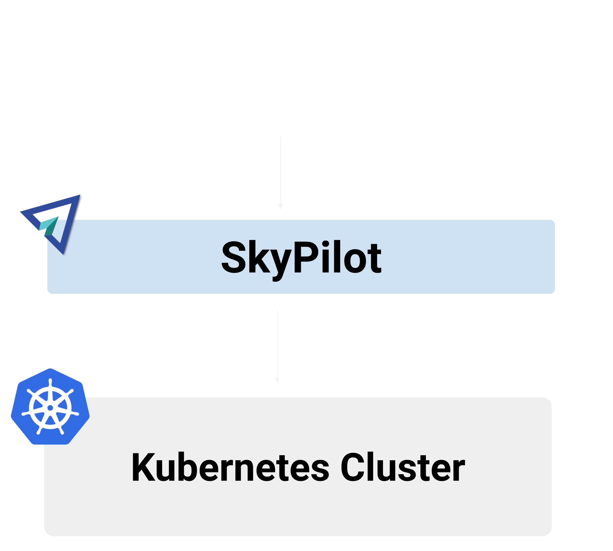
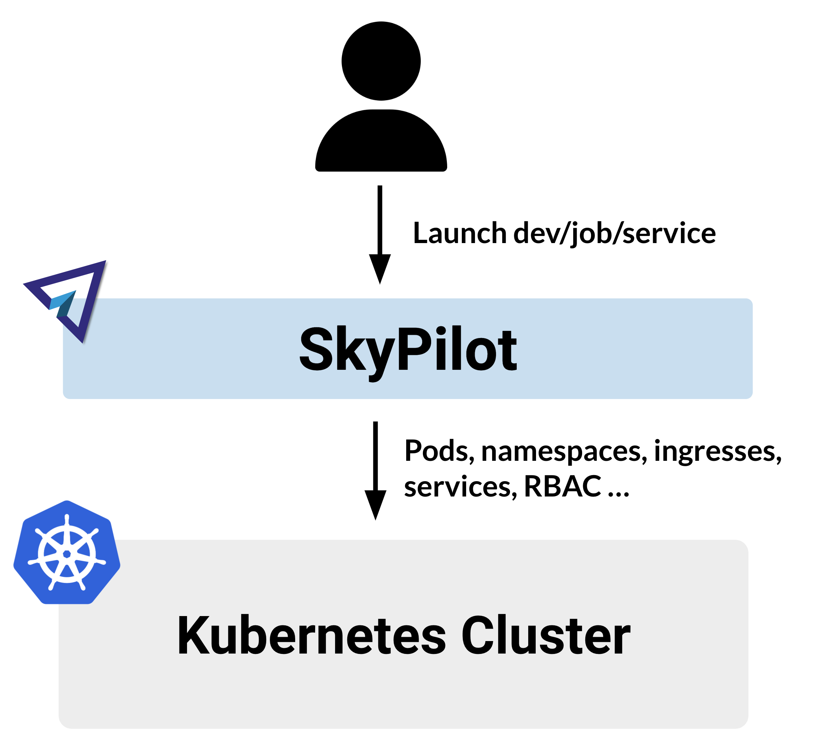

.. _sky-compare:

Comparing SkyPilot with other systems
=====================================

SkyPilot is a framework for running AI and batch workloads on any infrastructure. While SkyPilot offers unique capabilities, certain functionalities like job scheduling overlap with existing systems (e.g., Kubernetes, Slurm). That said, SkyPilot can be used in conjunction with them to provide additional benefits.

This page provides a comparison of SkyPilot with other systems, focusing on the unique benefits provided by SkyPilot. We welcome feedback and contributions to this page.

SkyPilot vs Vanilla Kubernetes
------------------------------

Kubernetes is a powerful system for managing containerized applications. :ref:`Using SkyPilot to access your Kubernetes cluster <kubernetes-overview>` boosts developer productivity and allows you to scale your infra beyond a single Kubernetes cluster.

..
   Figure sources
   Light: https://docs.google.com/drawings/d/1REe_W49SPJ44N-o4NRCKcIRhCkXG9o03ZXHh1mfLUzk/edit?usp=sharing
   Dark: https://docs.google.com/drawings/d/1MefAOXRNHj05B9raO3dCPhAyMJN3oWYM6nvUNgo8aoA/edit?usp=sharing

   SkyPilot layers on top of your Kubernetes cluster to deliver a better developer experience.

   SkyPilot layers on top of your Kubernetes cluster to deliver a better developer experience.

Faster developer velocity
^^^^^^^^^^^^^^^^^^^^^^^^^

SkyPilot provides faster iteration for interactive development. For example, a common workflow for AI engineers is to iteratively develop and train models by tweaking code and hyperparameters and observing the training runs.

* **With Kubernetes, a single iteration is a multi-step process** involving building a Docker image, pushing it to a registry, updating the Kubernetes YAML and then deploying it.

* :strong:`With SkyPilot, a single command (`:literal:`sky launch`:strong:`) takes care of everything.` Behind the scenes, SkyPilot provisions pods, installs all required dependencies, executes the job, returns logs, and provides SSH and VSCode access to debug.

.. figure:: https://blog.skypilot.co/ai-on-kubernetes/images/k8s_vs_skypilot_iterative_v2.png
    :align: center
    :width: 95%
    :alt: Iterative Development with Kubernetes vs SkyPilot

    Iterative Development with Kubernetes requires tedious updates to Docker images and multiple steps to update the training run. With SkyPilot, all you need is one CLI (``sky launch``).

Simpler YAMLs
^^^^^^^^^^^^^

Consider serving `Gemma <https://ai.google.dev/gemma>`_ with `vLLM <https://github.com/vllm-project/vllm>`_ on Kubernetes:

* **With vanilla Kubernetes**, you need over `65 lines of Kubernetes YAML <https://cloud.google.com/kubernetes-engine/docs/tutorials/serve-gemma-gpu-vllm#deploy-vllm>`_ to launch a Gemma model served with vLLM.
* **With SkyPilot**, an easy-to-understand `19-line YAML <https://gist.github.com/romilbhardwaj/b5b6b893e7a3749a2815f055f3f5351c>`_ launches a pod serving Gemma with vLLM.

Here is a side-by-side comparison of the YAMLs for serving Gemma with vLLM on SkyPilot vs Kubernetes:

.. raw:: html

   

       

            <h4> SkyPilot (19 lines) </h4>

.. code-block:: yaml
   :linenos:

   envs:
     MODEL_NAME: google/gemma-2b-it
     HF_TOKEN: myhftoken

   resources:
     image_id: docker:vllm/vllm-openai:latest
     accelerators: L4:1
     ports: 8000

   setup: |
     conda deactivate
     python3 -c "import huggingface_hub; huggingface_hub.login('${HF_TOKEN}')"

   run: |
     conda deactivate
     echo 'Starting vllm openai api server...'
     python -m vllm.entrypoints.openai.api_server \
     --model $MODEL_NAME --tokenizer hf-internal-testing/llama-tokenizer \
     --host 0.0.0.0

.. raw:: html

       

       

            <h4> Kubernetes (65 lines) </h4>

.. code-block:: yaml
   :linenos:

   apiVersion: apps/v1
   kind: Deployment
   metadata:
     name: vllm-gemma-deployment
   spec:
     replicas: 1
     selector:
       matchLabels:
         app: gemma-server
     template:
       metadata:
         labels:
           app: gemma-server
           ai.gke.io/model: gemma-1.1-2b-it
           ai.gke.io/inference-server: vllm
           examples.ai.gke.io/source: user-guide
       spec:
         containers:
         - name: inference-server
           image: us-docker.pkg.dev/vertex-ai/ vertex-vision-model-garden-dockers/pytorch-vllm-serve:20240527_0916_RC00
           resources:
             requests:
               cpu: "2"
               memory: "10Gi"
               ephemeral-storage: "10Gi"
               nvidia.com/gpu: 1
             limits:
               cpu: "2"
               memory: "10Gi"
               ephemeral-storage: "10Gi"
               nvidia.com/gpu: 1
           command: ["python3", "-m", "vllm.entrypoints.api_server"]
           args:
           - --model=$(MODEL_ID)
           - --tensor-parallel-size=1
           env:
           - name: MODEL_ID
             value: google/gemma-1.1-2b-it
           - name: HUGGING_FACE_HUB_TOKEN
             valueFrom:
               secretKeyRef:
                 name: hf-secret
                 key: hf_api_token
           volumeMounts:
           - mountPath: /dev/shm
             name: dshm
         volumes:
         - name: dshm
           emptyDir:
             medium: Memory
         nodeSelector:
           cloud.google.com/gke-accelerator: nvidia-l4
   ---
   apiVersion: v1
   kind: Service
   metadata:
     name: llm-service
   spec:
     selector:
       app: gemma-server
     type: ClusterIP
     ports:
       - protocol: TCP
         port: 8000
         targetPort: 8000

.. raw:: html

       

   

Scale beyond a single region/cluster
^^^^^^^^^^^^^^^^^^^^^^^^^^^^^^^^^^^^

.. figure:: https://blog.skypilot.co/ai-on-kubernetes/images/failover.png
    :align: center
    :width: 95%
    :alt: Scaling beyond a single region Kubernetes cluster with SkyPilot

    If the Kubernetes cluster is full, SkyPilot can get GPUs from other regions and clouds to run your tasks at the lowest cost.

A Kubernetes cluster is typically constrained to a single region in a single cloud.
This is because etcd, the control store for Kubernetes state, can timeout and fail when it faces highers latencies across regions [1]_ [2]_ [3]_.

Being restricted to a single region/cloud with Vanilla Kubernetes has two drawbacks:

1. `GPU availability is reduced <https://blog.skypilot.co/introducing-sky-serve/#why-skyserve>`_ because you cannot utilize
available capacity elsewhere.

2. `Costs increase <https://blog.skypilot.co/introducing-sky-serve/#why-skyserve>`_ as you are unable to
take advantage of cheaper resources in other regions.

SkyPilot is designed to scale across clouds and regions: it allows you to run your tasks on your Kubernetes cluster, and burst to more regions and clouds if needed. In doing so, SkyPilot ensures that your tasks are always running in the most cost-effective region, while maintaining high availability.

.. [1] `etcd FAQ <https://etcd.io/docs/v3.3/faq/#does-etcd-work-in-cross-region-or-cross-data-center-deployments>`_
.. [2] `"Multi-region etcd cluster performance issue" on GitHub <https://github.com/etcd-io/etcd/issues/12232>`_
.. [3] `DevOps StackExchange answer <https://devops.stackexchange.com/a/13194>`_
