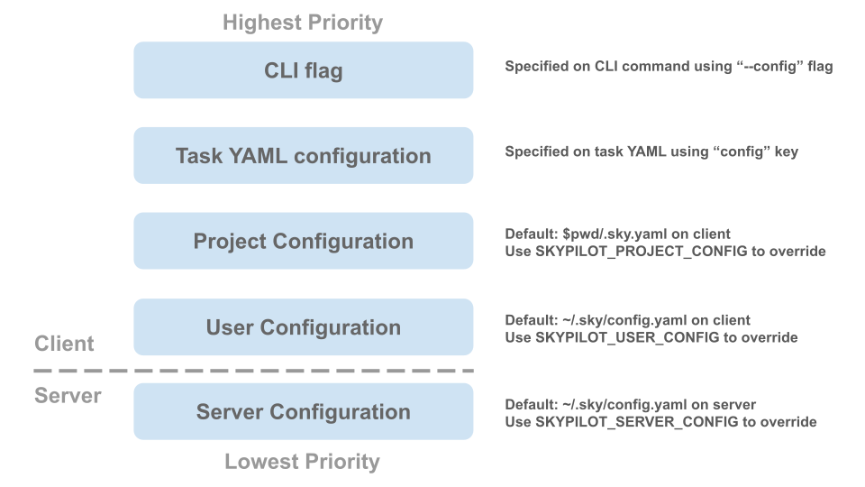

.. _config-sources-and-overrides:

Configuration Sources and Overrides
===================================

SkyPilot allows you to configure settings across multiple sources, providing flexibility in how you manage your configurations. 

It also implements a :ref:`priority<config-priority>` mechanism to combine configurations from different sources.

.. _config-sources:

Configuration sources
---------------------

+------------------------------------------+--------------------------------------+----------------------------------------------------------+
| **Configuration Type**                   | **Configuration Location**           | **Description**                                          |
+------------------------------------------+--------------------------------------+----------------------------------------------------------+
| :ref:`Server configuration<config-server-config>`                 | ``~/.sky/config.yaml`` on API server | Applies to all requests made to the SkyPilot API server. |
+------------------------------------------+--------------------------------------+----------------------------------------------------------+
| :ref:`User configuration<config-client-user-config>`                   | ``~/.sky/config.yaml``               | Applies to all SkyPilot invocations.                     |
+------------------------------------------+--------------------------------------+----------------------------------------------------------+
| :ref:`Project configuration<config-client-project-config>`                | ``$pwd/.sky.yaml``                   | Applies to all SkyPilot invocations in the current       |
|                                          |                                      | directory.                                               |
+------------------------------------------+--------------------------------------+----------------------------------------------------------+
| :ref:`SkyPilot YAML<config-client-job-task-yaml>`                        | ``config`` field in the SkyPilot YAML| Applies to a specific SkyPilot task.                     |
+------------------------------------------+--------------------------------------+----------------------------------------------------------+
| :ref:`CLI flags<config-client-cli-flag>`                            | Using ``--config`` CLI flag          | Override configuration for a specific command.           |
+------------------------------------------+--------------------------------------+----------------------------------------------------------+

All configurations use the :ref:`configuration syntax<config-yaml-syntax>`.

.. _config-priority:

You can layer configurations by using multiple configuration sources. When multiple configuration sources are specified, SkyPilot merges them. 

If fields conflict, they are :ref:`overridden<config-override>` in the following priority order:

#. CLI flag (highest priority)
#. SkyPilot YAML
#. Project configuration
#. User configuration
#. Server configuration (lowest priority)

.. note::

  The following fields are ignored if specified on the client side:

  * :ref:`admin_policy <config-yaml-admin-policy>`
  * :ref:`allowed_clouds <config-yaml-allowed-clouds>`

.. tip::

  If you are the admin of a SkyPilot API server, you can disable overrides or allow only certain fields to be overridden by enforcing an :ref:`admin policy <advanced-policy-config>`.

.. _config-server-config:

Server configuration
~~~~~~~~~~~~~~~~~~~~

If you are using a remote :ref:`SkyPilot API server <sky-api-server>`, it looks for ``~/.sky/config.yaml`` in the API server instance/container to find the server configuration.

To specify a different file, set ``SKYPILOT_SERVER_CONFIG`` environment variable to the desired path.

If you are using a local API server, you can use :ref:`User configuration<config-client-user-config>` to set global configuration.

.. _config-client-user-config:

User configuration
~~~~~~~~~~~~~~~~~~

SkyPilot client looks for ``~/.sky/config.yaml`` to find the user configuration.

To specify a different file, set ``SKYPILOT_USER_CONFIG`` environment variable to the desired path.

.. _config-client-project-config:

Project configuration
~~~~~~~~~~~~~~~~~~~~~

SkyPilot client looks for ``$pwd/.sky.yaml`` to find the current project configuration.

To specify a different file, set ``SKYPILOT_PROJECT_CONFIG`` environment variable to the desired path.

.. _config-client-job-task-yaml:

SkyPilot YAML
~~~~~~~~~~~~~

You can specify inline configuration options in SkyPilot YAML files in the :ref:`config <yaml-spec-config>` field.

The following fields are supported in SkyPilot YAML inline configuration:

* :ref:`docker.run_options <config-yaml-docker-run-options>`
* :ref:`nvidia_gpus.disable_ecc <config-yaml-nvidia-gpus-disable-ecc>`
* :ref:`kubernetes.pod_config <config-yaml-kubernetes-pod-config>`
* :ref:`kubernetes.provision_timeout <config-yaml-kubernetes-provision-timeout>`
* :ref:`gcp.managed_instance_group <config-yaml-gcp-managed-instance-group>`

Example:

.. code-block:: yaml

  # In your SkyPilot YAML
  config:
    docker:
      run_options: ...
    kubernetes:
      pod_config: ...
      provision_timeout: ...
    gcp:
      managed_instance_group: ...
    nvidia_gpus:
      disable_ecc: ...

.. _config-client-cli-flag:

CLI flag
~~~~~~~~

You can pass configuration arguments to the CLI using the ``--config`` flag.

The ``--config`` flag can either be a path to a config YAML file, or a dotlist of key-value pairs. Only one ``--config`` flag can be provided.

Example:

.. code-block:: bash

  # pass a config file
  sky launch --config my_config.yaml ...
  # pass individual config options
  sky launch --config 'kubernetes.provision_timeout=600,kubernetes.pod_config.spec.priorityClassName=high-priority' ...
  # this command is equivalent to the command above
  sky launch --config 'kubernetes.custom_metadata.annotations.myannotation1=myvalue1,kubernetes.custom_metadata.annotations.myannotation2=myvalue2' ...

Configuration overrides
-----------------------

If the same configuration field is specified in multiple configuration sources, configuration is combined based on :ref:`priority<config-priority>`.

Merging rules:

* Lists are overridden by config sources with higher priority.

  * Exception: lists in ``kubernetes.pod_config`` appended to the existing list.

* Dictionaries are merged, with individual keys overridden by config sources with higher priority.

Override Example
~~~~~~~~~~~~~~~~

If the following is configured in the :ref:`user config file<config-client-user-config>`:

.. code-block:: yaml

  kubernetes:
    allowed_contexts: [context1, context2]
    provision_timeout: 600
  aws:
    labels:
      map-migrated: my-value
      Owner: user-unique-name

And the following in the :ref:`project config file<config-client-project-config>`:

.. code-block:: yaml

  # project config overrides user config
  kubernetes:
    allowed_contexts: [context3, context4]
    provision_timeout: 300
  aws:
    labels:
      Owner: project-unique-name

The combined configuration is:

.. code-block:: yaml

  kubernetes:
    # lists are overridden by config sources with higher priority
    allowed_contexts: [context3, context4]
    provision_timeout: 300
    aws:
      # dicts are merged, with individual keys overridden by
      # config sources with higher priority
      labels:
        map-migrated: my-value
        Owner: project-unique-name
