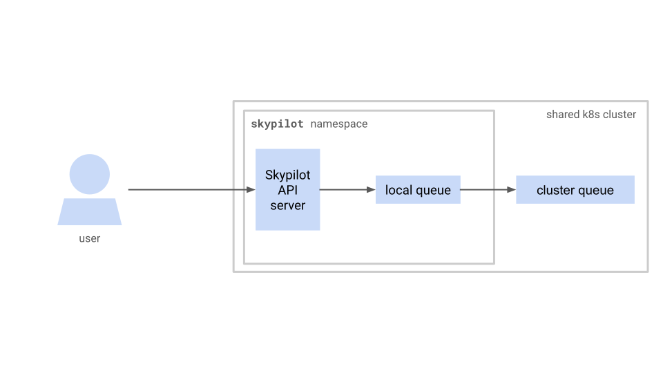

.. _kubernetes-example-kueue:

Using SkyPilot with Kueue
=========================

Kueue is an open source Kubernetes job scheduler.
This example shows how SkyPilot can be used with Kueue to schedule jobs on Kubernetes.

The example below walks through the steps to set up a SkyPilot API server and Kueue in the following architecture:

Prerequisites
-------------

* A Kubernetes cluster with LoadBalancer or NodePort service support
* `Helm <https://helm.sh/docs/intro/install/>`_
* `kubectl <https://kubernetes.io/docs/tasks/tools/#kubectl>`_
* `yq <https://github.com/mikefarah/yq/#install>`_

Install Kueue
-------------

This example assumes a Kubernetes cluster is already set up.

To install Kueue, run the following command:

.. code-block:: bash

    # See https://github.com/kubernetes-sigs/kueue/releases for available versions.
    VERSION=v0.11.4
    kubectl apply --server-side -f https://github.com/kubernetes-sigs/kueue/releases/download/$VERSION/manifests.yaml

Patch Kueue to support plain pods
---------------------------------

Kueue does not support scheduling plain pods out of the box. Since SkyPilot creates and manages workloads as pods,
the Kueue config needs to be patched to support plain pods.

.. code-block:: bash

    # Extract and patch the config and save it to /tmp/kueueconfig.yaml
    # This is required because SkyPilot creates and manages workloads as pods
    kubectl -n kueue-system get cm kueue-manager-config -o jsonpath={.data.controller_manager_config\\.yaml} | yq '.integrations.frameworks += ["pod"]' > /tmp/kueueconfig.yaml
    # Create an updated ConfigMap from /tmp/kueueconfig.yaml and apply the changes
    kubectl -n kueue-system create cm kueue-manager-config --from_file=controller_manager_config.yaml=/tmp/kueueconfig.yaml --dry-run=client -o yaml | kubectl -n kueue-system apply -f -
    # Restart the kueue-controller-manager pod with the following command
    kubectl -n kueue-system rollout restart deployment kueue-controller-manager
    # Wait for the restart to complete
    kubectl -n kueue-system rollout status deployment kueue-controller-manager

Check that the patch is applied by running the following command:

.. code-block:: bash

    kubectl -n kueue-system get cm kueue-manager-config -o jsonpath={.data.controller_manager_config\\.yaml} | yq '.integrations.frameworks'

This should output:

.. code-block:: bash

    ...
    - pod

Create a Kueue resource flavor
------------------------------

A ResourceFlavor is an object that represents resource variations (such as CPU architecture, GPU type, etc.)
and allows you to associate them with cluster nodes through labels, taints and tolerations.

.. note::

    To learn more about ResourceFlavor, see:

    - `Kueue Resource Flavor <https://kueue.sigs.k8s.io/docs/concepts/resource_flavor/>`_
    - `Cluster Queue Flavors and Resources <https://kueue.sigs.k8s.io/docs/concepts/cluster_queue/#flavors-and-resources>`_

Every queue needs to be associated with at least one resource flavor.
In case different types of resources do not need to be managed separately,
an empty ResourceFlavor without any labels or taints can be created.

Here a default, empty resource flavor is created to be used with Kueue.
This flavor is used to create a cluster queue and a local queue.

``kueue-resource-flavor.yaml``:

.. code-block:: yaml

    apiVersion: kueue.x-k8s.io/v1beta1
    kind: ResourceFlavor
    metadata:
      name: "default-flavor"

To create the resource flavor above, save the snippet to ``kueue-resource-flavor.yaml`` and run the following command:

.. code-block:: bash

    kubectl apply -f kueue-resource-flavor.yaml

Create a Kueue admission check
------------------------------

By default, Kueue will admit all pods that fits within the cluster queue's resource quota.
However, there may be cases where the underlying cluster does not have the necessary resources,
regardless of the quota.

To address this, an admission check is created to check if the necessary resources are available
in the underlying cluster.

``kueue-admission-check.yaml``:

.. code-block:: yaml

    apiVersion: kueue.x-k8s.io/v1beta1
    kind: AdmissionCheck
    metadata:
      name: skypilot-kueue-prov
    spec:
      controllerName: kueue.x-k8s.io/provisioning-request
      parameters:
        apiGroup: kueue.x-k8s.io
        kind: ProvisioningRequestConfig
        name: skypilot-kueue-config
    ---
    apiVersion: kueue.x-k8s.io/v1beta1
    kind: ProvisioningRequestConfig
    metadata:
      name: skypilot-kueue-config
    spec:
      provisioningClassName: check-capacity.autoscaling.x-k8s.io
      managedResources:
      - nvidia.com/gpu
      - cpu
      - memory

The ``ProvisioningClassConfig`` above uses ``ProvisioningClassName`` of ``check-capacity.autoscaling.x.k8s-io``,
one of the two ``ProvisioningClassName`` s that are supported
`out of the box <https://github.com/kubernetes/autoscaler/blob/master/cluster-autoscaler/FAQ.md#supported-provisioningclasses>`_.

This ProvisioningClass checks if necessary resources are available in the underlying cluster, and will attempt to
provision them via an autoscaler if one is available.

Different cloud providers may provide their own ``ProvisioningClassName`` for their own autoscalers.
For example, GKE provides ``queued-provisioning.gke.io`` which integrates with GKE autoscaling node pools.

To create the admission check and provisioning request config above, save the snippet to ``kueue-admission-check.yaml`` and run the following command:

.. code-block:: bash

    kubectl apply -f kueue-admission-check.yaml

Create a cluster queue and a local queue
----------------------------------------

Kueue has a two level hierarchy: cluster queues and local queues.

A cluster queue is a Kueue resource that defines the resource quota and admission checks.
A cluster queue is shared across all namespaces.

A local queue is a Kueue resource that defines the resource quota for a namespace.
A local queue is created in a namespace and is only applicable to that namespace.
A local queue points to a cluster queue. Multiple local queues can point to the same cluster queue.

Here, a cluster queue and a local queue are created.

``kueue.yaml``:

.. code-block:: yaml

    apiVersion: kueue.x-k8s.io/v1beta1
    kind: ClusterQueue
    metadata:
      name: "skypilot-cluster-queue"
    spec:
      namespaceSelector: {} # match all namespaces
      resourceGroups:
      - coveredResources: ["cpu", "memory", "nvidia.com/gpu"]
        flavors:
        - name: "default-flavor"
          # Adjust this value based on actual resource needs instead of "Infinite"
          resources:
          - name: "cpu"
            nominalQuota: 1000000000    # "Infinite" quota
          - name: "memory"
            nominalQuota: 1000000000Gi  # "Infinite" quota
          - name: "nvidia.com/gpu"
            nominalQuota: 1000000000    # "Infinite" quota
      admissionChecks:
      - skypilot-kueue-prov
    ---
    apiVersion: kueue.x-k8s.io/v1beta1
    kind: LocalQueue
    metadata:
      # A local queue is in a namespace
      namespace: "skypilot"
      name: "skypilot-local-queue"
    spec:
      clusterQueue: "skypilot-cluster-queue"

To create the cluster and local queues above, save the snippet to ``kueue.yaml`` and run the following command:

.. code-block:: bash

    # if 'skypilot' namespace does not exist, create it
    kubectl create namespace skypilot
    # create the cluster and local queue
    kubectl apply -f kueue.yaml

Now, jobs can be submitted to the local queue ``skypilot-local-queue``.
Jobs are subject to the quota defined in the cluster queue,
and the jobs are ordered by their priority.

At this point, the cluster and local queue are created. However, the SkyPilot API server is not yet configured to interact with the queues.

In the next section, the SkyPilot API server is configured to submit jobs to the local queue.

Configure SkyPilot API server to use Kueue
------------------------------------------

For the SkyPilot API server to submit jobs to a kueue, the following config should be set on the API server:

``~/.sky/config.yaml``:

.. code-block:: yaml

    kubernetes:
      pod_config:
        metadata:
          labels:
            kueue.x-k8s.io/queue-name: skypilot-local-queue

The config above allows the API server to submit jobs using the local queue.

Further reading
---------------

To learn more about Kueue, see the `Kueue documentation <https://kueue.x-k8s.io/docs/overview/>`_.

Specifically, the following sections describe concepts that can be used to manage SkyPilot jobs with Kueue more effectively:

- `Implement resource sharing between cluster queues and define hierarchical quotas <https://kueue.sigs.k8s.io/docs/concepts/cohort/>`_
- `Implement workload priorities <https://kueue.sigs.k8s.io/docs/concepts/workload_priority_class/>`_
- `Define multiple resource flavors <https://kueue.sigs.k8s.io/docs/concepts/resource_flavor/>`_
- `Set up gang scheduling of multiple pods <https://kueue.sigs.k8s.io/docs/tasks/run/plain_pods/#running-a-group-of-pods-to-be-admitted-together>`_
- `Use Kueue with multiple clusters <https://kueue.sigs.k8s.io/docs/concepts/multikueue/>`_
- `Troubleshoot Kueue <https://kueue.sigs.k8s.io/docs/tasks/troubleshooting/>`_
