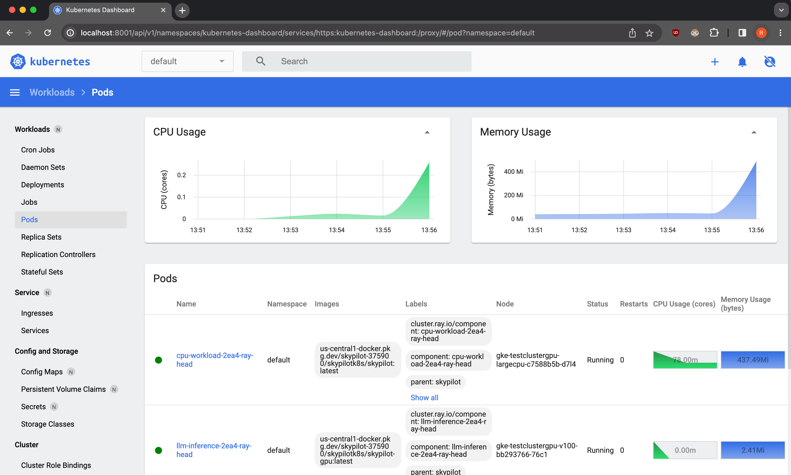

.. _kubernetes-setup:

Kubernetes Cluster Setup
========================

.. note::
    This is a guide for cluster administrators on how to set up Kubernetes clusters
    for use with SkyPilot.

    If you are a SkyPilot user and your cluster administrator has already set up a cluster
    and shared a kubeconfig file with you, :ref:`Submitting tasks to Kubernetes <kubernetes-instructions>`
    explains how to submit tasks to your cluster.

SkyPilot's Kubernetes support is designed to work with most Kubernetes distributions and deployment environments.

To connect to a Kubernetes cluster, SkyPilot needs:

* An existing Kubernetes cluster running Kubernetes v1.20 or later.
* A `Kubeconfig <kubeconfig>`_ file containing access credentials and namespace to be used.

Deployment Guides
-----------------
Below we show minimal examples to set up a new Kubernetes cluster in different environments, including hosted services on the cloud, and generating kubeconfig files which can be :ref:`used by SkyPilot <kubernetes-instructions>`.

..
  TODO(romilb) - Add a table of contents/grid cards for each deployment environment.

* :ref:`Deploying locally on your laptop <kubernetes-setup-kind>`
* :ref:`Deploying on Google Cloud GKE <kubernetes-setup-gke>`
* :ref:`Deploying on Amazon EKS <kubernetes-setup-eks>`
* :ref:`Deploying on on-prem clusters <kubernetes-setup-onprem>`

.. _kubernetes-setup-kind:

Deploying locally on your laptop
^^^^^^^^^^^^^^^^^^^^^^^^^^^^^^^^

To try out SkyPilot on Kubernetes on your laptop or run SkyPilot
tasks locally without requiring any cloud access, we provide the
:code:`sky local up` CLI to create a 1-node Kubernetes cluster locally.

Under the hood, :code:`sky local up` uses `kind <https://kind.sigs.k8s.io/>`_,
a tool for creating a Kubernetes cluster on your local machine.
It runs a Kubernetes cluster inside a container, so no setup is required.

1. Install `Docker <https://docs.docker.com/engine/install/>`_ and `kind <https://kind.sigs.k8s.io/>`_.
2. Run :code:`sky local up` to launch a Kubernetes cluster and automatically configure your kubeconfig file:

   .. code-block:: console

     $ sky local up

3. Run :code:`sky check` and verify that Kubernetes is enabled in SkyPilot. You can now run SkyPilot tasks on this locally hosted Kubernetes cluster using :code:`sky launch`.
4. After you are done using the cluster, you can remove it with :code:`sky local down`. This will terminate the KinD container and switch your kubeconfig back to it's original context:

   .. code-block:: console

     $ sky local down

.. note::
    We recommend allocating at least 4 or more CPUs to your docker runtime to
    ensure kind has enough resources. See instructions
    `here <https://docs.docker.com/desktop/settings/linux/>`_.

.. note::
    kind does not support multiple nodes and GPUs.
    It is not recommended for use in a production environment.
    If you want to run a private on-prem cluster, see the section on :ref:`on-prem deployment <kubernetes-setup-onprem>` for more.

.. _kubernetes-setup-gke:

Deploying on Google Cloud GKE
^^^^^^^^^^^^^^^^^^^^^^^^^^^^^

1. Create a GKE standard cluster with at least 1 node. We recommend creating nodes with at least 4 vCPUs.
2. Get the kubeconfig for your cluster. The following command will automatically update ``~/.kube/config`` with new kubecontext for the GKE cluster:

   .. code-block:: console

     $ gcloud container clusters get-credentials <cluster-name> --region <region>

     # Example:
     # gcloud container clusters get-credentials testcluster --region us-central1-c

3. [If using GPUs] If your GKE nodes have GPUs, you may need to to
   `manually install <https://kubernetes.io/docs/setup/production-environment/tools/kubeadm/create-cluster-kubeadm/>`_
   nvidia drivers. You can do so by deploying the daemonset
   depending on the GPU and OS on your nodes:

   .. code-block:: console

     # For Container Optimized OS (COS) based nodes with GPUs other than Nvidia L4 (e.g., V100, A100, ...):
     $ kubectl apply -f https://raw.githubusercontent.com/GoogleCloudPlatform/container-engine-accelerators/master/nvidia-driver-installer/cos/daemonset-preloaded.yaml

     # For Container Optimized OS (COS) based nodes with L4 GPUs:
     $ kubectl apply -f https://raw.githubusercontent.com/GoogleCloudPlatform/container-engine-accelerators/master/nvidia-driver-installer/cos/daemonset-preloaded-latest.yaml

     # For Ubuntu based nodes with GPUs other than Nvidia L4 (e.g., V100, A100, ...):
     $ kubectl apply -f https://raw.githubusercontent.com/GoogleCloudPlatform/container-engine-accelerators/master/nvidia-driver-installer/ubuntu/daemonset-preloaded.yaml

     # For Ubuntu based nodes with L4 GPUs:
     $ kubectl apply -f https://raw.githubusercontent.com/GoogleCloudPlatform/container-engine-accelerators/master/nvidia-driver-installer/ubuntu/daemonset-preloaded-R525.yaml

   To verify if GPU drivers are set up, run ``kubectl describe nodes`` and verify that ``nvidia.com/gpu`` is listed under the ``Capacity`` section.

4. Verify your kubeconfig (and GPU support, if available) is correctly set up by running :code:`sky check`:

   .. code-block:: console

     $ sky check

.. note::
    GKE autopilot clusters are currently not supported. Only GKE standard clusters are supported.

.. _kubernetes-setup-eks:

Deploying on Amazon EKS
^^^^^^^^^^^^^^^^^^^^^^^

1. Create a EKS cluster with at least 1 node. We recommend creating nodes with at least 4 vCPUs.

2. Get the kubeconfig for your cluster. The following command will automatically update ``~/.kube/config`` with new kubecontext for the EKS cluster:

   .. code-block:: console

     $ aws eks update-kubeconfig --name <cluster-name> --region <region>

     # Example:
     # aws eks update-kubeconfig --name testcluster --region us-west-2

3. [If using GPUs] EKS clusters already come with Nvidia drivers set up. However, you will need to label the nodes with the GPU type. Use the SkyPilot node labelling tool to do so:

   .. code-block:: console

     python -m sky.utils.kubernetes.gpu_labeler

   This will create a job on each node to read the GPU type from `nvidia-smi` and assign a ``skypilot.co/accelerator`` label to the node. You can check the status of these jobs by running:

   .. code-block:: console

     kubectl get jobs -n kube-system

4. Verify your kubeconfig (and GPU support, if available) is correctly set up by running :code:`sky check`:

   .. code-block:: console

     $ sky check

.. _kubernetes-setup-onprem:

Deploying on on-prem clusters
^^^^^^^^^^^^^^^^^^^^^^^^^^^^^

You can also deploy Kubernetes on your on-prem clusters using off-the-shelf tools,
such as `kubeadm <https://kubernetes.io/docs/setup/production-environment/tools/kubeadm/create-cluster-kubeadm/>`_,
`k3s <https://docs.k3s.io/quick-start>`_ or
`Rancher <https://ranchermanager.docs.rancher.com/v2.5/pages-for-subheaders/kubernetes-clusters-in-rancher-setup>`_.
Please follow their respective guides to deploy your Kubernetes cluster.

.. _kubernetes-setup-gpusupport:

Setting up GPU support
~~~~~~~~~~~~~~~~~~~~~~
If your Kubernetes cluster has Nvidia GPUs, ensure that:

1. The Nvidia GPU operator is installed (i.e., ``nvidia.com/gpu`` resource is available on each node) and ``nvidia`` is set as the default runtime for your container engine. See `Nvidia's installation guide <https://docs.nvidia.com/datacenter/cloud-native/gpu-operator/latest/getting-started.html#install-nvidia-gpu-operator>`_ for more details.
2. Each node in your cluster is labelled with the GPU type. This labelling can be done using `SkyPilot's GPU labelling script <automatic-gpu-labelling_>`_ or by manually adding a label of the format ``skypilot.co/accelerator: <gpu_name>``, where the ``<gpu_name>`` is the lowercase name of the GPU. For example, a node with V100 GPUs must have a label :code:`skypilot.co/accelerator: v100`.

.. tip::
    You can check if GPU operator is installed and the ``nvidia`` runtime is set as default by running:

    .. code-block:: console

        $ kubectl apply -f https://raw.githubusercontent.com/skypilot-org/skypilot/master/tests/kubernetes/gpu_test_pod.yaml
        $ watch kubectl get pods
        # If the pod status changes to completed after a few minutes, your Kubernetes environment is set up correctly.

.. note::

    Refer to :ref:`Notes for specific Kubernetes distributions <kubernetes-setup-onprem-distro-specific>` for additional instructions on setting up GPU support on specific Kubernetes distributions, such as RKE2 and K3s.

.. note::

    GPU labels are case-sensitive. Ensure that the GPU name is lowercase if you are using the ``skypilot.co/accelerator`` label.

.. note::

    GPU labelling is not required on GKE clusters - SkyPilot will automatically use GKE provided labels. However, you will still need to install `drivers <https://cloud.google.com/kubernetes-engine/docs/how-to/gpus#installing_drivers>`_.

.. _automatic-gpu-labelling:

Automatic GPU labelling
~~~~~~~~~~~~~~~~~~~~~~~

We provide a convenience script that automatically detects GPU types and labels each node. You can run it with:

.. code-block:: console

 $ python -m sky.utils.kubernetes.gpu_labeler

 Created GPU labeler job for node ip-192-168-54-76.us-west-2.compute.internal
 Created GPU labeler job for node ip-192-168-93-215.us-west-2.compute.internal
 GPU labeling started - this may take 10 min or more to complete.
 To check the status of GPU labeling jobs, run `kubectl get jobs --namespace=kube-system -l job=sky-gpu-labeler`
 You can check if nodes have been labeled by running `kubectl describe nodes` and looking for labels of the format `skypilot.co/accelerator: <gpu_name>`.

.. note::

    If the GPU labelling process fails, you can run ``python -m sky.utils.kubernetes.gpu_labeler --cleanup`` to clean up the failed jobs.

Once the cluster is deployed and you have placed your kubeconfig at ``~/.kube/config``, verify your setup by running :code:`sky check`:

.. code-block:: console

    $ sky check

This should show ``Kubernetes: Enabled`` without any warnings.

You can also check the GPUs available on your nodes by running:

.. code-block:: console

    $ sky show-gpus --cloud kubernetes

.. tip::

    If automatic GPU labelling fails, you can manually label your nodes with the GPU type. Use the following command to label your nodes:

    .. code-block:: console

        $ kubectl label nodes <node-name> skypilot.co/accelerator=<gpu_name>

.. _kubernetes-setup-onprem-distro-specific:

Notes for specific Kubernetes distributions
~~~~~~~~~~~~~~~~~~~~~~~~~~~~~~~~~~~~~~~~~~~

Rancher Kubernetes Engine 2 (RKE2)
**********************************

Nvidia GPU operator installation on RKE2 through helm requires extra flags to set ``nvidia`` as the default runtime for containerd.

.. code-block:: console

    $ helm install gpu-operator -n gpu-operator --create-namespace \
      nvidia/gpu-operator $HELM_OPTIONS \
        --set 'toolkit.env[0].name=CONTAINERD_CONFIG' \
        --set 'toolkit.env[0].value=/var/lib/rancher/rke2/agent/etc/containerd/config.toml.tmpl' \
        --set 'toolkit.env[1].name=CONTAINERD_SOCKET' \
        --set 'toolkit.env[1].value=/run/k3s/containerd/containerd.sock' \
        --set 'toolkit.env[2].name=CONTAINERD_RUNTIME_CLASS' \
        --set 'toolkit.env[2].value=nvidia' \
        --set 'toolkit.env[3].name=CONTAINERD_SET_AS_DEFAULT' \
        --set-string 'toolkit.env[3].value=true'

Refer to instructions on `Nvidia GPU Operator installation with Helm on RKE2 <https://docs.nvidia.com/datacenter/cloud-native/gpu-operator/latest/getting-started.html#rancher-kubernetes-engine-2>`_ for details.

K3s
***

Installing Nvidia GPU operator on K3s is similar to `RKE2 instructions from Nvidia <https://docs.nvidia.com/datacenter/cloud-native/gpu-operator/latest/getting-started.html#rancher-kubernetes-engine-2>`_, but requires changing
the ``CONTAINERD_CONFIG`` variable to ``/var/lib/rancher/k3s/agent/etc/containerd/config.toml.tmpl``. Here is an example command to install the Nvidia GPU operator on K3s:

.. code-block:: console

    $ helm install gpu-operator -n gpu-operator --create-namespace \
      nvidia/gpu-operator $HELM_OPTIONS \
        --set 'toolkit.env[0].name=CONTAINERD_CONFIG' \
        --set 'toolkit.env[0].value=/var/lib/rancher/k3s/agent/etc/containerd/config.toml' \
        --set 'toolkit.env[1].name=CONTAINERD_SOCKET' \
        --set 'toolkit.env[1].value=/run/k3s/containerd/containerd.sock' \
        --set 'toolkit.env[2].name=CONTAINERD_RUNTIME_CLASS' \
        --set 'toolkit.env[2].value=nvidia'

Check the status of the GPU operator installation by running ``kubectl get pods -n gpu-operator``. It takes a few minutes to install and some CrashLoopBackOff errors are expected during the installation process.

.. tip::

    If your gpu-operator installation stays stuck in CrashLoopBackOff, you may need to create a symlink to the ``ldconfig`` binary to work around a `known issue <https://github.com/NVIDIA/nvidia-docker/issues/614#issuecomment-423991632>`_ with nvidia-docker runtime. Run the following command on your nodes:

    .. code-block:: console

        $ ln -s /sbin/ldconfig /sbin/ldconfig.real

After the GPU operator is installed, create the nvidia RuntimeClass required by K3s. This runtime class will automatically be used by SkyPilot to schedule GPU pods:

.. code-block:: console

    $ kubectl apply -f - <<EOF
    apiVersion: node.k8s.io/v1
    kind: RuntimeClass
    metadata:
      name: nvidia
    handler: nvidia
    EOF

Now you can label your K3s nodes with the :code:`skypilot.co/accelerator` label using the `SkyPilot GPU labelling script <automatic-gpu-labelling_>`_ above.

.. _kubernetes-ports:

Setting up Ports on Kubernetes
-------------------------------

.. note::
    This is a guide on how to configure an existing Kubernetes cluster (along with the caveats involved) to successfully expose ports and services externally through SkyPilot.

    If you are a SkyPilot user and your cluster has already been set up to expose ports,
    :ref:`Opening Ports <ports>` explains how to expose services in your task through SkyPilot.

SkyPilot clusters can :ref:`open ports <ports>` to expose services. For SkyPilot
clusters running on Kubernetes, we support either of two modes to expose ports:

* :ref:`LoadBalancer Service <kubernetes-loadbalancer>` (default)
* :ref:`Nginx Ingress <kubernetes-ingress>`

By default, SkyPilot creates a `LoadBalancer Service <https://kubernetes.io/docs/concepts/services-networking/service/>`__ on your Kubernetes cluster to expose the port.

If your cluster does not support LoadBalancer services, SkyPilot can also use `an existing Nginx IngressController <https://kubernetes.github.io/ingress-nginx/>`_ to create an `Ingress <https://kubernetes.io/docs/concepts/services-networking/ingress/>`_ to expose your service.

.. _kubernetes-loadbalancer:

LoadBalancer Service
^^^^^^^^^^^^^^^^^^^^

This mode exposes ports through a Kubernetes `LoadBalancer Service <https://kubernetes.io/docs/concepts/services-networking/service/#loadbalancer>`__. This is the default mode used by SkyPilot.

To use this mode, you must have a Kubernetes cluster that supports LoadBalancer Services:

* On Google GKE, Amazon EKS or other cloud-hosted Kubernetes services, this mode is supported out of the box and no additional configuration is needed.
* On bare metal and self-managed Kubernetes clusters, `MetalLB <https://metallb.universe.tf/>`_ can be used to support LoadBalancer Services.

When using this mode, SkyPilot will create a single LoadBalancer Service for all ports that you expose on a cluster.
Each port can be accessed using the LoadBalancer's external IP address and the port number. Use :code:`sky status --endpoints <cluster>` to view the external endpoints for all ports.

.. note::
    In cloud based Kubernetes clusters, this will automatically create an external Load Balancer.     GKE creates a (`pass-through load balancer <https://cloud.google.com/kubernetes-engine/docs/concepts/service-load-balancer>`__)
    and AWS creates a `Network Load Balancer <https://docs.aws.amazon.com/eks/latest/userguide/network-load-balancing.html>`__). These load balancers will be automatically terminated when the cluster is deleted.

.. note::
    The default LoadBalancer implementation in EKS selects a random port from the list of opened ports for the
    `LoadBalancer's health check <https://docs.aws.amazon.com/elasticloadbalancing/latest/network/target-group-health-checks.html>`_. This can cause issues if the selected port does not have a service running behind it.

    For example, if a SkyPilot task exposes 5 ports but only 2 of them have services running behind them, EKS may select a port that does not have a service running behind it and the LoadBalancer will not pass the healthcheck. As a result, the service will not be assigned an external IP address.

    To work around this issue, make sure all your ports have services running behind them.

.. note::
    LoadBalancer services are not supported on kind clusters created using :code:`sky local up`.

.. _kubernetes-ingress:

Nginx Ingress
^^^^^^^^^^^^^

This mode exposes ports by creating a Kubernetes `Ingress <https://kubernetes.io/docs/concepts/services-networking/ingress/>`_ backed by an existing `Nginx Ingress Controller <https://kubernetes.github.io/ingress-nginx/>`_.

To use this mode:

1. Install the Nginx Ingress Controller on your Kubernetes cluster. Refer to the `documentation <https://kubernetes.github.io/ingress-nginx/deploy/>`_ for installation instructions specific to your environment.
2. Verify that the ``ingress-nginx-controller`` service has a valid external IP:

.. code-block:: bash

    $ kubectl get service ingress-nginx-controller -n ingress-nginx

    # Example output:
    # NAME                             TYPE                CLUSTER-IP    EXTERNAL-IP     PORT(S)
    # ingress-nginx-controller         LoadBalancer        10.24.4.254   35.202.58.117   80:31253/TCP,443:32699/TCP

.. note::
    If the ``EXTERNAL-IP`` field is ``<none>``, you must manually assign an External IP.
    This can be done by patching the service with an IP that can be accessed from outside the cluster.
    If the service type is ``NodePort``, you can set the ``EXTERNAL-IP`` to any node's IP address:

    .. code-block:: bash

      # Patch the nginx ingress service with an external IP. Can be any node's IP if using NodePort service.
      # Replace <IP> in the following command with the IP you select.
      $ kubectl patch svc ingress-nginx-controller -n ingress-nginx -p '{"spec": {"externalIPs": ["<IP>"]}}'

    If the ``EXTERNAL-IP`` field is left as ``<none>``, SkyPilot will use ``localhost`` as the external IP for the Ingress,
    and the endpoint may not be accessible from outside the cluster.

3. Update the :ref:`SkyPilot config <config-yaml>` at :code:`~/.sky/config` to use the ingress mode.

.. code-block:: yaml

    kubernetes:
      ports: ingress

.. tip::

    For RKE2 and K3s, the pre-installed Nginx ingress is not correctly configured by default. Follow the `bare-metal installation instructions <https://kubernetes.github.io/ingress-nginx/deploy/#bare-metal-clusters/>`_ to set up the Nginx ingress controller correctly.

When using this mode, SkyPilot creates an ingress resource and a ClusterIP service for each port opened. The port can be accessed externally by using the Ingress URL plus a path prefix of the form :code:`/skypilot/{pod_name}/{port}`.

Use :code:`sky status --endpoints <cluster>` to view the full endpoint URLs for all ports.

.. code-block::

    $ sky status --endpoints mycluster
    8888: http://34.173.152.251/skypilot/test-2ea4/8888

.. note::

    When exposing a port under a sub-path such as an ingress, services expecting root path access, (e.g., Jupyter notebooks) may face issues. To resolve this, configure the service to operate under a different base URL. For Jupyter, use `--NotebookApp.base_url <https://jupyter-notebook.readthedocs.io/en/5.7.4/config.html>`_ flag during launch. Alternatively, consider using :ref:`LoadBalancer <kubernetes-loadbalancer>` mode.

.. note::

    Currently, SkyPilot does not support opening ports on a Kubernetes cluster using the `Gateway API <https://kubernetes.io/docs/concepts/services-networking/gateway/>`_.
    If you are interested in this feature, please `reach out <https//slack.skypilot.co>`_.

.. _kubernetes-observability:

Observability for Administrators
--------------------------------
All SkyPilot tasks are run in pods inside a Kubernetes cluster. As a cluster administrator,
you can inspect running pods (e.g., with :code:`kubectl get pods -n namespace`) to check which
tasks are running and how many resources they are consuming on the cluster.

Additionally, you can also deploy tools such as the `Kubernetes dashboard <https://kubernetes.io/docs/tasks/access-application-cluster/web-ui-dashboard/>`_ for easily viewing and managing
SkyPilot tasks running on your cluster.

As a demo, we provide a sample Kubernetes dashboard deployment manifest that you can deploy with:

.. code-block:: console

    $ kubectl apply -f https://raw.githubusercontent.com/skypilot-org/skypilot/master/tests/kubernetes/scripts/dashboard.yaml

To access the dashboard, run:

.. code-block:: console

    $ kubectl proxy

In a browser, open http://localhost:8001/api/v1/namespaces/kubernetes-dashboard/services/https:kubernetes-dashboard:/proxy/ and click on Skip when
prompted for credentials.

Note that this dashboard can only be accessed from the machine where the ``kubectl proxy`` command is executed.

.. note::
    The demo dashboard is not secure and should not be used in production. Please refer to the
    `Kubernetes documentation <https://kubernetes.io/docs/tasks/access-application-cluster/web-ui-dashboard/>`_
    for more information on how to set up access control for the dashboard.

Troubleshooting Kubernetes Setup
--------------------------------

If you encounter issues while setting up your Kubernetes cluster, please refer to the :ref:`troubleshooting guide <kubernetes-troubleshooting>` to diagnose and fix issues.
