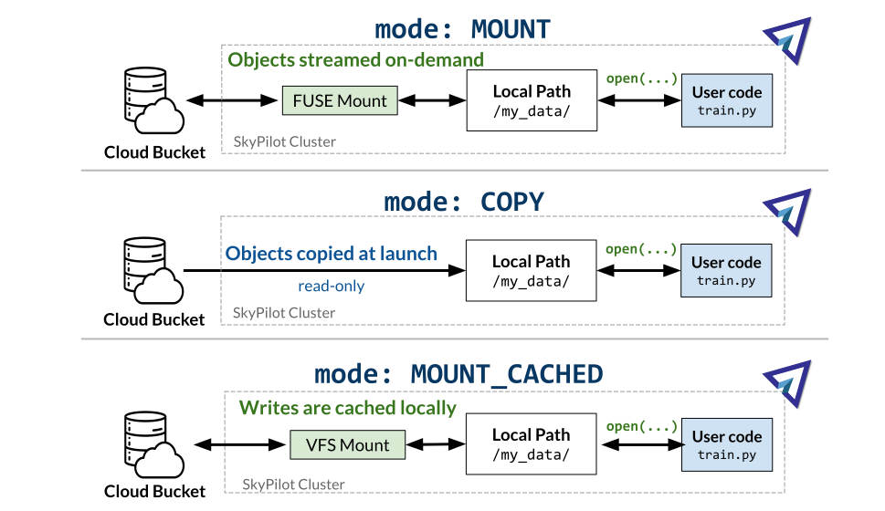

.. _sky-storage:

Cloud Buckets
==============

SkyPilot tasks can access data from buckets in cloud object storages such as AWS S3, Google Cloud Storage (GCS), Cloudflare R2, OCI Object Storage or IBM COS.

Buckets are made available to each task at a local path on the remote VM, so
the task can access bucket objects as if they were local files.

Usage
-----

Object storages are specified using the :code:`file_mounts` field in a SkyPilot task.

.. tab-set::

    .. tab-item:: Use an existing bucket
        :sync: existing-bucket-tab

        To access an existing bucket (e.g., created through cloud CLI or other tools),
        specify ``source``.

        .. code-block:: yaml

          # Mount an existing S3 bucket
          file_mounts:
            /my_data:
              source: s3://my-bucket/  # or gs://, https://<azure_storage_account>.blob.core.windows.net/<container>, r2://, cos://<region>/<bucket>, oci://<bucket_name>
              mode: MOUNT  # MOUNT or COPY or MOUNT_CACHED. Defaults to MOUNT. Optional.

        This will `mount <storage-mounting-modes_>`__ the contents of the bucket at ``s3://my-bucket/`` to the remote VM at ``/my_data``.

    .. tab-item:: Create a bucket
        :sync: empty-bucket-tab

        To create an empty bucket, specify ``name``.

        .. code-block:: yaml

          # Create an empty gcs bucket
          file_mounts:
            /my_data:
              name: my-sky-bucket
              store: gcs  # Optional: either of s3, gcs, azure, r2, ibm, oci

        SkyPilot will create an empty GCS bucket called ``my-sky-bucket`` and mount it at ``/my_data``.
        This bucket can be used to write checkpoints, logs or other outputs directly to the cloud.

        .. note::
            ``name`` must be unique to create a new bucket. If the bucket already
            exists and was created by SkyPilot, SkyPilot will fetch and reuse the
            bucket, so the same YAML can be reused across runs.

    .. tab-item:: Upload files to a bucket
        :sync: new-bucket-tab

        To create a new bucket, upload local files to this bucket and attach it to the task,
        specify ``name`` and ``source``, where ``source`` is a local path.

        .. code-block:: yaml

          # Create a new S3 bucket and upload local data
          file_mounts:
            /my_data:
              name: my-sky-bucket
              source: ~/dataset  # Optional: path to local data to upload to the bucket
              store: s3  # Optional: either of s3, gcs, azure, r2, ibm, oci
              mode: MOUNT  # Optional: either MOUNT or COPY. Defaults to MOUNT.

        SkyPilot will create a S3 bucket called ``my-sky-bucket`` and upload the
        contents of ``~/dataset`` to it. The bucket will then be mounted at ``/my_data``
        and your data will be available to the task.

        If ``store`` is omitted, SkyPilot will use the same cloud provider as the task's cloud.

        .. note::
            If the bucket already exists and was created by SkyPilot, SkyPilot will fetch
            and reuse the bucket. If any files at ``source`` have changed, SkyPilot will
            automatically sync the new files to the bucket at the start of the task.

You can find more detailed usage examples in `storage_demo.yaml <https://github.com/skypilot-org/skypilot/blob/master/examples/storage_demo.yaml>`_.

.. _storage-mounting-modes:

Storage modes
--------------

A cloud storage can be used in :code:`MOUNT` mode, :code:`COPY` mode, or :code:`MOUNT_CACHED` mode.

1. **MOUNT** mode: The bucket is directly "mounted" to the remote VM. I.e., files are streamed when accessed by the task and all writes are replicated to the remote bucket. Any writes will also appear on other VMs mounting the same bucket. This is the default mode.
2. **COPY** mode: The files are pre-fetched and cached on the local disk. Writes only affect the local copy and are not streamed back to the bucket.
3. **MOUNT_CACHED** mode: The bucket is mounted to the local disk with a VFS cache. The writes are cached locally before being uploaded to the bucket. SkyPilot waits for the cached entries to be uploaded to remote before marking a task or a job as complete. Writes are not immediately consistent across multiple nodes.

.. Source for the image: https://docs.google.com/drawings/d/1SuAkkZya1sbFByYbeNIWRQJRhaKNRrF9PWVRKHOIx9U/edit?usp=sharing

Picking a storage mode
~~~~~~~~~~~~~~~~~~~~~~~

Choosing among :code:`MOUNT`, :code:`COPY`, and :code:`MOUNT_CACHED` modes depends on the workload,
its performance requirements and size of the data.

.. list-table::
   :header-rows: 1
   :stub-columns: 1

   * -
     - .. centered:: :code:`mode: MOUNT`
     - .. centered:: :code:`mode: COPY`
     - .. centered:: :code:`mode: MOUNT_CACHED`
   * - Best for
     - Writing task outputs; reading very large data that won't fit on disk.
     - High performance read-only access to datasets that fit on disk.
     - High performance writes (e.g., model checkpoints, logs) that fit on disk cache.
   * - Performance
     - |:yellow_circle:| Slow to read/write files. Fast to provision.
     - |:white_check_mark:| Fast file access. Slow at initial provisioning.
     - |:white_check_mark:| Fast file access. Fast at initial provisioning.
   * - Writing to buckets
     - |:yellow_circle:| Most write operations [1]_ are supported.
     - |:x:| Not supported. Read-only.
     - |:white_check_mark:| All write operations are supported. [2]_
   * - Disk Size
     - |:white_check_mark:| No disk size requirements [3]_ .
     - |:yellow_circle:| VM disk size must be greater than the size of the bucket.
     - |:yellow_circle:| No disk size requirements, but cached data needs to fit on disk.

.. [1] ``MOUNT`` mode does not support the full POSIX interface and some file
    operations may fail. Most notably, random writes and append operations are
    not supported.

.. [2] In ``MOUNT_CACHED`` mode, writes are not immediately consistent across multiple nodes. See :ref:`MOUNT_CACHED mode in detail <mount_cached_mode_in_detail>` for more details.

.. [3] Disk size smaller than the object size may cause performance degradation
    in ``MOUNT`` mode.

.. note::
    Under the hood, :code:`MOUNT` mode uses `FUSE <https://www.kernel.org/doc/html/next/filesystems/fuse.html>`_
    to provide a close-to-open consistency model for attached buckets. This means calling
    :code:`close()` on a file will upload the entire file to the bucket.
    Any subsequent reads will see the latest data.

.. note::
    SkyPilot does not guarantee preservation of file permissions when attaching
    buckets. You may need to set file permissions during task execution.

.. note::
    Symbolic links are handled differently in :code:`file_mounts` depending on whether buckets are used.
    For bucket mounts, symbolic links are not copied to remote.
    For local ``file_mounts`` that are directly rsynced to the VM,
    the symbolic links are directly copied, not their target data.
    The targets must be separately mounted or else the symlinks may break.

.. note::
    **Architecture compatibility**: S3 storage mounting (including S3-compatible services like 
    Cloudflare R2 and Nebius) works on all architectures including ARM64 (e.g., Apple Silicon, 
    AWS Graviton). SkyPilot automatically uses the optimal mounting tool for each architecture: 
    goofys for x86_64 and rclone for ARM64.

.. _mount_cached_mode_in_detail:

MOUNT_CACHED mode in detail
~~~~~~~~~~~~~~~~~~~~~~~~~~~

:code:`MOUNT_CACHED` mode uses `rclone <https://rclone.org/>`_
to provide a virtual filesystem that is asynchronously synced with the bucket.
Calling :code:`close()` does not guarantee that the file is written to the bucket.
rclone will sync written files back to the bucket asynchronously in the order they were written.
The local filesystem should be fully consistent, but a bucket using
`MOUNT_CACHED` on multiple nodes may only be eventually consistent.

Important considerations for :code:`MOUNT_CACHED` mode:

* If files are written faster than they can be uploaded to remote storage, the cache will grow until disk space is exhausted.
* Files only begin uploading after they are closed by all processes.
* By default, SkyPilot uses a single transfer at a time to ensure files are committed to remote storage in the same order they are created locally.
* The write performance depends on the disk tier used for caching - faster disks provide better performance.

Files only begin uploading after they are closed by all processes.
When a task completes, SkyPilot ensures all cached data from the `run` section of the SkyPilot YAML is successfully uploaded to the remote bucket before marking the task as finished. This guarantees that all task outputs are safely stored in cloud storage, even if the task finished execution before uploads completed. For long-running tasks with frequent writes, this may result in additional time spent flushing the cache after the main computation has finished.

Common patterns
---------------

Reading datasets
~~~~~~~~~~~~~~~~

If your dataset is already in a cloud bucket, you can directly mount it to your
remote VM.

.. code-block:: yaml

  # Mount an existing S3 bucket containing a dataset
  file_mounts:
    /my_data:
      source: s3://my-dataset/
      mode: MOUNT

.. tip::
    If your dataset can fit on the VM's disk, you can use :code:`mode: COPY` to
    improve the I/O performance of your task. See :ref:`storage-mounting-modes` for more details.

Storing task outputs
~~~~~~~~~~~~~~~~~~~~

You can directly write the outputs of your tasks to a cloud bucket by creating
a new bucket and using it in :code:`MOUNT` mode.

**💡 Example use case**: Writing model checkpoints, logs from training runs.

.. code-block:: yaml

  # Creates an empty bucket. Any writes to /my_data will be replicated to s3://my-sky-bucket
  file_mounts:
    /my_data:
      name: my-sky-bucket
      store: s3

Your task can then write files to :code:`/my_data` and they will be automatically
be uploaded to the cloud.

Avoid re-uploading data on every run
~~~~~~~~~~~~~~~~~~~~~~~~~~~~~~~~~~~~

Compared to directly using local paths in file_mounts, uploading to a bucket can
be faster because it is persistent and thus requires fewer uploads from your local
machine.

**💡 Example use case**: Uploading local dataset or files once and using it in multiple tasks.

.. code-block:: yaml

  # Creates a bucket and reuses it in multiple tasks and runs
  file_mounts:
    /my_data:
      name: my-sky-bucket
      source: ~/my_local_path
      store: s3

.. note::
    If the data at source changes, new files will be automatically synced to the bucket.

Shared file system across workers
~~~~~~~~~~~~~~~~~~~~~~~~~~~~~~~~~

A bucket used in :code:`MOUNT` mode can act as a shared file system across
workers running on different nodes.

**💡 Example use case**: `Inter-Process Communication (IPC) <https://github.com/skypilot-org/skypilot/blob/master/examples/storage/pingpong.yaml>`_, sharing data and outputs between workers.

.. code-block:: yaml

  num_nodes: 2

  # This bucket will be mounted at /my_data on both nodes.
  file_mounts:
    /my_data:
      name: my-sky-bucket
      store: s3

Storing model checkpoints
~~~~~~~~~~~~~~~~~~~~~~~~~

:code:`MOUNT_CACHED` mode can efficiently store large model checkpoints in a cloud bucket
without blocking the training loop.

**💡 Example use case**: Saving model checkpoints to a cloud bucket.

.. code-block:: yaml

  # Creates a bucket and reuses it in multiple tasks and runs
  file_mounts:
    /my_checkpoint:
      name: my-sky-bucket
      store: gcs
      mode: MOUNT_CACHED

.. note::
    When using MOUNT_CACHED for checkpoints, ensure your checkpoint frequency allows each checkpoint to be completely flushed to the remote bucket before the next one is written. Otherwise, the local cache will continue to grow and may eventually fill the disk. New files will be automatically synced to the bucket in the background.

Using SkyPilot storage CLI
--------------------------

To manage buckets created by SkyPilot, the sky CLI provides two commands:
:code:`sky storage ls` and :code:`sky storage delete`.

1.  :code:`sky storage ls` shows buckets created by SkyPilot.

.. code-block:: console

    $ sky storage ls
    NAME               CREATED     STORE  COMMAND                                        STATUS
    sky-dataset        3 mins ago  S3     sky launch -c demo examples/storage_demo.yaml  READY

2.  :code:`sky storage delete` allows you to delete any buckets created
    by SkyPilot.

.. code-block:: console

    $ sky storage delete sky-dataset
    Deleting storage object sky-dataset...
    I 04-02 19:42:24 storage.py:336] Detected existing storage object, loading Storage: sky-dataset
    I 04-02 19:42:26 storage.py:683] Deleting S3 Bucket sky-dataset

.. note::
    :code:`sky storage ls` only shows storage that were created
    by SkyPilot. Externally created buckets or public buckets are not listed
    in :code:`sky storage ls` and cannot be managed through SkyPilot.

Storage YAML reference
----------------------

.. code-block:: markdown

    file_mounts:
      /remote_path:
        name: str
          Identifier for the storage object. Used when creating a new storage
          or referencing an existing storage created by SkyPilot. Not required
          when using an existing bucket created externally.

        source: str
          The source attribute specifies the path that must be made available
          in the storage object. It can either be:
          - A local path
          - A list of local paths
          - A remote path using one of the following formats:
            - s3://<bucket_name>
            - gs://<bucket_name>
            - https://<azure_storage_account>.blob.core.windows.net/<container_name>
            - r2://<bucket_name>
            - cos://<region_name>/<bucket_name>
            - oci://<bucket_name>@<region>

          If the source is local, data is uploaded to the cloud to an appropriate
          bucket (s3, gcs, azure, r2, oci, or ibm). If source is bucket URI,
          the data is copied or mounted directly (see mode flag below).

        store: str; either of 's3', 'gcs', 'azure', 'r2', 'ibm', 'oci'
          If you wish to force sky.Storage to be backed by a specific cloud object
          storage, you can specify it here. If not specified, SkyPilot chooses the
          appropriate object storage based on the source path and task's cloud provider.

        persistent: bool; default: True.
          Whether the remote backing stores in the cloud should be deleted after
          execution of the task. Set to True to avoid uploading files again
          in subsequent runs (at the cost of storing your data in the cloud). If
          files change between runs, new files are synced to the bucket.

        mode: str; either of MOUNT or COPY; default: MOUNT
          Whether attach the bucket by copying files, or mounting the remote
          bucket. With MOUNT mode, files are streamed from the remote bucket
          and writes are replicated to the object store (and consequently, to
          other workers mounting the same Storage). With COPY mode, files are
          copied at VM initialization and any writes to the mount path will
          not be replicated on the bucket.
