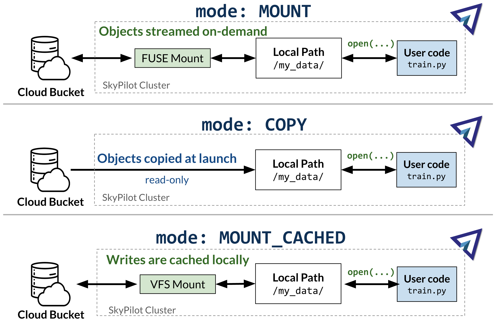

.. _sky-storage:

Accessing Object Stores
=======================

SkyPilot tasks can access data from cloud object stores such as AWS S3, Google Cloud Storage (GCS), Cloudflare R2 or IBM COS.

These objects are made available to the task at a local path on the remote VM, so
the task can access these objects as if they were local files.

Usage
-----

Object stores are specified using the :code:`file_mounts` field in a SkyPilot task.

.. tab-set::

    .. tab-item:: Use existing bucket
        :sync: existing-bucket-tab

        To access a bucket created externally (e.g., through cloud CLI or other tools),
        specify ``source``.

        .. code-block:: yaml

          # Mount an existing S3 bucket
          file_mounts:
            /mydata:
                source: s3://my-bucket/ # or gs://, r2://, cos://<region>/<bucket>
                mode: MOUNT  # Optional - either MOUNT or COPY. Defaults to MOUNT.

        This will `mount <storage-mounting-modes_>`__ the contents of the bucket at ``s3://my-bucket/`` to the remote VM at ``/mydata``.

    .. tab-item:: Upload files to new bucket
        :sync: new-bucket-tab

        To create a new bucket, upload local files to this bucket and attach it to the task,
        specify ``name`` and ``source``, where ``source`` is a local path.

        .. code-block:: yaml

          # Create a new S3 bucket and upload local data
          file_mounts:
            /mydata:
                name: my-sky-bucket
                source: ~/dataset   # Optional - path to local data to upload to the bucket
                store: s3   # Optional - either of s3, gcs, r2, ibm
                mode: MOUNT  # Optional - either MOUNT or COPY. Defaults to MOUNT.

        SkyPilot will create a S3 bucket called ``my-sky-bucket`` and upload the
        contents of ``~/dataset`` to it. The bucket will then be mounted at ``/mydata``
        and your data will be available to the task.

        If the bucket already exists and was created by SkyPilot, SkyPilot will fetch
        and re-use the bucket.

        If ``store`` is omitted, SkyPilot will use the same cloud provider as the task's cloud.

    .. tab-item:: Create empty bucket
        :sync: empty-bucket-tab

        To create an empty bucket, specify only the ``name`` and omit the ``source``.

        .. code-block:: yaml

          # Create an empty gcs bucket
          file_mounts:
            /mydata:
                name: my-sky-bucket
                store: gcs   # Optional - either of s3, gcs, r2, ibm

        SkyPilot will create an empty GCS bucket called ``my-sky-bucket`` and mount it at ``/mydata``.
        This empty bucket can be used to write checkpoints, logs or other outputs directly to the cloud.

You can find more detailed usage examples in `storage_demo.yaml <https://github.com/skypilot-org/skypilot/blob/master/examples/storage_demo.yaml>`_.

.. _storage-mounting-modes:

Mounting Modes
--------------

A cloud storage can used in either :code:`MOUNT` mode or :code:`COPY` mode.

1. **MOUNT** mode: The object store is directly "mounted" to the remote VM. I.e., files are streamed when accessed by the task and all writes are replicated to remote bucket (and any other VMs mounting the same bucket). This is the default mode.
2. **COPY** mode: The files are pre-fetched and cached on the local disk. Writing to object stores is not supported in this mode.

.. Source for the image: https://docs.google.com/drawings/d/1MPdVd2TFgAFOYSk6R6E903v1_C0LHmVU-ChIVwdX9A8/edit?usp=sharing

Picking a mounting mode
~~~~~~~~~~~~~~~~~~~~~~~

Choosing between :code:`MOUNT` and :code:`COPY` modes depends on the workload,
its performance requirements and size of the data.

.. list-table::
   :header-rows: 1
   :stub-columns: 1

   * -
     - .. centered:: :code:`mode: MOUNT`
     - .. centered:: :code:`mode: COPY`
   * - Performance
     - |:yellow_circle:| Slow to access files. Fast to provision.
     - |:white_check_mark:| Fast file access. Slow at initial provisioning.
   * - Writing to object stores
     - |:yellow_circle:| Most write operations [1]_ are supported.
     - |:x:| Read-only.
   * - Disk Size
     - |:white_check_mark:| No disk size requirements
     - |:yellow_circle:| VM disk size must be greater than the size of the bucket
   * - Best for
     - Writing task outputs, very large data that won't fit on disk
     - High performance read-only workloads, data that fits on disk

.. [1] ``MOUNT`` mode does not support the full POSIX interface and some file
    operations may fail. Most notably, random writes and append operations are
    not supported.

.. note::
    :code:`MOUNT` mode employs a close-to-open consistency model. This means calling
    :code:`close()` on a file will upload the entire file to the backing object store.
    Any subsequent reads, either using SkyPilot Storage or external utilities (such as
    aws/gsutil cli) will see the latest data.

.. note::
    SkyPilot does not guarantee preservation of file permissions when attaching
    object stores. You may need to set file permissions during task execution.

.. note::
    Symbolic links are handled differently in :code:`file_mounts` depending on whether object stores are used.
    For object store mounts, symbolic links are not copied to remote.
    For local ``file_mounts`` that are directly rsynced to the VM,
    the symbolic links are directly copied, not their target data.
    The targets must be separately mounted or else the symlinks may break.

Common patterns
---------------

Storing and sharing outputs of tasks
~~~~~~~~~~~~~~~~~~~~~~~~~~~~~~~~~~~~

You can directly write the outputs of your tasks (e.g., checkpoints, logs, etc.)
to a cloud object store by creating a new bucket and using it in :code:`MOUNT` mode.

.. code-block:: yaml

  # Creates an empty bucket. Any writes to /mydata will be replicated to s3://my-sky-bucket
  file_mounts:
    /mydata:
        name: my-sky-bucket
        store: s3

Your task can then write files to :code:`/mydata` and they will be automatically
be uploaded to the cloud.

Avoid re-uploading data on every run
~~~~~~~~~~~~~~~~~~~~~~~~~~~~~~~~~~~~

Compared directly using local paths in file_mounts, uploading to a bucket can
be faster since it is persistent and requires fewer uploads from your local
machine if the data is not changing.

.. code-block:: yaml

  # Creates a Sky Storage object once and re-uses it in multiple tasks and runs
  file_mounts:
    /mydata:
        name: my-sky-bucket
        source: ~/my_local_path
        store: s3

.. note::
    If the data at source changes, new files will be automatically synced to the bucket.

Shared file system across workers
~~~~~~~~~~~~~~~~~~~~~~~~~~~~~~~~~

A object store used in :code:`MOUNT` mode can act as a shared file system across
workers running on different nodes.

.. code-block:: yaml

  num_nodes: 2

  # This bucket will be mounted at /mydata on both nodes.
  file_mounts:
    /mydata:
        name: my-sky-bucket
        store: s3

A shared file system can be used for Inter-Process Communication (IPC) or for sharing data between workers.
You can find an example of this in `pingpong.yaml <https://github.com/skypilot-org/skypilot/blob/master/examples/storage/pingpong.yaml>`_.

Using SkyPilot Storage CLI
--------------------------------

To manage object stores created by SkyPilot, the sky CLI provides two useful commands -
:code:`sky storage ls` and :code:`sky storage delete`.

1.  :code:`sky storage ls` shows storage objects created by SkyPilot.

.. code-block:: console

    $ sky storage ls
    NAME               CREATED     STORE  COMMAND                                        STATUS
    sky-dataset        3 mins ago  S3     sky launch -c demo examples/storage_demo.yaml  READY

2.  :code:`sky storage delete` allows you to delete any Storage objects created
    by SkyPilot.

.. code-block:: console

    $ sky storage delete sky-dataset
    Deleting storage object sky-dataset...
    I 04-02 19:42:24 storage.py:336] Detected existing storage object, loading Storage: sky-dataset
    I 04-02 19:42:26 storage.py:683] Deleting S3 Bucket sky-dataset

.. note::
    :code:`sky storage ls` only shows storages that were created
    by SkyPilot. Storage objects using externally created buckets or public buckets
    are not listed in :code:`sky storage ls` and cannot be managed through SkyPilot.

Storage YAML reference
----------------------

.. code-block:: markdown

    file_mounts:
      /remote_path:
        name: str
          Identifier for the storage object. Used when creating a new storage
          or referencing an existing storage created by SkyPilot. Not required
          when using an existing object store created externally.

        source: str
          The source attribute specifies the path that must be made available
          in the storage object. It can either be a local path or a list of local
          paths or it can be a remote path (s3://, gs://, r2://, cos://<region_name>).

          If the source is local, data is uploaded to the cloud to an appropriate
          object store (s3, gcs, r2, or ibm). If source is object store URI,
          the data is copied or mounted directly (see mode flag below).

        store: str; either of 's3', 'gcs', 'r2', 'ibm'
          If you wish to force sky.Storage to be backed by a specific cloud object
          store, you can specify it here. If not specified, SkyPilot chooses the
          appropriate object store based on the source path and task's cloud provider.

        persistent: bool; default: True.
          Whether the remote backing stores in the cloud should be deleted after
          execution of the task. Set to True to avoid uploading files again
          in subsequent runs (at the cost of storing your data in the cloud). If
          files change between runs, new files are synced to the bucket.

        mode: str; either of MOUNT or COPY; default: MOUNT
          Whether to mount the storage object by copying files, or actually
          mounting the remote storage object. With MOUNT mode, files are streamed
          from the remote object store and writes are replicated to the object
          store (and consequently, to other workers mounting the same Storage).
          With COPY mode, files are copied at VM initialization and any writes to
          the mount path will not be replicated on the object store.
