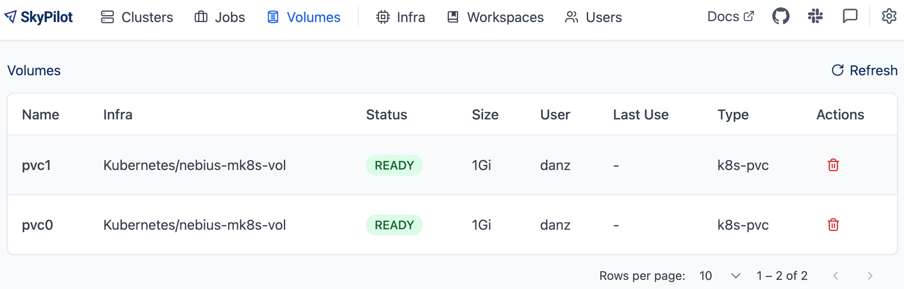

.. _volumes:

Volumes
=======

Volumes offer a high-performance alternative to :ref:`cloud buckets <sky-storage>` for storing data. Unlike buckets, volumes are limited to a single region and cannot be accessed across regions and clouds.

Benefits of using volumes:

* **Performance**: Volumes are generally faster than object stores, and SkyPilot lets you choose from different storage classes based on your performance requirements.
* **Data persistence**: Volumes can persist data independently of task life cycles, making it easy to share data between different tasks (e.g., datasets, caches) or preserve results.
* **Size control**: You can set volume size limits to manage costs and limit storage usage.

SkyPilot supports creating and managing volumes directly through the ``sky`` CLI and the web dashboard.

Supported volume types:

- Kubernetes: `Persistent Volume Claims (PVCs) <https://kubernetes.io/docs/concepts/storage/persistent-volumes/#persistentvolumeclaims/>`_
- GCP: `Persistent Disks <https://cloud.google.com/compute/docs/disks/persistent-disks>`_ and `Local SSDs <https://cloud.google.com/compute/docs/disks/local-ssd>`_

.. _volumes-on-kubernetes:

Volumes on Kubernetes
---------------------

SkyPilot supports creating and managing PVC (Persistent Volume Claim) volumes on Kubernetes clusters through three commands:

- ``sky volumes apply``: Create a new volume
- ``sky volumes ls``: List all volumes
- ``sky volumes delete``: Delete a volume

.. note::

  Volumes are shared across users on a SkyPilot API server. A user can mount volumes created by other users. This is useful for sharing caches and data across users.

Quickstart
~~~~~~~~~~

1. Prepare a volume YAML file:

   .. code-block:: yaml

     # volume.yaml
     name: new-pvc
     type: k8s-pvc
     infra: kubernetes  # or k8s or k8s/context
     size: 10Gi
     config:
       namespace: default  # optional
       storage_class_name: csi-mounted-fs-path-sc  # optional
       access_mode: ReadWriteMany  # optional

2. Create the volume with ``sky volumes apply volume.yaml``:

   .. code-block:: console

     $ sky volumes apply volume.yaml
     Proceed to create volume 'new-pvc'? [Y/n]: Y
     Creating PVC: new-pvc-73ec42f2-5c6c4e

3. Mount the volume in your task YAML:

   .. code-block:: yaml

     # task.yaml
     volumes:
       /mnt/data: new-pvc  # The volume new-pvc will be mounted to /mnt/data

     run: |
       echo "Hello, World!" > /mnt/data/hello.txt

Managing volumes
~~~~~~~~~~~~~~~~

List all volumes with ``sky volumes ls``:

.. code-block:: console

  $ sky volumes ls
  NAME     TYPE     INFRA                         SIZE  USER   WORKSPACE  AGE   STATUS  LAST_USE     USED_BY
  new-pvc  k8s-pvc  Kubernetes/nebius-mk8s-vol    1Gi   alice  default    8m    IN_USE  <timestamp>  <cluster_name>

.. tip::

  Use ``-v`` to view detailed information about a volume.

  .. code-block:: console

    $ sky volumes ls -v
    NAME     TYPE     INFRA                         SIZE  USER   WORKSPACE  AGE   STATUS  LAST_USE             USED_BY   NAME_ON_CLOUD              STORAGE_CLASS           ACCESS_MODE
    new-pvc  k8s-pvc  Kubernetes/nebius-mk8s-vol    1Gi   alice  default    8m    IN_USE  2025-06-24 10:18:32  training  new-pvc-73ec42f2-5c6c4e    csi-mounted-fs-path-sc  ReadWriteMany

Delete a volume with ``sky volumes delete``:

.. code-block:: console

  $ sky volumes delete new-pvc
  Proceed to delete volume 'new-pvc'? [Y/n]: Y
  Deleting PVC: new-pvc-73ec42f2-5c6c4e

If the volume is in use, it will be marked as ``IN_USE`` and cannot be deleted.

You can also check the volumes in the SkyPilot dashboard.

Filesystem volume examples
~~~~~~~~~~~~~~~~~~~~~~~~~~

This section demonstrates how to configure and use distributed filesystems as SkyPilot volumes. We'll cover options like `JuiceFS <https://juicefs.com/docs/community/introduction/>`_ (a cloud-native distributed filesystem) and `Nebius shared file system <https://docs.nebius.com/compute/storage/types#filesystems>`_ (a high-performance shared storage solution).

.. tab-set::

    .. tab-item:: JuiceFS
        :sync: juicefs-tab

        To use JuiceFS as a SkyPilot volume:

        1. **Install the JuiceFS CSI driver** on your Kubernetes cluster. Follow the official `installation guide <https://juicefs.com/docs/csi/getting_started>`_ for detailed instructions.

        2. **Verify the driver installation** - Confirm that the ``juicefs-sc`` storage class has been created successfully:

        .. code-block:: console

          $ kubectl get storageclass
          NAME           PROVISIONER         RECLAIMPOLICY   VOLUMEBINDINGMODE   ALLOWVOLUMEEXPANSION   AGE
          juicefs-sc     csi.juicefs.com     Retain          Immediate           false                  10m

        .. note::
           If the ``juicefs-sc`` storage class is not available, refer to the `JuiceFS storage class creation guide <https://juicefs.com/docs/csi/guide/pv/#create-storage-class>`_ to set it up.

        3. **Create a SkyPilot volume for JuiceFS** with a volume YAML:

        .. code-block:: yaml

          # juicefs-volume.yaml
          name: juicefs-pvc
          type: k8s-pvc
          infra: k8s
          size: 100Gi
          config:
            storage_class_name: juicefs-sc
            access_mode: ReadWriteMany

        .. code-block:: console

          $ sky volumes apply juicefs-volume.yaml

        4. **Mount the volume to SkyPilot task** in your SkyPilot YAML:

        .. code-block:: yaml

          # task.yaml
          num_nodes: 2

          volumes:
            # Mount the JuiceFS volume to /mnt/data across all nodes
            /mnt/data: juicefs-pvc

          run: |
            # Verify the volume is mounted and accessible
            df -h /mnt/data
            ls -la /mnt/data

        .. code-block:: console

          # Launch the cluster with the JuiceFS volume
          $ sky launch -c juicefs-cluster task.yaml

    .. tab-item:: Nebius shared file system
        :sync: nebius-tab

        To use Nebius shared file system as a SkyPilot volume:

        1. **Set up the Nebius filesystem infrastructure** by following the official documentation:

           - `Create a shared filesystem <https://docs.nebius.com/kubernetes/storage/filesystem-over-csi#create-filesystem>`_
           - `Create a node group and mount the filesystem <https://docs.nebius.com/kubernetes/storage/filesystem-over-csi#create-node-group>`_
           - `Install the CSI driver <https://docs.nebius.com/kubernetes/storage/filesystem-over-csi#install-csi>`_

        2. **Verify the storage class** - Confirm that the ``csi-mounted-fs-path-sc`` storage class has been created:

        .. code-block:: console

          $ kubectl get storageclass
          NAME                     PROVISIONER                    RECLAIMPOLICY   VOLUMEBINDINGMODE      ALLOWVOLUMEEXPANSION   AGE
          csi-mounted-fs-path-sc   mounted-fs-path.csi.nebius.ai  Delete          WaitForFirstConsumer   false                  10m

        3. **Create a SkyPilot volume for Nebius file system** with a volume YAML:

        .. code-block:: yaml

          # nebius-volume.yaml
          name: nebius-pvc
          type: k8s-pvc
          infra: k8s
          size: 100Gi
          config:
            storage_class_name: csi-mounted-fs-path-sc
            access_mode: ReadWriteMany

        .. code-block:: console

          $ sky volumes apply nebius-volume.yaml

        4. **Mount the volume to SkyPilot task** in your SkyPilot YAML:

        .. code-block:: yaml

          # task.yaml
          num_nodes: 2

          volumes:
            # Mount the Nebius shared filesystem to /mnt/data across all nodes
            /mnt/data: nebius-pvc

          run: |
            # Verify the volume is mounted and accessible
            df -h /mnt/data
            ls -la /mnt/data

        .. code-block:: console

          # Launch the cluster with the Nebius volume
          $ sky launch -c nebius-cluster task.yaml

Volumes on GCP
--------------

.. note::

  GCP volume support is currently in development, and will be updated to use the ``sky volumes`` commands.

Volumes on GCP are specified using the :ref:`file_mounts <yaml-spec-file-mounts>` field in a SkyPilot task.

There are three ways to mount volumes:

1. Mount an existing volume
2. Create and mount a new network volume (reattachable)
3. Create and mount a new instance volume (temporary)

.. tab-set::

    .. tab-item:: Mount existing volume
        :sync: existing-volume-tab

        To mount an existing volume:

        1. Ensure the volume exists
        2. Specify the volume name using ``name: volume-name``
        3. Specify the region or zone in the resources section to match the volume's location

        .. code-block:: yaml

          file_mounts:
            /mnt/path:
              name: volume-name
              store: volume
              persistent: true

          resources:
            # Must specify cloud, and region or zone.
            # These need to match the volume's location.
            cloud: gcp
            region: us-central1
            # zone: us-central1-a

    .. tab-item:: Create network volume
        :sync: new-network-volume-tab

        To create and mount a new network volume:

        1. Specify the volume name using ``name: volume-name``
        2. Specify the desired volume configuration (``disk_size``, ``disk_tier``, etc.)

        .. code-block:: yaml

          file_mounts:
            /mnt/path:
              name: new-volume
              store: volume
              persistent: true  # If false, delete the volume when cluster is downed.
              config:
                disk_size: 100  # GiB.

          resources:
            # Must specify cloud, and region or zone.
            cloud: gcp
            region: us-central1
            # zone: us-central1-a

        SkyPilot will automatically create and mount the volume to the specified path.

    .. tab-item:: Create instance volume
        :sync: new-instance-volume-tab

        To create and mount a new instance volume (temporary disk; will be lost when the cluster is stopped or terminated):

        .. code-block:: yaml

          file_mounts:
            /mnt/path:
              store: volume
              config:
                storage_type: instance

          resources:
            # Must specify cloud.
            cloud: gcp

        Note that the ``name`` and ``config.disk_size`` fields are unsupported,
        and will be ignored even if specified.

        SkyPilot will automatically create and mount the volume to the specified path.

Configuration options
~~~~~~~~~~~~~~~~~~~~~

Here's a complete example showing all available configuration options for GCP volumes:

.. code-block:: yaml

  file_mounts:
    /mnt/path:
      store: volume

      # Name of the volume to mount.
      #
      # Required for network volume, ignored for instance volume.  If the volume
      # doesn't exist in the specified region, it will be created in the region.
      name: volume-name

      # Source local path.
      #
      # Do not set if no need to sync data from local to volume.  If specified,
      # the data will be synced to the /mnt/path/data directory.
      source: /local/path

      # If set to false, the volume will be deleted when the cluster is downed.
      # Default: false
      persistent: false

      config:
        # Size of the volume in GiB. Ignored for instance volumes.
        disk_size: 100

        # Type of the volume, either 'network' or 'instance'.
        # Default: 'network'
        storage_type: network

        # Tier of the volume, same as `resources.disk_tier`.
        # Default: best
        disk_tier: best

        # Attach mode, either 'read_write' or 'read_only'.
        # Default: read_write
        attach_mode: read_write

See :ref:`YAML spec for volumes <yaml-spec-volumes>` for more details.
