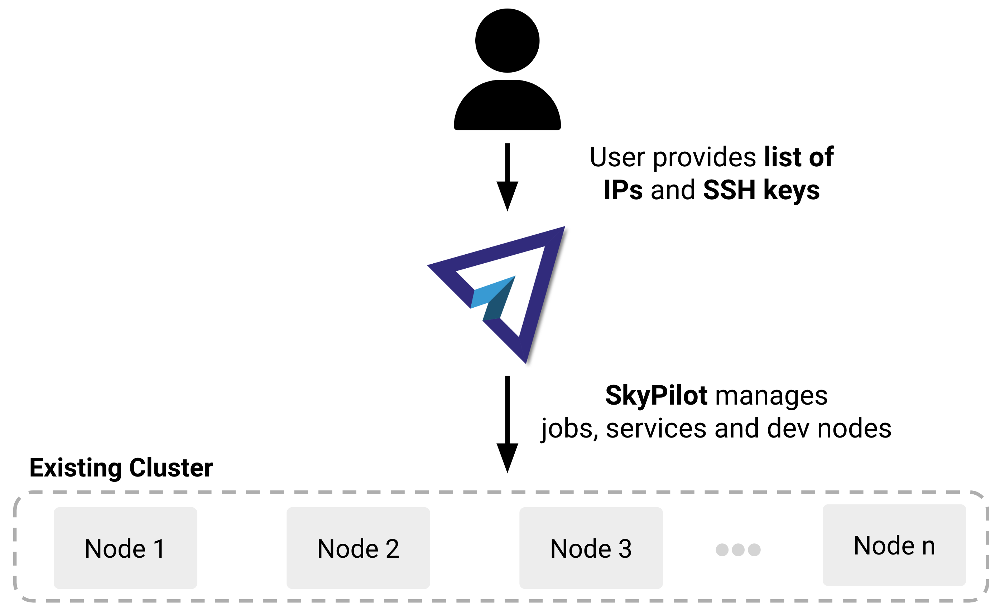

.. _existing-clusters:

Deploy SkyPilot on existing clusters
====================================

This page will help you deploy SkyPilot on your existing clusters - whether it's on-premises machines or reserved instances on a cloud provider.

**Given a list of IP addresses and SSH keys,**
the `deploy.sh <https://github.com/skypilot-org/skypilot/blob/master/examples/existing_infra/deploy.sh>`_
script will install necessary dependencies on the remote machines and configure
SkyPilot to run jobs and services on the cluster.

At the end of this guide, you will be able to use SkyPilot to run jobs or services
on your own preexisting cluster.

   Given a list of IP addresses and SSH keys, ``deploy.sh`` will install necessary dependencies on the remote machines and configure SkyPilot to run jobs and services on the cluster.

.. note::

    Behind the scenes, the script deploys a lightweight Kubernetes cluster on the remote machines using `k3s <https://k3s.io/>`_.

    **Note that no Kubernetes knowledge is required for running this guide.** SkyPilot abstracts away the complexity of Kubernetes and provides a simple interface to run your jobs and services.

Prerequisites
-------------

**Local machine (typically your laptop):**

* `kubectl <https://kubernetes.io/docs/tasks/tools/install-kubectl/>`_
* `SkyPilot <https://skypilot.readthedocs.io/en/latest/getting-started/installation.html>`_

**Remote machines (your cluster, optionally with GPUs):**

* Debian-based OS (tested on Debian 11)
* SSH access with key-based authentication
* All machines must use the same SSH key and username
* Port 6443 must be accessible on at least one node from your local machine

Deployment steps
----------------

1. Create a file ``ips.txt`` with the IP addresses of your machines with one IP per line.
   The first node will be used as the head node - this node must have port 6443 accessible from your local machine.

   Here is an example ``ips.txt`` file:

   .. code-block:: text

      192.168.1.1
      192.168.1.2
      192.168.1.3

   In this example, the first node (``192.168.1.1``) has port 6443 open and will be used as the head node.

2. Get the deployment script:

   .. code-block:: bash

      wget https://raw.githubusercontent.com/skypilot-org/skypilot/master/examples/existing_infra/deploy.sh
      chmod +x deploy.sh

2. Run ``./deploy.sh`` and pass the ``ips.txt`` file, SSH username, and SSH keys as arguments:

   .. code-block:: bash

      chmod +x deploy.sh
      IP_FILE=ips.txt
      SSH_USERNAME=username
      SSH_KEY=path/to/ssh/key
      ./deploy.sh $IP_FILE $SSH_USERNAME $SSH_KEY

3. The script will deploy a Kubernetes cluster on the remote machines, setup GPU support, configure Kubernetes credentials on your local machine, and set up SkyPilot to operate with the new cluster.

   At the end, you should see a message like this:

   .. code-block:: text

      ✔ SkyPilot configured successfully.
      ==== 🎉 Kubernetes cluster deployment completed successfully 🎉 ====

4. To verify that the cluster is running, run:

   .. code-block:: bash

      sky check kubernetes

   You can now use SkyPilot to launch your :ref:`development clusters <dev-cluster>` and `training jobs <ai-training>` on your own infrastructure.

   .. code-block:: console

      $ sky show-gpus --cloud kubernetes
      Kubernetes GPUs
      GPU   QTY_PER_NODE  TOTAL_GPUS  TOTAL_FREE_GPUS
      L4    1, 2, 4       12          12
      H100  1, 2, 4, 8    16          16
      Kubernetes per node GPU availability
      NODE_NAME                  GPU_NAME  TOTAL_GPUS  FREE_GPUS
      my-cluster-0               L4        4           4
      my-cluster-1               L4        4           4
      my-cluster-2               L4        2           2
      my-cluster-3               L4        2           2
      my-cluster-4               H100      8           8
      my-cluster-5               H100      8           8

      $ sky launch --cloud kubernetes --gpus H100:1 -- nvidia-smi

   .. tip::

     You can also use ``kubectl`` to interact with the cluster.

Cleanup
-------

To clean up all state created by ``deploy.sh`` on your cluster, use the ``--cleanup`` flag:

.. code-block:: bash

    IP_FILE=ips.txt
    SSH_USERNAME=username
    SSH_KEY=path/to/ssh/key
    ./deploy.sh $IP_FILE $SSH_USERNAME $SSH_KEY --cleanup

This will stop all Kubernetes services on the remote machines.
