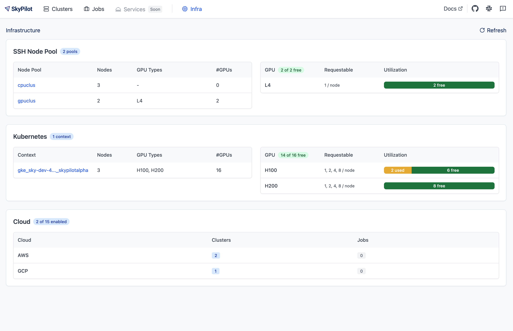
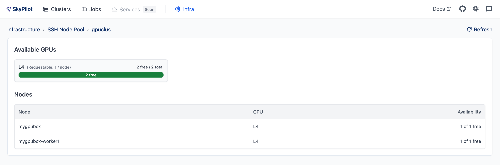

.. _existing-machines:

Deploy SkyPilot on existing machines
====================================

SkyPilot supports bringing your existing machines, whether they are on-premises or reserved instances on a cloud provider.

Given **a list of IPs and SSH credentials,** use ``sky ssh up`` to turn
them into a **SSH Node Pool**. It becomes an infra choice on which you can
launch clusters, jobs, or services, just like a regular cloud provider.

..
   Figure v1 (for deploy.sh): https://docs.google.com/drawings/d/1Jp1tTu1kxF-bIrS6LRMqoJ1dnxlFvn-iobVsXElXfAg/edit?usp=sharing
   Figure v2: https://docs.google.com/drawings/d/1hMvOe1HX0ESoUbCvUowla2zO5YBacsdruo0dFqML9vo/edit?usp=sharing
   Figure v2 Dark: https://docs.google.com/drawings/d/1AEdf9i3SO6MVnD7d-hwRumIfVndzNDqQmrFvRwwVEiU/edit

.. figure:: ../images/sky-existing-infra-workflow-light.png
   :width: 85%
   :align: center
   :alt: Deploying SkyPilot on existing machines
   :class: no-scaled-link, only-light

   Given a list of IP addresses and SSH keys, ``sky ssh up`` will install necessary dependencies on the remote machines and configure SkyPilot to run jobs and services on the cluster.

.. figure:: ../images/sky-existing-infra-workflow-dark.png
   :width: 85%
   :align: center
   :alt: Deploying SkyPilot on existing machines
   :class: no-scaled-link, only-dark

   Given a list of IP addresses and SSH keys, ``sky ssh up`` will install necessary dependencies on the remote machines and configure SkyPilot to run jobs and services on the cluster.

Quickstart
-------------

Write to ``~/.sky/ssh_node_pools.yaml`` on the host of your API server (refer to :ref:`Defining SSH Node Pools <defining-ssh-node-pools>` if you are running a remote API server):

.. code-block:: yaml

   # ~/.sky/ssh_node_pools.yaml

   my-cluster:  # Give the pool a name.
      hosts:
        - 1.2.3.4  # Ensure `ssh 1.2.3.4` works.
        - 1.2.3.5

   my-box:
     hosts:
       - hostname_in_ssh_config  # Ensure `ssh hostname_in_ssh_config` works.

Run ``sky ssh up`` to deploy SkyPilot on the machines:

.. code-block:: console

    $ sky ssh up

Check that the SSH Node Pools are set up :

.. code-block:: console

    $ sky check ssh

    ...
    🎉 Enabled infra 🎉
      SSH [compute]
         SSH Node Pools:
         ├── my-cluster
         └── my-box

Enabled SSH Node Pools are listed in ``sky status``:

.. code-block:: console

    $ sky status

    Enabled Infra: ssh/my-cluster, ssh/my-box, ...
    ...

Launch compute on enabled SSH Node Pools, using ``--infra ssh/<node_pool_name>``:

.. code-block:: console

    $ sky launch --infra ssh/my-cluster --gpus H100:1 -- nvidia-smi
    $ sky launch --infra ssh/my-box -- echo "Hello, world!"

Equivalently, use ``resources.infra: ssh/<node_pool_name>`` in a task YAML:

.. code-block:: yaml

    resources:
      infra: ssh/my-cluster

See more customization options and details about SSH Node Pools in the rest of this guide.

.. _defining-ssh-node-pools:

Defining SSH Node Pools
-----------------------

In ``~/.sky/ssh_node_pools.yaml``, you can define multiple SSH Node Pools, each with a list of IPs and SSH credentials.

If passwordless SSH is enabled, you can simply list the IPs or hostnames:

.. code-block:: yaml

   # ~/.sky/ssh_node_pools.yaml

   my-cluster:
      hosts:
        - 1.2.3.4
        - another-node

Alternatively, you can customize SSH options, including:

- SSH user
- SSH private key
- SSH password (if passwordless sudo is not enabled)

Example:

.. code-block:: yaml

   # ~/.sky/ssh_node_pools.yaml

   my-cluster:
      # Defaults for all nodes in this pool (optional).
      user: root
      identity_file: ~/.ssh/id_rsa
      password:  # Optional; if passwordless sudo is not enabled.

      # Override defaults for a specific node.
      hosts:
        - ip: 1.2.3.4
          user: alice
          identity_file: alice-key
          password: alice-password
        - ip: 5.6.7.8
          user: bob
          identity_file: bob-key
          password: bob-password

Apply ``~/.sky/sky_node_pools.yaml`` to the API server by the following steps for different setup:

.. tab-set::

   .. tab-item:: Local API server

      If you did not start an API server instance or use a :ref:`local API server <sky-api-server-local>`, set ``~/.sky/ssh_node_pools.yaml`` on your local machine.
   
   .. tab-item:: Helm Deployment

      If you use a Helm Deployment, follow the :ref:`SSH Node Pool configuration instructions <sky-api-server-configure-credentials>` to upload your ``~/.sky/ssh_node_pools.yaml`` and SSH keys to the API server.

   .. tab-item:: VM Deployment

      If you use a :ref:`VM Deployment <sky-api-server-cloud-deploy>`, set ``~/.sky/ssh_node_pools.yaml`` on the API server host.
      This is usually only available to the administrator who deployed the API server.

      If any SSH key is needed, you should also set it on the API server host.

Observability of SSH Node Pools
-------------------------------

Open ``sky dashboard`` and click on the ``Infra`` tab to see an overview of all SSH Node Pools:

Click on an SSH Node Pool to see more details, including per-node GPU availability:

To use the CLI to see what GPUs are available, run:

.. code-block:: console

   $ sky show-gpus --infra ssh
   $ sky show-gpus --infra ssh/my-cluster

Using multiple SSH Node Pools
-----------------------------

You can set up multiple SSH Node Pools as shown above.

Once set up, you can launch compute on either a specific SSH Node Pool, or let
SkyPilot automatically select one with available resources.

.. code-block:: bash

    # Run on cluster1
    sky launch --infra ssh/cluster1 -- echo "Running on cluster 1"

    # Run on cluster2
    sky launch --infra ssh/cluster2 -- echo "Running on cluster 2"

    # Let SkyPilot automatically select the cluster with available resources.
    sky launch --infra ssh -- echo "Running on SkyPilot selected cluster"

Attaching NFS and other volumes
-------------------------------

SkyPilot jobs can access NFS, shared disks, or local high-performance storage like NVMe drives available on your host machines in a SSH Node Pool.

Volume mounting can be done directly in the task YAML on a per-task basis, or globally for all tasks in :code:`~/.sky/config.yaml`.

.. tab-set::

    .. tab-item:: Mounting a path on the host (NFS)
      :name: ssh-volumes-hostpath-nfs

      Any path available on the host can be directly mounted to SkyPilot jobs. For example, to mount a NFS share available on the hosts:

      **Per-task configuration:**

      .. code-block:: yaml

           # task.yaml
           run: |
             echo "Hello, world!" > /mnt/nfs/hello.txt
             ls -la /mnt/nfs

           config:
             ssh:
               pod_config:
                 spec:
                   containers:
                     - volumeMounts:
                         - mountPath: /mnt/nfs
                           name: my-host-nfs
                   volumes:
                     - name: my-host-nfs
                       hostPath:
                         path: /path/on/host/nfs
                         type: Directory

      **Global configuration:**

      .. code-block:: yaml

           # ~/.sky/config.yaml
           ssh:
             pod_config:
               spec:
                 containers:
                   - volumeMounts:
                       - mountPath: /mnt/nfs
                         name: my-host-nfs
                 volumes:
                   - name: my-host-nfs
                     hostPath:
                       path: /path/on/host/nfs
                       type: Directory

    .. tab-item:: Nebius shared filesystem
      :name: ssh-volumes-nebius-shared-filesystem

      SSH Node Pools running on Nebius VMs can access Nebius shared filesystems.

      When creating a VM on the Nebius console, attach your desired shared file system to the VM (``Create virtual machine`` -> ``Attach shared filesystem``):

      * Ensure ``Auto mount`` is enabled.
      * Note the ``Mount tag`` (e.g. ``filesystem-d0``).

      .. image:: ../images/screenshots/nebius/nebius-k8s-attach-fs.png
        :width: 50%
        :align: center

      Nebius will automatically mount the shared filesystem to all hosts. You can then attach the volume to your SkyPilot jobs:

      **Per-task configuration:**

      .. code-block:: yaml

           # task.yaml
           run: |
             echo "Hello, world!" > /mnt/nfs/hello.txt
             ls -la /mnt/nfs

           config:
             ssh:
               pod_config:
                 spec:
                   containers:
                     - volumeMounts:
                         - mountPath: /mnt/nfs
                           name: nebius-sharedfs
                   volumes:
                     - name: nebius-sharedfs
                       hostPath:
                         path: /mnt/<mount_tag> # e.g. /mnt/filesystem-d0
                         type: Directory

      **Global configuration:**

      .. code-block:: yaml

           # ~/.sky/config.yaml
           ssh:
             pod_config:
               spec:
                 containers:
                   - volumeMounts:
                       - mountPath: /mnt/nfs
                         name: nebius-sharedfs
                 volumes:
                   - name: nebius-sharedfs
                     hostPath:
                       path: /mnt/<mount_tag> # e.g. /mnt/filesystem-d0
                       type: Directory

Cleanup
-------

To remove all state created by SkyPilot on your machines, run ``sky ssh down``.

.. code-block:: console

   $ sky ssh down

This removes the SkyPilot runtime on your machines and disables the SSH Node Pools.

Details: Prerequisites
----------------------

**SkyPilot API server host:**

* `kubectl <https://kubernetes.io/docs/tasks/tools/install-kubectl/>`_
* `SkyPilot <https://docs.skypilot.co/en/latest/getting-started/installation.html>`_

**Remote machines:**

* Debian-based OS (tested on Debian 11)
* SSH access from SkyPilot API server host to all remote machines
* All nodes within a SSH Node Pool must have access to port 6443 to its peers (e.g., same VPC). Port 6443 doesn't have to be open to machines outside of the network.
* Nodes should not be part of an existing Kubernetes cluster (use :ref:`Kubernetes Support <kubernetes-overview>`) instead)
