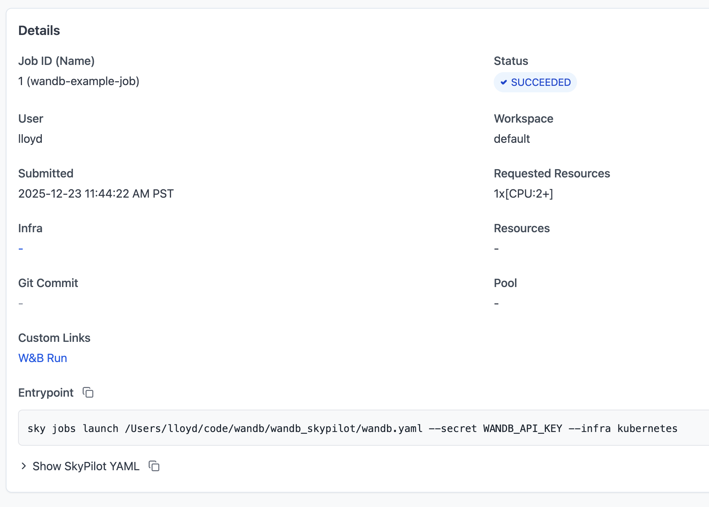

.. _custom-links:

Custom Links
============

Custom links allow you to view URLs associated with your managed jobs directly in the SkyPilot dashboard. This is useful for quickly accessing experiment trackers, dashboards, or any other external resources related to your jobs.

Supported services
------------------

SkyPilot automatically supports the following URLs for your job:

- **Weights & Biases (W&B)**: Run URLs (e.g., ``https://wandb.ai/<entity>/<project>/runs/<run_id>``)
- **Instance Links**: URLs to the cloud console for jobs running on AWS, GCP, or Azure.

When your job prints a URL from a supported service to stdout or stderr, the dashboard will automatically extract it and display it in the "Custom Links" section of the job details page.

Example: Using Weights & Biases
-------------------------------

When using W&B for experiment tracking, the W&B library automatically prints the run URL to stdout when you initialize a run. SkyPilot detects this and displays it in the dashboard.

Here's an example training job:

.. code-block:: yaml

  # wandb_training.yaml
  name: wandb-training

  envs:
    WANDB_API_KEY:  # Set via --env

  setup: |
    pip install wandb torch

  run: |
    python train.py

.. code-block:: python

  # train.py
  import wandb
  run = wandb.init(project='example', name='demo-run')
  run.log({'loss': 1.0})
  run.finish()

Launch the job:

.. code-block:: console

  $ sky jobs launch -n wandb-example-job --env WANDB_API_KEY=$WANDB_API_KEY wandb_training.yaml

Once the job starts and W&B prints the run URL to the logs, you'll see the link appear in the dashboard:

Clicking the link will take you directly to the W&B run page allowing you to quickly view the run metrics and artifacts.

.. image:: ../images/examples/custom-links/wandb.png
  :width: 800
  :alt: W&B run page

