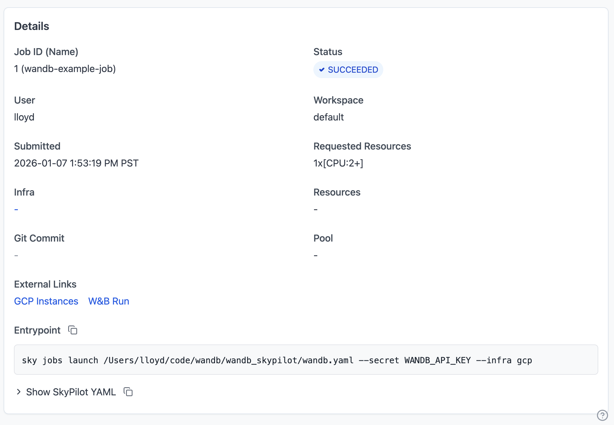
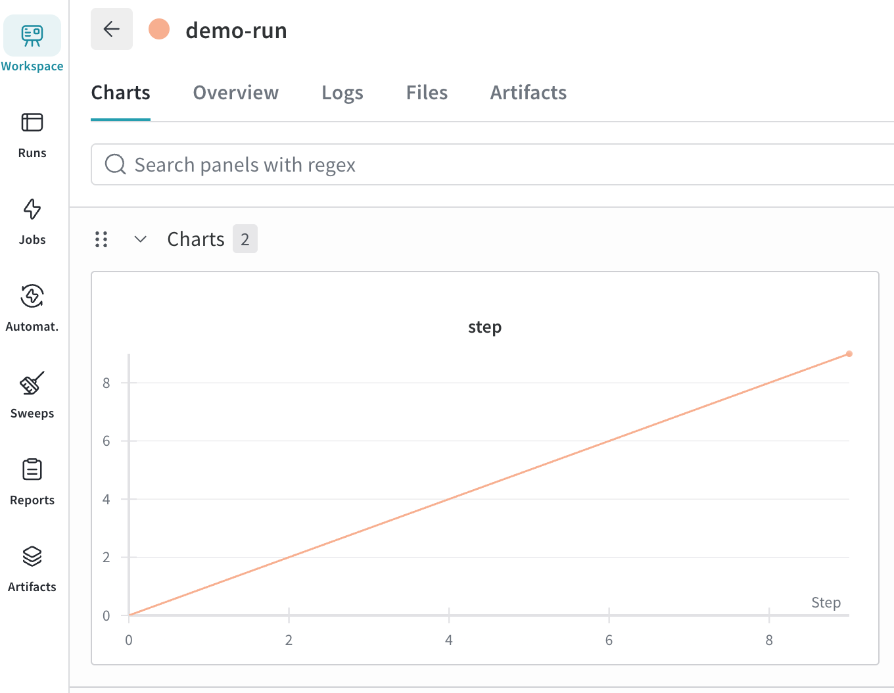

.. _external-links:

External Links
==============

External links are URLs associated with managed jobs that are displayed in the SkyPilot dashboard. This is useful for linking to external dashboards, experiment trackers, or any other relevant resources.

SkyPilot automatically detects and displays two types of links:

1. **Instance links**: For jobs running on AWS, GCP, or Azure, SkyPilot automatically adds links to the cloud console for the underlying instance.
2. **Log-detected links**: The dashboard automatically parses job logs to detect URLs from supported services and displays them as external links.

Supported services
~~~~~~~~~~~~~~~~~~

SkyPilot automatically detects URLs from the following services in your job logs:

- **Weights & Biases (W&B)**: Run URLs (e.g., ``https://wandb.ai/<entity>/<project>/runs/<run_id>``)

When your job prints a URL from a supported service to stdout or stderr, the dashboard will automatically extract it and display it in the "External Links" section.

Example: Using Weights & Biases
-------------------------------

When using W&B for experiment tracking, the W&B library automatically prints the run URL to stdout when you initialize a run. SkyPilot detects this and displays it in the dashboard.

Here's an example training job:

.. code-block:: yaml

  # wandb_training.yaml
  name: wandb-training

  envs:
    WANDB_API_KEY: null # Set via --secret

  setup: |
    pip install wandb torch

  run: |
    python train.py

.. code-block:: python

  # train.py
  import wandb
  run = wandb.init(project='example', name='demo-run')
  run.log({'loss': 1.0})
  run.finish()

Launch the job:

.. code-block:: console

  $ sky jobs launch -n wandb-example-job --env WANDB_API_KEY=$WANDB_API_KEY wandb_training.yaml

Once the job starts and W&B prints the run URL to the logs, you'll see the link appear in the dashboard:

Clicking the link will take you directly to the W&B run page allowing you to quickly view the run metrics and artifacts.

