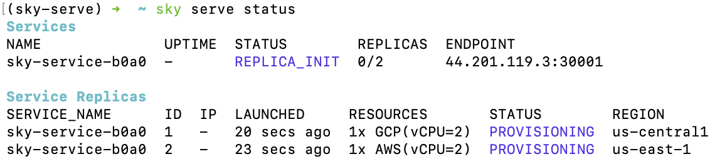
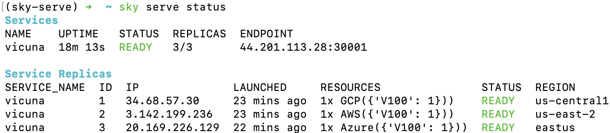
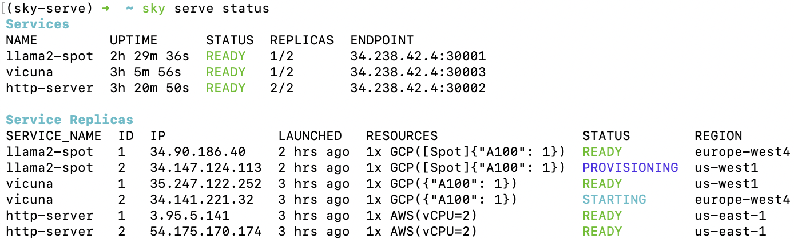
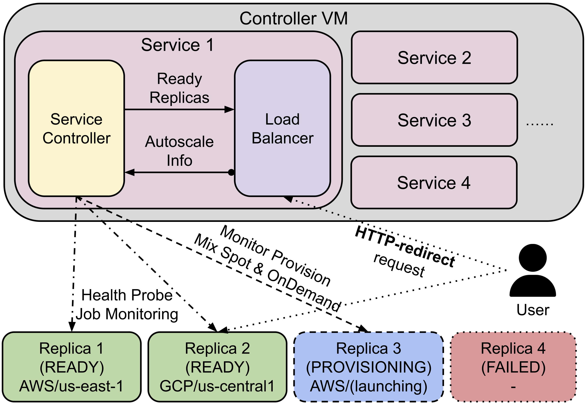

.. _sky-serve:

Serving Models
==============

SkyServe is SkyPilot's model serving library. SkyServe takes an existing serving
framework and deploys it across one or more regions or clouds.

.. warning::
   
   SkyServe is currently in **beta**. It is well-suited for internal serving use cases (R&D, batch inference) but is not yet recommended for external/production serving. Expect rough edges.
   
   As we actively develop SkyServe, we welcome `feedback <https://slack.skypilot.co>`_ and `contributions <https://github.com/skypilot-org/skypilot/blob/master/CONTRIBUTING.md>`_.

.. * Serve on scarce resources (e.g., A100; spot) with **reduced costs and increased availability**

Why SkyServe?

* **Bring any serving framework** (vLLM, TGI, FastAPI, ...) and scale it across regions/clouds
* **Reduce costs and increase availability** of service replicas by leveraging multiple/cheaper locations and hardware (spot instances)
* Out-of-the-box **load-balancing** and **autoscaling** of service replicas
* **Privacy and Control**: Everything is launched inside your cloud accounts and VPCs
* Manage multi-cloud, multi-region deployments with a single control plane

.. * Allocate scarce resources (e.g., A100) **across regions and clouds**
.. * Autoscale your endpoint deployment with load balancing
.. * Manage your multi-cloud resources with a single control plane

How it works:

- Each service gets an endpoint that automatically distributes requests to its replicas.
- Replicas of the same service can run in different regions and clouds — reducing cloud costs and increasing availability.
- SkyServe handles the load balancing, recovery, and autoscaling of the replicas.

.. GPU availability has become a critical bottleneck for many AI services. With Sky
.. Serve, we offer a lightweight control plane that simplifies deployment across
.. many cloud providers. By consolidating availability and pricing data across
.. clouds, we ensure **timely execution at optimal costs**, addressing the
.. complexities of managing resources in a multi-cloud environment.

.. SkyServe provides a simple CLI interface to deploy and manage your services. It
.. features a simple YAML spec to describe your services (referred to as a *service
.. YAML* in the following) and a centralized controller to manage the deployments.

Quick tour: LLM serving
-----------------------

Here is a simple example of serving an LLM model (:code:`Mixtral-8x7B-Instruct-v0.1` on vLLM or :code:`lmsys/vicuna-13b-v1.5` on TGI):

.. tab-set::

    .. tab-item:: vLLM
        :sync: vllm-tab

        .. code-block:: yaml

            # service.yaml
            service:
              readiness_probe: /v1/models
              replicas: 2

            # Fields below describe each replica.
            resources:
              ports: 8080
              accelerators: {L4:8, A10g:8, A100:4, A100:8, A100-80GB:2, A100-80GB:4, A100-80GB:8}

            setup: |
              conda create -n vllm python=3.9 -y
              conda activate vllm
              pip install vllm

            run: |
              conda activate vllm
              python -m vllm.entrypoints.openai.api_server \
                --tensor-parallel-size $SKYPILOT_NUM_GPUS_PER_NODE \
                --host 0.0.0.0 --port 8080 \
                --model mistralai/Mixtral-8x7B-Instruct-v0.1

    .. tab-item:: TGI
        :sync: tgi-tab

        .. code-block:: yaml

            # service.yaml
            service:
              readiness_probe: /health
              replicas: 2

            # Fields below describe each replica.
            resources:
              ports: 8080
              accelerators: A100

            run: |
              docker run --gpus all --shm-size 1g -p 8080:80 -v ~/data:/data \
                ghcr.io/huggingface/text-generation-inference \
                --model-id lmsys/vicuna-13b-v1.5

Run :code:`sky serve up service.yaml` to deploy the service with automatic price and capacity optimization. Once it is deployed, use :code:`sky serve status` to check the status of the service:

.. tab-set::

    .. tab-item:: vLLM
        :sync: vllm-tab

        .. image:: ../images/sky-serve-status-vllm.png
            :width: 800
            :align: center
            :alt: sky-serve-status-vllm

    .. tab-item:: TGI
        :sync: tgi-tab

        .. image:: ../images/sky-serve-status-tgi.png
            :width: 800
            :align: center
            :alt: sky-serve-status-tgi

.. raw:: html

   

.. tip::

  Notice that the two replicas are launched in different regions/clouds for the lowest cost and highest GPU availability.
  This is performed automatically, like a regular ``sky launch``.

If you see the :code:`STATUS` column becomes :code:`READY`, then the service is ready to accept traffic!

Simply ``curl`` the service endpoint, which automatically load-balances across the two replicas:

.. tab-set::

    .. tab-item:: vLLM
        :sync: vllm-tab

        .. code-block:: console

            $ curl 3.84.15.251:30001/v1/chat/completions \
                -X POST \
                -d '{"model": "mistralai/Mixtral-8x7B-Instruct-v0.1", "messages": [{"role": "user", "content": "Who are you?"}]}' \
                -H 'Content-Type: application/json'

            # Example output:
            {"id":"cmpl-80b2bfd6f60c4024884c337a7e0d859a","object":"chat.completion","created":1005,"model":"mistralai/Mixtral-8x7B-Instruct-v0.1","choices":[{"index":0,"message":{"role":"assistant","content":" I am a helpful AI assistant designed to provide information, answer questions, and engage in conversation with users. I do not have personal experiences or emotions, but I am programmed to understand and process human language, and to provide helpful and accurate responses."},"finish_reason":"stop"}],"usage":{"prompt_tokens":13,"total_tokens":64,"completion_tokens":51}}

    .. tab-item:: TGI
        :sync: tgi-tab

        .. code-block:: console

            $ curl 44.211.131.51:30001/generate \
                -X POST \
                -d '{"inputs":"What is Deep Learning?","parameters":{"max_new_tokens":20}}' \
                -H 'Content-Type: application/json'

            # Example output:
            {"generated_text":"\n\nDeep learning is a subset of machine learning that uses artificial neural networks to model and solve"}

Tutorial: Hello, SkyServe!
--------------------------

Here we will go through an example to deploy a simple HTTP server with SkyServe. To spin up a service, you can simply reuse your task YAML with the two following requirements:

#. An HTTP endpoint (launched in ``run`` commands) and the port on which it listens;
#. An extra :code:`service` section in your task YAML to describe the service configuration.

It is recommended to test it with :code:`sky launch` first. For example, we have the following task YAML works with :code:`sky launch`:

.. code-block:: yaml

    resources:
      ports: 8080
      cpus: 2

    workdir: .

    run: python -m http.server 8080

And under the same directory, we have an :code:`index.html`:

.. code-block:: html

    <html>
    <head>
        <title>My First SkyServe Service</title>
    </head>
    <body>
        
Hello, SkyServe!

    </body>
    </html>

.. note::

  :ref:`workdir <sync-code-artifacts>` and :ref:`file mounts with local files <sync-code-artifacts>` will be automatically uploaded to a
  :ref:`cloud bucket <sky-storage>`. The bucket will be created, and cleaned up after the service is terminated.

Notice that task YAML already has a running HTTP endpoint at 8080, and exposed
through the :code:`ports` section under :code:`resources`. Suppose we want to
scale it to multiple replicas across multiple regions/clouds with SkyServe. We
can simply add a :code:`service` section to the YAML:

.. code-block:: yaml
    :emphasize-lines: 2-4

    # hello-sky-serve.yaml
    service:
      readiness_probe: /
      replicas: 2

    resources:
      ports: 8080
      cpus: 2

    workdir: .

    run: python -m http.server 8080

This example will spin up two replicas of the service,
each listening on port 8080. A replica is considered ready when it responds to
:code:`GET /` with a 200 status code. You can customize the readiness
probe by specifying a different path in the :code:`readiness_probe` field.
You can find more configuration options at :ref:`Service YAML Specification
<service-yaml-spec>`.

Use ``sky serve up`` to spin up the service:

.. code-block:: console

    $ sky serve up hello-sky-serve.yaml

SkyServe will start (or reuse) a centralized controller/load balancer and deploy the
service replicas to the cloud location(s) with the best price and
availability.  SkyServe will also monitor the service status and re-launch a new
replica if one of them fails.

Under the hood, :code:`sky serve up`:

#. Launches a controller which handles autoscaling, monitoring and load balancing;
#. Returns a Service Endpoint which will be used to accept traffic;
#. Meanwhile, the controller provisions replica VMs which later run the services;
#. Once any replica is ready, the requests sent to the Service Endpoint will be distributed to one of the endpoint replicas.

.. note::
  SkyServe uses least load load balancing to distribute the traffic to the replicas. It keeps track of the number of requests each replica has handled and routes the next request to the replica with the least load.

After the controller is provisioned, you'll see the following in :code:`sky serve status` output:

.. raw:: html

   

You can use ``watch`` to monitor the service status:

.. code-block:: console

    $ watch -n10 sky serve status

Once any of the replicas becomes ready to serve (``READY``), you can start
sending requests to :code:`<endpoint-url>` (e.g., ``44.201.119.3:30001``):

.. code-block:: console

    $ curl <endpoint-url>
    <html>
    <head>
        <title>My First SkyServe Service</title>
    </head>
    <body>
        
Hello, SkyServe!

    </body>
    </html>

Tutorial: Serve a chatbot LLM!
------------------------------

Let's bring up a real LLM chat service with FastChat + Vicuna. We'll use the `Vicuna OpenAI API Endpoint YAML <https://github.com/skypilot-org/skypilot/blob/master/llm/vicuna/serve-openai-api-endpoint.yaml>`_ as an example:

.. code-block:: yaml

    resources:
      ports: 8080
      accelerators: A100:1
      disk_size: 1024
      disk_tier: best

    setup: |
      conda activate chatbot
      if [ $? -ne 0 ]; then
        conda create -n chatbot python=3.9 -y
        conda activate chatbot
      fi

      # Install dependencies
      pip install "fschat[model_worker,webui]==0.2.24"
      pip install protobuf

    run: |
      conda activate chatbot

      echo 'Starting controller...'
      python -u -m fastchat.serve.controller --host 127.0.0.1 > ~/controller.log 2>&1 &
      sleep 10
      echo 'Starting model worker...'
      python -u -m fastchat.serve.model_worker \
                --model-path lmsys/vicuna-${MODEL_SIZE}b-v1.3 2>&1 \
                --host 127.0.0.1 \
                | tee model_worker.log &

      echo 'Waiting for model worker to start...'
      while ! `cat model_worker.log | grep -q 'Uvicorn running on'`; do sleep 1; done

      echo 'Starting openai api server...'
      python -u -m fastchat.serve.openai_api_server \
        --host 0.0.0.0 --port 8080 | tee ~/openai_api_server.log

    envs:
      MODEL_SIZE: 7

The above SkyPilot Task YAML will launch an OpenAI API endpoint with a Vicuna 7B
model. This YAML can be used with regular :code:`sky launch` to launch a single
replica of the service.

However, by adding a :code:`service` section to the YAML, we can scale it
to multiple replicas across multiple regions/clouds:

.. code-block:: yaml
    :emphasize-lines: 2-4

    # vicuna.yaml
    service:
      readiness_probe: /v1/models
      replicas: 3

    resources:
      ports: 8080
      # Here goes other resources config

    # Here goes other task config

Now we have a Service YAML that can be used with SkyServe! Simply run

.. code-block:: console

    $ sky serve up vicuna.yaml -n vicuna

to deploy the service (use :code:`-n` to give your service a name!). After a while, there will be an OpenAI Compatible API endpoint ready to accept traffic (:code:`44.201.113.28:30001` in the following example):

.. raw:: html

   

Send a request using the following cURL command:

.. code-block:: console

    $ curl http://<endpoint-url>/v1/chat/completions \
        -X POST \
        -d '{"model":"vicuna-7b-v1.3","messages":[{"role":"system","content":"You are a helpful assistant."},{"role":"user","content":"Who are you?"}],"temperature":0}' \
        -H 'Content-Type: application/json'

    # Example output:
    {"id":"chatcmpl-gZ8SfgUwcm9Xjbuv4xfefq","object":"chat.completion","created":1702082533,"model":"vicuna-7b-v1.3","choices":[{"index":0,"message":{"role":"assistant","content":"I am Vicuna, a language model trained by researchers from Large Model Systems Organization (LMSYS)."},"finish_reason":"stop"}],"usage":{"prompt_tokens":19,"total_tokens":43,"completion_tokens":24}}

You can also use a simple chatbot Python script to send requests:

.. code-block:: python

    import openai

    stream = True
    model = 'vicuna-7b-v1.3' # This is aligned with the MODEL_SIZE env in the YAML
    init_prompt = 'You are a helpful assistant.'
    history = [{'role': 'system', 'content': init_prompt}]
    endpoint = input('Endpoint: ')
    openai.api_base = f'http://{endpoint}/v1'
    openai.api_key = 'placeholder'

    try:
        while True:
            user_input = input('[User] ')
            history.append({'role': 'user', 'content': user_input})
            resp = openai.ChatCompletion.create(model=model,
                                                messages=history,
                                                stream=True)
            print('[Chatbot]', end='', flush=True)
            tot = ''
            for i in resp:
                dlt = i['choices'][0]['delta']
                if 'content' not in dlt:
                    continue
                print(dlt['content'], end='', flush=True)
                tot += dlt['content']
            print()
            history.append({'role': 'assistant', 'content': tot})
    except KeyboardInterrupt:
        print('\nBye!')

Useful CLIs
-----------

Here are some commands for SkyServe. Check :code:`sky serve --help` for more details.

See all running services:

.. code-block:: console

    $ sky serve status

.. raw:: html

   

Stream the logs of a service:

.. code-block:: console

    $ sky serve logs vicuna 1 # tail logs of replica 1, including provisioning and running logs
    $ sky serve logs vicuna --controller # tail controller logs
    $ sky serve logs vicuna --load-balancer --no-follow # print the load balancer logs so far, and exit

Terminate services:

.. code-block:: console

    $ sky serve down http-server # terminate the http-server service
    $ sky serve down --all # terminate all services

Autoscaling
-----------

See :ref:`Autoscaling <serve-autoscaling>` for more information.

Authorization
-------------

See :ref:`Authorization <serve-auth>` for more information.

SkyServe architecture
---------------------

.. raw:: html

   

SkyServe has a centralized controller VM that manages the deployment of your service. Each service will have a process group to manage its replicas and route traffic to them.

It is composed of the following components:

#. **Controller**: The controller will monitor the status of the replicas and re-launch a new replica if one of them fails. It also autoscales the number of replicas if autoscaling config is set (see :ref:`Service YAML spec <service-yaml-spec>` for more information).
#. **Load Balancer**: The load balancer will route the traffic to all ready replicas. It is a lightweight HTTP server that listens on the service endpoint and distribute the requests to one of the replicas.

All of the process group shares a single controller VM. The controller VM will be launched in the cloud with the best price/performance ratio. You can also :ref:`customize the controller resources <customizing-sky-serve-controller-resources>` based on your needs.

SkyServe controller
-------------------

The SkyServe controller is a small on-demand CPU VM running in the cloud that:

#. Manages the deployment of your service;
#. Monitors the status of your service;
#. Routes traffic to your service replicas.

It is automatically launched when the first service is deployed, and it is autostopped after it has been idle for 10 minutes (i.e., after all services are terminated).
Thus, **no user action is needed** to manage its lifecycle.

You can see the controller with :code:`sky status` and refresh its status by using the :code:`-r/--refresh` flag.

High availability controller
~~~~~~~~~~~~~~~~~~~~~~~~~~~~

SkyServe also supports a High Availability Controller mode when running controller on Kubernetes. This ensures your services remain available even if the controller pod experiences unexpected failures. The controller state is preserved using persistent volumes, allowing seamless recovery with minimal disruption to your running services.

For more details on setting up and configuring high availability, see :ref:`High availability controller <sky-serve-high-availability-controller>`.

.. _customizing-sky-serve-controller-resources:

Customizing SkyServe controller resources
~~~~~~~~~~~~~~~~~~~~~~~~~~~~~~~~~~~~~~~~~~

You may want to customize the resources of the SkyServe controller for several reasons:

1. Use a lower-cost controller. (if you have a few services running)
2. Enforcing the controller to run on a specific location. This is particularly useful when you want the service endpoint within specific geographical region. (Default: cheapest location)
3. Changing the maximum number of services that can be run concurrently, which is the minimum number between 4x the vCPUs of the controller and the memory in GiB of the controller. (Default: 16)
4. Changing the disk_size of the controller to store more logs. (Default: 200GB)

To achieve the above, you can specify custom configs in :code:`~/.sky/config.yaml` with the following fields:

.. code-block:: yaml

  serve:
    # NOTE: these settings only take effect for a new SkyServe controller, not if
    # you have an existing one.
    controller:
      # Enable high availability mode for the controller (optional).
      #
      # When set to true, the controller will be deployed with high availability
      # capabilities on Kubernetes using Deployments. This allows the controller and load balancer
      # to automatically recover from failures (e.g., node failures, pod crashes)
      # and maintain service continuity.
      #
      # NOTE: This feature is ONLY supported when Kubernetes cloud is enabled. To enable kubernetes, see :ref:`Kubernetes Setup <kubernetes-setup>`.
      # The service controller cluster will be scheduled to kubernetes. The k8s deployment needs to be always-on to keep the controller running. If using a local kubernetes deployment (e.g. `sky local up`), keeping the laptop/machines up is required.
      # When enabled:
      # - The controller is deployed as a Kubernetes Deployment instead of a Pod
      # - Automatic pod rescheduling and recovery is handled by Kubernetes
      #
      # Default: false.
      high_availability: true

      resources:
        # All configs below are optional.
        # Specify the location of the SkyServe controller.
        infra: gcp/us-central1
        # Specify the maximum number of services that can be run concurrently.
        cpus: 2+  # number of vCPUs, max concurrent services = min(4 * cpus, memory in GiB)
        # Specify the disk_size in GB of the SkyServe controller.
        disk_size: 1024

The :code:`resources` field has the same spec as a normal SkyPilot job; see `here <https://docs.skypilot.co/en/latest/reference/yaml-spec.html>`__.

.. note::
  These settings will not take effect if you have an existing controller (either
  stopped or live).  For them to take effect, tear down the existing controller
  first, which requires all services to be terminated.
