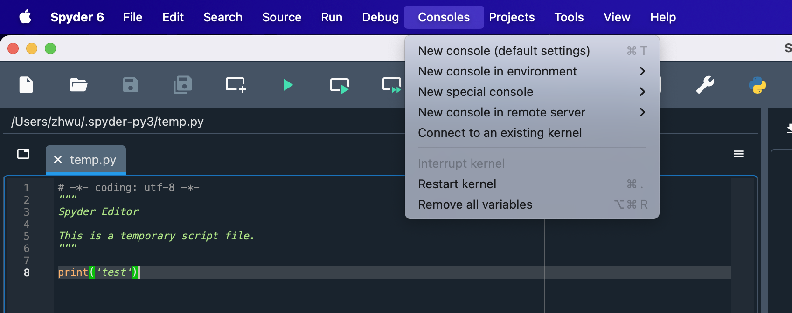
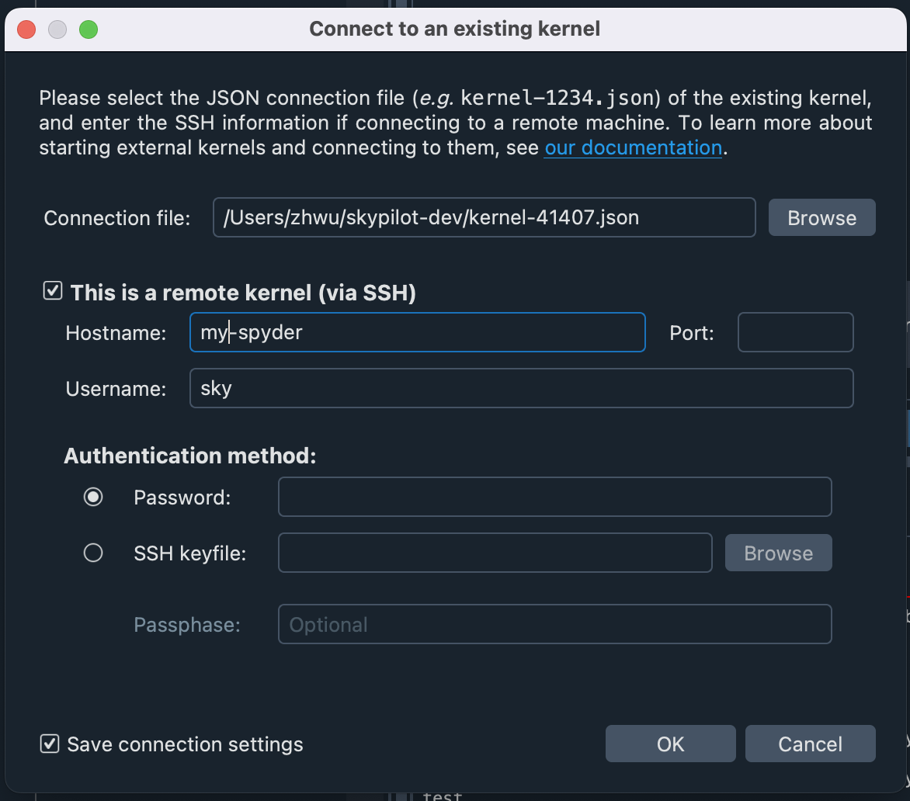

# Connect Spyder IDE to a SkyPilot Cluster and develop your R program

## Launch the cluster and download the connection file

```bash
sky launch -c my-spyder spyder.yaml --detach-run
# Download the connection file
scp my-spyder:~/.local/share/jupyter/runtime/kernel-*.json .
```

## Connect Spyder to the cluster





Note: username need to be specified explicitly as `sky` due to the limitation of Spyder.
