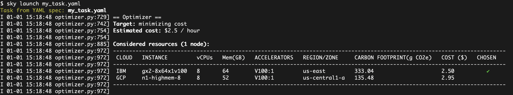

# Sustainability
The algorithm used to generate carbon footprint estimates - pulled from https://github.com/GreenAlgorithms/green-algorithms-tool.  Additional details can be found on the hosted [Green Algorithms Calculator](http://calculator.green-algorithms.org/).

## Getting Started
The sustainability enhancement is tracked in the [sustainibility branch](https://github.com/skypilot-org/skypilot/tree/sustainability_poc).  Here are the steps for getting started.  

### Installation
Setup the environment and checkout the sustainability branch of SkyPilot
```
# Recommended: use a new conda env to avoid package conflicts.
# SkyPilot requires 3.7 <= python <= 3.10.
conda create -y -n sky python=3.10
conda activate sky

# Clone the skypilot project in github and checkout the sustainability branch
git clone https://github.com/skypilot-org/skypilot.git
cd skypilot
git checkout -t origin/sustainability_poc

# Choose your cloud:
pip install -e ".[all]"

# Install Google Cloud SDK (Required)
conda install -c conda-forge google-cloud-sdk
```
### Verify Cloud Access
After setting up the `sustainability_poc` branch environment for SkyPilot follow these instructions to [verify cloud access](https://skypilot.readthedocs.io/en/latest/getting-started/installation.html#verifying-cloud-access).

## SkyPilot in 1 Minute with Carbon Footprint Estimates

Paste the following into a file `my_task.yaml`:

```yaml
resources:
  accelerators: V100:1  # 1x NVIDIA V100 GPU

num_nodes: 1  # Number of VMs to launch

# Working directory (optional) containing the project codebase.
# Its contents are synced to ~/sky_workdir/ on the cluster.
workdir: ~/torch_examples

# Commands to be run before executing the job.
# Typical use: pip install -r requirements.txt, git clone, etc.
setup: |
  pip install torch torchvision

# Commands to run as a job.
# Typical use: launch the main program.
run: |
  cd mnist
  python main.py --epochs 1
```

Prepare the workdir by cloning:
```bash
git clone https://github.com/pytorch/examples.git ~/torch_examples
```

Launch with `sky launch` (note: [access to GPU instances](https://skypilot.readthedocs.io/en/latest/cloud-setup/quota.html) is needed for this example):
```bash
sky launch my_task.yaml --optimize-cost-target=carbon_footprint
```

SkyPilot then performs the heavy-lifting for you, including:
1. Find the lowest priced VM instance type across different clouds
2. Displays the Carbon Footprint estimate (Note the `CARBON FOOTPRINT` column) for each VM instance type.
3. Provision the VM, with auto-failover if the cloud returned capacity errors
4. Sync the local `workdir` to the VM
5. Run the task's `setup` commands to prepare the VM for running the task
6. Run the task's `run` commands

<p align="center">
  
</p>