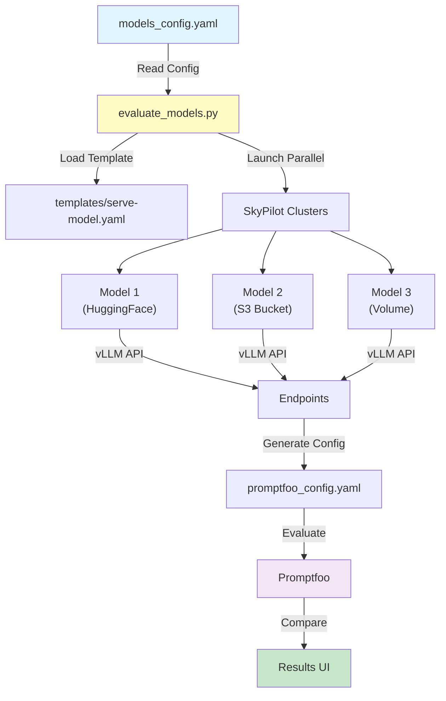

# Multi-Model Evaluation Example

Compare multiple trained models side-by-side using Promptfoo and SkyPilot.

## Architecture Overview

```
┌─────────────────────┐     ┌─────────────────────┐     ┌─────────────────────┐
│   HuggingFace Hub   │     │    S3/GCS Bucket    │     │  SkyPilot Volume    │
│  (Public Models)    │     │ (Custom Checkpoints)│     │  (Local Models)     │
└──────────┬──────────┘     └──────────┬──────────┘     └──────────┬──────────┘
           │                           │                           │
           └───────────────────────────┴───────────────────────────┘
                                       │
                              ┌────────▼────────┐
                              │ evaluate_models │
                              │   .py (SDK)     │
                              └────────┬────────┘
                                       │ Parallel Launch
           ┌───────────────────────────┼───────────────────────────┐
           │                           │                           │
    ┌──────▼──────┐            ┌──────▼──────┐            ┌──────▼──────┐
    │  Cluster 1  │            │  Cluster 2  │            │  Cluster 3  │
    │   (vLLM)    │            │   (vLLM)    │            │   (vLLM)    │
    └──────┬──────┘            └──────┬──────┘            └──────┬──────┘
           │                           │                           │
           └───────────────────────────┴───────────────────────────┘
                                       │
                              ┌────────▼────────┐
                              │   Promptfoo     │
                              │  (Evaluation)   │
                              └────────┬────────┘
                                       │
                              ┌────────▼────────┐
                              │  Side-by-side   │
                              │   Comparison    │
                              └─────────────────┘
```

## Quick Start

```bash
# 1. Install dependencies
pip install skypilot[all] pyyaml
npm install -g promptfoo

# 2. Configure models (edit models_config.yaml)
# 3. Run evaluation
python evaluate_models.py
```

## Project Structure

```
multi-model-eval/
├── evaluate_models.py      # Main script
├── models_config.yaml      # Your model configurations
├── templates/
│   └── serve-model.yaml    # vLLM serving template
├── scripts/
│   └── test_setup.sh       # Check dependencies
└── README.md
```

## Model Configuration

Edit `models_config.yaml` to specify your models:

```yaml
models:
  # HuggingFace Hub model
  - name: "llama2-base"
    source: "huggingface"
    model_id: "meta-llama/Llama-2-7b-chat-hf"
    accelerators: "L4:1"
    
  # Custom model from S3
  - name: "my-finetuned-model"
    source: "s3://my-bucket/models/llama2-finance"
    accelerators: "L4:1"
    
  # Model from SkyPilot volume
  - name: "mistral-custom"
    source: "volume://model-checkpoints/mistral-7b"
    accelerators: "A10:1"

# Cleanup clusters after evaluation
cleanup_on_complete: true
```

## How It Works



1. **Launch Models**: Each model runs on its own SkyPilot cluster with vLLM
2. **Run Tests**: All models receive the same prompts for fair comparison
3. **View Results**: See outputs side-by-side in the Promptfoo UI

## Model Sources

- **HuggingFace**: Any public model from the Hub
- **S3/GCS**: Your trained models in cloud storage
- **Volumes**: Models stored in SkyPilot volumes for fast loading

## GPU Selection

Common configurations:
- `"L4:1"` - Good for 7B models
- `"A10:1"` - Good for 7-13B models  
- `"A100:1"` - For larger models
- `"A100-80GB:1"` - For 70B+ models

## Example Output

```
🎯 Multi-Model Evaluation
=========================

📋 Launching 3 models...

🚀 Launching llama2-base...
✅ Launched eval-llama2-base
📡 Endpoint: http://34.125.23.45:8000/v1

🚀 Launching my-finetuned-model...
✅ Launched eval-my-finetuned-model
📡 Endpoint: http://35.223.12.89:8000/v1

✅ Successfully launched 2 models

📝 Created evaluation config for 2 models

🔍 Running evaluation...
✅ Evaluation complete!

View results: promptfoo view
```

## Tips

- Models run on port 8000 (no configuration needed)
- Launch happens in parallel for speed
- Results saved to `results.json`
- View detailed comparison with `promptfoo view`

## Troubleshooting

```bash
# Check dependencies
./scripts/test_setup.sh

# View model logs
sky logs eval-<model-name>

# List running clusters
sky status

# Manually cleanup
sky down -a
```