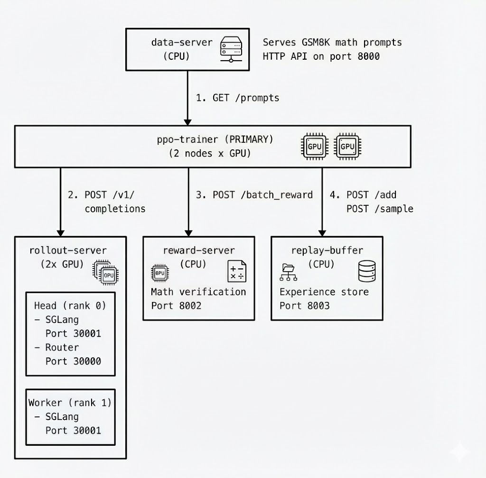

# RL Post-Training with Job Groups

This example demonstrates a distributed RL post-training architecture using SkyPilot job groups. It trains an LLM on mathematical reasoning tasks using GRPO (Group Relative Policy Optimization) with verifiable rewards.

## Architecture

The example consists of 5 task types that communicate over HTTP, with built-in load balancing for scaling inference:

<p align="center">
  
</p>

### Components

1. **data-server** (auxiliary): FastAPI server that serves math prompts from the GSM8K dataset. Provides batches of problems with ground truth answers.

2. **rollout-server** (auxiliary, x2): SGLang inference servers with native load balancing:
   - Using `num_nodes: 2` creates two GPU instances for higher throughput
   - Head node (rank 0) runs both SGLang server and SGLang router on port 30000
   - SGLang router provides cache-aware load balancing for optimal KV cache reuse

3. **reward-server** (auxiliary): Verifies mathematical answers by comparing model outputs against ground truth. Returns binary rewards (1.0 for correct, 0.0 for incorrect).

4. **replay-buffer** (auxiliary): Stores experience tuples (prompt, response, reward) for sampling during training. Supports priority-based sampling where high-reward experiences are sampled more frequently.

5. **ppo-trainer** (primary): Multi-node training orchestrator that implements GRPO. Coordinates with all other services to fetch prompts, generate responses, compute rewards, store experiences, and update the policy.

### Primary/Auxiliary Tasks

The ppo-trainer is designated as the **primary task**. When training completes:
- All auxiliary services (data-server, rollout-server, reward-server, replay-buffer) are automatically terminated after a 10-second grace period (`termination_delay: 10s`)
- This ensures GPU and CPU resources are released promptly once training finishes
- Without this feature, auxiliary services would run indefinitely

## Usage

### Prerequisites

- SkyPilot configured with a Kubernetes cluster
- GPU nodes available (H100 recommended for optimal performance)

### Launch Training

```bash
sky jobs launch llm/rl-post-training-jobgroup/rlhf-math-jobgroup.yaml
```

### Monitor Training

```bash
# Check job status
sky jobs queue

# View logs for specific components
sky jobs logs <job-id> data-server
sky jobs logs <job-id> rollout-server
sky jobs logs <job-id> reward-server
sky jobs logs <job-id> replay-buffer
sky jobs logs <job-id> ppo-trainer
```

Or use the SkyPilot dashboard to monitor jobs.

## Configuration

### Environment Variables

| Variable | Default | Description |
|----------|---------|-------------|
| `MODEL_NAME` | `Qwen/Qwen2.5-0.5B-Instruct` | Model to train |
| `NUM_EPOCHS` | `3` | Number of training epochs |
| `BATCH_SIZE` | `4` | Training batch size |

### Customizing Resources

Edit the YAML to adjust resources per component:

```yaml
# For larger models, increase GPU memory
resources:
  accelerators: H100:1  # or A100:1
  memory: 64+
```

## Service Discovery

Components discover each other using job group DNS names:

- `data-server-0.${SKYPILOT_JOBGROUP_NAME}:8000`
- `rollout-server-0.${SKYPILOT_JOBGROUP_NAME}:30000` (SGLang router endpoint)
- `rollout-server-0.${SKYPILOT_JOBGROUP_NAME}:30001` (SGLang backend 1)
- `rollout-server-1.${SKYPILOT_JOBGROUP_NAME}:30001` (SGLang backend 2)
- `reward-server-0.${SKYPILOT_JOBGROUP_NAME}:8002`
- `replay-buffer-0.${SKYPILOT_JOBGROUP_NAME}:8003`

This allows components to communicate without hardcoded IP addresses.

## Load Balancing

The example uses [SGLang's native router](https://docs.sglang.ai/advanced_features/router.html) for load balancing:

1. **Multiple rollout servers**: Using `num_nodes: 2` creates two SGLang instances
2. **Head node router**: The head node (rank 0) runs both SGLang server and SGLang router on port 30000
3. **Automatic discovery**: The router is configured with worker URLs from `SKYPILOT_NUM_NODES`
4. **Transparent to clients**: The trainer only needs to know the head node endpoint

### Scaling to More Servers

To scale up, simply increase `num_nodes`:

```yaml
name: rollout-server
num_nodes: 4  # Scale to 4 servers
```

The router on the head node automatically discovers all workers using:
```bash
for i in $(seq 0 $((SKYPILOT_NUM_NODES - 1))); do
  WORKER_URLS="${WORKER_URLS} http://rollout-server-${i}.${SKYPILOT_JOBGROUP_NAME}:30001"
done
```

### SGLang Router Features

SGLang's native router (`sglang_router`) provides:
- **Cache-aware routing**: Routes requests to maximize KV cache reuse
- Health checking with automatic failover
- OpenAI-compatible API passthrough
- Built-in Rust implementation for high performance

## GRPO Algorithm

GRPO (Group Relative Policy Optimization) is a simplified variant of PPO that:
- Doesn't require a critic/value model
- Uses group-relative advantages (compares rewards within a batch)
- Works well with verifiable rewards (math, code)

The training loop:
1. Fetch batch of prompts from data-server
2. Generate responses using rollout-server
3. Compute rewards using reward-server
4. Store experiences in replay-buffer
5. Calculate group-relative advantages
6. Update policy with clipped surrogate loss
7. Sample from replay-buffer for additional updates (experience replay)

## Extending This Example

### Using a Reward Model

Replace the reward-server with a neural reward model:

```python
# In reward_server.py, load a reward model
from transformers import AutoModelForSequenceClassification
model = AutoModelForSequenceClassification.from_pretrained("Skywork/Skywork-Reward-Llama-3.1-8B-v0.2")
```

### Scaling Up

For larger models:
1. Increase SGLang tensor parallelism
2. Use multiple GPUs per trainer node
3. Enable gradient checkpointing

### Adding a Critic

For full PPO, add a critic-server component that estimates value functions.

## References

- [OpenRLHF](https://github.com/OpenRLHF/OpenRLHF) - Distributed RLHF framework
- [VeRL](https://github.com/volcengine/verl) - Hybrid flow RLHF framework
- [GRPO Paper](https://arxiv.org/abs/2402.03300) - Group Relative Policy Optimization
- [GSM8K Dataset](https://huggingface.co/datasets/openai/gsm8k) - Math reasoning benchmark
