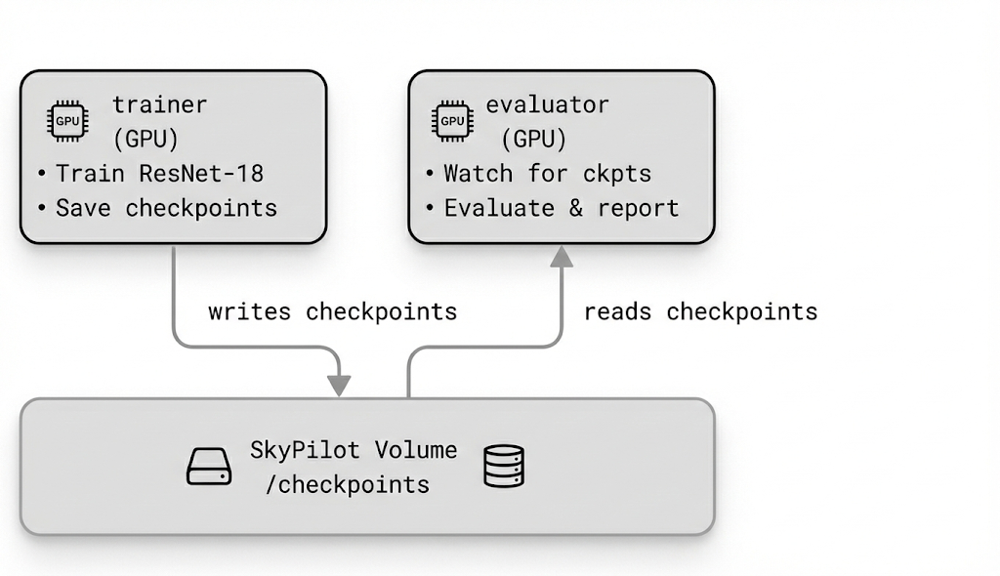

# Parallel Training and Evaluation with Shared Volume

This example demonstrates SkyPilot job groups with parallel training and evaluation tasks that share a Kubernetes PVC volume for checkpoints. The evaluator monitors the checkpoint directory and evaluates models "on the fly" as training produces them.

## Architecture

<p align="center">
  
</p>

### Components

1. **trainer**: Trains ResNet-18 on CIFAR-10, saves checkpoints every N epochs to shared storage
2. **evaluator**: Watches the checkpoint directory, evaluates new checkpoints as they appear, reports test accuracy

### Graceful Completion

Both tasks complete naturally without forced termination:
- When training finishes, the trainer writes a `training_complete` marker file to the shared volume
- The evaluator detects this marker, finishes evaluating any remaining checkpoints, and exits gracefully
- This pattern avoids the need for `primary_tasks` and `termination_delay` settings

## Usage

### Create the Shared Volume

First, create the shared volume that both tasks will use:

```bash
sky volume apply llm/train-eval-jobgroup/train-eval-ckpts-volume.yaml
```

### Launch the Job Group

```bash
sky jobs launch llm/train-eval-jobgroup/train-eval-jobgroup.yaml
```

### Monitor Training

```bash
# Check job status
sky jobs queue

# View trainer logs (training progress)
sky jobs logs <job-id> --task trainer

# View evaluator logs (accuracy reports)
sky jobs logs <job-id> --task evaluator
```

### Expected Output

**Trainer logs:**
```
Starting trainer...
Loading CIFAR-10 dataset...
Epoch 1/10 | Loss: 1.8234 | LR: 0.099511 | Time: 45.2s
Epoch 2/10 | Loss: 1.2456 | LR: 0.095106 | Time: 44.8s
Saved checkpoint: /checkpoints/checkpoint_epoch_2.pt
...
```

**Evaluator logs:**
```
Starting evaluator...
Watching for checkpoints...
Epoch   2 | Train Loss: 1.2456 | Test Accuracy: 52.34%
Epoch   4 | Train Loss: 0.8123 | Test Accuracy: 68.91%
Epoch   6 | Train Loss: 0.5234 | Test Accuracy: 75.23%
...
```

## Configuration

### Environment Variables

| Variable | Default | Description |
|----------|---------|-------------|
| `NUM_EPOCHS` | `10` | Number of training epochs |
| `SAVE_EVERY` | `2` | Save checkpoint every N epochs |
| `CHECKPOINT_DIR` | `/checkpoints` | Shared checkpoint directory |

### Customizing Resources

Edit the YAML to adjust resources:

```yaml
resources:
  accelerators: H100:1  # or A100:1 for faster training
  memory: 32+
```

## How It Works

### Shared Volume

Both tasks mount the same SkyPilot volume at `/checkpoints`:

```yaml
volumes:
  /checkpoints: train-eval-ckpts
```

This creates a shared Kubernetes PVC that both tasks can access. The volume must be created before launching the job group.

### Checkpoint Format

The trainer saves checkpoints with:
- Model state dict
- Optimizer state dict
- Epoch number
- Training loss
- Timestamp

Files are named `checkpoint_epoch_N.pt` and a `latest.json` file tracks the most recent checkpoint.

### Evaluator Polling

The evaluator uses simple filesystem polling to detect new checkpoints:
1. Scans for `checkpoint_epoch_*.pt` files every 5 seconds
2. Loads new checkpoints and evaluates on CIFAR-10 test set
3. Reports accuracy and tracks results
4. Exits when training completes

## Key Features Demonstrated

1. **Parallel Execution**: Training and evaluation run simultaneously
2. **Shared Storage**: Tasks communicate through a shared filesystem
3. **On-the-fly Evaluation**: No need to wait for training to finish
4. **Simple Communication**: Filesystem-based, no network services needed

## Comparison with RLHF Example

| Feature | Train-Eval | RLHF |
|---------|------------|------|
| Communication | Shared filesystem | HTTP APIs |
| Complexity | Simple | Complex |
| Components | 2 tasks | 5 tasks |
| Use case | Checkpointing | Service mesh |

This example is intentionally simpler to demonstrate job groups without the complexity of network services.

## Extending This Example

### Adding More Evaluators

You can run multiple evaluators for different metrics:

```yaml
---
name: evaluator-accuracy
# ... evaluates accuracy

---
name: evaluator-perplexity
# ... evaluates perplexity
```

### Distributed Training

Add `num_nodes` for multi-node training:

```yaml
name: trainer
num_nodes: 2
# ... use torch.distributed
```

### Early Stopping

The evaluator could signal the trainer to stop early by writing a `stop.txt` file that the trainer checks.
