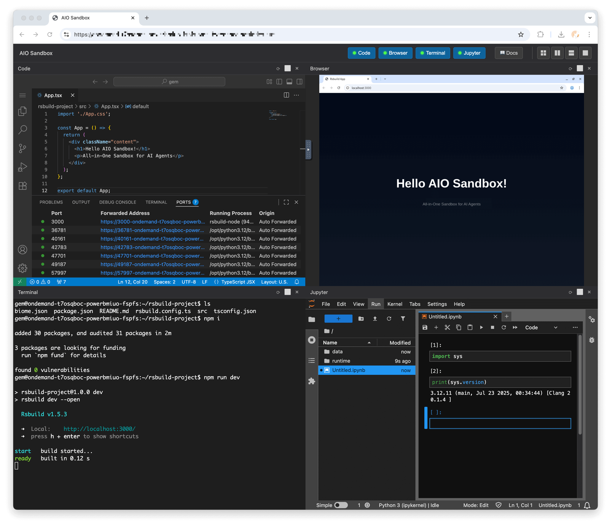
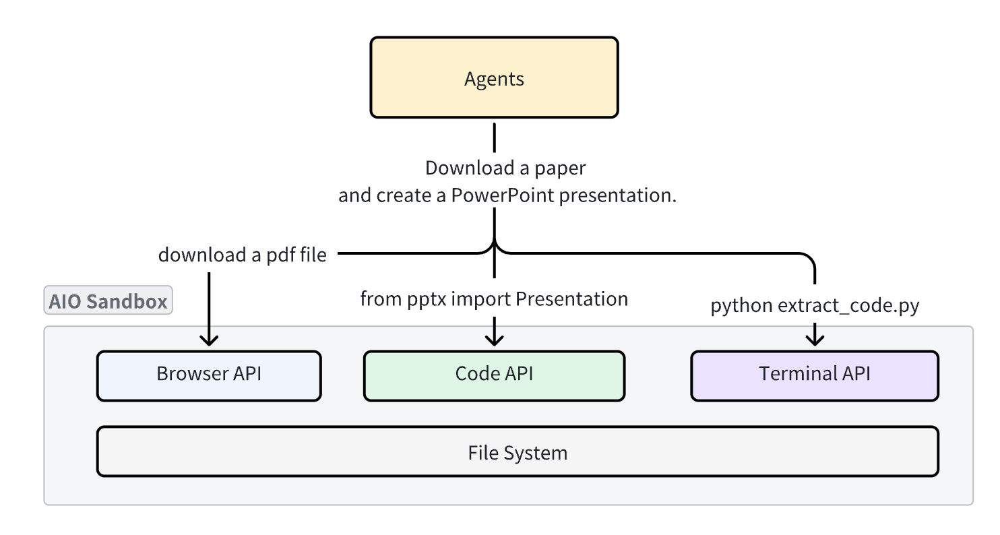
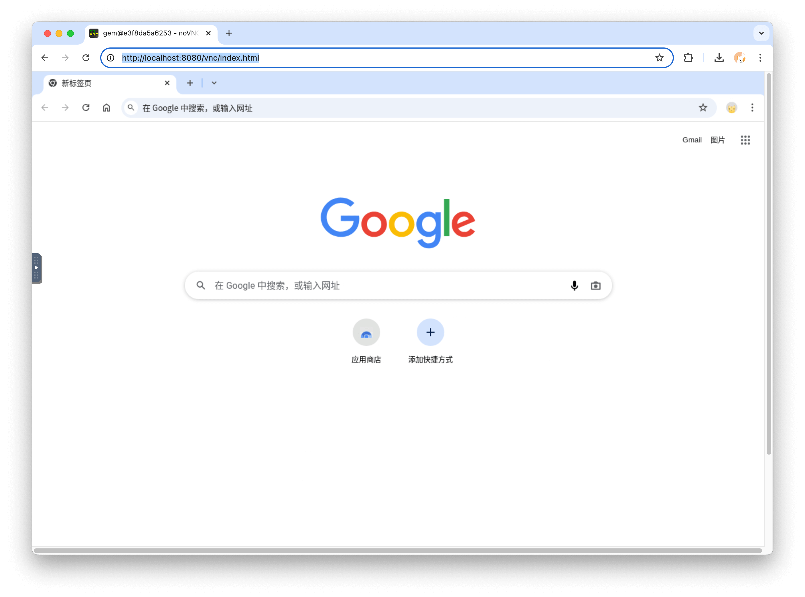
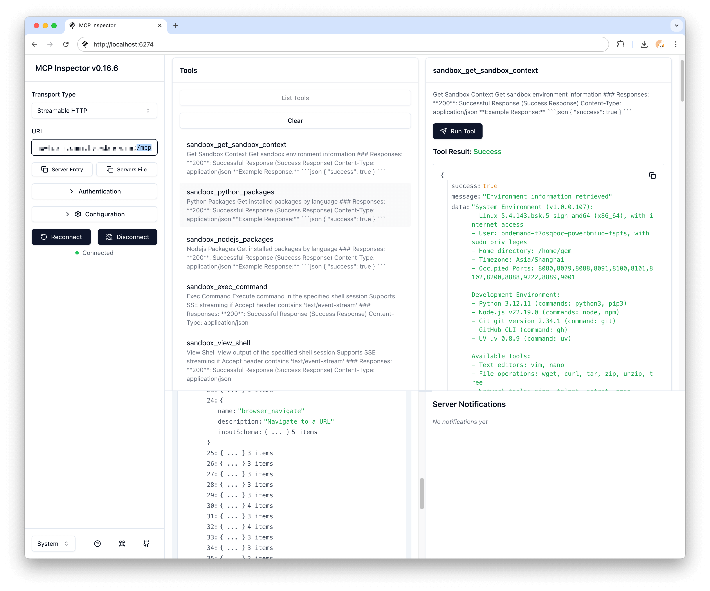
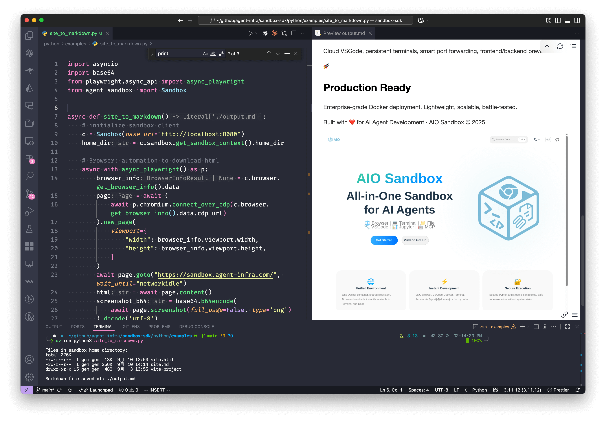

# AIO Sandbox - All-in-One Agent Sandbox Environment

<p align="center">
  
</p>

<p align="center">
  <strong>🌐 Browser | 💻 Terminal | 📁 File | 🔧 VSCode | 📊 Jupyter | 🤖 MCP</strong>
</p>

<div align="center">
<p>
        🌐 <a href="https://sandbox.agent-infra.com/">Website</a>&nbsp&nbsp
        | &nbsp&nbsp🔌 <a href="https://sandbox.agent-infra.com/api">API</a>&nbsp&nbsp
        | &nbsp&nbsp📑 <a href="https://arxiv.org/pdf/2509.02544#S2.SS2">Paper</a>&nbsp&nbsp
        | &nbsp&nbsp🌟 <a href="https://github.com/agent-infra/sandbox/tree/main/examples">Examples</a> &nbsp&nbsp
</p>
</div>

<p align="center">
  <a href="https://github.com/agent-infra/sandbox/releases"></a>
  <a href="https://github.com/agent-infra/sandbox/blob/main/LICENSE"></a>
  <a href="https://pypi.org/project/agent-sandbox/"></a>
  <a href="https://www.npmjs.com/package/@agent-infra/sandbox"></a>
</p>



## 🚀 Quick Start

Get up and running in 30 seconds:

```bash
docker run --security-opt seccomp=unconfined --rm -it -p 8080:8080 ghcr.io/agent-infra/sandbox:latest
```

For users in mainland China:

```bash
docker run --security-opt seccomp=unconfined --rm -it -p 8080:8080 enterprise-public-cn-beijing.cr.volces.com/vefaas-public/all-in-one-sandbox:latest
```

Use a specific version in the format `agent-infra/sandbox:${version}`, for example, to use version 1.0.0.125:

```bash
docker run --security-opt seccomp=unconfined --rm -it -p 8080:8080 ghcr.io/agent-infra/sandbox:1.0.0.125
# or users in mainland China
docker run --security-opt seccomp=unconfined --rm -it -p 8080:8080 enterprise-public-cn-beijing.cr.volces.com/vefaas-public/all-in-one-sandbox:1.0.0.125
```

Once running, access the environment at:
- 📖 **Documentation**: http://localhost:8080/v1/docs
- 🌐 **VNC Browser**: http://localhost:8080/vnc/index.html?autoconnect=true
- 💻 **VSCode Server**: http://localhost:8080/code-server/
- 🤖 **MCP Services**: http://localhost:8080/mcp

## 🎯 What is AIO Sandbox?

AIO Sandbox is an **all-in-one** agent sandbox environment that combines Browser, Shell, File, MCP operations, and VSCode Server in a single Docker container. Built on cloud-native lightweight sandbox technology, it provides a unified, secure execution environment for AI agents and developers.

<p align="center">
  
</p>

### Why Choose AIO Sandbox?

Traditional sandboxes are **single-purpose** (browser, code, or shell), making file sharing and functional coordination extremely challenging. AIO Sandbox solves this by providing:

- ✅ **Unified File System** - Files downloaded in browser are instantly available in Shell/File operations
- ✅ **Multiple Interfaces** - VNC, VSCode, Jupyter, and Terminal in one unified environment
- ✅ **Secure Execution** - Sandboxed Python and Node.js execution with safety guarantees
- ✅ **Zero Configuration** - Pre-configured MCP servers and development tools ready to use
- ✅ **Agent-Ready** - MCP-compatible APIs for seamless AI agent integration

## 📦 Installation

### SDK Installation

<table>
<tr>
<td>

**Python**
```bash
pip install agent-sandbox
```

</td>
<td>

**TypeScript/JavaScript**
```bash
npm install @agent-infra/sandbox
```

</td>
<td>

**Golang**
```bash
go get github.com/agent-infra/sandbox-sdk-go
```

</td>
</tr>
</table>

### Basic Usage

<table>
<tr>
<td>

**Python Example**
```python
from agent_sandbox import Sandbox

# Initialize client
client = Sandbox(base_url="http://localhost:8080")
home_dir = client.sandbox.get_context().home_dir

# Execute shell commands
result = client.shell.exec_command(command="ls -la")
print(result.data.output)

# File operations
content = client.file.read_file(file=f"{home_dir}/.bashrc")
print(content.data.content)

# Browser automation
screenshot = client.browser.screenshot()
```

</td>
<td>

**TypeScript Example**
```typescript
import { Sandbox } from '@agent-infra/sandbox';

// Initialize client
const sandbox = new Sandbox({ baseURL: 'http://localhost:8080' });

// Execute shell commands
const result = await sandbox.shell.exec({ command: 'ls -la' });
console.log(result.output);

// File operations
const content = await sandbox.file.read({ path: '/home/gem/.bashrc' });
console.log(content);

// Browser automation
const screenshot = await sandbox.browser.screenshot();
```

</td>
</tr>
</table>

## 🌟 Key Features

### 🔗 Unified Environment
All components run in the same container with a shared filesystem, enabling seamless workflows:

<p align="center">
  
</p>

### 🌐 Browser Automation
Full browser control through multiple interfaces:
- **VNC** - Visual browser interaction through remote desktop
- **CDP** - Chrome DevTools Protocol for programmatic control
- **MCP** - High-level browser automation tools

<p align="center">
  
</p>

### 💻 Development Tools
Integrated development environment with:
- **VSCode Server** - Full IDE experience in browser
- **Jupyter Notebook** - Interactive Python environment
- **Terminal** - WebSocket-based terminal access
- **Port Forwarding** - Smart preview for web applications

<p align="center">
  
</p>

### 🤖 MCP Integration
Pre-configured Model Context Protocol servers:
- **Browser** - Web automation and scraping
- **File** - File system operations
- **Shell** - Command execution
- **Markitdown** - Document processing

<p align="center">
  
</p>

## 📚 Complete Example

Convert a webpage to Markdown with embedded screenshot:

```python
import asyncio
import base64
from playwright.async_api import async_playwright
from agent_sandbox import Sandbox

async def site_to_markdown():
    # Initialize sandbox client
    c = Sandbox(base_url="http://localhost:8080")
    home_dir = c.sandbox.get_context().home_dir

    # Browser: Automation to download HTML
    async with async_playwright() as p:
        browser_info = c.browser.get_info().data
        page = await (await p.chromium.connect_over_cdp(browser_info.cdp_url)).new_page()
        await page.goto("https://example.com", wait_until="networkidle")
        html = await page.content()
        screenshot_b64 = base64.b64encode(await page.screenshot()).decode('utf-8')

    # Jupyter: Convert HTML to markdown in sandbox
    c.jupyter.execute_code(code=f"""
from markdownify import markdownify
html = '''{html}'''
screenshot_b64 = "{screenshot_b64}"

md = f"{{markdownify(html)}}\\n\\n"
with open('{home_dir}/site.md', 'w') as f:
    f.write(md)
print("Done!")
""")

    # Shell: List files in sandbox
    list_result = c.shell.exec_command(command=f"ls -lh {home_dir}")
    print(f"Files in sandbox: {list_result.data.output}")

    # File: Read the generated markdown
    return c.file.read_file(file=f"{home_dir}/site.md").data.content

if __name__ == "__main__":
    result = asyncio.run(site_to_markdown())
    print(f"Markdown saved successfully!")
```

<p align="center">
  
</p>

## 🏗️ Architecture

```
┌─────────────────────────────────────────────────────────────┐
│                    🌐 Browser + VNC                        │
├─────────────────────────────────────────────────────────────┤
│  💻 VSCode Server  │  🐚 Shell Terminal  │  📁 File Ops   │
├─────────────────────────────────────────────────────────────┤
│              🔗 MCP Hub + 🔒 Sandbox Fusion               │
├─────────────────────────────────────────────────────────────┤
│         🚀 Preview Proxy + 📊 Service Monitoring          │
└─────────────────────────────────────────────────────────────┘
```

## 🛠️ API Reference

### Core APIs

| Endpoint | Description |
|----------|-------------|
| `/v1/sandbox` | Get sandbox environment information |
| `/v1/shell/exec` | Execute shell commands |
| `/v1/file/read` | Read file contents |
| `/v1/file/write` | Write file contents |
| `/v1/browser/screenshot` | Take browser screenshot |
| `/v1/jupyter/execute` | Execute Jupyter code |

### MCP Servers

| Server | Tools Available |
|--------|----------------|
| `browser` | `navigate`, `screenshot`, `click`, `type`, `scroll` |
| `file` | `read`, `write`, `list`, `search`, `replace` |
| `shell` | `exec`, `create_session`, `kill` |
| `markitdown` | `convert`, `extract_text`, `extract_images` |

## 🚢 Deployment

### Docker Compose

```yaml
version: '3.8'
services:
  sandbox:
    container_name: aio-sandbox
    image: ghcr.io/agent-infra/sandbox:latest
    volumes:
      - /tmp/gem/vite-project:/home/gem/vite-project
    security_opt:
      - seccomp:unconfined
    extra_hosts:
      - "host.docker.internal:host-gateway"
    restart: "unless-stopped"
    shm_size: "2gb"
    ports:
      - "${HOST_PORT:-8080}:8080"
    environment:
      PROXY_SERVER: ${PROXY_SERVER:-host.docker.internal:7890}
      JWT_PUBLIC_KEY: ${JWT_PUBLIC_KEY:-}
      DNS_OVER_HTTPS_TEMPLATES: ${DNS_OVER_HTTPS_TEMPLATES:-}
      WORKSPACE: ${WORKSPACE:-"/home/gem"}
      HOMEPAGE: ${HOMEPAGE:-}
      BROWSER_EXTRA_ARGS: ${BROWSER_EXTRA_ARGS:-}
      TZ: ${TZ:-Asia/Singapore}
      WAIT_PORTS: ${WAIT_PORTS:-}
```

### Kubernetes

```yaml
apiVersion: apps/v1
kind: Deployment
metadata:
  name: aio-sandbox
spec:
  replicas: 2
  template:
    spec:
      containers:
      - name: aio-sandbox
        image: ghcr.io/agent-infra/sandbox:latest
        ports:
        - containerPort: 8080
        resources:
          limits:
            memory: "2Gi"
            cpu: "1000m"
```

## 🤝 Integration Examples

### Browser Use Integration

```python
import asyncio

from agent_sandbox import Sandbox
from browser_use import Agent, Tools
from browser_use.browser import BrowserProfile, BrowserSession
from browser_use.llm import ChatOpenAI

sandbox = Sandbox(base_url="http://localhost:8080")
print("sandbox", sandbox.browser)
cdp_url = sandbox.browser.get_info().data.cdp_url

browser_session = BrowserSession(
    browser_profile=BrowserProfile(cdp_url=cdp_url, is_local=True)
)
tools = Tools()


async def main():
    agent = Agent(
        task='Visit https://duckduckgo.com and search for "browser-use founders"',
        llm=ChatOpenAI(model="gcp-claude4.1-opus"),
        tools=tools,
        browser_session=browser_session,
    )

    await agent.run()
    await browser_session.kill()

    input("Press Enter to close...")


if __name__ == "__main__":
    asyncio.run(main())
```

### LangChain Integration

```python
from langchain.tools import BaseTool
from agent_sandbox import Sandbox

class SandboxTool(BaseTool):
    name = "sandbox_execute"
    description = "Execute commands in AIO Sandbox"

    def _run(self, command: str) -> str:
        client = Sandbox(base_url="http://localhost:8080")
        result = client.shell.exec_command(command=command)
        return result.data.output
```

### OpenAI Assistant Integration

```python
from openai import OpenAI
from agent_sandbox import Sandbox
import json

client = OpenAI(
    api_key="your_api_key",
)
sandbox = Sandbox(base_url="http://localhost:8080")


# define a tool to run code in the sandbox
def run_code(code, lang="python"):
    if lang == "python":
        return sandbox.jupyter.execute_code(code=code).data
    return sandbox.nodejs.execute_nodejs_code(code=code).data


# Use OpenAI
response = client.chat.completions.create(
    model="gpt-4",
    messages=[{"role": "user", "content": "calculate 1+1"}],
    tools=[
        {
            "type": "function",
            "function": {
                "name": "run_code",
                "parameters": {
                    "type": "object",
                    "properties": {
                        "code": {"type": "string"},
                        "lang": {"type": "string"},
                    },
                },
            },
        }
    ],
)


if response.choices[0].message.tool_calls:
    args = json.loads(response.choices[0].message.tool_calls[0].function.arguments)
    print("args", args)
    result = run_code(**args)
    print(result['outputs'][0]['text'])
```

## 🤝 Contributing

We welcome contributions! Please see our [Contributing Guide](CONTRIBUTING.md) for details.

## 📄 License

AIO Sandbox is released under the [Apache License 2.0](LICENSE).

## 🙏 Acknowledgments

Built with ❤️ by the Agent Infra team. Special thanks to all contributors and the open-source community.

## 📞 Support

- 📖 [Documentation](https://sandbox.agent-infra.com)
- 💬 [GitHub Discussions](https://github.com/agent-infra/sandbox/discussions)
- 🐛 [Issue Tracker](https://github.com/agent-infra/sandbox/issues)

---

<p align="center">
  <strong>Ready to revolutionize your AI development workflow?</strong><br/>
  <a href="https://github.com/agent-infra/sandbox">⭐ Star us on GitHub</a> •
  <a href="https://sandbox.agent-infra.com">📚 Read the Docs</a> •
  <a href="https://github.com/agent-infra/sandbox/issues">🐛 Report Issues</a>
</p>
