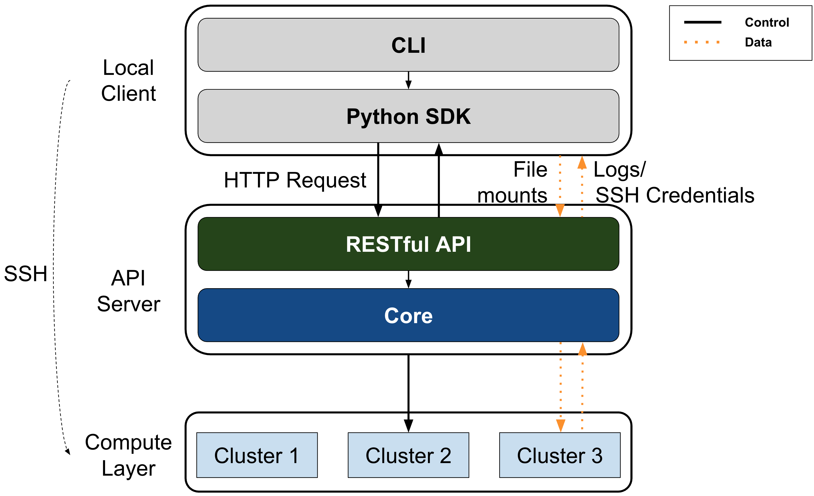
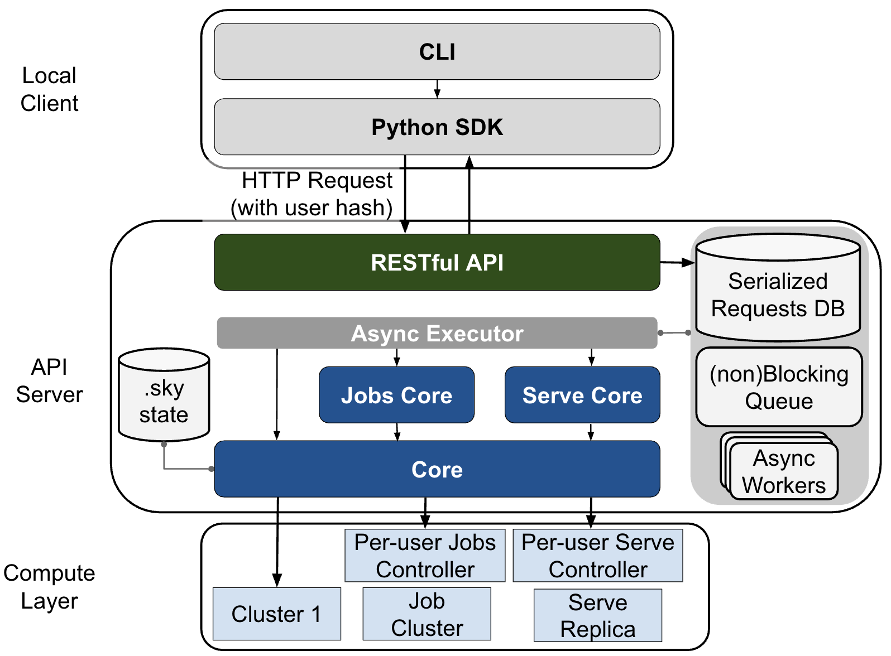
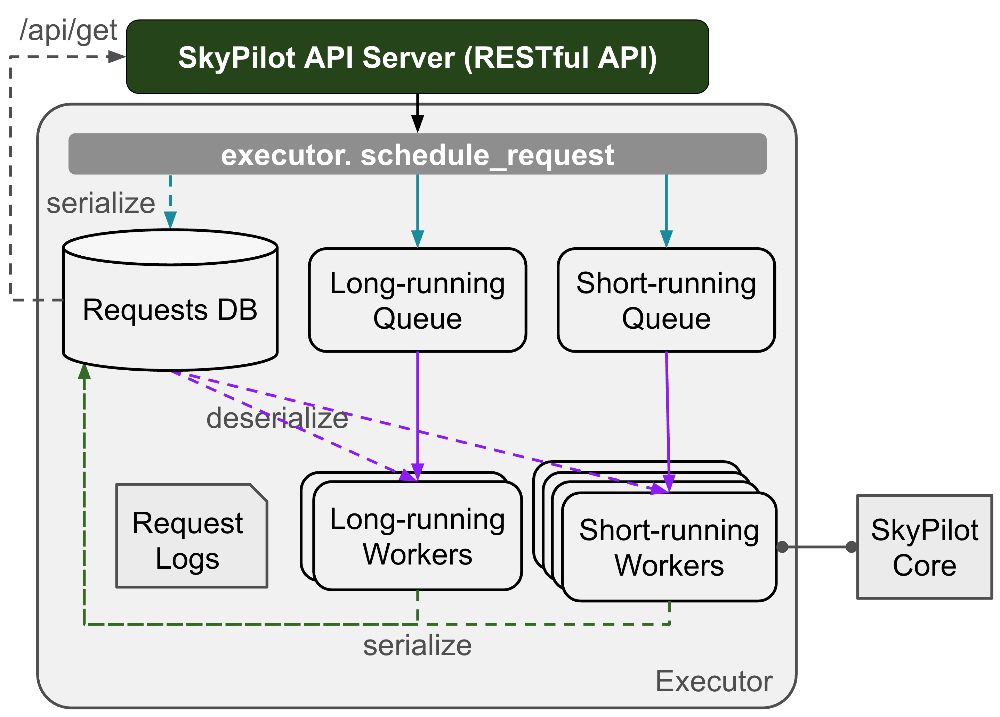

# Client-Server Architecture

SkyPilot implements a client-server architecture. When a user runs a command or an API call,
a SkyPilot client issues asynchronous requests to a SkyPilot API server, which
handles all requests.

User-facing docs can be found in [SkyPilot docs](https://docs.skypilot.co/en/latest/docs/index.html).

## High-Level Architecture

## Detailed Architecture

## Request Executor

See `sky.serve.server.requests` for more details.

