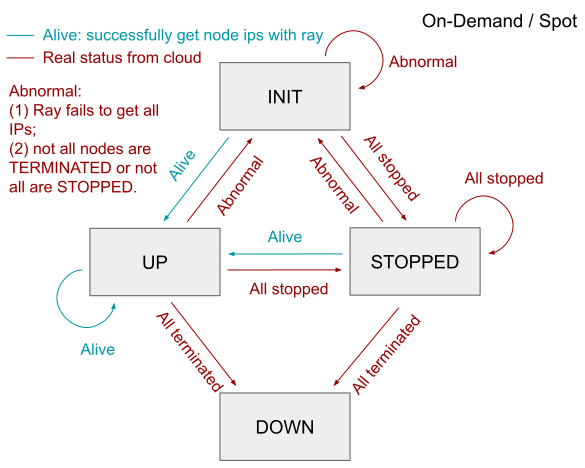
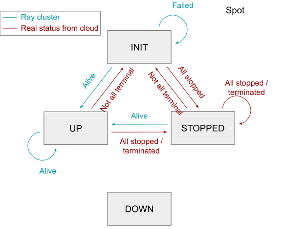

# Cluster State: Definition & Transition Diagram

* **INIT**: The provision / runtime setup has not been finished. Or, the cluster is in abnormal states, e.g. partially UP.
* **UP**: The cluster is healthy, i.e. all the nodes are UP and the ray cluster is correctly running.
* **STOPPED**: All the nodes in the cluster is STOPPED.
* **DOWN**: The cluster has been terminated or not exist. This is implicitly indicated by not appearing in the database.

## Cluster State Transition for Refreshing
### On-Demand Cluster
<!-- Image edited in https://docs.google.com/presentation/d/1PFNw6OYnr5rh4gKPvg43nmP_t1W0AXvyjszE7nNHPQ0/edit?usp=sharing -->

### Spot Cluster
<!-- Image edited in https://docs.google.com/presentation/d/1PFNw6OYnr5rh4gKPvg43nmP_t1W0AXvyjszE7nNHPQ0/edit?usp=sharing -->

