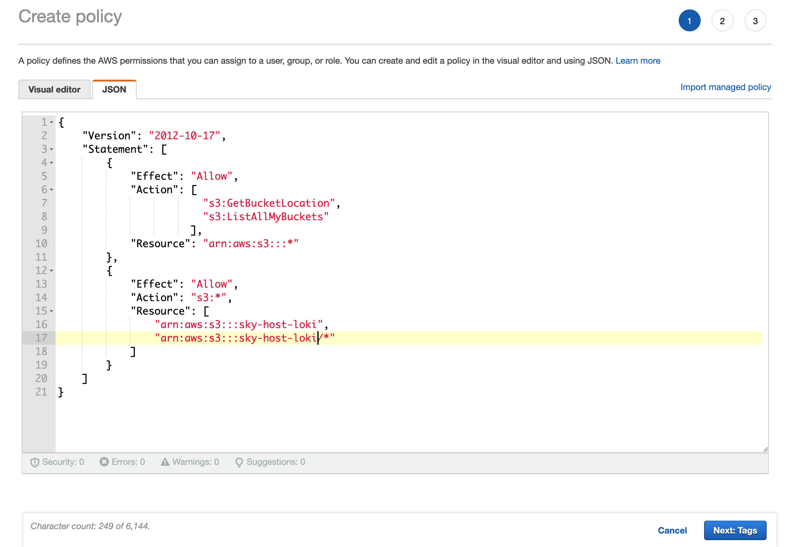
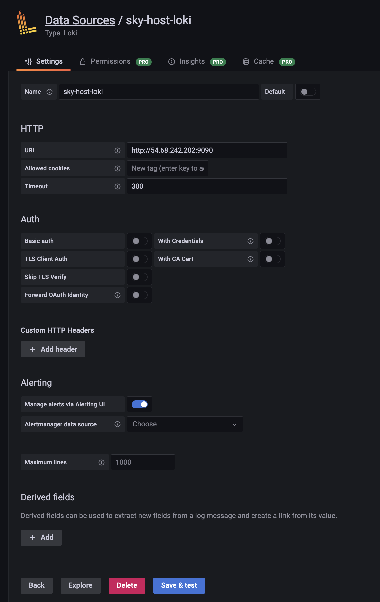

# Usage Collection
This doc is for sky team only to set up the usage collection service. Instead of using the Grafana's hosted Loki, we host our own Loki service to make sure the data is always available without retention and query limitation. 

## Sky Host Loki
To set up the service, following steps should be applied.
### Create a persistent storage for logging
1. Create a S3 bucket for the logging storage (our current bucket: `s3://sky-host-loki` in us-west-2).
1. [Create an IAM role](https://objectivefs.com/howto/how-to-restrict-s3-bucket-policy-to-only-one-aws-s3-bucket) that can only access that bucket using the following policy:

1. Replace the `access_key_id` and `secret_access_key` in [loki-s3-config.yaml](sky/usage/loki-s3-config.yaml) with the keys of that IAM role.

### Launch hosting instance
1. Create a CPU instance for hosting the Loki service: `sky launch --cloud aws --region us-west-2 -c usage-loki-server`
1. Change the security group setting of the instance to allow custom TCP inbound from 9090 to 9100.
1. Copy the config file to server `scp sky/usage/loki-s3-config.yaml usage-loki-server:~/`
1. Start the loki service with the following command on the server
    ```
    docker run --name loki -d -v $(pwd):/mnt/config -p 9090:9090 grafana/loki:2.6.0 -config.file=/mnt/config/loki-s3-config.yaml
    ```

## Connect to Grafana
To visualize the logs collected, we can connect Grafana to our Loki service:
1. click the `Connect data` button in the home page
2. Search for the "Loki" and select the `Loki`
3. Use the following settings.

